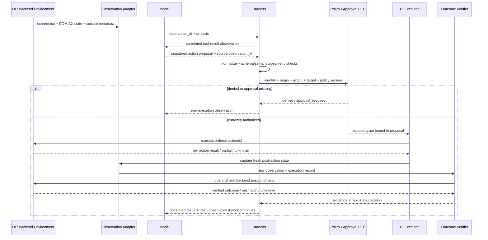

# 第 15 章：Computer-Use 与多模态 Agent

Computer use 是工具调用生命周期的一种特化，而不是另一套抽象。模型接收一个或多个用户界面 observation，提出结构化 computer action，再由 application 或 harness 决定是否执行以及如何执行。随后，screenshot、结构化状态、错误或执行记录作为相关联的 tool result/observation 返回。OpenAI 的当前契约使用 `computer_call` action 和 `computer_call_output`；Anthropic 的 client-executed computer tool 则在同一条“模型提出、应用执行”的边界下使用 `tool_use` 与 `tool_result`（[OpenAI — Computer Use](https://developers.openai.com/api/docs/guides/tools-computer-use)；[Anthropic — Computer Use Tool](https://platform.claude.com/docs/en/agents-and-tools/tool-use/computer-use-tool)；[Anthropic — How Tool Use Works](https://platform.claude.com/docs/en/agents-and-tools/tool-use/how-tool-use-works)）。

Computer use 的特殊难点，不是图像不再属于 tool result，也不是点击不再类似 function proposal，而是 GUI observation 局部且容易过期、grounding 涉及几何映射、action 依赖未必可见的界面状态，而且一次成功的 input event 不一定产生预期的 environment outcome。

### 15.1 结构化 Computer-Tool Loop

这条专门化 loop 扩展了[第 6 章](./06-tools-invocation-lifecycle.md)的 invocation lifecycle：

1. **捕获 observation bundle。** 记录 screenshot 和/或结构化 UI state，同时保存 identity、时间、几何信息和 surface metadata。
2. **让模型提出 action proposal。** 输出是结构化动作，例如 `click(x, y)`、`type(text)`、`scroll(direction, amount)`、按键组合，或自定义 DOM/role action。
3. **标准化并验证。** 把 proposal 绑定到它使用的 observation；验证 action type、参数、坐标变换、当前 application/origin、目标 scope 和 policy。
4. **授权并审批。** 不可绕过的 enforcement point 应用 allowlist、sandbox 约束和必要的 mandatory human gate。
5. **由应用执行。** Browser automation、OS input adapter 或其他 UI runtime 实施动作，而不是模型实施。
6. **返回 execution result 与新 observation。** 把二者与 proposal 关联，并根据事实报告 `succeeded`、`failed`、`partial` 或 `unknown`。
7. **验证 environment outcome。** 判断预期的 UI 和 backend postcondition 是否成立；否则重新观察、恢复或停止。

OpenAI 当前的内置 loop 会在一个 `computer_call` 中返回有序 action，由应用代码执行，再要求应用用相关联的 `computer_call_output` 返回更新后的 screenshot。Anthropic 同样要求应用代码把 tool request 转换成 computer action，并通过 `tool_result` block 返回 screenshot 或 command output（[OpenAI — Computer Use](https://developers.openai.com/api/docs/guides/tools-computer-use)；[Anthropic — Computer Use Tool](https://platform.claude.com/docs/en/agents-and-tools/tool-use/computer-use-tool)）。Provider payload 不同，但责任边界相同。

### 15.2 区分六类记录

稳健的 harness 不能把这些对象压缩成一个笼统的“screen state”：

| 对象 | 它表示什么 | 最少应有的 metadata | 它不能证明什么 |
|---|---|---|---|
| **Screenshot observation** | 某一时刻捕获的渲染像素 | `observation_id`、捕获时间、image digest、像素尺寸、viewport、crop、scale/device-pixel ratio、window/tab、当前 URL 或 application identity | Dispatch 时仍然存在同样的像素 |
| **DOM/accessibility state** | UI automation surface 暴露的结构化 element、role、label、value、bounds 和关系 | snapshot/version ID、frame 或 window、origin、提取方法、element reference | 精确外观、视觉显著性、可见性或可点击性，除非另外检查 |
| **Coordinate grounding** | 把预期目标或 element reference 映射到某一 observation 的坐标空间 | source observation、target reference、bounding box/point、置信或歧义、coordinate transform | 已经派发 input event |
| **Action proposal** | 模型请求的 UI operation 及参数 | proposal/call ID、source observation ID、action type、normalized arguments、expected effect | 授权、执行或成功 |
| **Execution result** | Executor 对 dispatch 和 input-event processing 的已知事实 | attempt ID、逐 action status、时间戳、active surface、error、partial/unknown status | 已经到达预期 product state |
| **Environment outcome** | 交互后经过验证的状态 | UI assertion、URL/origin、backend/API state、durable object ID、external-effect evidence | 该路径符合 policy，除非还检查了 process evidence |

Screenshot 可以是 tool result 的 payload；DOM 或 accessibility data 可以随同一个 result 返回，也可以通过单独工具返回。Click 可以编码成 provider 定义的 computer action、自定义 function call 或生成代码（[OpenAI — Computer Use](https://developers.openai.com/api/docs/guides/tools-computer-use)）。这些是 protocol 与 interface choice，不是互斥类别。

应保持整条链路的 identity：

```text
observation_id
  -> grounding_id
  -> proposal_id / provider_call_id
  -> dispatch_attempt_id
  -> execution_result_id
  -> post_action_observation_id
  -> outcome_evidence_id
```

有了这条 correlation，eval 或 incident review 才能判断：是模型选择了错误目标、坐标映射错误、executor 在过期状态上行动，还是应用接收了输入却没有更新 backend。

### 15.3 根据决策选择 Observation Channel

Harness 可以提供几种互补的 observation channel：

- **Screenshot：**保留捕获时的渲染布局、样式、overlay 和空间关系。
- **DOM 或 application tree：**对支持的应用提供结构化内容与 element identity。
- **Accessibility state：**在应用正确发布信息时，提供语义 role、label、value、checked/expanded state 与 hierarchy。
- **OCR 或 extracted text：**在结构化状态不可用时提供文字；如果还要用于 grounding，则应保留 bounding box 与 source-image identity。
- **Direct environment query：**查询权威 backend 或 application state，用于 verification，而不是 perception。

OpenAI 当前指南明确支持视觉 computer action，也支持自定义 Playwright/Selenium/VNC/MCP harness，以及能把 screenshot 与 DOM workflow 组合起来的 code-execution harness（[OpenAI — Computer Use](https://developers.openai.com/api/docs/guides/tools-computer-use)）。这支持一种混合设计：用结构化状态获得稳定 element identity 和高效阅读，用像素判断几何与视觉条件，再用 direct state query 验证 outcome。

没有哪一种 channel 会自动成为所有问题的 ground truth。DOM node 可能存在，但点击被 overlay 接收；screenshot 可能显示文字，却不提供 element role 或稳定 identity。Playwright 因此会在受支持的 action 前检查 visibility、stability、element 是否接收 event、enabled state 和 editability 等属性（[Playwright — Auto-Waiting and Actionability](https://playwright.dev/docs/actionability)）。Computer-use harness 应在 automation stack 允许时暴露同类 precondition。

Observation channel 应按任务和模型做评测。记录每次决策使用了哪个 channel 和 extraction version；如果模型 context 只接收紧凑 projection，则把完整 observation 作为 artifact 保存。

### 15.4 Grounding 是带版本的几何契约

**Coordinate grounding** 把预期目标转换到 executor 的坐标空间。它可以使用：

- 从 screenshot 直接预测的 raw pixel coordinate；
- 通过 DOM 或 accessibility state 解析的 element reference；
- Set-of-Mark 之类的编号 overlay，由系统给候选区域添加离散 label（[Yang et al. — Set-of-Mark Prompting](https://arxiv.org/abs/2310.11441)）；
- 先按语义选择 element、再检查当前 bounds 并点击验证点的 hybrid lookup。

每次映射都必须声明其 geometry：

```text
captured_pixel_size, model_visible_size, viewport_size
crop_origin, scroll_container_and_offset, browser_zoom
device_pixel_ratio, resize_scale, coordinate_origin
window_or_frame_id, element_or_mark_id
```

不能让 provider 在不可见的情况下缩放 screenshot，再把返回坐标直接应用到原始 display。Anthropic 当前 computer-use 文档警告：过大图像可能在模型看到前被缩小，因此模型坐标对应缩小后的图像；它建议在 client 侧用已知 scale 缩放，并特别说明 Retina device-pixel-ratio 的处理（[Anthropic — Computer Use Tool](https://platform.claude.com/docs/en/agents-and-tools/tool-use/computer-use-tool)）。OpenAI 同样建议当前 GPT-5.6 computer-use screenshot 使用 `detail: "original"`，如果 client 做了 downsize，则必须重新映射坐标（[OpenAI — Computer Use](https://developers.openai.com/api/docs/guides/tools-computer-use)）。

Grounding 会随 source observation 一起过期。Dispatch 前，应重新解析 element reference，或确认相关 geometry 和 surface identity 仍然有效。坐标永远不能作为按钮的 durable identifier。

### 15.5 Observation/Action Race 是常态

从捕获到 dispatch 之间，界面可能变化。核心 race 是：

```text
observe state S0 -> propose action for S0 -> environment becomes S1 -> execute against S1
```

以下机制都会制造 race：

| 机制 | 失败示例 | 控制措施 |
|---|---|---|
| **Stale screenshot** | 模型响应延迟时页面已经跳转，click 仍落在旧页面位置 | 把 action 与 observation age、surface identity 绑定；超过 freshness deadline 就重新观察 |
| **Layout shift 或 animation** | 目标移动，坐标落到另一个 control | 要求 bounds 稳定，或在 dispatch 前立刻重新 grounding |
| **Focus change** | 输入进入 address bar、terminal 或错误字段 | 在敏感输入前检查 active window/frame 与 focused element |
| **Scroll drift** | 滚动了错误 container，或目标离开 viewport | 记录 container 与 offset；scroll 后验证 target 仍在 viewport |
| **Modal/overlay** | Consent dialog 或 popup 截获 click | 检测最上层 dialog/overlay，并暂停或交给 policy |
| **Latency/navigation** | Click 已被接收，但下一个 action 仍假定旧页面 | 等待声明的 navigation/network/UI condition，再捕获新 observation |
| **Partial batch execution** | Action 1 成功，action 2 失败，继续 action 3 已不安全 | 记录逐 action status；停止依赖 action，返回 `partial` 和新 observation |

OpenAI 当前内置契约可以在一个 `computer_call` 中批量返回有序 action，并在 batch 后捕获 screenshot（[OpenAI — Computer Use](https://developers.openai.com/api/docs/guides/tools-computer-use)）。这是 latency optimization，不表示每个 batch 都是原子的。因此，本章建议只批处理 precondition 可以共同保持有效的 action；对 consequential、会触发 navigation、依赖 focus 或不易逆转的 action，应插入 observation barrier。

不要通过盲目 replay click 或 submit 来“修复”race。响应丢失或 timeout 时，即使 executor 没有观察到成功，环境也可能已经变化。应使用第 6 章的 `partial` 与 `unknown` state，检查 UI 和 backend，再决定 deduplicate、escalate 或是否允许下一次 consequential attempt。

### 15.6 在 Dispatch 时验证 Action

Computer-use dispatch 是第 6 章 validation stack 的特化，但不能绕过它。执行前，policy enforcement path 应检查：

- proposal 与 observation identity、freshness 和 correlation；
- action schema 与 semantic bounds；
- 适用的 application、process、window、tab、frame、URL、domain 和 origin；
- 当前 focus、target visibility/stability、overlay state 与 coordinate transform；
- actor、tenant、credential scope、policy version 和 action allowlist；
- action 是否传输数据、对外通信、花费资金、改变访问权限、修改 production，或难以撤销；
- 与精确 normalized proposal 绑定的 mandatory approval；
- retry、deduplication、deadline、cancellation 和 action-budget state。

即使 provider 批量提出 action，result envelope 也应逐 action 记录：

```text
status: denied | not_executed | succeeded | failed | partial | unknown
proposal_id, attempt_id, source_observation_id
surface_before, surface_after
normalized_action, executor_error
post_action_observation, postcondition_evidence
```

Executor 应在 state-changing action 或 batch 后捕获新 observation，并验证预期转换。“Mouse event delivered” 是 execution result；“表单只提交一次，而且 order 以预期字段存在”才是 environment outcome。

### 15.7 安全边界必须包围模型

渲染后的网页、文档、email、chat、PDF 和 tool output 都是不可信输入。OpenAI 的 computer-use 指南明确说 on-screen instruction 不是 user permission，并建议使用隔离环境以及 domain/action allowlist；Anthropic 则警告网页或图像中的内容在某些情况下可能覆盖 instruction，并建议使用最小权限 VM/container、限制 domain，以及对有现实后果的决策做人类确认（[OpenAI — Computer Use](https://developers.openai.com/api/docs/guides/tools-computer-use)；[Anthropic — Computer Use Tool](https://platform.claude.com/docs/en/agents-and-tools/tool-use/computer-use-tool)）。

对高风险 UI action，应组合：

1. **Action allowlist：**只暴露或 dispatch 已批准的 action type 和 scoped target；默认拒绝意外 keyboard shortcut、download、shell launch、clipboard read 或 credential entry。
2. **Sandbox：**使用独立 browser profile、container 或 VM，并最小化 filesystem、network、credential、device 和 host integration，具体边界见[第 7 章](./07-sandboxing-runtime-enforcement.md)。
3. **Domain 与 origin check：**在 navigation 和 dispatch 时检查实际 current origin，包括 redirect、iframe、popup 和新 tab；上一次 screenshot 中记住的 domain 不是当前 authority。
4. **Mandatory approval：**在发送/发布、传输敏感数据、购买、删除、修改 access、接受条款或其他由 policy 分类的 consequence 之前，立刻插入[第 14 章](./14-human-agent-interaction.md)的 runtime gate。Approval 绑定准确 target、payload、identity、origin 和 expiry。
5. **Post-action verification：**在报告成功或尝试 retry 之前，独立检查新 UI，并在可能时检查权威 backend state。

Instruction priority 仍然是一层行为防御：它可以要求模型把页面内容当作 data，并报告可疑 instruction；但它不是 allowlist、sandbox、origin check、approval record 或 PEP。[第 2 章](./02-system-prompts-instructions-policy.md)定义了这条边界。Provider-side prompt-injection classifier 同样只是 defense in depth；Anthropic 明确说明，即使有 classifier layer，computer-use precaution 仍然必要（[Anthropic — Computer Use Tool](https://platform.claude.com/docs/en/agents-and-tools/tool-use/computer-use-tool)）。

### 15.8 Visual Accounting 必须绑定 Provider 与 Model

“一张 screenshot”等价于“一页文字”不存在可移植换算。Image preprocessing、detail mode、resize、patch/tile rule、token multiplier 和价格都会随 provider、model、snapshot 与 API contract 变化（[Anthropic — Vision](https://platform.claude.com/docs/en/build-with-claude/vision)；[OpenAI — Images and Vision](https://developers.openai.com/api/docs/guides/images-vision)）。

下面两个带日期的例子说明了原因。它们彼此不等价：

| 2026 年 7 月 31 日核验的契约 | 输入示例 | 文档给出的 accounting basis |
|---|---|---|
| Anthropic Vision，**Claude Opus 5** high-resolution tier | 1000×1000 image | `ceil(width/28) × ceil(height/28) = 1,296` visual tokens；同一契约对 Claude 4.7 及更新 high-resolution model 列出 2,576-pixel long-edge 与 4,784-visual-token native limit（[Anthropic — Vision](https://platform.claude.com/docs/en/build-with-claude/vision)） |
| OpenAI Vision，**GPT-5.6**，`detail: "original"` | 1000×1000 image | `ceil(width/32) × ceil(height/32) = 1,024` original patches；当前契约说明 GPT-5.6 `original` 不会为了 pixel-dimension 或 patch-budget limit 缩放图像（[OpenAI — Images and Vision](https://developers.openai.com/api/docs/guides/images-vision)） |

每一项 visual cost 或 context claim 都应记录：

```text
provider, endpoint, model and snapshot/tool version
verification date, image detail/fidelity mode
source and model-visible dimensions, crop and resize transform
patch/tile rule and multiplier, observed input usage, price contract
```

应根据实测任务效果与实际 usage 优化。Crop、downscale、structured UI state、zoom 或减少 observation barrier 都可能降低 cost 和 latency，但也可能降低 legibility 或增加 race risk。根据[第 5 章](./05-compaction-memory-context-handoffs.md)，把旧 screenshot 存为 artifact，在模型 context 中只保留与决策相关的 observation；但不能删除 evaluation 或 incident review 所需证据。

Round-trip latency 也依赖具体契约。Anthropic 把它的 screenshot-based computer tool 描述为较慢，因为 action 需要 screenshot round trip；而 OpenAI 当前工具可以在下一次 screenshot 前返回有序 action batch（[Anthropic — Tool Combinations](https://platform.claude.com/docs/en/agents-and-tools/tool-use/tool-combinations)；[OpenAI — Computer Use](https://developers.openai.com/api/docs/guides/tools-computer-use)）。应分别测量 capture、upload、inference、approval wait、dispatch、application settle 与 verification。

### 15.9 Recovery 与 Stop Condition

遇到以下条件，computer-use loop 应停止或 escalation：

- 经过验证的 environment outcome 已成立；
- Policy 拒绝 next action，或 mandatory approval 被拒绝/过期；
- 当前 origin、account、application 或 target 超出 scope；
- Modal、CAPTCHA、authentication challenge、可疑 instruction 或 sensitive-data request 需要人类处理；
- Execution 为 partial 或 unknown，而且 reconciliation 无法确定状态；
- Observation、action、token、cost 或 wall-time budget 已耗尽；
- Loop 重复执行却没有 environment progress；
- 用户 steering 或 cancellation。

仅仅因为模型输出 prose 或不再请求工具，就停止并报告完成，并不能提供充分完成证据。Finalization 前，应对任何 in-flight action 做 reconciliation，并应用 outcome predicate。第 6 章和第 14 章定义 unknown effect、steering、cancellation 与 approval expiry；[第 13 章](./13-loop-engineering.md)定义通用 loop stop hierarchy。

### 15.10 按最终 UI 与 Backend State 评测

Computer-use eval 应分别评价这些层次：

- **Process：**允许的 origin、禁止 action、approval 使用、sensitive-data handling、budget 和 race recovery。
- **Artifact：**下载或编辑的文件、screenshot、export report 或其他可寻址输出。
- **UI environment state：**可见 dialog state、selected value、current page、application state 或渲染 confirmation。
- **Backend/external state：**database record、submitted form、sent message、account permission、order 或其他 durable effect。
- **User outcome：**预期任务是否实际得到满足。

Final screenshot 是证据，但不一定就是 outcome。Confirmation banner 可能过时或误导；backend state 也可能在没有可见 confirmation 的情况下变化。Anthropic 的 Agent eval 指南专门描述了使用 URL/page-state check 与 backend verification 评价 browser task，并区分 transcript 与最终 environment outcome（[Anthropic — Demystifying Evals for AI Agents](https://www.anthropic.com/engineering/demystifying-evals-for-ai-agents)）。

WebArena 提供带 functional correctness evaluator 的 self-hosted web task；OSWorld 则提供使用 execution-based evaluation script 检查 application 和 system state 的 desktop task（[WebArena](https://arxiv.org/abs/2307.13854)；[OSWorld](https://arxiv.org/abs/2404.07972)）。应把它们视作 benchmark design 的一手资料，而不是实际 workload task 的替代品。应用[第 11 章](./11-evaluation.md)要求的 isolated baseline、repeated trial、complete trajectory、configuration pinning、grader calibration 与 per-slice reporting。

报告 slice 时，应包含 observation channel、screen resolution/detail contract、grounding method、application/origin、action type、modal/navigation presence、latency、partial/unknown execution、policy gate 与 outcome-verification method。否则 aggregate score 可能掩盖 Agent 只会处理静态页面，或只在缺少 backend verification 时表现成功。

### 15.11 完整 Computer-Use Loop



Screenshot 与 structured state 是 observation payload；UI operation 是 structured proposal；应用执行它，只有 postcondition evidence 才能建立 environment outcome。

### 15.12 设计检查表

发布 computer-use workflow 前，确认：

- 每个 proposal 都指明它依赖的 observation 与 coordinate transform。
- Screenshot、DOM/accessibility state、grounding、proposal、execution result 和 environment outcome 分别拥有 identity。
- Executor 会在 dispatch 时验证 surface、origin、focus、scroll、overlay 和 geometry。
- Batched action 拥有兼容 precondition，并产生逐 action result。
- Partial 与 unknown execution 会停止依赖 action，并触发 reconciliation。
- 高风险 action 会经过 allowlist、sandbox、origin check、mandatory approval 和 post-action verification。
- On-screen instruction 被视作不可信内容；instruction priority 不被当作 enforcement。
- Visual accounting 记录 provider、model、version、resolution、detail mode、date、usage 和 price contract。
- Completion grader 检查最终 UI 与 backend state，而不只检查 trajectory 或 screenshot。
- Eval 会恢复 isolated baseline，并报告 race、grounding、resolution、policy 和 outcome slice。

---

## 要点

- **Computer use 是结构化 tool loop。** 模型提出，应用负责验证、授权、执行和返回 observation。
- **Pixel 与 tool result 不是对立项。** Screenshot 通常正是相关联 tool result 的 payload。
- **Gesture 与 function call 不是对立项。** Click、type、scroll 和 key action 都是 provider 或 custom schema 下的结构化 proposal。
- **必须区分 perception、grounding、execution 与 outcome。** 它们的失败模式和证据不同。
- **Observation/action race 是预期内问题。** Staleness、layout、focus、scroll、modal、latency 和 partial execution 都需要明确状态处理。
- **安全边界包围模型。** Allowlist、sandbox、origin check、mandatory approval 和 verification 构成边界；instruction priority 只辅助模型行为。
- **Visual accounting 绑定具体契约。** 绝不能把 screenshot 换算成通用文本页数。
- **Environment outcome 决定成功。** 评价最终 UI 与 backend state，并对 policy-sensitive path 检查 process。

## 延伸阅读

- OpenAI, *Computer Use*. https://developers.openai.com/api/docs/guides/tools-computer-use
- Anthropic, *Computer Use Tool*. https://platform.claude.com/docs/en/agents-and-tools/tool-use/computer-use-tool
- Anthropic, *How Tool Use Works*. https://platform.claude.com/docs/en/agents-and-tools/tool-use/how-tool-use-works
- Microsoft Playwright, *Auto-Waiting and Actionability*. https://playwright.dev/docs/actionability
- Jianwei Yang et al., *Set-of-Mark Prompting Unleashes Extraordinary Visual Grounding in GPT-4V*, 2023. https://arxiv.org/abs/2310.11441
- Anthropic, *Vision*. https://platform.claude.com/docs/en/build-with-claude/vision
- OpenAI, *Images and Vision*. https://developers.openai.com/api/docs/guides/images-vision
- Anthropic, *Tool Combinations*. https://platform.claude.com/docs/en/agents-and-tools/tool-use/tool-combinations
- Mikaela Grace et al., *Demystifying Evals for AI Agents*, Anthropic, Jan 2026. https://www.anthropic.com/engineering/demystifying-evals-for-ai-agents
- Shuyan Zhou et al., *WebArena: A Realistic Web Environment for Building Autonomous Agents*, 2023. https://arxiv.org/abs/2307.13854
- Tianbao Xie et al., *OSWorld: Benchmarking Multimodal Agents for Open-Ended Tasks in Real Computer Environments*, 2024. https://arxiv.org/abs/2404.07972
