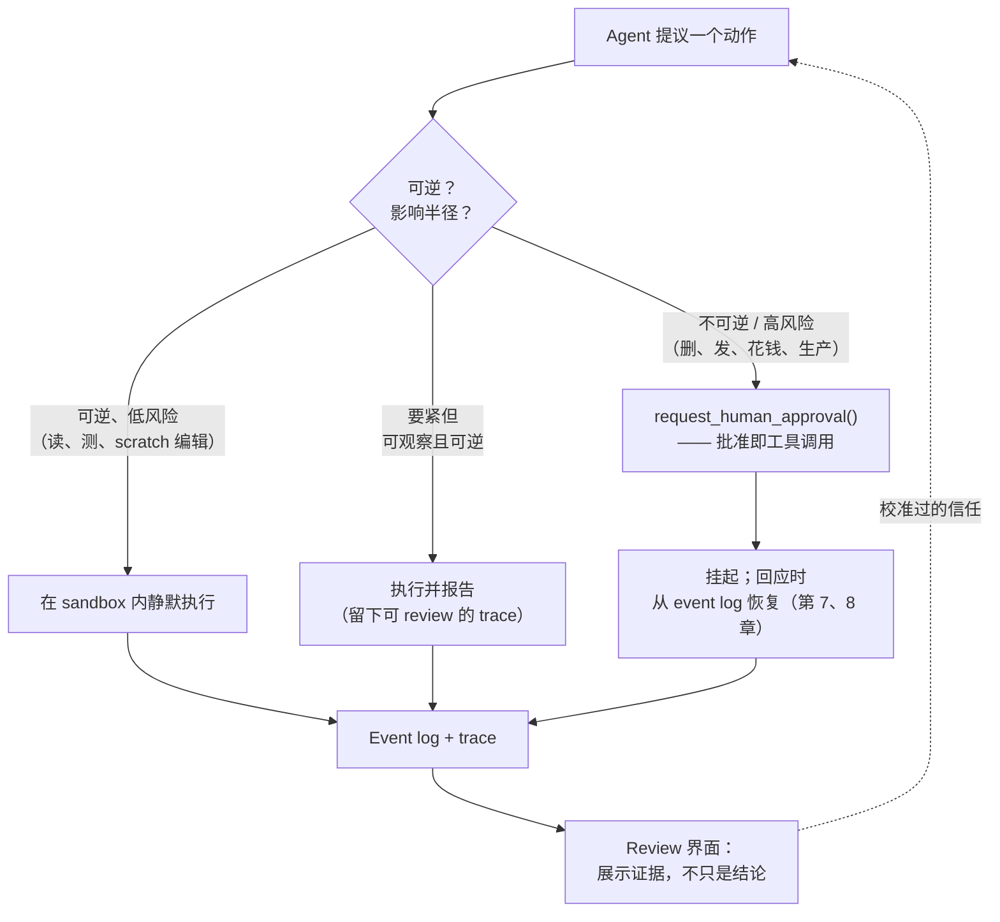

# 第 15 章：人–Agent 交互

本书大部分在讲模型与世界之间的机器：context、工具、sandbox、状态、评估。但对任何做要紧工作的 agent，人也在这个 loop 里——批准动作、任务中途引导、review 结果、决定何时信任输出。通往这个人的接口，是一个和[第 4 章](./04-tools-agent-computer-interface.md)的 agent–computer interface 一样真实的 harness 层，它是被工程化的，不是附带产生的。[第 5 章](./05-sandboxing-guardrails.md)介绍了它的一角——permission fatigue。本章把人的接口当成一个整体来处理。

### 14.1 人在 loop 之内

Agent–computer interface 那一章主张：投入到“agent 如何使用工具”的工程，应该和投入到“人如何使用屏幕”的一样多。人–agent 接口是它的镜像：投入到“人如何监督 agent”的工程，应该和投入到“agent 如何行动”的一样多。Anthropic 的三条实现原则已经指向这里——保持简单、*通过展示 agent 的规划步骤来优先做到透明*、精心打造接口 ([Anthropic — Building Effective Agents](https://www.anthropic.com/engineering/building-effective-agents))。透明不是 UX 上的点缀；它是让监督根本成为可能的东西。

这个前提比 agent 更古老。Horvitz 1999 年的 *mixed-initiative（混合主动）* 接口原则就已框定了核心问题：一个代用户行事的系统，必须决定何时自主行动、何时让步，必须管理打断用户的代价，并且必须记住和使用交互的上下文 ([Horvitz — Principles of Mixed-Initiative User Interfaces](https://www.microsoft.com/en-us/research/publication/principles-of-mixed-initiative-user-interfaces/))。这些问题中的每一个，都在一个能跑 shell 的 agent 身上更尖锐地重现。

### 14.2 两个失败模式：permission fatigue 与盲目信任

人的接口会朝两个相反方向失败，好的设计必须同时避开两者。

- **Permission fatigue（许可疲劳）** 是问得太多的失败。当 agent 对每个动作都请求批准时，人会习惯化、不读就点“allow”，这比不问更糟，因为它制造了监督的*表象*却没有实质 ([Anthropic — Beyond Permission Prompts](https://www.anthropic.com/engineering/claude-code-sandboxing)，第 5 章)。Sandbox 存在的意义，正是让边界内低风险的动作根本不需要询问。
- **盲目信任** 是问得太少的失败。一个流畅自信的输出诱使人盖橡皮图章。当 agent 以一种貌似合理的方式出错——幻觉出的引用、微妙地坏掉的重构——一个不暴露证据的 review 界面会让错误溜过去。

这是同一个旋钮的两端。把它拧向更少询问，冒盲目信任的险；拧向更多询问，冒疲劳的险。解法不是一个全局设置，而是 *与风险成比例* 的交互：让人被询问的程度，校准到动作的可逆性和影响半径上（§14.3）。

### 14.3 混合主动：何时问、何时做

核心设计问题是逐动作的：agent 该直接做，还是先问？一个可行的默认是让答案随后果缩放：

- **静默执行**：对可逆、低风险的动作——读文件、跑测试、改 scratch 工作区（第 5 章）——在 sandbox 内静默做。在这里询问只会训练人停止阅读。
- **执行并报告**：对要紧但可观察、可逆的动作——留下清晰 trace 供人事后 review，而不是阻塞等批准。
- **先问**：对不可逆或高影响半径的动作：删数据、发外部消息、花钱、动生产。这正是 *lethal trifecta* 边界（第 5 章）——agent 即将把私有数据、不可信输入和外部触达结合起来的那一刻，正是人该在 loop 里的那一刻。

这张图就是本书在[展望](./18-outlook.md)里反复回到的 capability–control 权衡：更多自治是更多能力，也是更多控制负担。接口正是这个权衡被逐动作落地的地方。

### 14.4 把批准建模为一次工具调用

HumanLayer 的十二要素宣言做了最干净的结构性动作：*用工具调用联系人类*。与其把人类批准当成一个特殊的控制流异常，不如把它建模为 agent 可以调用的又一个工具——`request_human_approval(action, context)`——其结果像任何别的 observation 一样回到 loop 里 ([HumanLayer — 12-Factor Agents](https://www.humanlayer.dev/blog/12-factor-agents))。

这把人类交互和架构其余部分统一了起来。批准请求是 event log（第 9 章）里的一个事件，所以它是持久、可重放、可审计的。它和[第 7 章](./07-long-running-agents.md)的长运行模式组合：agent 可以请求批准、挂起，并在数小时后人类回应时恢复，因为它的状态活在 log 里，而不在一个一直挂着的连接里。它还让人类成为 trace（[第 12 章](./12-trace-driven-iteration.md)）里的一等参与者，而不是带外的打断。

### 14.5 设计 review 界面

当人确实去 review 时，决策的质量被接口展示的内容所限。一个只呈现 agent 结论的 review 界面诱发盲目信任；一个呈现*结论背后证据*的界面则让真正的判断成为可能。对 coding agent，这意味着 diff、跑过的测试、执行的命令——而不只是“done”。对 research agent，这意味着来源，而不只是摘要。

这是同一份 span telemetry——驱动调试的那份（第 12 章）——面向监督的用法：一个好的 trace 同时也是一个好的 review 产物。人-AI 交互研究的指引在此直接适用——讲清系统能做什么、讲清这次做得多好、支持对错误输出高效地纠正与否决 ([Amershi et al. — Guidelines for Human-AI Interaction](https://www.microsoft.com/en-us/research/publication/guidelines-for-human-ai-interaction/))。一个让自己的工作便于验证、便于否决的 agent，才是人真正能监督的 agent。

### 14.6 引导与打断

监督不只在事前和事后，也在事中。一个看着 agent 走上错路的人，需要在不杀掉 session、不丢掉全部状态的前提下重定向它。引导（steering）是一个 harness 能力：把一条新指令注入正在运行的 agent，并让它在下一回合被纳入。

机制连回前面各章。因为 agent loop 每回合都重新组装 context（第 1 章），一条引导消息只是被加进下一次迭代的 context——而按[第 3 章](./03-compaction-memory-subagent.md)的 recitation 逻辑，把纠正放在 context 靠近末尾处，能让它留在模型最可靠的 attention 跨度里。可打断性也依赖干净的 checkpoint（第 7 章）：一个能被暂停和恢复的 agent 才能被引导；一个把全部状态攥在单次不可打断调用里的 agent 不能。

### 14.7 校准信任：透明与不确定性

人接口的目标是 *校准过的* 信任：人对 agent 的信任，恰好等于它在这个任务上配得到的程度。过度信任产生未经 review 的错误；信任不足产生疲劳和被浪费的人力。两个 harness 杠杆移动校准：

- **透明**——展示规划步骤、工具调用和证据——让人的信任跟随 agent 的实际推理，而不是它的流畅度 ([Anthropic — Building Effective Agents](https://www.anthropic.com/engineering/building-effective-agents))。
- **不确定性信号**——讲清 agent 何时没把握——把人的注意力导向需要的地方。这取决于 agent 的校准是否可信，而姊妹卷警告校准本身就不可靠（*LLM Foundations*，第 10 章）；自报信心是弱信号，所以 harness 应优先把不确定性扎根在验证里（测试过了吗？被引用的来源存在吗？），而不是模型自己的含糊其辞。

### 14.8 监督许多 agent

随着 agent 增多，人的角色从做这份工作，转为监督做这份工作的 agent——再转为*同时*监督*许多* agent。这正是这个领域在走向的杠杆，它改变了接口需求。一个人监督十个 agent，不可能读完每条 trace；接口必须浮现出需要注意的东西：哪些 agent 卡在批准上、哪些没把握、哪些产出的结果没过验证。

这把监督提升为一个 fleet 级关切，而[展望](./18-outlook.md)把它标记为开放问题——人类批准接口和规模化的 harness 一致性都还没解决。仍然成立的原则是：让监督*便宜且有意义*。便宜，使一个人能监督许多 agent 而不被淹没；有意义，使监督是真实的而非橡皮图章。本章的每一项技术——与风险成比例的询问、批准即工具调用、富证据的 review 界面、引导、校准过的透明——都服务于这一个目标。

---

## 图：与风险成比例的交互

*旋钮从静默执行到强制批准；按可逆性和影响半径把每个动作放在它上面。批准是一次工具调用，review 展示证据——同时避开 permission fatigue 和盲目信任。*

---

## 要点

- **人的接口是一个 harness 层**：投入到“人如何监督 agent”的工程，应和投入到“agent 如何行动”的一样多。
- **避开两个失败模式**：permission fatigue（问太多训练出橡皮图章）和盲目信任（问太少放过貌似合理的错误）是同一旋钮的两端。
- **让交互与风险成比例**：可逆低风险静默执行、可观察的执行并报告、不可逆或高影响半径的先问——即 lethal-trifecta 边界。
- **把批准建模为工具调用**：它就变得持久、可重放、可审计，并与长运行的挂起/恢复组合。
- **展示证据，而非只是结论**：一个工作便于验证、便于否决的 agent，才是人真正能监督的——无论是一个还是一队。

## 延伸阅读

- Erik Schluntz and Barry Zhang, *Building Effective Agents*, Anthropic, Dec 2024. https://www.anthropic.com/engineering/building-effective-agents
- Dex Horthy, *12-Factor Agents*（要素 7：用工具调用联系人类），HumanLayer, Apr 2025. https://www.humanlayer.dev/blog/12-factor-agents
- David Dworken and Oliver Weller-Davies, *Beyond Permission Prompts: Making Claude Code More Secure and Autonomous*, Anthropic, Oct 2025. https://www.anthropic.com/engineering/claude-code-sandboxing
- Saleema Amershi et al., *Guidelines for Human-AI Interaction*, CHI 2019. https://www.microsoft.com/en-us/research/publication/guidelines-for-human-ai-interaction/
- Eric Horvitz, *Principles of Mixed-Initiative User Interfaces*, CHI 1999. https://www.microsoft.com/en-us/research/publication/principles-of-mixed-initiative-user-interfaces/
