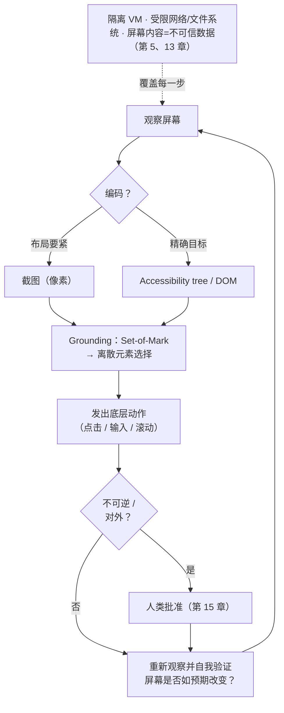

# 第 16 章：Computer-Use 与多模态 Agent

[第 4 章](./04-tools-agent-computer-interface.md)通过定义清晰的工具构建了 agent–computer interface：带 schema 的函数、MCP server 和 code API。如今，越来越多 agent 采用另一种工作方式。它们不调用接口明确的 API，而是像人一样操作软件：观察屏幕、移动光标、在字段中输入文字并点击按钮。这类 *computer-use* agent 依赖多模态感知，也给 harness 带来了 API 型工具不会遇到的问题。当下许多目标宏大的通用 agent 也正采用这种工作方式。

### 16.1 越过 API：操作软件的 agent

核心动机是扩大 agent 能操作的软件范围。大多数软件没有对 agent 友好的 API，只有为人设计的图形界面。只要能看懂屏幕并在其中行动，agent 就能使用原本难以接入的软件，包括旧式桌面应用、没有 API 的网站，以及不太可能被封装成 MCP 的内部工具。Anthropic 的 computer-use 模型和 OpenAI 的 Computer-Using Agent 都采用这种方式：模型接收截图，判断画面内容，再发出“在 (x, y) 处点击”或“输入这个字符串”等底层动作 ([Anthropic — Computer use](https://www.anthropic.com/news/3-5-models-and-computer-use)；[OpenAI — Computer-Using Agent](https://openai.com/index/computer-using-agent/))。

这种 loop 与[第 1 章](./01-what-is-an-agent-harness.md)介绍的 agent loop 有显著差别：observation 是图像而不是工具结果，action 是 UI 操作而不是函数调用，环境则是整个操作系统或浏览器，而不是一套精心挑选的工具。本书关于工具、context 和安全的原则仍然适用，只是它们现在要通过视觉界面作用于更底层的操作。

### 16.2 环境就是工具面

在 ACI 那一章，harness engineer 可以*选择*工具，只提供少量用途清晰、易于正确调用的动作（第 4 章）。computer-use agent 的动作面却由环境决定：屏幕上的每个按钮、菜单和字段都可能成为操作目标。[第 4 章](./04-tools-agent-computer-interface.md)所说的精心筛选工具，在这里无法照搬，因为应用在界面中展示的所有元素都可能成为“工具”。

这改变了一个关键的设计杠杆。Harness 无法再靠减少工具数量来缩小动作空间，而必须帮助 agent 准确*识别*可用动作，并限制它*可以在哪里*行动。设计重点因此从工具选择转向感知与范围控制，这也是接下来几节的主题。

### 16.3 屏幕的几种编码

Harness 可以用多种形式把屏幕呈现给模型，而选择哪种形式会直接影响效果。正如姊妹卷所解释的，图像最终也会转化为 token（*LLM Foundations*，第 2 章）。常见的屏幕编码包括：

- **截图像素**：保留视觉布局和样式，但会消耗大量 token，也可能让小号文字难以辨认。模型必须依靠视觉来定位元素。
- **DOM 或 HTML**（网页）：保留精确文本和文档结构，却无法可靠反映用户实际看到的内容。隐藏、位于屏幕外或相互遮挡的元素可能难以区分。
- **Accessibility tree（可达性树）**：提供为辅助技术设计的结构化语义视图，包含 role、label 和 state，通常比原始 DOM 紧凑得多。
- **OCR**：从像素中恢复文字，但会丢失大量结构和空间关系。

没有哪一种编码能提供完整信息。截图呈现了人所看到的画面，却不包含底层结构；DOM dump 展示了结构，却无法体现视觉上的显著程度。因此，生产系统常常*组合*多种编码，例如用截图理解布局，再用 accessibility tree 或 DOM 确定准确目标。这样更稳健，但也会占用更多 context。这与检索中的精度和预算权衡（第 2 章）本质相同，只是发生在视觉领域。

### 16.4 Grounding：从“看见”到“点击”

computer-use agent 特有的最大难题是 *visual grounding（视觉定位）*：把“点击 Submit 按钮”这样的意图，转换为屏幕上某个具体坐标处的点击。模型可能判断对了该按哪个按钮，却点在错误的位置。API 型工具没有直接对应的失败模式，因为选择一个具名函数是精确操作。

一种常见的 harness 技术是 *Set-of-Mark prompting*。Harness 先在截图中的候选交互元素上叠加编号，让模型选择“点击元素 7”这样的离散标签，而不是直接生成坐标 ([Yang et al. — Set-of-Mark Prompting](https://arxiv.org/abs/2310.11441))。这样可以把容易出错的连续坐标问题转化为更可靠的离散选择，但 harness 必须先检测并标记候选元素。SeeAct 相关研究也表明，即使是能力很强的视觉模型，也需要这类 grounding 脚手架，才能在真实网页上可靠行动。感知和动作是两种可以分开的能力，而 harness 的作用正是弥合两者之间的差距 ([Zheng et al. — GPT-4V is a Generalist Web Agent](https://arxiv.org/abs/2401.01614))。

### 16.5 动作空间及其失败模式

与函数调用相比，computer-use 动作更底层，也更依赖当前状态。一次点击能否成功，取决于屏幕是否仍处于模型预期的状态。页面加载缓慢、意外弹出的 modal 或位置发生变化的布局，都可能让模型已经选定的动作失效。因此，loop 必须在每次动作后重新观察屏幕，并把新画面视为 ground truth；同时还要考虑 observation 与 action 失去同步的情况。

这使[第 7 章](./07-long-running-agents.md)强调的 self-verification 更加重要。每次行动后，agent 都应先确认屏幕是否按预期变化，再继续下一步。恢复也变得更困难：撤销 GUI 操作通常不像回滚 API 调用那样干净。因此，[第 15 章](./15-human-agent-interaction.md)提出的、与风险相称的人机交互在这里尤其重要。computer-use agent 即将确认不可逆对话框时，正应该设置人类 checkpoint。

### 16.6 延迟、成本与像素的 token 重量

computer-use loop 的每个回合都会向 context 发送一张图，而图像会消耗大量 token。单张高分辨率截图的成本可能相当于一页文字（*LLM Foundations*，第 2 章）。一个需要点击三十次的任务，可能让三十张截图先后进入 context window。这会迅速消耗[第 2 章](./02-context-as-finite-resource.md)所说的有限上下文预算，也会加剧 agent 负载以 prefill 为主的特征。

熟悉的 harness 杠杆在这里仍然有效，但需要更谨慎地调节。应在任务允许的范围内尽量降低截图分辨率，却不能让 agent 需要读取的文字或控件变得无法辨认。提取出有用信息后，应从 context 中移除旧截图，只保留一条简洁的屏幕内容说明。[第 3 章](./03-compaction-memory-subagent.md)“把不需要的内容挡在外面”的原则对图像尤其重要。如果 accessibility tree 等结构化表示已经足够，就应优先使用它们，只在布局确实重要时才保留成本较高的截图。

### 16.7 安全：全书最宽的攻击面

computer-use agent 集中了 [lethal trifecta](https://simonwillison.net/2025/Jun/16/the-lethal-trifecta/)（第 5 章）的三个条件：它会读取屏幕上网页或文档中的不可信内容，可能通过浏览器或文件系统接触私有数据，还能通过页面跳转、提交表单或发送消息与外部通信。这里的 prompt injection 不只是藏在工具结果中的恶意文本，也可能是直接显示在网页上的指令，而模型可能误把它当成真正的命令。

防御仍然依靠[第 5 章](./05-sandboxing-guardrails.md)介绍的 sandboxing 和 governance，只是动作面越宽，控制就必须越严格。应让 agent 在专用 VM 或容器等隔离环境中运行，而不是使用用户的主 session；限制它对网络和文件系统的访问；在执行不可逆或对外动作前要求人类批准（第 15 章）。屏幕上显示的一切都应被视为不可信 data，而不是指令。当“data”是一整张渲染后的网页时，[第 13 章](./13-system-prompts-and-instructions.md)的 instruction hierarchy 就成为关键防线。

### 16.8 评估 computer-use agent

由于环境是整个操作系统或浏览器，评估必须衡量环境中的实际结果，而不能只检查文本。[第 10 章](./10-evaluation.md)对 *outcome* 的强调在这里无法回避：真正重要的是任务是否确实在环境中完成。专门设计的 benchmark 展示了这种评估方式。WebArena 提供可自托管的真实 web 环境，并通过执行结果判断任务是否成功 ([WebArena](https://arxiv.org/abs/2307.13854))；OSWorld 则把这一思路扩展到真实桌面操作系统中的开放式任务 ([OSWorld](https://arxiv.org/abs/2404.07972))。

这些 benchmark 再次印证了本书的主线：computer-use agent 距离稳定完成真实任务仍有很大差距。“模型能看懂屏幕”与“agent 能可靠完成任务”之间，缺少的正是 harness 提供的 grounding 脚手架、重新观察、恢复、范围控制和验证机制。一如既往，真正有决定意义的是面向实际工作负载的 eval（第 10 章）。公开的 computer-use benchmark 只能提供背景证据；agent 能否可靠操作*你的*应用，才应决定它是否可以发布。

---

## 图：Computer-Use 循环

*感知 → grounding → 行动 → 重新观察，整个过程都由 sandbox 包裹。Grounding 把“看见”转化为“点击”，重新观察用于应对不断变化的屏幕状态，sandbox 则约束了本书涉及的最宽攻击面。*

---

## 要点

- **Computer-use agent 以更难控制的 loop 换取更广的触达范围**：它们像人一样操作 GUI，因此能使用没有 agent API 的软件。
- **环境本身就是动作面**：工具筛选让位于感知和范围控制；harness 必须帮助 agent 准确识别可用动作，并限制它可以在哪里行动。
- **屏幕编码是 harness 的设计选择**：像素、DOM、accessibility tree 和 OCR 保留的信息各不相同；组合使用更稳健，却会占用更多 context。
- **Grounding 是 computer-use 特有的失败模式**：把意图转换为正确点击很容易出错；Set-of-Mark 等离散选择技术通常比直接生成坐标更可靠。
- **最宽的攻击面需要最严格的 sandbox**：computer-use agent 集中了 lethal trifecta，因此必须隔离运行、限制权限、为不可逆动作设置审批，并把整个屏幕视为不可信 data。

## 延伸阅读

- Anthropic, *Introducing computer use, a new Claude 3.5 Sonnet, and Claude 3.5 Haiku*, Oct 2024. https://www.anthropic.com/news/3-5-models-and-computer-use
- OpenAI, *Computer-Using Agent (Operator)*, Jan 2025. https://openai.com/index/computer-using-agent/
- Jianwei Yang et al., *Set-of-Mark Prompting Unleashes Extraordinary Visual Grounding in GPT-4V*, 2023. https://arxiv.org/abs/2310.11441
- Boyuan Zheng et al., *GPT-4V(ision) is a Generalist Web Agent, if Grounded* (SeeAct), 2024. https://arxiv.org/abs/2401.01614
- Shuyan Zhou et al., *WebArena: A Realistic Web Environment for Building Autonomous Agents*, 2023. https://arxiv.org/abs/2307.13854
- Tianbao Xie et al., *OSWorld: Benchmarking Multimodal Agents for Open-Ended Tasks in Real Computer Environments*, 2024. https://arxiv.org/abs/2404.07972
