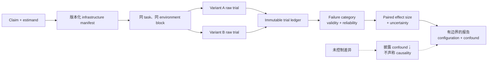

# 第 16 章：Agent Eval 中的基础设施噪声

第 11 章把 evaluation result 定义为关于完整、版本化 model-plus-harness configuration 的证据。本章分析其中一个很容易被隐藏的部分：运行 trial 的基础设施。对于会安装依赖、调用服务、运行测试并在多轮中改变环境状态的 agent，CPU、内存、存储、网络、并发和时间限制既会影响 run 能否完成，也会改变哪些策略可行。Anthropic 的基础设施实验具体展示了这条边界：资源预算或时间限制不同的两个 agent，参加的并不是同一场测试（[Anthropic — Quantifying infrastructure noise in agentic coding evals](https://www.anthropic.com/engineering/infrastructure-noise)）。

**Infrastructure noise** 这个词取决于目标 claim。如果 eval 声称隔离 model 或 harness change，未受控的基础设施变化就是 nuisance variable 或 confounder；如果 eval 声称测量产品在已声明 production contract 下的端到端表现，那么 rate limit、timeout 和 resource ceiling 就属于被测系统，其失败应计入 reliability。在决定固定或排除什么之前，先明确自己要提出哪一种 claim。

### 16.1 在运行 Trial 前定义 Estimand

**Estimand** 是实验计划估计的量。基础设施研究通常会问三个不同问题之一：

1. **固定环境下比较 model-plus-harness：** 保持基础设施不变，估计系统 A 与 B 的 outcome 差异。
2. **基础设施敏感性：** 保持 model、harness、task 与 grader 不变，估计改变一项基础设施因素后的变化。
3. **生产系统可靠性：** 对用户实际会遇到的基础设施条件采样，估计完整系统的 outcome、latency、cost 与 failure distribution。

这些问题需要以不同方式处理 failure。意外的集群设置错误可能让 model-capability trial 无效；由已声明 product contract 施加的 timeout 则是 system reliability failure，不能作为“噪声”移除。应保留第 11 章对 task verdict、infrastructure-invalid trial 和 in-scope reliability failure 的区分。

查看分数之前，先写下目标 claim 与 treatment contrast：

```text
Claim：把 X 从 A 改为 B 会改变 metric Y
Population：已声明的 task suite 与 slice
Fixed configuration：model、harness、grader 与具名 infrastructure field
Experimental unit：一个 trial
Pairing/blocking key：task × replicate × environment block
Primary effect：outcome rate 的绝对差
Uncertainty：已声明的 interval 或 model，在 task/block 层聚类
Invalid-trial policy：版本化的纳入、排除与重试规则
```

缺少这份 contract 时，“同一个 benchmark”可能掩盖完全不同的实验。

### 16.2 Anthropic 资源实验是一个具名 Case Study

Anthropic 在 Google Kubernetes Engine 集群上，以六种资源配置运行 Terminal-Bench 2.0；这些配置从把每个 task 的资源规格同时作为 allocation floor 与 hard ceiling（`1×`），一直延伸到 uncapped resource。实验使用同一个 Claude model、harness 和 task set，目标 treatment 是资源配置（[Anthropic — Quantifying infrastructure noise in agentic coding evals](https://www.anthropic.com/engineering/infrastructure-noise)）。

报告的结果只属于这个实验设置：

| 比较 | 实验设置 | 报告结果 |
|---|---|---|
| Terminal-Bench `1×` → `3×` ceiling | 同一 model、harness、task set；在每个 task 的资源规格之上增加 headroom | Infrastructure error 从 5.8% 降至 2.1%（`p < 0.001`）；success score 在该实验的噪声范围内波动（`p = 0.40`） |
| Terminal-Bench `3×` → uncapped | 同一个六配置实验 | Infrastructure error 又下降 1.6 个百分点，success 则增加将近 4 个百分点 |
| Terminal-Bench `1×` → uncapped | 同一实验的两个极端 | Success 相差 6 个百分点（`p < 0.01`） |
| SWE-bench `1×` → `5×` RAM | 对 227 个 problem 各运行 10 个 sample 的 crossover experiment | Score 增加 1.54 个百分点 |

Anthropic 把 Terminal-Bench 曲线解释为两个经验区间。增加到约 `3×` 之前，额外 headroom 主要减少 container failure；超过这一点后，更多资源启用了大型依赖、昂贵 subprocess 或高内存测试等方案。`bn-fit-modify` 例子显示，一些模型会在宽松限制下安装 Python data-science stack，却会在严格限制下于安装阶段耗尽内存；与此同时，使用标准库的解法依然存在（[Anthropic — Quantifying infrastructure noise in agentic coding evals](https://www.anthropic.com/engineering/infrastructure-noise)）。

这个 case 也说明为什么 allocation 与 enforcement 必须分别报告。Kubernetes 区分用于调度的 resource **request** 与 runtime 执行的 resource **limit**；CPU limit 与 memory limit 的执行行为也不相同（[Kubernetes — Resource Management for Pods and Containers](https://kubernetes.io/docs/concepts/configuration/manage-resources-containers/)）。因此，“8 GB machine”这样的标签不是完整的执行 contract。

### 16.3 三个百分点不是通用阈值

Anthropic 的结论是：在资源方法尚未标准化时，**对于所研究的 agentic-coding 设置，在配置得到记录并匹配之前**，应谨慎看待 leaderboard 上低于 3 个百分点的差异。原文把这条建议与三项结果联系起来：Terminal-Bench 中等资源区间的 observed spread 略低于 2 个百分点，naive binomial interval 约为 1–2 个百分点，而资源分配两端的 spread 达到 6 个百分点（[Anthropic — Quantifying infrastructure noise in agentic coding evals](https://www.anthropic.com/engineering/infrastructure-noise)）。

不要把这条特定 case 的诊断规则转换成以下任何说法：

- 低于 3 个百分点的差异永远不真实；
- 超过 3 个百分点的差异就是显著的；
- 3 个百分点是可以接受的 regression budget；
- 每个 benchmark 都含有 3 个百分点的 infrastructure noise；
- 只要 RAM 相同，就消除了所有基础设施混淆。

通用 cutoff 会忽略 sample size、paired structure、task mix、baseline rate、variance、multiple comparison、grader error，以及实际发生变化的基础设施变量。对于新的 eval，应在自己的实验设计下估计 effect size 与 uncertainty。NIST 关于 binomial proportion interval 的指南让 interval 随 observed count 与 sample size 变化，而不是使用固定 percentage-point 规则（[NIST/SEMATECH — Confidence Intervals for a Proportion](https://itl.nist.gov/div898/handbook/prc/section2/prc241.htm)）。

### 16.4 固定并发布 Infrastructure Manifest

为第 11 章的 `EvalConfiguration` 增加 infrastructure manifest。记录配置值，并在可用时记录观测值：

| 变量类别 | 至少应固定或记录的字段 |
|---|---|
| **Hardware 与 resource** | Cloud/provider、region/zone、node 或 VM type、CPU architecture、vCPU request 与 limit、memory request 与 limit、accelerator、ephemeral-storage request 与 limit、scheduler class、autoscaling behavior |
| **Disk 与 filesystem** | Local/remote storage type、capacity、IOPS/throughput policy、filesystem 与 mount option、workspace location、起始 free space、snapshot/reset mechanism |
| **Network** | Allowed destination、DNS/proxy configuration、egress path、bandwidth/connection limit、到各 dependency 的 region、network emulation、outage 或 incident status |
| **Container image** | Image registry、repository、immutable digest、base-image digest、OS/runtime version、entrypoint、sandbox/runtime version |
| **Dependency** | Lockfile 与 package-manager version、repository/index snapshot、system package、compiler、test runner、browser/driver、installation policy |
| **Service 与 rate limit** | Model/provider endpoint 与 region、account tier、quota、每个 interval 的 request/token 限制、connection pool、retry 与 backoff policy、observed throttling |
| **Cache state** | Image、package、build、repository、DNS、retrieval 与 application cache；cold/warm treatment；priming sequence；reset 或 sharing scope |
| **Parallelism 与 contention** | Evaluation concurrency、每个 node 的 worker、agent subprocess limit、neighboring workload、task scheduling/order、queue policy |
| **Timeout 与 clock** | End-to-end、model、tool、command、install、test、network、queue、idle 与 cleanup timeout；retry budget；clock/timezone control |

不要只用可变 tag 标识 image。Docker 文档说明 tag 之后可能解析到不同 image，而 digest 可以固定 image version；它还说明 build cache 与未固定 package 可能改变后续 build 实际安装的内容（[Docker — Building best practices](https://docs.docker.com/build/building/best-practices/)）。除 image digest 外，还应记录 dependency lock hash 与 repository snapshot，因为 trial 可能会在启动后继续安装软件。

“Warm”并不是单一状态。应明确哪个 cache 是 warm、由谁 prime、是否跨 trial 共享，以及 agent 能否观察到其他 trial 的 artifact。如果 cache state 不是 treatment，就应在 variant 之间 reset 或平衡；如果它就是 treatment，则应精确定义 cold 与 warm protocol。

### 16.5 尽可能按 Task 与 Environment 配对

进行 A/B comparison 时，让两个 variant 在相同 `task_id` 和相同 declared baseline 上运行，并将它们放入匹配的 environment block：相同 image 与 dependency、hardware/resource class、network policy、cache treatment、timeout policy、grader version，以及足够窄的运行时间窗口。每个 task 需要重复足够多的 trial 以表示模型非确定性，并在 block 内 randomize 或 counterbalance A/B 顺序。

这些 observation 是 paired data，因为每个 A result 都能与同 task、同 block 的 B counterpart 自然匹配。NIST 对 paired observation 的定义正是如此：一个 sample 中的第 `i` 个 measurement，与另一个 sample 中的第 `i` 个 measurement 自然配对，并分析 pair 内 difference（[NIST/SEMATECH — Analysis of Paired Observations](https://www.itl.nist.gov/div898/handbook/prc/section3/prc311.htm)）。NIST 的实验设计指南同样建议在 block 内保持可控 nuisance factor 不变，并对无法控制的因素进行 randomization（[NIST/SEMATECH — Randomized Block Designs](https://www.itl.nist.gov/div898/handbook/pri/section3/pri332.htm)）。

“Same environment”不等于复用已经污染的 state。每个 trial 都应从同一个 immutable 或 recoverable baseline 开始，但使用隔离的 namespace、filesystem、credential 和 external-resource scope。Matched block 应让预期条件相同，同时避免一个 trial 的 artifact 帮助另一个 trial。

如果 pairing 不可行，例如 variant 使用不兼容 hardware、provider 或 time window，应把结果报告为 unpaired comparison，并列出 confound。Region、time of day、account tier、image、concurrency 或 provider incident 都可能仍是替代解释；Anthropic 具体列出了 cluster health、hardware、concurrency、egress bandwidth 与时变 API 条件，同时注明其 time-of-day observation 尚未经过正式量化（[Anthropic — Quantifying infrastructure noise in agentic coding evals](https://www.anthropic.com/engineering/infrastructure-noise)）。此时，不要把 observed difference 描述为 model 或 harness 本身的 causal effect。

### 16.6 保存 Raw Trial Ledger

Leaderboard point estimate 不是充分证据。应为每个 trial 保存一条 immutable record：

```text
InfrastructureTrial {
  task_id, trial_id, replicate_id, pair_or_block_id, variant,
  start_time, run_order, model_and_harness_version,
  task_suite_and_grader_version, infrastructure_manifest_hash,
  node_or_worker_id, image_digest, dependency_lock_hash,
  configured_resources, observed_peak_resources,
  cache_treatment, concurrency, rate_limit_events,
  phase_timings, retries, timeout_reason,
  task_verdict, validity, failure_category,
  artifact_ids, trajectory_id, environment_outcome_id
}
```

在隐私与安全控制允许的范围内，应把 raw trial row 与 aggregate 一起发布或保存。至少报告 task 数、每个 task 与 variant 的 trial 数、pass/fail/partial count、invalid trial、retry 和 missing record。Anthropic 建议运行多个 trial，因为 agent output 会变化；其指南也强调 coding eval 需要稳定环境（[Anthropic — Demystifying evals for AI agents](https://www.anthropic.com/engineering/demystifying-evals-for-ai-agents)）。

使用版本化 failure taxonomy：

- model/agent substantive failure；
- CPU、memory、accelerator、process 或 disk exhaustion；
- storage 或 filesystem failure；
- network、DNS、proxy 或 egress failure；
- container-image、dependency、package-index 或 setup failure；
- provider error、rate limit 或 backoff exhaustion；
- timeout、queue delay 或 cancellation；
- concurrency contention 或 worker eviction；
- cache contamination 或 failed reset；
- harness、grader、fixture、cleanup 或 logging failure。

分类取决于 claim。已声明 production contract 内的 rate limit 是有效 reliability failure；被测系统之外的 grader outage 则可能让 trial 无效。应在应用 retry 或 exclusion policy 之前记录 reason code，避免基础设施错误在重跑中消失。

### 16.7 同时报告 Effect Size 与 Uncertainty

对于 binary outcome，先报告以**百分点**表示的绝对 pass-rate difference，并附 raw numerator 与 denominator。Relative lift 或 rate ratio 可以补充，但必须同时给出 baseline：“1.5×”在 2% 和 60% baseline 下代表完全不同的绝对变化。

对于 paired repeated trial，先计算 task-level difference，避免保留 attempt 更多的 task 静默占据更大权重：

```text
d_task = mean(outcome_B for task and matched blocks)
       - mean(outcome_A for task and matched blocks)
primary effect = mean(d_task across the declared task population)
```

应选择尊重实验设计的 interval 或 statistical model：paired task bootstrap、适合 matched binary data 的 procedure，或者在 trial 嵌套于 task 与 environment block 时使用 hierarchical model。报告 sampling unit、confidence 或 credible level、method、assumption，以及对 invalid-trial handling 的 sensitivity。第 11 章解释了为什么把 correlated attempt 当作独立观测会夸大 precision。

每张结果表都应包含：

- 每个 variant 的 raw task 与 trial count；
- absolute effect size，以及有用时带 baseline 的 relative effect；
- uncertainty interval 与任何预先指定的 hypothesis-test result；
- failure-category count 与 delta；
- latency、cost 与 resource-use distribution；
- 按 reason 列出的 invalid、missing、retried 与 excluded trial；
- per-task 或 per-slice result，而不只是 pooled score；
- 完整 configuration 或其 content-addressed manifest。

`p`-value 不能替代 effect size 或 interval。同样，窄 interval 也不能修复未控制的 confound 或损坏的 grader。如果比较许多 infrastructure variant 或 slice，应在查看结果前声明 primary contrast，并在解释中考虑探索性 multiple comparison。

### 16.8 诊断 Score 为什么改变

至少区分四种机制：

1. **Reliability stabilization：** 到达 grader 的无效或 in-scope infrastructure failure 变少。
2. **Strategy enablement：** Agent 现在能够安装、搜索、编译、测试或 brute-force，而严格配置之前会阻止这些方案。
3. **Latency-budget interaction：** 更快 hardware、warm cache、更少 contention 或不同 rate limit，使更多工作可以在同一个 timeout 内完成。
4. **Uncontrolled confounding：** 另一个 configuration 或时变条件与目标 treatment 同时发生变化。

同时比较 outcome 与 trajectory evidence：failure reason、resource peak、install 与 test 行为、subprocess count、service throttling、queue time 和 phase latency。在 Anthropic 的 Terminal-Bench case 中，`1×`–`3×` 区间主要表现为 infrastructure error 下降；而超过 `3×` 后，score 增幅超过了该错误降幅，并伴随资源密集型策略（[Anthropic — Quantifying infrastructure noise in agentic coding evals](https://www.anthropic.com/engineering/infrastructure-noise)）。这是关于该实验的证据，而不是通用 breakpoint。

不要把每个对基础设施敏感的 success 都重新标为 score inflation。如果产品确实提供更大的资源预算，善用它可能是有效能力。报告应说明测量目标究竟是约束下的效率、预算内最大 task success，还是 production condition 下的 reliability。

### 16.9 运行 Sensitivity Matrix，而不是只用一种“干净”配置

固定 baseline 能支持比较，却不能展示 robustness。在 release 或 publication 前，测试重要 configuration boundary：

| 因素 | 控制比较示例 | 要检查的证据 |
|---|---|---|
| Hardware/resource | Declared request/limit floor 与校准后的 ceiling | Outcome、OOM/throttling、peak use、strategy change |
| Disk/network | Local 与 remote disk；normal 与声明的 bandwidth/latency condition | I/O error、install/test latency、timeout interaction |
| Image/dependency | 相同 image digest；然后进行一次计划内 dependency upgrade | Reproducibility、setup failure、behavioral delta |
| Rate limit | Declared quota tier 或 controlled throttling | Retry/backoff behavior、queue time、incomplete task |
| Warm cache | 精确定义的 cold 与 warm treatment | Hit rate、latency/cost、contamination check |
| Parallelism | 固定 per-trial limit 下的低并发与 production concurrency | Contention、tail latency、eviction、outcome |
| Timeout | Production timeout 与用于诊断的更长 timeout | Near-boundary completion、hung phase、strategy change |

当目标是诊断时，可以一次筛查一个因素；当 interaction 重要时，使用预先指定的 factorial 或 blocked design。不要同时改变 model、harness、image、resource、concurrency 与 timeout，然后把全部 score delta 归因于单一组件。

### 16.10 发布可重建的结果

一份能够体现基础设施影响的报告应包含：

- claim、estimand、task population、slice 与 decision owner；
- model、agent harness、evaluation harness、tool、grader 与 policy version；
- experiment design、pairing/blocking、order randomization、run date 与 location；
- 完整 infrastructure manifest，包括 resource allocation **与 enforcement**；
- raw trial ledger，或带 checksum 的 privacy-preserving derivation；
- point estimate、raw count、effect size、uncertainty 与 failure category；
- invalid-trial、retry、missing-data 和 exclusion policy，以及 sensitivity analysis；
- 具名 confound 与 causal/cross-lab comparison 的边界；
- release decision、exception owner，以及 monitoring 或 rerun trigger。

OpenAI 的 evaluation playbook 同样要求报告披露 tested system、harness 与 tool access、elicitation method、budget、safeguard 和 validity check，因为这些内容决定了结果能够支持什么 claim（[OpenAI — A shared playbook for trustworthy third-party evaluations](https://openai.com/index/trustworthy-third-party-evaluations-foundations/)）。

跨实验室复现不要求 vendor 名字完全相同，但要求实验 contract 等价，或者明确说明差异。如果无法建立等价性，应分别发布结果，而不是通过 normalization 隐藏差别。当其他 reviewer 能够重建运行内容、分类 failure，并理解哪些 uncertainty 来自 sampling、哪些来自 configuration 时，benchmark score 才会成为有用证据。

---

## 图示：从基础设施变量到有边界的 Claim



---

## 本章要点

- **Infrastructure noise 取决于 claim。** Model comparison 中的 nuisance variable，在 product eval 中可能是 in-scope reliability condition。
- **三个百分点建议是具名 Anthropic case result。** 它不是通用 significance threshold、regression budget 或所有 benchmark 的噪声估计。
- **发布完整 execution contract。** Hardware/resource、disk/network、image 与 dependency、rate limit、cache state、parallelism 和 timeout 都属于 manifest。
- **尽可能按 task 与 environment 配对。** 使用 matched baseline 与 block，再分析 pair 内 difference；否则应披露 unpaired confound。
- **保存 raw trial 与 failure category。** 在重试或排除前区分 substantive failure、in-scope system reliability failure 与 infrastructure-invalid trial。
- **Effect size 必须与 uncertainty 一起报告。** 附 raw count、sampling unit、per-slice effect、interval、invalid-trial sensitivity、latency、cost 与 resource use，而不是只给 leaderboard point estimate。
- **所有 multiplier 与 score shift 都必须附带实验设置。** `3×`、6-point 与 1.54-point 结果描述的是 Anthropic 的特定实验，不是可移植常数。

## 延伸阅读

- Gian Segato，*Quantifying infrastructure noise in agentic coding evals*，Anthropic。https://www.anthropic.com/engineering/infrastructure-noise
- Mikaela Grace 等，*Demystifying evals for AI agents*，Anthropic。https://www.anthropic.com/engineering/demystifying-evals-for-ai-agents
- NIST/SEMATECH，*Randomized Block Designs*。https://www.itl.nist.gov/div898/handbook/pri/section3/pri332.htm
- NIST/SEMATECH，*Analysis of Paired Observations*。https://www.itl.nist.gov/div898/handbook/prc/section3/prc311.htm
- NIST/SEMATECH，*Confidence Intervals for a Proportion*。https://itl.nist.gov/div898/handbook/prc/section2/prc241.htm
- Kubernetes，*Resource Management for Pods and Containers*。https://kubernetes.io/docs/concepts/configuration/manage-resources-containers/
- Docker，*Building best practices*。https://docs.docker.com/build/building/best-practices/
- OpenAI，*A shared playbook for trustworthy third-party evaluations*。https://openai.com/index/trustworthy-third-party-evaluations-foundations/
