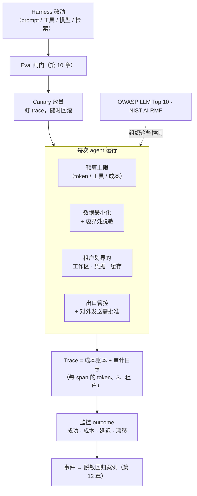

# 第 17 章：成本、隐私与生产运维

到目前为止各章搭出了一个能工作的 agent。把它放到生产、服务真实用户，会多出三个被 agent loop 本身掩盖的关切：每次运行*花多少钱*、它如何处理*敏感数据*、以及一旦有人依赖它之后 harness 如何被*安全地改动*。没有一个光鲜，而每一个都是“能跑的 demo”悄悄无法变成“能用的产品”的地方。[第 5 章](./05-sandboxing-guardrails.md)讲了安全威胁模型，[第 11 章](./11-infrastructure-noise.md)讲了测量噪声；本章讲围绕它们的运维经济学、数据治理和发布纪律。

### 17.1 成本：给 agent 做预算

Agent 是运行模型最贵的方式，因为一个用户请求会扩展成许多模型调用、工具往返，以及——有了推理模型之后——很长的内部 token 流（[第 14 章](./14-model-selection-routing-reasoning.md)）。更糟的是，一个任务的成本事先未知：开放式 loop 可能跑三个回合，也可能跑三十个。这正是本书反复回到“做能奏效的最简单的事”（[第 6 章](./06-agentic-workflow-patterns.md)）的运维理由——每个 agentic 回合都是一笔反复发生的费用，而不是一次性的。

因此生产 agent 需要一个明确的*预算*，就像[第 7 章](./07-long-running-agents.md)需要 checkpoint 一样。具体地：

- **每任务上限**：对 token、工具调用或墙钟成本设上限，超过就停下来问，而不是无限循环。无界 loop 就是一张失控的账单。
- **已经确立的成本杠杆**：把简单步骤路由到便宜模型，把前沿和推理模型留给确实需要的步骤（第 14 章）；缓存稳定前缀，让重复的 context 不必每回合重付（第 2 章）；返回 token 高效的工具结果，并用 code execution 避免把大结果倒进 context（第 4 章）。
- **要不要建的决定**：最便宜的 agent 是不跑的那个。许多任务用一个 workflow 或单次调用服务更好，而成本分析是这个选择的一部分（第 6 章）。

[第 14 章](./14-model-selection-routing-reasoning.md)的级联和路由模式既是质量控制，也同样是成本控制；FrugalGPT 的核心结果是，朴素的“总是调最好的模型”策略上的大部分花费，在不损失准确率的前提下是可以省掉的 ([FrugalGPT](https://arxiv.org/abs/2305.05176))。

缓存在这里值得再看一眼，因为它有两种不同的形态。[第 2 章](./02-context-as-finite-resource.md)的 KV/前缀缓存廉价地服务*相同*前缀；而*语义缓存（semantic cache）*服务*相似*请求：它把进来的查询嵌入成向量，当某个先前查询足够接近时就返回已存响应，这一做法由 GPTCache 推广开来 ([Fu Bang - GPTCache](https://github.com/zilliztech/GPTCache))。对高频重复查询，它能消掉整次模型调用，而不只是让调用变便宜——但它引入了前缀缓存所没有的正确性风险：一次错误命中会为一个只是*看起来*像缓存项的问题返回一个微妙错误的答案。因此语义缓存是一个需要调优的组件——相似度阈值在节省与该风险之间权衡——并且应像任何其他 harness 变更一样接受同样的 eval 纪律（第 17.5 节）。两种缓存，连同上面的按 key 预算，都天然地在 *AI 网关*（第 14.8 节）处执行：它坐落在每一次调用的路径上，是唯一可以跨 agent 统一施加成本控制的地方。

### 17.2 成本归因与 trace

预算只有在成本被*测量*时才可执行，而测量它的地方是 trace。[第 12 章](./12-trace-driven-iteration.md)的 span telemetry——一棵由模型调用、工具调用、检索构成的 span 树——同时也是成本账本：给每个 span 附上 token 数和美元成本，trace 就不只告诉你 agent 做了什么，还告诉你每一步花了多少。这把“agent 很贵”变成“这个工具每次调用返回 8000-token 的结果”，那是一个工程任务，而不是一句抱怨。

成本归因也喂进和失败同一个迭代 loop。一个既贵又低价值的步骤，是换更便宜模型、收紧工具结果或干脆移除的候选——把[第 12 章](./12-trace-driven-iteration.md)的 trace 驱动迭代用在成本轴而非正确性轴上。正如[第 11 章](./11-infrastructure-noise.md)所警告，成本和资源配置也与被测行为相互作用，所以成本应该和能力并列报告，而不是分开。

### 17.3 隐私与数据治理

Agent 每次运行都触碰数据——读文件、查数据库、检索文档、向模型供应商和工具发请求。每一处都是敏感数据可能泄露的地方，而 harness 拥有这些控制。威胁在[第 5 章](./05-sandboxing-guardrails.md)的 *lethal trifecta* 形态下最尖锐：一个同时拥有私有数据访问、暴露于不可信内容、并有对外通信路径的 agent，可以被诱导去外泄那些数据 ([Simon Willison — The lethal trifecta](https://simonwillison.net/2025/Jun/16/the-lethal-trifecta/))。隐私不是和安全分开的关切；它是安全的数据处理那一面。

Harness 层的控制：

- **最小化进入 context 的东西。** Agent 永远看不到的数据不会泄露。检索任务所需的切片，而不是整条记录（第 2 章），并优先用 handle 而非裸敏感内容。
- **在边界处脱敏。** 在内容跨进模型 context 或跨进 trace 之前，剥掉 secrets 和 PII——trace 是持久的，而且常被送往第三方 observability 工具，所以一条未脱敏的 trace 本身就是一次泄露（第 12 章）。
- **在检索时尊重权限。** 在检索之前按 *用户* 被允许看到什么来过滤，而不是在生成之后；agent 绝不能变成读取其用户读不到的数据的途径（第 5 章、[第 12 章](./12-trace-driven-iteration.md)）。
- **管控出口。** Trifecta 里对外通信那条腿，是 harness 能切断的那条：约束 agent 能把数据发到哪里，并对对外发送要求批准（第 15 章）。

### 17.4 多租户与隔离

当一个 agent 平台服务许多用户或组织时，隔离成为一个正确性属性，而不只是锦上添花。两个失败模式要紧。*状态串味*——一个租户的 context、记忆或缓存前缀泄进另一个租户的 session——是灾难性的，而且在加入记忆（第 3 章）和前缀缓存（第 2 章）却没做租户划界时很容易引入。*权限串味*——agent 用一个租户的凭据代另一个租户行事——是[第 5 章](./05-sandboxing-guardrails.md)的 delegated-auth 关切的多租户版本。

纪律遵循[第 7 章](./07-long-running-agents.md)的 managed-agent 架构：每租户的持久工作区、划界到单一租户资源的 sandbox、以及划界且绝不跨 brain/hands 边界共享的凭据。Event log（第 9 章）应携带租户身份，使每个动作可归因，而这也是审计（第 5 章）在共享系统里有意义的前提。

### 17.5 发布 harness 改动

Harness 是软件，而改动有人依赖的软件需要发布纪律——但 harness 改动异常地有风险，因为它的影响是统计性的，不是确定性的。一次 prompt 编辑、一个新工具、一次换模型、一次检索调整，都可能在没人测过的输入上改变行为，而回归可能是几个百分点的案例，而不是一次崩溃（[第 10 章](./10-evaluation.md)、[第 12 章](./12-trace-driven-iteration.md)）。

随之而来的发布实践：

- **每次改动都用 eval 把关。** 改动前后各跑套件，比较 pass rate、失败类别、成本和延迟——[第 10 章](./10-evaluation.md)的回归纪律就是发布闸门。
- **逐步放量。** 因为 eval 套件永远覆盖不了完整输入分布，把 harness 改动当成任何有风险的部署：先发布给一小部分流量，盯着生产 trace 和 outcome 指标，并随时准备回滚。Canary 是便宜地接住 eval 漏掉的案例的方式。
- **把整个配置一起版本化。** [第 12 章](./12-trace-driven-iteration.md)的 model–harness 耦合意味着发布的单位是*配置*——模型、prompt、工具、检索策略——而不是其中任一部分。Readiness validation（第 10 章）是针对每个配置的，回滚也必须恢复整个配置，而不只是 prompt。

### 17.6 监控、SLO 与事件响应

Eval 在发布前跑；监控在发布后跑。两者互补：eval 测量一个精挑的分布，生产告诉你真实的那个。[第 12 章](./12-trace-driven-iteration.md)的 span telemetry 是监控底座，而运维上的补充就是任何生产系统都需要、只是为 agent 特化的那些：

- **Outcome 指标，而不只是 uptime。** 一个“API 有响应”的 liveness 检查，对任务是否在成功一无所知。把任务成功率、升级/批准率、每任务成本、延迟分位（p50/p95/p99，如第 6 章）当一等信号来跟踪。
- **对漂移告警。** 上升的失败率、攀升的每任务成本、下降的 self-verification 通过率，即便什么都没崩，也是一次事件——这些是 agent 特有的失败形状。
- **生产失败变成回归案例。** [第 12 章](./12-trace-driven-iteration.md)的 trace-to-eval loop 同时也是事件响应 loop：一次生产失败被脱敏、变成一个可复现的 eval case、并被永久工程化掉，使同一事件不能再悄悄复发。

### 17.7 治理框架

这些关切不只是内部工程；对许多部署而言，它们是外部要求。四个参考框架帮助组织这项工作、无需重复造轮子，覆盖从自愿指南到有约束力的法律。

- **OWASP Top 10 for LLM Applications** 列举了常见风险类别——prompt injection、敏感信息泄露、过度自主（excessive agency）、供应链风险——并干净地映射到[第 5 章](./05-sandboxing-guardrails.md)和本章的控制 ([OWASP - Top 10 for LLM Applications](https://genai.owasp.org/llm-top-10/))。
- **NIST AI Risk Management Framework** 提供一个更高层的结构——govern、map、measure、manage——给需要围绕 agent 部署做可审计风险流程的组织 ([NIST - AI Risk Management Framework](https://www.nist.gov/itl/ai-risk-management-framework))。
- **ISO/IEC 42001:2023**，首个 AI 管理体系标准，是 ISO 27001 的 AI 对应物：它规定组织如何为其 AI 建立、运行并持续改进一套管理体系，且可认证 ([ISO/IEC 42001:2023](https://www.iso.org/standard/42001))。
- **欧盟《AI 法案》（EU AI Act）**（Regulation (EU) 2024/1689）是首部全面的 AI 法律。它按风险层级对系统分类，并对高风险用途施加有约束力的义务——风险管理、数据治理、透明度、人类监督、日志记录——相关条款在 2026-2027 年间分阶段生效 ([EU AI Act - Regulation (EU) 2024/1689](https://eur-lex.europa.eu/eli/reg/2024/1689/oj/eng))。注意两者互补但不同：ISO 42001 认证是良好流程的证据，而非 AI 法案合规的自动证明。

这些框架都不替代本书里的工程；它们组织这些工程，并让它对审计方、客户和监管者可读。[展望](./18-outlook.md)把跨层治理一致性标记为开放问题，恰恰因为 policy、审计和运行时强制仍然活在分离的层里——这些框架是当下让它们保持对齐的最好脚手架。

---

## 图：生产外壳

*成本、隐私和租户隔离在每次运行处强制；trace 既是成本账本也是审计日志；每次 harness 改动都要过 eval 闸门和 canary 才到生产。*

---

## 要点

- **Agent 需要明确预算**：开放式 loop 是失控账单；给每任务的 token/工具/成本设上限，并用路由、级联、缓存和 token 高效工具控制花费（[FrugalGPT](https://arxiv.org/abs/2305.05176)）。
- **Trace 是成本账本**：附上每 span 的 token 和美元，“agent 很贵”就变成一个具体、可修的工程任务。
- **隐私是 lethal trifecta 的数据那一面**：最小化进入 context 的东西、在边界脱敏（trace 也会泄露）、按用户权限过滤检索、管控出口。
- **多租户要求隔离**：按租户划界工作区、凭据、记忆和前缀缓存，并在 event log 里携带租户身份——状态串味和权限串味都是灾难性的。
- **两种缓存，两种风险画像**：前缀缓存廉价地服务相同上下文；语义缓存服务*相似*查询、能省掉整次调用，但一次错误命中会返回错误答案——调好它的阈值，并像任何 harness 变更一样对它做 eval。
- **发布 harness 改动是一次统计性部署**：用 eval 把关、逐步 canary、把整个配置一起版本化、把生产失败变成回归案例。
- **治理框架横跨指南到法律**：OWASP LLM Top 10 和 NIST AI RMF 组织这些控制；ISO/IEC 42001 认证流程；欧盟《AI 法案》让高风险用途的义务具有约束力。

## 延伸阅读

- Lingjiao Chen, Matei Zaharia, and James Zou, *FrugalGPT: How to Use Large Language Models While Reducing Cost and Improving Performance*, 2023. https://arxiv.org/abs/2305.05176
- Simon Willison, *The lethal trifecta for AI agents*, Jun 2025. https://simonwillison.net/2025/Jun/16/the-lethal-trifecta/
- OWASP, *Top 10 for Large Language Model Applications*, 2025. https://genai.owasp.org/llm-top-10/
- NIST, *AI Risk Management Framework (AI RMF 1.0)*, 2023. https://www.nist.gov/itl/ai-risk-management-framework
- Gian Segato, *Quantifying Infrastructure Noise in Agentic Coding Evals*, Anthropic, Feb 2026. https://www.anthropic.com/engineering/infrastructure-noise
- Dex Horthy, *12-Factor Agents*, HumanLayer, Apr 2025. https://www.humanlayer.dev/blog/12-factor-agents
- Fu Bang, *GPTCache: An Open-Source Semantic Cache for LLM Applications*, NLP-OSS @ EMNLP 2023. https://github.com/zilliztech/GPTCache
- *ISO/IEC 42001:2023 - Information technology - Artificial intelligence - Management system*, ISO, 2023. https://www.iso.org/standard/42001
- *Regulation (EU) 2024/1689 (Artificial Intelligence Act)*, European Union, Jun 2024. https://eur-lex.europa.eu/eli/reg/2024/1689/oj/eng
