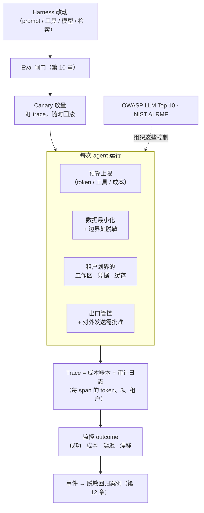

# 第 17 章：AgentOps——成本、隐私与生产运维

前面的章节已经构建出一个可以工作的 agent。但要让它进入生产环境并服务真实用户，还必须处理三个容易被 agent loop 掩盖的问题：每次运行*花费多少*、如何处理*敏感数据*，以及在用户开始依赖系统之后，怎样*安全地修改 harness*。这些问题很容易被忽略，却往往决定了一个可运行的 demo 能否成为可靠的产品。[第 5 章](./05-sandboxing-guardrails.md)介绍了安全威胁模型，[第 11 章](./11-infrastructure-noise.md)讨论了测量噪声。本章将在此基础上讨论运维经济性、数据治理和发布纪律。

这套运维方法正逐渐被称为 **AgentOps**。AWS 将其归纳为四个相互关联的支柱：**治理与安全（governance and security）**、**构建与运维（build and operations）**、**评估（evaluation）**和**可观测性（observability）** ([AWS - AgentOps](https://aws.amazon.com/blogs/machine-learning/agentops-operationalize-agentic-ai-at-scale-with-amazon-bedrock-agentcore/))。这个概念的价值在于，它覆盖 agent 的完整生命周期：从规划、开发、构建和测试，到部署、维护、监控，直至最终退役。生产责任贯穿整条路径，而不是从打开 monitoring dashboard 才开始。

AgentOps 也改变了“发布什么”这个问题的答案。可部署的 artifact 不只是模型代码或一段 prompt，而是一套版本化的完整配置，其中包括模型及推理设置、system 与 project instructions、tool catalog 与 schema、memory policy、sandbox image、identity 与 authorization policy、grader、预算和路由规则。Release record 应明确记录这套配置，以便工程师把事件归因到具体版本，并在必要时完整 rollback。第 18 章会再向上一层：控制平面负责注册这些 artifact，管理它们的身份和 fleet lifecycle；AgentOps 则负责日常运行并持续改进它们。

### 17.1 成本：给 agent 做预算

Agent 通常是运行模型成本最高的方式，因为一个用户请求可能扩展为多次模型调用和工具往返；使用推理模型时，还可能产生很长的内部 token 流（[第 14 章](./14-model-selection-routing-reasoning.md)）。总成本也很难预先判断：开放式 loop 可能运行三个回合，也可能运行三十个。这正是本书反复强调“采用能够奏效的最简单方案”（[第 6 章](./06-agentic-workflow-patterns.md)）的运维原因——每增加一个回合，就会增加一笔费用。

因此，生产环境中的 agent 必须有明确的*预算*，就像[第 7 章](./07-long-running-agents.md)中的长时运行 agent 必须设置 checkpoint 一样。实践中需要考虑：

- **每项任务的上限**：限制 token、工具调用次数或按实际运行时间计算的成本。达到上限后，agent 应停止运行并请求进一步指示，而不是无限循环。没有边界的 loop 可能迅速变成一笔失控的账单。
- **前文介绍的成本杠杆**：把简单步骤路由给成本较低的模型，只在确有需要时使用前沿模型和推理模型（第 14 章）；缓存稳定前缀，避免每个回合都为重复 context 付费（第 2 章）；让工具返回 token 效率更高的结果，并用 code execution 处理大体量数据，避免直接把它们放进 context（第 4 章）。
- **是否应该构建 agent**：最便宜的 agent 是根本不需要运行的 agent。许多任务更适合 workflow 或单次模型调用，成本应成为设计选择的一部分（第 6 章）。

[第 14 章](./14-model-selection-routing-reasoning.md)介绍的级联和路由模式既能控制质量，也能控制成本。FrugalGPT 的核心结论是：与朴素的“始终调用最佳模型”策略相比，大部分费用都可以避免，同时不必牺牲准确率 ([FrugalGPT](https://arxiv.org/abs/2305.05176))。

缓存需要进一步区分，因为这里涉及两种不同的机制。[第 2 章](./02-context-as-finite-resource.md)介绍的 KV/前缀缓存以较低成本处理*完全相同*的前缀；*语义缓存（semantic cache）*则用于处理*相似*请求。它先将新查询编码为向量，如果发现足够接近的历史查询，就直接返回已存储的响应。GPTCache 推广了这种做法 ([Fu Bang - GPTCache](https://github.com/zilliztech/GPTCache))。对于高频、重复性强的查询，语义缓存可以省去整次模型调用，而不只是降低调用成本。

但语义缓存也带来了前缀缓存没有的正确性风险。一次错误命中，可能会把某个缓存答案返回给一个只是*表面相似*的问题，造成不易察觉的错误。因此，语义缓存需要调优：相似度阈值决定了成本节省与错误匹配风险之间的权衡，它也必须像其他 harness 变更一样经过严格 eval（第 17.5 节）。两种缓存以及前述的按 key 预算，都适合在 *AI 网关*（第 14.8 节）统一执行。由于每次模型调用都会经过网关，它可以为不同 agent 一致地应用成本控制。

### 17.2 成本归因与 trace

只有先*测量*成本，预算才能真正执行，而 trace 是最自然的测量位置。[第 12 章](./12-trace-driven-iteration.md)介绍的 span telemetry，是一棵由模型调用、工具调用和检索组成的 span 树，也可以同时充当成本账本。只要为每个 span 记录 token 数和美元成本，trace 就既能说明 agent 做了什么，也能显示每一步花了多少钱。这样，“agent 很贵”就能转化为“这个工具每次调用都会返回 8000-token 的结果”等具体观察，工程师也就有了可以着手解决的问题。

成本归因应进入与失败分析相同的迭代 loop。如果某个步骤成本很高、贡献却很小，就可以考虑改用更便宜的模型、缩短工具响应，甚至删除这一步。这相当于把[第 12 章](./12-trace-driven-iteration.md)的 trace 驱动迭代用于成本，而不是正确性。正如[第 11 章](./11-infrastructure-noise.md)所提醒的，成本和资源配置还可能影响测得的行为，因此成本应与能力一并报告，而不应被视为彼此独立的指标。

### 17.3 隐私与数据治理

Agent 每次运行都会处理数据：读取文件、查询数据库、检索文档，并向模型供应商和工具发送请求。每一条路径都可能泄露敏感数据，而 harness 负责控制这些路径。[第 5 章](./05-sandboxing-guardrails.md)所说的 *lethal trifecta* 会让威胁尤为严重：如果 agent 能访问私有数据、接收不可信内容，又能与外部通信，攻击者就可能诱导它外泄数据 ([Simon Willison — The lethal trifecta](https://simonwillison.net/2025/Jun/16/the-lethal-trifecta/))。因此，隐私并不是独立于安全的另一个问题，而是同一问题在数据处理层面的体现。

相关的 harness 层控制包括：

- **尽量减少进入 context 的数据。** Agent 从未接触的数据不可能由它泄露。只检索任务需要的部分，而不是整条记录（第 2 章）；能使用 handle 时，优先使用 handle，而不要直接传入敏感内容。
- **在边界处脱敏。** 在内容进入模型 context 或 trace 前，移除 secret 和个人可识别信息（PII）。Trace 会长期保存，而且常被发送到第三方 observability 工具，因此未经脱敏的 trace 本身就可能成为数据泄露源（第 12 章）。
- **在检索阶段执行权限检查。** 应在检索前根据*用户*有权查看的数据进行过滤，而不是生成后再处理。Agent 不能成为用户越权读取数据的途径（第 5 章、[第 12 章](./12-trace-driven-iteration.md)）。
- **管控数据出口。** Harness 可以切断 trifecta 中的对外通信路径：限制 agent 可以把数据发送到哪里，并要求对外发送必须经过批准（第 15 章）。

### 17.4 多租户与隔离

当一个 agent 平台同时服务多个用户或组织时，隔离就不再只是附加的安全措施，而是系统正确性的基本要求。这里尤其需要防范两种失败。*租户间状态泄漏（state bleed）*是指一个租户的 context、记忆或缓存前缀出现在另一个租户的 session 中；如果引入记忆（第 3 章）或前缀缓存（第 2 章）时没有按租户划分范围，就很容易造成这种灾难性后果。*租户间权限泄漏（authority bleed）*则是指 agent 使用一个租户的凭据代表另一个租户行动，它是[第 5 章](./05-sandboxing-guardrails.md)所讨论的 delegated authorization 问题在多租户环境中的表现。

所需的工程纪律与[第 7 章](./07-long-running-agents.md)的 managed-agent 架构一致：为每个租户建立持久工作区，把 sandbox 限制在单个租户的资源范围内，并使用权限范围明确、绝不跨 brain/hands 边界共享的凭据。Event log（第 9 章）还应记录租户身份，使每项动作都能正确归因；这也是审计（第 5 章）在共享系统中真正有效的前提。

### 17.5 发布 harness 改动

Harness 也是软件，修改一套已经被用户依赖的软件必须遵守发布纪律。Harness 变更的特殊风险在于，其影响往往是统计性的，而不是确定性的。修改 prompt、增加工具、更换模型或调整检索策略，都可能改变系统在未测试输入上的行为。回归也未必表现为明显崩溃，而可能只影响几个百分点的案例（[第 10 章](./10-evaluation.md)、[第 12 章](./12-trace-driven-iteration.md)）。

这种风险要求三项发布实践：

- **每次变更都要通过 eval 闸门。** 在变更前后分别运行 eval 套件，比较 pass rate、失败类别、成本和延迟。[第 10 章](./10-evaluation.md)介绍的回归测试纪律，就是这里的发布条件。
- **逐步放量。** Eval 套件永远无法覆盖完整的输入分布，因此应把 harness 变更当作其他高风险部署一样处理：先向一小部分流量发布，观察生产 trace 和 outcome 指标，并随时准备 rollback。Canary 可以在限制影响范围的同时，发现 eval 套件遗漏的问题。
- **把完整配置作为一个版本发布。** [第 12 章](./12-trace-driven-iteration.md)讨论的 model–harness 耦合意味着，发布单位应是包含模型、prompt、工具和检索策略在内的完整*配置*，而不是其中某个单独组件。Readiness validation（第 10 章）应针对整套配置，rollback 时也必须恢复整套配置，而不只是还原 prompt。

### 17.6 监控、SLO 与事件响应

Eval 在发布前提供证据，监控则在发布后持续运行。两者回答的问题不同：eval 衡量精心构造的输入分布，生产环境则揭示真实的输入分布。[第 12 章](./12-trace-driven-iteration.md)介绍的 span telemetry 构成了监控底座。在此之上，agent 系统还需要常见的生产监控能力，并针对 agent 的行为特点进行调整：

- **衡量 outcome，而不只是 uptime。** API 能够响应的 liveness 检查，并不能说明任务是否成功。任务成功率、升级和批准率、每项任务的成本，以及延迟分位数（p50/p95/p99，见第 6 章）都应成为一等监控信号。
- **对漂移发出告警。** 失败率上升、每项任务成本增加或 self-verification 通过率下降，即使没有组件崩溃，也可能构成一次事件。这些都是 agent 系统特有的失败形态。
- **把生产失败转化为回归案例。** [第 12 章](./12-trace-driven-iteration.md)的 trace-to-eval loop 同时也是事件响应 loop。每次生产失败都应先脱敏，再转换为可复现的 eval case，并修复根本问题，避免同类事件在没有察觉的情况下再次发生。

### 17.7 治理框架

这些问题不仅属于内部工程。对于许多部署，它们同时也是外部要求。以下四个参考框架可以帮助组织相关工作，范围从自愿采用的指南一直延伸到具有约束力的法律。

- **OWASP Top 10 for LLM Applications** 列出了常见风险类别，包括 prompt injection、敏感信息泄露、过度自主（excessive agency）和供应链风险。这些类别与[第 5 章](./05-sandboxing-guardrails.md)及本章介绍的控制措施高度对应 ([OWASP - Top 10 for LLM Applications](https://genai.owasp.org/llm-top-10/))。
- **NIST AI Risk Management Framework** 提供了更高层的组织结构——govern、map、measure、manage——适用于需要为 agent 部署建立可审计风险流程的组织 ([NIST - AI Risk Management Framework](https://www.nist.gov/itl/ai-risk-management-framework))。
- **ISO/IEC 42001:2023** 是首个 AI 管理体系标准，可以视为 ISO 27001 在 AI 领域的对应标准。它规定组织应如何建立、运行并持续改进 AI 管理体系，并允许组织通过认证 ([ISO/IEC 42001:2023](https://www.iso.org/standard/42001))。
- **欧盟《AI 法案》（EU AI Act）**（Regulation (EU) 2024/1689）是首部全面的 AI 法律。它按风险等级对系统分类，并对高风险用途规定具有约束力的义务，包括风险管理、数据治理、透明度、人类监督和日志记录；相关条款将在 2026-2027 年间分阶段生效 ([EU AI Act - Regulation (EU) 2024/1689](https://eur-lex.europa.eu/eli/reg/2024/1689/oj/eng))。EU AI Act 与 ISO 42001 彼此互补，但并不等同：ISO 42001 认证可以证明管理流程健全，却不能自动证明系统符合 EU AI Act。

这些框架不能替代本书介绍的工程实践。它们的作用是组织这些实践，并让审计方、客户和监管机构能够理解。[展望](./19-outlook.md)把跨层治理一致性列为一个开放问题，原因正在于 policy、审计和运行时强制仍分布在彼此独立的层中。这些框架是目前用于保持各层对齐的最佳脚手架。

---

## 图：生产外壳

*每次运行都要执行成本、隐私和租户隔离控制；trace 同时充当成本账本和审计日志；每项 harness 变更都必须先通过 eval 闸门和 canary，才能进入生产环境。*

---

## 要点

- **Agent 需要明确预算**：为每项任务设置 token、工具调用或成本上限，并通过路由、级联、缓存和 token 高效的工具控制开支，避免开放式 loop 产生失控账单（[FrugalGPT](https://arxiv.org/abs/2305.05176)）。
- **Trace 是成本账本**：记录每个 span 的 token 数和美元成本，才能把“agent 很贵”转化为具体、可修复的工程问题。
- **隐私是 lethal trifecta 在数据处理层面的体现**：减少进入 context 的数据，在边界处脱敏，包括 trace；在检索阶段执行用户权限，并管控数据出口。
- **多租户系统必须隔离**：工作区、凭据、记忆和前缀缓存都要按租户划分范围，event log 也要记录租户身份。租户间状态泄漏和权限泄漏都会造成灾难性后果。
- **两种缓存具有不同的风险**：前缀缓存以较低成本复用相同 context；语义缓存可以为*相似*查询省去整次调用，却可能因错误命中返回错误答案。必须调好相似度阈值，并像评估其他 harness 变更一样评估它。
- **发布 harness 变更是一种统计性部署**：使用 eval 把关，逐步 canary，把完整配置作为一个版本发布，并将生产失败转化为回归案例。
- **AgentOps 覆盖完整生命周期**：治理与安全、构建与运维、评估和可观测性从规划一直贯穿到退役；模型、工具、记忆、policy、sandbox、grader 和预算应作为一套版本化配置共同发布。
- **治理框架从指南延伸到法律**：OWASP LLM Top 10 和 NIST AI RMF 用于组织控制措施，ISO/IEC 42001 用于认证管理流程，欧盟《AI 法案》则对高风险用途规定了具有约束力的义务。

## 延伸阅读

- Lingjiao Chen, Matei Zaharia, and James Zou, *FrugalGPT: How to Use Large Language Models While Reducing Cost and Improving Performance*, 2023. https://arxiv.org/abs/2305.05176
- Simon Willison, *The lethal trifecta for AI agents*, Jun 2025. https://simonwillison.net/2025/Jun/16/the-lethal-trifecta/
- OWASP, *Top 10 for Large Language Model Applications*, 2025. https://genai.owasp.org/llm-top-10/
- NIST, *AI Risk Management Framework (AI RMF 1.0)*, 2023. https://www.nist.gov/itl/ai-risk-management-framework
- Gian Segato, *Quantifying Infrastructure Noise in Agentic Coding Evals*, Anthropic, Feb 2026. https://www.anthropic.com/engineering/infrastructure-noise
- Dex Horthy, *12-Factor Agents*, HumanLayer, Apr 2025. https://www.humanlayer.dev/blog/12-factor-agents
- Fu Bang, *GPTCache: An Open-Source Semantic Cache for LLM Applications*, NLP-OSS @ EMNLP 2023. https://github.com/zilliztech/GPTCache
- *ISO/IEC 42001:2023 - Information technology - Artificial intelligence - Management system*, ISO, 2023. https://www.iso.org/standard/42001
- *Regulation (EU) 2024/1689 (Artificial Intelligence Act)*, European Union, Jun 2024. https://eur-lex.europa.eu/eli/reg/2024/1689/oj/eng
- AWS, *AgentOps: Operationalize Agentic AI at Scale with Amazon Bedrock AgentCore*, 2026. https://aws.amazon.com/blogs/machine-learning/agentops-operationalize-agentic-ai-at-scale-with-amazon-bedrock-agentcore/
