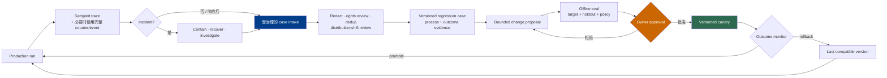

# 第 17 章：基于 Trace 的迭代

Production trace 可以展示一次被观测执行路径中的耗时分布、组件交互与错误，因此很适合用于调试和发现 regression case 候选项。但这不会让 trace 自动成为其他所有用途的 system of record。

第 10 章把 **trace** 定义为由 span、timestamp、attribute、event、link 与 status 组成的 observability data。OpenTelemetry 通过 tracing API 暴露这些对象，并允许实现对记录或导出的内容进行 sampling（[OpenTelemetry — Trace API](https://opentelemetry.io/docs/specs/otel/trace/api/)；[OpenTelemetry — Trace SDK](https://opentelemetry.io/docs/specs/otel/trace/sdk/)）。本章讨论如何安全使用这种易错且可能不完整的信号，改进经过版本管理的 model-plus-harness system。

### 17.1 Trace 是一种证据产品，而不是四种

以下产品必须保持分离：

| 产品 | 必需属性 | 主要用途 | Sampled trace 为什么不能取代它 |
|---|---|---|---|
| **Trace** | 在声明的 sampling policy 下，可查询的 span 与 causal/correlation metadata | Observability、performance diagnosis、failure discovery | Sampling 可能丢弃完整执行或单项细节 |
| **Event history** | 在 recovery/replay contract 下，有序且持久的 accepted event | 重建 execution state 并恢复运行 | Trace order 与 retention 不是权威 workflow state |
| **Eval trajectory** | 一次 trial 中，declared grader 所需的全部模型、工具、observation、artifact 与 policy event | 评测 process behavior | Production instrumentation 可能省略或脱敏 grader 所需证据 |
| **Audit record** | 明确定义的 content、identity、timestamp、completeness、integrity、access、protection 与 retention | Accountability、investigation、compliance | Trace 可能可修改、被采样、使用不同 access scope，或保留时间太短 |

Temporal event history 是用于恢复的 append-only workflow record，而 OpenTelemetry sampling 可以有意丢弃 attribute、event、status 或完整 span（[Temporal — Events and Event History](https://docs.temporal.io/workflow-execution/event)；[OpenTelemetry — Trace SDK](https://opentelemetry.io/docs/specs/otel/trace/sdk/)）。NIST 把 audit generation、content、protection、review、access 与 retention 分别视为显式 control，而不是任意 log 自动继承的属性（[NIST SP 800-53 Rev. 5](https://csrc.nist.gov/pubs/sp/800/53/r5/upd1/final)）。第 11 章同样要求 eval trajectory 对 grader 消费的证据保持完整。

这些产品应该互相链接，却不能混为一谈。Span 可以携带 event-history ID；eval trajectory 可以由 unsampled instrumentation 与 artifact 构建；audit pipeline 可以复制选定且受保护的 record。正因为各自的保证仍然明确，这种 lineage 才有价值。

### 17.2 关联持久 ID 与 Trace/Span ID

第 10 章定义了能够跨越 observability backend 生命周期的 application identity：

```text
session_id -> run_id -> step_id -> action_id -> attempt_id
call_id 挂在发起 protocol exchange 的 step 或 attempt 上
```

Trace identity 回答的是不同问题。W3C Trace Context 标准化了跨 service boundary 传播 `trace-id`、parent/span identity 与 trace flag 的方式（[W3C — Trace Context](https://www.w3.org/TR/trace-context/)）。不能用这些面向传输的 ID 取代 durable workflow identity。

| 持久 Identity | Trace 关联方式 | 重要区别 |
|---|---|---|
| `session_id` | 作为相关 root span 与 child span 的 attribute | 一个 session 可以包含多个 run 和 trace |
| `run_id` | 作为该 run 每个 span 的 attribute；常与一个 root trace 或相互链接的多个 trace 关联 | Long-running run 可能比 trace retention 更久，也可能跨越 trace boundary |
| `step_id` | 作为表示该 logical transition 的 orchestration span attribute | 在显式 loop semantics 下重复某一步，不会使 `span_id` 成为 workflow position 的来源 |
| `action_id` | 作为 intended-effect span 与所有 delivery attempt 的 attribute | Retry 之间保持稳定；它不是 tool-call transport ID |
| `attempt_id` | 作为一次 model/tool execution-attempt span 的 attribute | 同一 logical step 或 action 下每次 attempt 都会变化 |
| `call_id` | 作为 provider/protocol model 或 tool span 及关联 result 的 attribute | 标识一次 exchange；不能为 external effect 提供 idempotency |
| `trace_id` / `span_id` | 原生 observability correlation | 可能被采样、在边界重新生成，或根本没有进入 durable recovery data |

同步 causal nesting 使用 parent–child relation。对于从 queue 接回的工作、fan-out/fan-in branch、与早期 attempt 相关的 retry，或者在原 trace 结束后启动的 operation，应使用 span **link**；OpenTelemetry 允许 link 指向同一 trace 或另一 trace 中的 span（[OpenTelemetry — Trace API](https://opentelemetry.io/docs/specs/otel/trace/api/)）。Durable event envelope 也应保留 `causation_id` 和 `correlation_id`，因为 trace backend 不是 accepted state 的权威来源。

### 17.3 围绕问题设计 Span，而不是追求最大 Payload

一个 span 表示一项 operation。OpenTelemetry 允许 instrumentation 设置 attribute、添加带 timestamp 的 event、设置 status、记录 exception，以及链接相关 span（[OpenTelemetry — Trace API](https://opentelemetry.io/docs/specs/otel/trace/api/)；[OpenTelemetry — Exceptions](https://opentelemetry.io/docs/specs/otel/trace/exceptions/)）。每种字段都应有意使用：

- **Attribute** 保存稳定且可查询的事实：durable ID、operation type、component 与 configuration version、model/tool name 与 schema version、tenant-safe classification、token/cost counter、retry number、policy outcome 和 artifact reference。不要把 raw secret、完整 prompt、高 cardinality payload 或可变 prose 当作 primary key。
- **Event** 记录 operation 内某个时点发生的事实：retry scheduled、approval requested、first byte received、timeout observed、cancellation requested、result normalized 或 postcondition checked。Span event 仍是 observability data，不会自动成为 accepted workflow event。
- **Status** 汇总 operation 的 tracing status。OpenTelemetry 定义 `Unset`、`Ok` 与 `Error`，但不会编码 application 的完整 state machine（[OpenTelemetry — Trace API](https://opentelemetry.io/docs/specs/otel/trace/api/)）。`partial`、`cancelled`、`unknown outcome`、policy denial 与 business success 应继续作为明确 domain attribute/event 和 durable state。
- **Error** 应使用稳定 category 与安全 description，并在需要时附上完整诊断的引用。OpenTelemetry exception convention 会在未处理异常导致 span 以 error 结束时，把 exception 记录为 event（[OpenTelemetry — Exceptions](https://opentelemetry.io/docs/specs/otel/trace/exceptions/)）。如果 exception 被捕获且 recovery 成功，就不应在没有解释的情况下让整个 run 看起来已经失败。
- **Link** 表示非树状关系，而不是把每个异步 dependency 强行塞进错误的 parent–child chain。

OpenTelemetry GenAI semantic convention 定义了新兴的 model、agent 与 tool span 命名，但这些 convention 带有版本，而且其中一部分可能仍标记为 Development（[OpenTelemetry — GenAI Spans](https://opentelemetry.io/docs/specs/semconv/gen-ai/gen-ai-spans/)）。应固定 convention version、记录 local extension，并在 adapter boundary 映射 provider field。不要把不断变化的 semantic-convention draft 写进 durable business state。

一份最小 span envelope 可以是：

```text
trace_id, span_id, parent_span_id, links
session_id, run_id, step_id, action_id, attempt_id, call_id
operation, component_version, model_or_tool_version
started_at, ended_at, status, error_type
policy_decision, token_and_cost_counters, artifact_refs
sampling_policy_version, content_capture_mode
```

### 17.4 Sampling Policy 是解释的一部分

OpenTelemetry sampling 的作用是降低采集开销与数据量；sampler 可以返回 `DROP`、`RECORD_ONLY` 或 `RECORD_AND_SAMPLE`，而未记录的 span 会丢弃自身 attribute、event 与 status（[OpenTelemetry — Trace SDK](https://opentelemetry.io/docs/specs/otel/trace/sdk/)）。因此，除非 estimator 与 inclusion probability 足以支持范围更广的结论，否则根据 exported trace 生成的 dashboard 回答的只是 sampled population 的问题。

应定义 sampling policy 并进行版本管理：

- 普通成功 run 的 baseline probability 或 rule；
- 对 error、policy denial、approval flow、unknown side effect、新 version 与 canary traffic 提高 capture priority；
- head sampling 与 tail sampling 的行为，以及 downstream service 意见不一致时怎样处理；
- content-capture mode、redaction point、storage location、retention 与 access class；
- 必须保持完整计数的 metric 或 ledger 怎样在 sampled trace export 之外生成；
- collector、exporter 或 instrumentation 失效时，operator 如何发现 blind spot。

Priority sampling 会提高诊断覆盖率，却不会自动产生具有统计代表性的 dataset。如果 failure trace 被过度采样，其原始占比就不是 production failure rate。如果 successful run 很少被采样，没有观察到某种失败模式也只是很弱的证据。Billing、hard policy event 与 durable recovery 应使用 unsampled counter 或其他完整 operation record，而不能要求 trace 提供 sampling policy 已经删除的保证。

### 17.5 不应混淆的三种活动

| 活动 | 问题 | 证据 | 输出 |
|---|---|---|---|
| **Trace grader** | 完整 evaluation trajectory 是否遵循声明的 process rule？ | Unsampled trial trajectory、event、tool argument、approval、budget、artifact | 一次 trial 的 versioned grader verdict |
| **Outcome grader** | Artifact、environment 或 user/business state 是否满足成功标准？ | Test、state query、独立 API check、artifact inspection、user/business event | Versioned outcome verdict 或 score |
| **Incident investigation** | 生产环境中发生了什么、影响了什么、原因是什么，以及系统应怎样 contain 和 recover？ | Trace 加 event history、log、audit record、configuration、external-system state、human report | Timeline、impact、containment/recovery action、contributing cause、follow-up |

Anthropic 的 agent-eval 指南区分 transcript/trajectory evidence 与 outcome，并警告不能只评判 agent 说了什么（[Anthropic — Demystifying Evals for AI Agents](https://www.anthropic.com/engineering/demystifying-evals-for-ai-agents)）。NIST incident-response 指南把 preparation、detection、response 与 recovery 视为组织风险管理活动，而不是 grader 的 pass/fail decision（[NIST SP 800-61 Rev. 3](https://csrc.nist.gov/pubs/sp/800/61/r3/final)）。

Production trace analyzer 可能标记“缺少 approval span”。如果相关 record 并不保证完整，这只是一条等待 investigation 的 hypothesis。只有当 evaluation harness 保证捕获所有必需 approval evidence 时，eval 中的 trace grader 才能因此判定 trial 失败。Outcome grader 可以判定最终 artifact 通过，而 process grader 同时判定存在 policy violation；两种 verdict 都不能取代对真实 production event 的 incident triage。

### 17.6 把生产故障转化为受治理的 Regression Case

Production failure 是 eval task 候选项的重要来源，但把 trace 直接复制进 suite 会带来 privacy、rights、duplication 与 validity risk。应使用受治理的 intake pipeline：

1. **先处理 live event。** 保留易失证据，通过 incident process 完成 containment、notification 与 recovery；不能为了设计 eval 而延迟响应。
2. **确认使用权。** 在把 production material 改作其他用途之前，应根据需要检查 user notice 或 consent、contract term、data-processing purpose、third-party content license 与 intellectual-property restriction。NIST AI RMF core 要求在 AI-system risk work 中对 privacy 和 third-party data/software rights 进行有文档记录的管理（[NIST — AI RMF Core](https://airc.nist.gov/airmf-resources/airmf/5-sec-core/)）。
3. **最小化并脱敏。** 删除 secret、credential、personal/tenant data、不必要 payload 与 production identifier；当 investigation 或 legal obligation 需要时，把受保护证据另行保存。
4. **重建完整证据。** 把 sampled trace 与获准使用的 event-history record、artifact、configuration version 和 external outcome 连接起来。明确标记缺失事实；不能根据 partial trace 虚构 complete trajectory。
5. **创建隔离 fixture。** 用可复现 environment、synthetic 或 licensed data、scoped identity 与 deterministic reset/teardown 取代 live side effect。
6. **去重与聚类。** 多个 alert 可能来自同一个底层 failure。保留到每个 source incident 的 lineage，同时避免重复 copy 悄悄增加一个类别的权重。
7. **检查 distribution shift。** 判断该案例应进入 representative task distribution、historical-regression slice、high-risk policy suite，还是只用于 incident testing。不能在没有 versioning 与 disclosure 的情况下改变 headline distribution。
8. **分别编写 process 与 outcome assertion。** 明确哪些 trace evidence 必须完整，以及哪种 independent environment result 能够证明成功。
9. **审定并版本化。** 在接纳案例之前，review task fairness、solvability、leakage、rights、grader behavior 与 expected failure。

OpenAI evaluation playbook 把 contamination、broken task、reward hacking、refusal 与 sandbagging 列为 validity hazard，并建议报告 tested system、harness、budget 与 validity check（[OpenAI — Trustworthy Third-Party Evaluations](https://openai.com/index/trustworthy-third-party-evaluations-foundations/)）。逃逸到生产环境的 failure 可以增强 regression suite，但一份不断增长且只包含失败的 archive 并不代表 ordinary traffic。第 11 章的 suite versioning、slice、isolation 与 grader calibration 仍然适用。

### 17.7 Trace Review 产生假设，而不是自动修复

Trace review 应先对可能负责的 boundary 进行分类，再提出修改：

| 症状 | 等待验证的候选原因 | 需要收集的证据 |
|---|---|---|
| 工具选择错误或 call 格式错误 | Tool description/schema、context selection、model capability、router choice | Proposal、catalog/version、validation error、相关 context、comparison trial |
| 循环反复或过早停止 | Stop state、error normalization、context compaction、no-progress detector、model behavior | Step/action ID、error class、state transition、budget、final outcome |
| Transcript 正确，external state 错误 | Tool timeout、duplicate/partial effect、stale observation、缺少 postcondition check | Action/attempt ID、operation ID、event history、environment query |
| Policy 或 approval failure | PEP 缺失、policy 过时、identity/delegation mismatch、UI 或 event bug | Policy input/version、decision、approval proposal hash、dispatch evidence |
| Latency 或 cost regression | Model/routing change、cache miss、retrieval/tool latency、retry fan-out、infrastructure change | Child span、sampling-adjusted metric、configuration diff、controlled eval |

模型文本只是一个 component，不是默认 root cause。修复方式可能是修改 prompt，也可能是 typed tool、state transition、sandbox rule、policy gate、context transformation、infrastructure fix 或 grader change。在编辑 harness 之前，应先记录 hypothesis 与能够证伪它的 test；否则团队可能会对一条令人印象深刻的 trace 过拟合，却没有修复 failure class。

### 17.8 Meta-Harness 修改需要发布 Pipeline

所谓 “self-improving agent” 应指 production evidence 进入外部且受治理的 improvement process，而不是 deployed agent 无边界地改写自己当前生效的 prompt、tool、memory policy、runtime 或 grader。OpenAI 的 tax-agent case study 描述了 expert correction 怎样变成经过 review 的 finding、targeted eval 与 bounded coding task，而不是直接重写 deployed agent（[OpenAI — Building Self-Improving Tax Agents with Codex](https://openai.com/index/building-self-improving-tax-agents-with-codex/)）。

Human-authored change 与 meta-harness-generated change 都应采用相同 release discipline：

1. **限定 proposal。** 写明 failure class、component、owner、预期 effect，以及允许修改的 file/configuration。
2. **创建 version。** 固定受影响的 model、prompt、tool schema/implementation、retrieval configuration、memory policy、sandbox image、runtime、policy、budget 与 grader。
3. **运行 offline eval。** 要求通过 targeted regression、更广泛的 holdout suite、critical policy slice、grader calibration check，以及 cost/latency/reliability comparison。
4. **获得 approval。** 责任 owner review change、evidence、known limitation、deployment scope、canary plan 与 rollback trigger。Candidate 不能批准自身。
5. **安全执行 canary。** 从有边界的 traffic slice、有限 authority、适当隔离的 tenant 或 task，以及更强 outcome monitoring 开始。
6. **Promote 或 rollback。** 使用预先声明的 criteria，保留 decision 与 lineage，并在 trigger 生效时恢复最近的 compatible version。

Production traffic 可以产生 trace、finding、candidate test 或 change proposal，却不能授予某个 process 无边界修改 active production configuration，并立即在同一 traffic 上评价自身的权限。Proposal、evaluation、approval、deployment 与 outcome monitoring 应使用相互分离的 identity；还要防止 candidate 编辑自己的 holdout task 或 release grader。

### 17.9 Model–Harness 依赖带来测试责任

Performance 属于接受测试的 **model-plus-harness configuration**，而不只属于其中一个 component。OpenAI evaluation guidance 明确要求报告公开 harness choice，因为 tool、budget、safeguard 与 elicitation setup 都可能改变 score 所支持的结论（[OpenAI — Trustworthy Third-Party Evaluations](https://openai.com/index/trustworthy-third-party-evaluations-foundations/)）。

这是 dependency claim，而不是预测 model 与 harness 必然沿一个方向 “co-evolve”。新模型可能使 planner 变得多余，也可能需要不同 tool interface，或暴露新的 failure。Harness change 可能改善一个模型，却使另一个模型 regression。Anthropic 描述了一种 ablation-style practice：移除或改变一个 component，再运行 realistic eval，判断它对当前 task 与 model 是否仍然物有所值（[Anthropic — Harness Design for Long-Running Application Development](https://www.anthropic.com/engineering/harness-design-long-running-apps)）。

测试责任很具体：

- 每条 trace、eval result 与 release packet 都要把 model 和 harness 一起版本化；
- 任意一方变化后，都要重新运行相关 suite，包括 routing、fallback、tool、context、policy 与 infrastructure；
- 使用 ablation 与 controlled comparison，而不能假设某个 component 永远 load-bearing；
- 报告出现 coupling 的 task slice，不能泛化一项 benchmark result；
- 对使用早期 configuration 创建的 durable run 保持 rollback compatibility 与 migration。

### 17.10 受治理的迭代循环



---

## 要点

- **Trace 是 sampled observability data：** 它不能自动充当完整 event history、eval trajectory 或 audit record。
- **关联 ID，而不是混淆 ID：** Session/run/step/action/attempt/call identity 保持持久；trace/span ID 用于 observability propagation 与 correlation。
- **使用完整 span model：** Attribute、event、status、error 与 link 回答不同的诊断问题。
- **版本化 sampling policy：** Priority capture 会改变 observed distribution，也不能取代完整 counter、policy event 或 recovery data。
- **区分三种活动：** Trace grading、outcome grading 与 incident investigation 具有不同的问题、证据和输出。
- **治理 production-to-eval intake：** Review redaction、consent 与 licensing、deduplication、distribution shift、task validity 与 grader evidence。
- **把 trace finding 当作 hypothesis：** 修改前应验证负责的 model、context、tool、runtime、policy、infrastructure 或 grader boundary。
- **不能原地自我修改：** Meta-harness proposal 必须经过 offline eval、独立 approval、versioning、canary deployment、monitoring 与 rollback。
- **Model–harness 依赖会产生 regression responsibility：** 它是 configuration 的实证属性，而不是必然的历史趋势。

## 延伸阅读

- OpenTelemetry, *Trace API*. https://opentelemetry.io/docs/specs/otel/trace/api/
- OpenTelemetry, *Trace SDK*. https://opentelemetry.io/docs/specs/otel/trace/sdk/
- OpenTelemetry, *Exceptions*. https://opentelemetry.io/docs/specs/otel/trace/exceptions/
- OpenTelemetry, *Semantic Conventions for Generative AI Spans*. https://opentelemetry.io/docs/specs/semconv/gen-ai/gen-ai-spans/
- W3C, *Trace Context*. https://www.w3.org/TR/trace-context/
- Temporal, *Events and Event History*. https://docs.temporal.io/workflow-execution/event
- NIST, *SP 800-53 Rev. 5*. https://csrc.nist.gov/pubs/sp/800/53/r5/upd1/final
- NIST, *SP 800-61 Rev. 3*. https://csrc.nist.gov/pubs/sp/800/61/r3/final
- NIST, *AI RMF Core*. https://airc.nist.gov/airmf-resources/airmf/5-sec-core/
- Mikaela Grace et al., *Demystifying Evals for AI Agents*, Anthropic, Jan 2026. https://www.anthropic.com/engineering/demystifying-evals-for-ai-agents
- OpenAI, *A Shared Playbook for Trustworthy Third-Party Evaluations*, May 2026. https://openai.com/index/trustworthy-third-party-evaluations-foundations/
- OpenAI, *Building Self-Improving Tax Agents with Codex*, 2026. https://openai.com/index/building-self-improving-tax-agents-with-codex/
- Prithvi Rajasekaran, *Harness Design for Long-Running Application Development*, Anthropic, Mar 2026. https://www.anthropic.com/engineering/harness-design-long-running-apps
