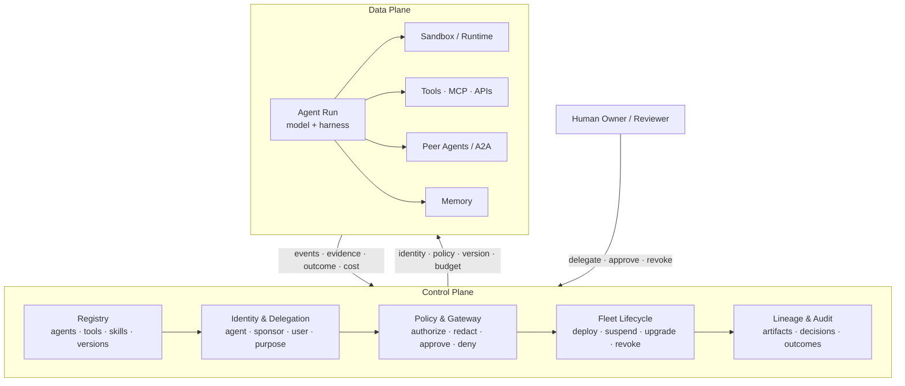

# 第 18 章：Agent Fleet、身份与控制平面

Loop engineering 研究的是单个自治任务应如何启动、执行、验证和停止。到了生产环境，设计对象会扩大为一支 agent fleet：许多团队构建的多个 agent，运行在不同环境中，甚至跨越组织边界。此时，难题也从单条 loop 上升到整个 fleet：系统中究竟有哪些 agent？当前版本由谁发布？它在代表谁行动？它可以访问哪些工具、数据、资金和网络目的地？运维人员如何暂停、升级或撤销正在运行的 agent？又有哪些证据能把一次动作准确关联到产生它的身份、策略、模型和 artifact？

一种逐渐成形的答案是 **agent control plane（agent 控制平面）**。这个概念沿用了分布式系统中数据平面与控制平面的区分。*数据平面（data plane）*负责实际工作，包括模型调用、工具调用、代码执行和 agent-to-agent 消息；*控制平面（control plane）*则声明并执行这些工作所处的运行状态，涵盖 registry、identity、authorization、routing、lifecycle、policy、lineage 和 audit。控制平面不会让单个 agent 更聪明，但能让整支 fleet 受到治理。

### 18.1 从 Agent Program 到 Agent Fleet

单个 agent 只需一段 prompt、几个工具和一个本地状态文件就能完成配置。但在 fleet 规模下，本地配置无法回答所有运维问题，新的问题会随之出现：

- 重复建设或已经废弃的 agent，其归属责任并不清楚；
- 多个版本使用同一个名称，实际行为却不相同；
- credential 被复制到 prompt、sandbox 或环境变量中；
- 工具访问权在授权它的任务或用户结束后仍然有效；
- 同一项 policy 在聊天、定时运行和 A2A 委派中执行方式不一；
- 发生事件后，无人能还原究竟是哪份 artifact 或哪项权限导致了相关动作。

第 9.2 节讨论的平台化转向已经预示了这一更大的范围。Fleet 需要一个关于 agent 和 capability 的可信信息源，需要能签发和撤销任务级访问权的运行时授权机制，也需要由生命周期服务持续协调“*应该*运行什么”和“*实际*正在运行什么”。AgentOps（第 17 章）负责系统在整个生命周期中的运行与改进；控制平面则提供这些工作共同依赖的治理层。

边界应保持明确：

- **数据平面：** inference、retrieval、工具执行、sandbox 进程、消息和结果。
- **控制平面：** definition、identity、policy decision、placement、version、budget、revocation 和 audit。

核心设计原则是：只要条件允许，就不要让 policy decision 落在数据路径中具有概率性的部分。Agent 可以提出一项动作，但具名身份能否在当前情境下执行该操作，应由确定性的控制平面服务决定。

### 18.2 Agent Identity：谁——或什么——在行动？

只有 user identity 还不够。同一个用户可能启动多个用途和权限不同的 agent。发起 session 结束后，agent 仍可能按计划继续运行，也可能把工作委派给另一个 agent，或与自身的其他版本同时运行。**Agent identity** 是 agent 这一行为主体持久的机器身份；它不同于某次运行涉及的人类、service account、runtime process 和 model。

NIST 关于软件 agent 身份与权限的概念论文，将问题拆分为 identification、authentication、authorization、delegation、audit 和 non-repudiation。论文特别指出，prompt injection 和 confused-deputy behavior 表明普通的 service identity 不足以处理 agent 场景 ([NIST - Identity and Authorization for Software Agents](https://www.nist.gov/news-events/news/2026/02/new-concept-paper-identity-and-authority-software-agents))。在实践中，一份 identity record 应回答：

- **Principal：** 正在行动的是哪个 agent definition 和 version？
- **Sponsor：** 哪个人或组织对它负责？
- **Delegator：** 这次运行具体代表谁行动？
- **Purpose：** 哪项范围明确的任务或 workflow 是授予权限的依据？
- **Runtime：** 当前使用的是哪些 harness、model、sandbox image 和 policy version？
- **Lifetime：** identity 在何时签发，又会在何时过期或可被撤销？

不要用一把长期 API key 代表整条身份与授权链。Fleet 应使用 workload identity 和短期 task token，并明确记录 delegation chain。Agent 先以自身身份完成认证，authorization service 再结合委派用户、tenant、purpose、environment 和 requested operation 作出决定。将两者分开，可以防止低风险的 research agent 在不知不觉中继承启动者的全部权限。

### 18.3 Agent Registry

**Agent registry** 是 fleet 的资产清单和发现层。它让人类、orchestrator、gateway 和其他 agent 知道系统中有哪些对象，以及它们将要信任哪份 artifact。Google Cloud Agent Registry 把 agent 与 MCP server、endpoint、skill、skill revision 和 publisher 放在同一套模型中管理。AWS Agent Registry 与 Microsoft 365 Agent Registry 也体现了同一趋势：把散落的 deployment URL 收拢为受治理的 catalog ([Google Cloud - Agent Registry Overview](https://docs.cloud.google.com/agent-registry/overview); [AWS - Agent Registry in AgentCore](https://aws.amazon.com/about-aws/whats-new/2026/04/aws-agent-registry-in-agentcore-preview/); [Microsoft - Agent Registry](https://learn.microsoft.com/en-us/microsoft-365/admin/manage/agent-registry?view=o365-worldwide))。

一条有用的 registry entry 不能只有名称和描述，还应包括：

- 不可变的 agent identifier 和 version identifier；
- publisher 和明确承担责任的 owner；
- 支持的 task、input/output contract 和 endpoint；
- 对 tool、MCP、skill、memory、model 和 sandbox 的依赖；
- 申请的 permission、data class、network destination 和 budget class；
- 该版本的 eval 结果和 security attestation；
- deployment status、deprecation date 和 revocation state；
- 可追溯到 source、build、configuration 和 policy bundle 的 lineage。

Discovery 与 governance 必须在 registry 中汇合。搜索结果只能显示调用方有权调用的 agent，orchestration 也应解析到不可变的版本，而不是可随时修改的显示名称。注册不等于批准：一条新记录可以作为 draft 对外可见，却尚未获准承接 production traffic。版本 promotion 应通过 ownership、eval、security 和 policy gate；在 deprecate 或移除版本之前，registry 还应先找出所有依赖项。

### 18.4 Runtime Authorization 与 Delegation

Registration 说明一个 agent *是什么*；authorization 则决定某次具体运行*此刻可以做什么*。单次运行获得的权限范围，应小于这个 agent 在所有场景下可能用到的权限总和。

一条稳健流程如下：

1. User 或 service 启动一次 run，并声明 purpose 和 tenant。
2. 控制平面解析到一个已批准的 agent version。
3. Policy 根据 agent capability、delegator authority、task need、environment 和 risk 的交集，计算允许的范围。
4. Identity broker 签发短期、audience-bound 的 credential 或 capability token。
5. Proxy 在 tool boundary 附加 credential；raw secret 不进入 model context 或 sandbox。
6. 每次使用都记录 identity、delegation chain、policy version、operation、resource 和 result。
7. Run 完成或超时后撤销 lease；policy change 或 incident 也可以触发撤销。

AWS AgentCore Identity 展示了这一模式如何落地为产品：提供 agent identity 和 credential provider，并在不把 user credential 嵌入 agent code 的情况下，委派访问外部资源的权限 ([AWS - AgentCore Identity](https://aws.amazon.com/blogs/machine-learning/introducing-amazon-bedrock-agentcore-identity-securing-agentic-ai-at-scale/))。其架构原则并不依赖具体厂商：权限应按需即时签发，并且只在真正需要它的边界上呈现。

A2A delegation 应明确记录权限如何逐级传递。Agent A 不应把包含自身全部权限的 bearer token 直接交给 Agent B，而应申请一份范围更窄的 token：以 B 为 audience，以 delegated task 为 purpose，限定允许的 operation 和 resource，并设置很短的有效期。如果 B 继续委派，新权限也不得超过现有委派链所授予的范围。这样可以阻断第 3 章所述的**信任升级**：低信任 worker 不能仅靠说服高权限 parent，就把自己的结果转化为高权限动作，而绕过一次新的 policy decision。

### 18.5 Agent Gateway 与 Policy Enforcement

**Agent gateway** 是数据路径上的 policy enforcement point。它可以代理 model call、MCP 和 API tool call、A2A message、网络 egress，有时也会管理 memory access。“绝不发送 secret”这类自然语言指令只能带来概率性的约束；gateway 则可以用确定性规则拒绝未授权的目的地、移除 credential、限制 budget，或要求 human approval。

每条请求都应附带一份经过签名或以其他方式可验证的 execution envelope：

```text
agent identity + version
delegating principal + tenant
task purpose + run/session id
requested action + resource
policy and configuration versions
budget and expiry
trace/span correlation id
```

Policy 不必只返回 allow 或 deny 两种结果，还可以返回 **allow with redaction**、**allow in a stronger sandbox**、**require human approval**，或 **allow with a lower budget or read-only scope**。Decision 及其输入都应写入 trace。这样，第 15 章按风险调整交互强度的控制，以及第 5 章的 containment matrix，就能在整个 fleet 中一致执行，而不必由每支团队各自重写一套约定。

Gateway 的部署位置同样重要。Central gateway 能提供统一的 enforcement 和 visibility，但也可能成为 latency bottleneck 和 single point of failure。Local sidecar 可以降低延迟，并在部分连接中断时继续工作，却会增加 policy distribution 和 evidence collection 的难度。成熟的设计通常把集中式 policy administration 与分布式 enforcement 分开：通过 signed policy bundle 下发规则，对后果重大的动作采用 fail closed，只允许低风险读取在经过审慎评估后 fail open。

### 18.6 Fleet Lifecycle：Reconcile、Suspend、Upgrade、Revoke

Agent 的生命周期不能只用 deployed 和 stopped 两种状态表示。一套实用的 fleet state machine 应包括 **draft**、**evaluated**、**approved**、**deployed**、**suspended**、**deprecated**、**revoked** 和 **retired**。Run 有自己的状态机——queued、active、waiting for approval、checkpointed、completed、failed 或 canceled——sandbox 还会有另一套状态机（第 7 章）。控制平面需要关联这些生命周期，但不能把它们混为一谈。

这里的核心治理模式是 reconciliation：比较 declared state 与 observed state，再通过确定性动作消除两者之间的差异。

- 如果某个 agent version 被 revoked，应阻止新的 run、撤销 credential，并根据风险暂停或终止受影响的 in-flight run。
- 如果 policy 发生变化，应找出哪些 session 需要重新 authorization，而不是让旧权限无限期延续。
- 如果 version 需要升级，应先在有限的 traffic slice 上进行 canary，同时保留旧版本以便 rollback（第 17 章）。
- 如果 owner 离职或 publisher 遭到入侵，应遍历 registry 的 dependency graph，找出继承该信任的 agent、skill、MCP server 和 schedule。
- 如果 run 失去连接，应保留 durable session，重新获取 sandbox 或 worker，而不是重复创建同一任务（第 7 章）。

Fleet kill switch 也属于这一层。它应在 gateway 和 identity broker 处撤销 capability，而不只是向模型发送一句“stop”。控制范围必须足够精细：operator 应能单独停止某个 run、version、publisher、tenant、tool dependency，或在必要时停止整个 fleet，而不必每次 incident 都动用范围最大的开关。

### 18.7 Lineage、Audit 与 Non-Repudiation

普通日志回答的是“哪个请求到达了这个 service？”Agent audit 则必须回答一条更完整的因果问题：

> 哪个 user 或 service，出于什么 purpose，把任务委派给了哪个 agent version？它使用了哪些 model、harness、tool、memory、sandbox 和 policy？哪些 evidence 导致了哪项 decision？哪项 authority 允许产生 side effect？又是谁批准或 override 了这项动作？

答案应呈现为一张 lineage graph。它把 registry artifact、build attestation、identity、delegation event、session 与 run ID、trace span、policy decision、human approval、tool result、memory write 和环境中的最终结果连接起来。稳定的 content hash 或不可变的 version identifier，可以防止后续编辑改写“当时实际运行了什么”这段历史。

使用 **non-repudiation（不可否认性）**一词时需要谨慎。Signed event 可以证明某个 workload identity 发出了请求，也可以证明某个 policy service 授权了该请求；但它无法证明某个人真正理解了 approval dialog，也无法证明模型给出的自然语言 rationale 属实。因此，可靠的 audit 应把 cryptographic integrity 与 operational evidence 结合起来，包括 append-only log、trusted timestamp、credential 和 policy version、outcome check、approval identity 与 retention rule。系统既要保留足够的信息供调查使用，也要遵守第 17 章的隐私原则。一个不加筛选地保存 prompt、secret 和 personal data 的 audit 系统，本身会制造新的安全问题。

Lineage 还能让 evaluation 和改进过程更加安全。生产环境中的一次纠错可以追溯到实际失败的 artifact，再转化为脱敏的 regression case，用于 promotion 新版本，同时保持旧版本不变（第 12 章）。控制平面保存 chain of custody，eval gate 则提供版本 promotion 所需的证据。

### 18.8 控制平面的开放问题

控制平面仍在发展之中，其中最重要的开放问题包括：

- **可迁移的身份与委派。** Agent Card 和 registry 可以描述 capability，但 principal identity、delegation chain、revocation 和 purpose-bound authority 仍缺少成熟的跨平台标准。
- **Policy composition。** User policy、tenant policy、agent policy、tool policy、data-residency rule 和 human approval 可能彼此冲突。要确定采用哪项规则并解释原因，需要一套可迁移的语义。
- **Memory governance。** 不同 memory product 尚未以一致方式表达 provenance、permission-at-retrieval、expiry、correction 和 poisoning defense。
- **跨组织 lineage。** A2A chain 会跨越多个 audit domain。每个组织可能只提供很少的证据，让对方无法评估信任；也可能披露过多 private trace data。
- **Evaluator authority。** Model judge 可以阻止 deployment 或触发 incident。对于它的 identity、calibration、conflicts of interest 和 appeal path，应采用与其他 privileged decision-maker 同等严格的要求（第 10 章）。
- **Fleet-level supervision。** Risk ranking、alert deduplication 和有意义的人类控制都必须能随 fleet 扩展，同时又不能让 operator 沦为只会盖章的角色（第 15 章）。
- **控制平面本身被攻陷。** 集中的 registry、policy service 和 identity broker 都是高价值目标。它们较大的 blast radius 要求系统采用 separation of duties、signed artifact、尽可能小的 trust root，以及独立的 recovery path。

标准虽然尚未定型，方向却已经清楚：agent 正在成为分布式系统中的 principal。成熟的 harness 不再只是围绕模型的一条 loop，而是一套受到治理的关系，将 identity、artifact、policy、environment、evidence 和人连接在一起。

---

## 图：Agent 控制平面



*数据平面负责实际工作；控制平面决定这项工作受哪些 identity、artifact、authority、lifecycle 和 evidence 约束。*

---

## 要点

- **Fleet 是 loop 之后更大的设计单元**：loop engineering 治理单个 task；控制平面治理多个 agent、version、environment 和 organization。
- **分离 data plane 与 control plane**：agent 提出并执行工作；确定性 service 负责注册 artifact、签发 authority、执行 policy、协调 lifecycle，并保存 evidence。
- **Agent identity 不同于 user identity 和 runtime identity**：每次 run 都应绑定 agent version、sponsor、delegator、purpose、environment 和 expiry。
- **Registry 是受治理的 source of truth**：除了 discovery metadata，还应包含 ownership、dependency、permission、attestation、deployment state 和 immutable lineage。
- **Authority 应按需签发并限定用途**：使用短期、audience-scoped credential，在 tool boundary 附加，并确保 delegation 只能缩小权限范围。
- **Gateway 把 policy 落实为 enforcement**：它可以 allow、deny、redact、加强 isolation、缩小 scope 或要求 approval，并记录作出决定的原因。
- **Lifecycle management 的核心是 reconciliation**：分别管理 agent definition、run 和 sandbox，让 suspension、migration、canary deployment、rollback 与 revocation 成为一等操作。
- **Audit 是一张因果 lineage graph**：它连接 user delegation、agent 和 policy version、evidence、authorization、side effect 与 outcome，同时尽量减少 sensitive content。

## 延伸阅读

- NIST, *Identity and Authorization for Software Agents*, Feb 2026. https://www.nist.gov/news-events/news/2026/02/new-concept-paper-identity-and-authority-software-agents
- Google Cloud, *Agent Registry Overview*, 2026. https://docs.cloud.google.com/agent-registry/overview
- AWS, *AWS Agent Registry in Amazon Bedrock AgentCore (Preview)*, Apr 2026. https://aws.amazon.com/about-aws/whats-new/2026/04/aws-agent-registry-in-agentcore-preview/
- AWS, *Introducing Amazon Bedrock AgentCore Identity: Securing Agentic AI at Scale*, 2026. https://aws.amazon.com/blogs/machine-learning/introducing-amazon-bedrock-agentcore-identity-securing-agentic-ai-at-scale/
- Microsoft, *Agent Registry in the Microsoft 365 Admin Center*, 2026. https://learn.microsoft.com/en-us/microsoft-365/admin/manage/agent-registry?view=o365-worldwide
- Anthropic Safeguards Research Team, *How We Contain Claude*, May 2026. https://www.anthropic.com/engineering/how-we-contain-claude
- Google Cloud, *Agent Executor: Google's Distributed Agent Runtime*, 2026. https://cloud.google.com/blog/products/ai-machine-learning/agent-executor-googles-distributed-agent-runtime/
- AWS, *AgentOps: Operationalize Agentic AI at Scale with Amazon Bedrock AgentCore*, 2026. https://aws.amazon.com/blogs/machine-learning/agentops-operationalize-agentic-ai-at-scale-with-amazon-bedrock-agentcore/
