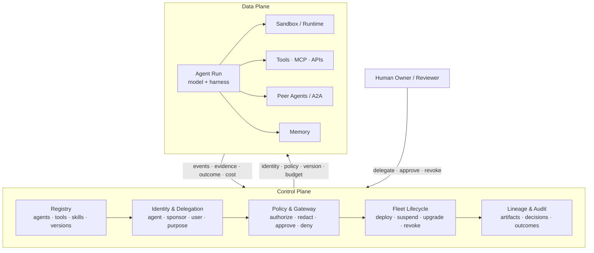

# 第 18 章：Agent Fleet、身份与控制平面

Loop engineering 追问一个自治任务应如何启动、行动、验证与停止。生产系统如今面对下一个设计单元：由许多团队创建、跨许多环境和组织运行的许多 agent。难题向上移动了。有哪些 agent？这个版本由谁发布？它代表谁行动？它能访问哪些工具、数据、资金和网络目的地？一个运行中的 agent 如何被暂停、升级或撤销？什么证据能把一次动作连接到产生它的确切身份、策略、模型与 artifact？

正在形成的答案是 **agent control plane（agent 控制平面）**。借用分布式系统的区分，*数据平面（data plane）*执行工作——模型调用、工具调用、代码执行与 agent-to-agent 消息；*控制平面（control plane）*则声明并强制工作周围的目标运行状态：registry、identity、authorization、routing、lifecycle、policy、lineage 与 audit。它不会让单个 agent 更聪明；它让一个 fleet 变得可治理。

### 18.1 从 Agent Program 到 Agent Fleet

单个 agent 可以用一段 prompt、几个 tool 和本地 state file 配置。Fleet 会引入本地配置无法解决的问题：

- 重复或废弃的 agent，ownership 不清；
- 多个版本共用名称，但行为不同；
- credential 被复制进 prompt、sandbox 或环境变量；
- tool access 比授权它的 task 或 user 活得更久；
- policy 在 chat、scheduled run 与 A2A delegation 上以不同方式执行；
- 事件发生后，无人能重建究竟是哪份 artifact 或哪项 authority 导致了动作。

第 9.2 节的平台化转向已经预示了这个范围。Fleet 需要 agents 与 capabilities 的 source of truth，需要能铸造和撤销 task-scoped access 的 runtime authority，也需要让“*应该*运行什么”和“*正在*运行什么”保持一致的 lifecycle service。AgentOps（第 17 章）跨完整生命周期运行和改进系统；控制平面则提供这些运维所依赖的共享治理底座。

边界应保持明确：

- **数据平面：** inference、retrieval、tool execution、sandbox process、message 与 result。
- **控制平面：** definition、identity、policy decision、placement、version、budget、revocation 与 audit。

只要可能，就把 policy 放在概率性 data path 之外，这是最核心的设计动作。Agent 可以提议一项 action；确定性的控制平面服务决定，具名身份在当前 context 下是否可以执行该 operation。

### 18.2 Agent Identity：谁——或什么——在行动？

仅有 user identity 不够。同一个用户可以启动多个目的与权限不同的 agent；agent 可以在发起 session 结束后按 schedule 继续运行；一个 agent 可以向另一个委派；多个 agent 版本也可以共存。**Agent identity** 是 agentic principal 的持久 machine identity，不同于它使用的人类、service account、runtime process 与 model。

NIST 关于软件 agent 身份与权限的 concept paper，把问题分为 identification、authentication、authorization、delegation、audit 与 non-repudiation，并指出 prompt injection 与 confused-deputy behavior 是普通 service identity 不足以应对这一问题的原因 ([NIST - Identity and Authorization for Software Agents](https://www.nist.gov/news-events/news/2026/02/new-concept-paper-identity-and-authority-software-agents))。一份实用 identity record 应回答：

- **Principal：** 哪个 agent definition 与 version 正在行动？
- **Sponsor：** 哪个人或组织拥有它？
- **Delegator：** 这次运行具体代表谁行动？
- **Purpose：** 哪项有界任务或 workflow 为这项 authority 提供理由？
- **Runtime：** 哪些 harness、model、sandbox image 与 policy version 正在执行？
- **Lifetime：** identity 何时签发，何时过期或变得可撤销？

不要把这些压成一把长期 API key。Fleet 应使用 workload identity 与短期 task token，并保留明确 delegation chain。Agent 以自身身份认证；authorization decision 则把该身份与 delegating user、tenant、purpose、environment 和 requested operation 结合。这能防止低风险 research agent 静默继承启动它的人类的全部权限。

### 18.3 Agent Registry

**Agent registry** 是 fleet 的 inventory 与 discovery 层。它向人类、orchestrator、gateway 和其他 agent 说明有什么，以及它们即将信任哪份 artifact。Google Cloud Agent Registry 把 agent 与 MCP server、endpoint、skill、skill revision 和 publisher 一起建模；AWS Agent Registry 与 Microsoft 365 Agent Registry 也体现了同一转向：从散落的 deployment URL，转向被治理的 catalog ([Google Cloud - Agent Registry Overview](https://docs.cloud.google.com/agent-registry/overview); [AWS - Agent Registry in AgentCore](https://aws.amazon.com/about-aws/whats-new/2026/04/aws-agent-registry-in-agentcore-preview/); [Microsoft - Agent Registry](https://learn.microsoft.com/en-us/microsoft-365/admin/manage/agent-registry?view=o365-worldwide))。

一条有用 registry entry 不只包含名称和描述：

- immutable agent 与 version identifier；
- publisher 与 accountable owner；
- 支持的 task、input/output contract 与 endpoint；
- tool、MCP、skill、memory、model 与 sandbox dependency；
- requested permission、data class、network destination 与 budget class；
- 当前版本的 eval 与 security attestation；
- deployment status、deprecation date 与 revocation state；
- 指向 source、build、configuration 与 policy bundle 的 lineage。

Discovery 与 governance 必须在 registry 汇合。搜索结果应按调用方可调用的内容过滤，orchestration 应解析 immutable version，而不是 mutable display name。注册不等于批准：新 entry 可以以 draft 形式可见，但尚未获准承接 production traffic。Promotion 应经过 ownership、eval、security 与 policy gate；deprecation 则应在 removal 前识别 dependent。

### 18.4 Runtime Authorization 与 Delegation

Registration 说明一个 agent *是什么*。Authorization 决定一次具体运行*此刻能做什么*。这个决定必须窄于 agent 可能需要的所有能力的并集。

一条稳健流程如下：

1. User 或 service 带着声明的 purpose 与 tenant 启动 run。
2. 控制平面解析一个已批准的 agent version。
3. Policy 计算 agent capability、delegator authority、task need、environment 与 risk 的交集。
4. Identity broker 签发短期、audience-bound credential 或 capability token。
5. Proxy 在 tool boundary 附加 credential；raw secret 不进入 model context 或 sandbox。
6. 每次使用都记录 identity、delegation chain、policy version、operation、resource 与 result。
7. Completion、timeout、policy change 或 incident 撤销 lease。

AWS AgentCore Identity 描述了这一模式的产品形态：agent identity、credential provider，以及在不把 user credential 嵌入 agent code 的前提下委派访问外部资源 ([AWS - AgentCore Identity](https://aws.amazon.com/blogs/machine-learning/introducing-amazon-bedrock-agentcore-identity-securing-agentic-ai-at-scale/))。架构要点不依赖厂商：authority just in time 签发，只在边界 just in time 呈现。

A2A delegation 会让链条显式化。Agent A 不应把拥有自身全部权限的 bearer token 发给 Agent B，而应请求一份更窄 token，明确 B 是 audience、delegated task 是 purpose、允许的 operation 与 resource，以及很短的 expiry。如果 B 再次委派，新 authority 不能超过已有链条的交集。这能阻断第 3 章的**信任升级**：低信任 worker 无法仅靠说服高权限 parent，就把自己的结果洗成一次高权限 action，而不触发新 policy decision。

### 18.5 Agent Gateway 与 Policy Enforcement

**Agent gateway** 是 data-plane path 上的 enforcement point。它可以 broker model call、MCP 与 API tool call、A2A message、egress，有时也包括 memory access。Gateway 的价值在于，“绝不发送 secret”这类指令是概率性的；gateway 则能确定性地拒绝未授权目的地、剥离 credential、执行 budget 或要求 human approval。

每条请求都应带有一份经过签名或可验证的 execution envelope：

```text
agent identity + version
delegating principal + tenant
task purpose + run/session id
requested action + resource
policy and configuration versions
budget and expiry
trace/span correlation id
```

Policy 不应只返回 allow 或 deny。实用结果还包括 **allow**、**deny**、**allow with redaction**、**allow in a stronger sandbox**、**require human approval**，以及 **allow with a lower budget or read-only scope**。Decision 与输入成为 trace 的一部分。这会把第 15 章与风险成比例的交互，以及第 5 章的 containment matrix，变成所有 agent 一致执行的系统，而不是每支团队各自重写的 convention。

Gateway placement 很重要。Central gateway 能带来统一 enforcement 与 visibility，但也可能成为 latency bottleneck 和 single point of failure。Local sidecar 降低延迟，并能在局部断连时存活，但会让 policy distribution 与 evidence collection 更困难。成熟设计通常把集中式 policy administration 与分布式 enforcement 分开，用 signed policy bundle；对有后果 action fail closed，仅对低风险 read 谨慎选择 fail open。

### 18.6 Fleet Lifecycle：Reconcile、Suspend、Upgrade、Revoke

Agent 不只处于 deployed 或 stopped 两种状态。一套实用 fleet state machine 包含 **draft**、**evaluated**、**approved**、**deployed**、**suspended**、**deprecated**、**revoked** 与 **retired**。Run 有独立 state machine——queued、active、waiting for approval、checkpointed、completed、failed 或 canceled——sandbox 则还有另一套（第 7 章）。控制平面连接这些 lifecycle，但不混淆它们。

治理模式是 reconciliation：比较 declared state 与 observed state，再采取确定性 action。

- 如果 agent version 被 revoked，阻止新 run、撤销 credential，并按风险 suspend 或 terminate 受影响的 in-flight run。
- 如果 policy 改变，识别哪些 session 需要重新 authorization，而不是让旧 authority 无限存续。
- 如果 version upgrade，先对有界 traffic slice 做 canary，同时保留旧版本以 rollback（第 17 章）。
- 如果 owner 离职或 publisher 被攻陷，遍历 registry dependency graph，找出继承该信任的 agent、skill、MCP server 与 schedule。
- 如果 run 失去连接，保留 durable session，重新获取 sandbox 或 worker，而不是复制一份任务（第 7 章）。

Fleet kill switch 属于这一层。它应在 gateway 与 identity broker 撤销 capability，而不只是向模型发送一句“stop”。Scope 也很重要：operator 需要能停止一个 run、一个 version、一个 publisher、一个 tenant、一个 tool dependency 或整个 fleet，而不是每次 incident 都只能动用最大开关。

### 18.7 Lineage、Audit 与 Non-Repudiation

普通日志回答“哪个请求打到了这个 service？”Agent audit 必须回答一条更长的因果问题：

> 哪个 user 或 service，把什么 purpose 委派给了哪个 agent version；它在什么 model、harness、tool、memory、sandbox 与 policy 下运行；哪些 evidence 导致哪项 decision；哪项 authority 允许了 side effect；又是谁批准或 override 了它？

答案是一张 lineage graph：连接 registry artifact、build attestation、identity、delegation event、session 与 run ID、trace span、policy decision、human approval、tool result、memory write 和最终 environment outcome。Stable content hash 或 immutable version identifier 能防止后来的编辑改写“当时究竟运行了什么”的历史。

**Non-repudiation（不可否认性）**需要谨慎使用。Signed event 可以说明某个 workload identity 产生了请求、某个 policy service 授权了它；却不能证明一个人理解了 approval dialog，也不能证明模型的自然语言 rationale 真实。因此，强 audit 要把 cryptographic integrity 与 operational evidence 组合：append-only log、trusted timestamp、credential 与 policy version、outcome check、approval identity 与 retention rule。要保存足够调查的信息，同时遵循第 17 章的隐私纪律——一个不加选择保留 prompt、secret 与 personal data 的 audit 系统，会制造第二个安全问题。

Lineage 还能让 evaluation 与 improvement 更安全。一次生产纠正可以被追溯到失败的确切 artifact，转成脱敏 regression case，并用于 promotion 新版本，而不改变旧版本（第 12 章）。控制平面提供 custody chain；eval gate 提供证据。

### 18.8 控制平面的开放问题

控制平面正在形成，尚未定型。最重要的开放问题包括：

- **可迁移的身份与委派。** Agent Card 与 registry 能描述 capability，但 principal identity、delegation chain、revocation 与 purpose-bound authority 的跨平台标准仍不成熟。
- **Policy composition。** User policy、tenant policy、agent policy、tool policy、data-residency rule 与 human approval 可能冲突。Precedence 与 explanation 需要一套可迁移语义。
- **Memory governance。** Provenance、permission-at-retrieval、expiry、correction 与 poisoning defense，还没有在不同 memory product 中被一致表达。
- **跨组织 lineage。** A2A chain 会跨越 audit domain；每个组织可能暴露太少证据，使对方无法判断信任，也可能暴露过多 private trace data。
- **Evaluator authority。** Model judge 可以阻止 deploy 或触发 incident。它的 identity、calibration、conflict 与 appeal path，需要和其他 privileged decision-maker 同等严格（第 10 章）。
- **Fleet-level supervision。** Risk ranking、alert deduplication 与有意义的人类控制必须扩展，同时不能把 operator 变成橡皮图章（第 15 章）。
- **控制平面本身被攻陷。** 集中的 registry、policy service 与 identity broker 都是高价值目标。它们的 blast radius 要求 separation of duties、signed artifact、最小 trust root 与独立 recovery path。

即使标准仍未定型，方向已经清楚：agent 正在成为分布式系统中的 principal。成熟 harness 不再只是环绕模型的一条 loop，而是 identities、artifacts、policies、environments、evidence 与 people 之间被治理的关系。

---

## 图：Agent 控制平面



*数据平面做工作；控制平面决定哪些 identity、artifact、authority、lifecycle 与 evidence 治理这项工作。*

---

## 要点

- **Fleet 是 loop 之后的下一个单元**：loop engineering 治理一个 task；控制平面治理许多 agent、version、environment 与 organization。
- **把 data plane 与 control plane 分开**：agent 提议和执行工作；确定性 service 注册 artifact、签发 authority、强制 policy、reconcile lifecycle 并保留 evidence。
- **Agent identity 不同于 user 与 runtime identity**：把每次 run 绑定到 agent version、sponsor、delegator、purpose、environment 与 expiry。
- **Registry 是被治理的 source of truth**：包含 ownership、dependency、permission、attestation、deployment state 与 immutable lineage，而不只是 discovery metadata。
- **Authority 应 just in time 且 purpose-bound**：使用短期、audience-scoped credential，在 tool boundary 附加；delegation 只能缩窄权限。
- **Gateway 把 policy 变成 enforcement**：allow、deny、redact、强化 isolation、缩小 scope 或要求 approval，并记录原因。
- **Lifecycle 就是 reconciliation**：独立管理 agent definition、run 与 sandbox；让 suspension、migration、canary、rollback 与 revocation 成为一等能力。
- **Audit 是一张因果 lineage graph**：连接 user delegation、agent 与 policy version、evidence、authorization、side effect 与 outcome，同时最小化 sensitive content。

## 延伸阅读

- NIST, *Identity and Authorization for Software Agents*, Feb 2026. https://www.nist.gov/news-events/news/2026/02/new-concept-paper-identity-and-authority-software-agents
- Google Cloud, *Agent Registry Overview*, 2026. https://docs.cloud.google.com/agent-registry/overview
- AWS, *AWS Agent Registry in Amazon Bedrock AgentCore (Preview)*, Apr 2026. https://aws.amazon.com/about-aws/whats-new/2026/04/aws-agent-registry-in-agentcore-preview/
- AWS, *Introducing Amazon Bedrock AgentCore Identity: Securing Agentic AI at Scale*, 2026. https://aws.amazon.com/blogs/machine-learning/introducing-amazon-bedrock-agentcore-identity-securing-agentic-ai-at-scale/
- Microsoft, *Agent Registry in the Microsoft 365 Admin Center*, 2026. https://learn.microsoft.com/en-us/microsoft-365/admin/manage/agent-registry?view=o365-worldwide
- Anthropic Safeguards Research Team, *How We Contain Claude*, May 2026. https://www.anthropic.com/engineering/how-we-contain-claude
- Google Cloud, *Agent Executor: Google's Distributed Agent Runtime*, 2026. https://cloud.google.com/blog/products/ai-machine-learning/agent-executor-googles-distributed-agent-runtime/
- AWS, *AgentOps: Operationalize Agentic AI at Scale with Amazon Bedrock AgentCore*, 2026. https://aws.amazon.com/blogs/machine-learning/agentops-operationalize-agentic-ai-at-scale-with-amazon-bedrock-agentcore/
