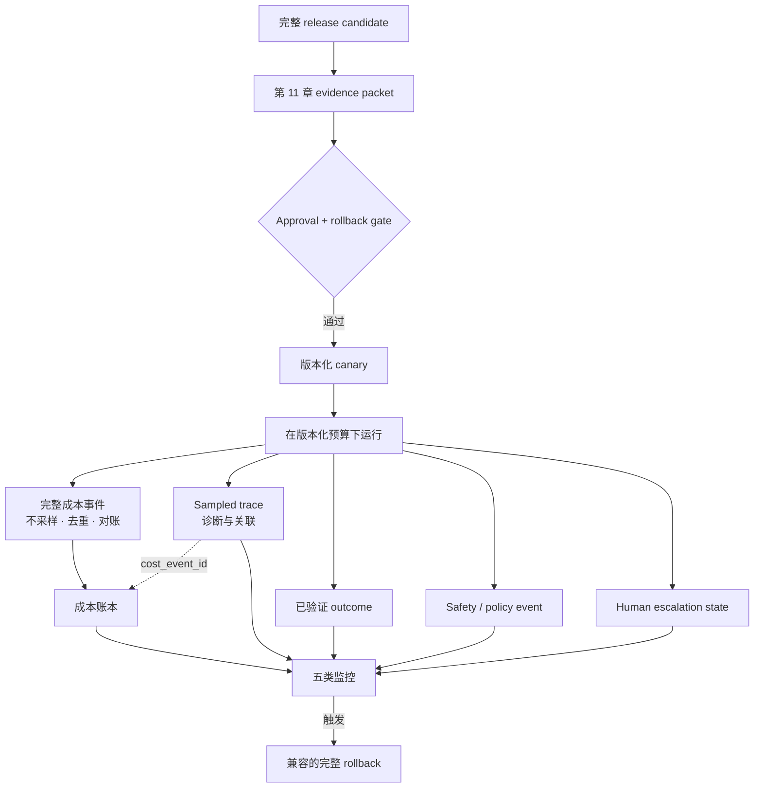

# 第 18 章：AgentOps——成本、隐私与生产运维

前面的章节定义了 model-plus-harness 系统如何执行、恢复并产出评估证据。生产环境增加了另一类责任：真实 run 执行期间，运维人员必须让这套确切配置始终处于成本、隐私、可靠性和发布边界内。

本书使用 **AgentOps** 作为这套运维纪律的本地统称。它不是某个强制产品的名称，也不表示所有 vendor 都采用同一分类。[第 10 章](./10-state-event-history-production-factors.md)区分了执行状态、event history、trace 和 audit record；[第 11 章](./11-evaluation.md)定义了发布证据；[第 17 章](./17-trace-driven-iteration.md)说明 sampled trace 如何辅助诊断，却不会因此变成 system of record。本章继续保持这些边界。

### 18.1 成本需要完整账本，而不只是 trace

**成本账本（cost ledger）**是在明确会计范围内，完整且去重的计费事件与可对外支出事件集合。Trace 可以链接这些事件并帮助诊断，但它不会自动成为账本，也不是 audit record。

OpenTelemetry sampling 可以决定不记录 span、不导出已记录的 span，或丢弃其 attribute、event 与 status；collection limit 也可能丢弃 span 字段（[OpenTelemetry — Trace SDK](https://opentelemetry.io/docs/specs/otel/trace/sdk/)）。因此：

- sampled trace 不能证明支出完整；
- 会丢失或延迟 export 的 trace backend 不能独自完成账期结算；
- 只有**完整且未丢失的成本事件或 cost span**才能进入成本账本；
- 如果使用 cost span，其采集路径在对应会计范围内必须不采样、能检测丢失、支持幂等摄取并经过对账；
- trace 应携带 `cost_event_id` 或 provider call reference，使运维人员可以把诊断 span 与账本条目关联起来，而不混同两者保证。

一条实用的成本事件至少包含：

```text
cost_event_id, session_id, run_id, step_id, action_id, attempt_id, call_id
tenant_id, provider_call_id, model_or_tool_version, billing_item
input_units, output_units, cached_units, reasoning_units
price_catalog_version, amount, currency, external_spend
retry_of, fallback_from, status, occurred_at, recorded_at
```

`amount` 必须基于固定的价格/目录版本计算，或复制自权威 provider record。迟到事件、重复投递、credit 和价格修正需要显式 adjustment entry，不能通过覆盖历史来处理。把账本总额与 provider invoice 及工具/vendor receipt 对账，并针对缺失 call ID 或无法解释的差额告警。

成本报告还应说明分析单位和统计总体：每次模型调用、工具调用、run、成功 run、tenant、release version 或会计窗口。如果排除被放弃和重试的 run，较低的单次请求成本可能掩盖昂贵的失败。

### 18.2 在使用处定义延迟分位数

本章针对明确的统计总体和时间窗口采用以下本地定义：

- **p50** 是观测延迟的中位数；
- **p95** 是使至少 95% 观测值不超过它的最小报告阈值；
- **p99** 是对应的 99% 阈值。

每张图表或 SLO 都必须说明测量对象：端到端 run 延迟、模型调用延迟、工具延迟、排队时间、等待批准时间或其他区间；还必须注明时间窗口、release/configuration、样本数、timeout 处理方式，以及是否包含取消或失败的 run。不要对各自独立计算的分位数再求平均并声称得到了合并分布；应聚合兼容的原始观测，或合并适当的 histogram/sketch。

延迟应与 outcome 和成本一起报告。如果一次 run 更快，却更常超时或跳过必要验证，它就不是运维上的改进。

### 18.3 四种缓存，四套正确性契约

“缓存”并不是一种机制。本书沿用[第 3 章](./03-context-as-finite-resource.md)引入的规范区分：

| 缓存 | 复用边界 | 复用内容 | 正确性条件 |
|---|---|---|---|
| **单次请求 KV 缓存（per-request KV cache）** | 单次 generation/request 内 | 已处理前缀对应的模型内部 key/value state | 同一 live generation，且 model/runtime state 兼容 |
| **Provider prompt cache** | 不同 provider request 之间 | Provider 管理的精确可复用 prompt 前缀计算 | 满足 provider 特定的精确前缀、模型、保留与资格规则 |
| **Application response cache** | 不同 application request 之间 | 精确规范化请求的一份已完成响应 | 请求精确相同，且 authorization、tenant、version、freshness 与 policy 兼容 |
| **Semantic cache** | 不同 application request 之间 | 含义相似请求的一份已完成响应 | similarity **以及** authorization、tenant、version、freshness、provenance 与 risk gate 全部通过 |

Provider prompt cache 不复用最终响应；provider 仍然为当前请求生成输出。作为带日期的产品案例而非可移植契约，OpenAI 文档在 **2026-07-31** 核验时描述了精确 prompt 前缀命中以及 provider 特定的资格和保留行为（[OpenAI — Prompt caching](https://developers.openai.com/api/docs/guides/prompt-caching)）。另一个带日期的产品案例是 Microsoft Azure API Management 文档；在 **2026-07-31** 核验时，它描述了可为含义相似 prompt 返回已存响应的 semantic caching，并提供 similarity threshold（[Microsoft — Semantic caching in Azure API Management](https://learn.microsoft.com/en-us/azure/api-management/azure-openai-enable-semantic-caching)）。产品行为可能变化；这些案例不会重新定义上述四类缓存。

语义相似绝不是 authorization 或事实等价的证明。Semantic cache 的 key 与准入/查询 gate 必须包含或绑定以下全部信息：

```text
tenant_id
user_id and authorization_scope
model_id and model version
normalized prompt/request and prompt-template version
tool schemas, tool implementations, and relevant tool-result versions
retrieval index, corpus snapshot, filters, and retrieval configuration
policy and safety-rule version
TTL / freshness deadline
invalidation dependencies and invalidation epoch
response provenance: source run, response, citations/artifacts, and creation time
```

每次 lookup 都必须重新检查当前 caller 的 authorization 和当前 policy。Tenant isolation 是强制要求；共享 embedding index 并不能让跨 tenant 响应复用变得安全。Invalidation 必须覆盖源文档变化、权限变化、删除请求、model/prompt/tool/retrieval/policy release，以及被发现的错误响应。TTL 是 freshness 的最长边界，不能替代 invalidation。

对于敏感、个性化或高影响决策，默认禁用语义响应复用。只有在测试衡量了 false hit、stale answer、跨 scope 拒绝、provenance 展示、invalidation 传播和安全 miss/fallback 后，才能启用具体 use case。缓存命中与未命中仍应产出完整成本事件和 policy 相关记录。

### 18.4 Run budget 是一个向量

单一 token cap 不是生产预算。每个 run 都需要一套版本化 budget vector，至少包括：

| 维度 | 计数示例 | 强制执行问题 |
|---|---|---|
| **Token** | input、output、reasoning、cached read/write unit | 下一次调用能否开始，并仍为安全收尾保留预算？ |
| **Dollar** | 模型、检索、存储、grader 与工具费用 | 计划动作是否会超过 run 或 tenant 的金额上限？ |
| **工具调用** | 尝试过的调用，包括失败调用和分支 | loop 或 fan-out 是否达到调用上限？ |
| **Wall time** | 排队、模型、工具、批准、重试和清理时间 | 剩余 deadline 是否足以完成或安全停止？ |
| **External spend** | 采购、转账、付费 API 动作、云资源 provision | 该 side effect 是否在金额和目的地限制内获得单独授权？ |
| **Retry/fallback** | retry、hedge、模型 fallback、恢复尝试 | 是否允许再次尝试，且其 side-effect outcome 是否已知？ |

Runtime 而不是模型文本负责维护 counter，并拒绝会越过 hard boundary 的工作。模型可以收到剩余预算状态用于规划，但不能给自己增加预算。Soft threshold 可以触发 compaction、更便宜的 routing、减少 fan-out 或升级给人；hard threshold 则转入预先声明的终态或暂停态。

为验证、durable state 写入、清理和可用 handoff 保留预算。Retry 和 fallback 既计入各自上限，也计入其消耗的每种资源。早期 side effect 为 `unknown` 时，不要把 retry budget 用在盲目重复上；应按[第 10 章](./10-state-event-history-production-factors.md)的恢复状态机解决或升级。用于强制 hard ceiling 的预算事件必须是完整 durable state，不能从 sampled trace 重建。

### 18.5 隐私是一条端到端数据生命周期

NIST Privacy Framework 是通过 enterprise risk management 识别和管理隐私风险的自愿工具，不是针对某一产品的 telemetry checklist（[NIST — Privacy Framework](https://www.nist.gov/privacy-framework)）。对于 agent harness，应把这种风险纪律转化为覆盖整条数据路径的控制：

| 生命周期位置 | 必需的 harness 控制 | 需要保留的证据 |
|---|---|---|
| **收集与 context** | 最小化字段和文档；优先 handle 或 summary；在模型/工具使用前分类敏感度 | purpose、data class、选定字段、source，以及必要时的法律/组织依据 |
| **Redaction** | 在 prompt、tool argument、trace、eval fixture 或 support export 前移除 secret 和非必要个人数据；确需完整数据时保留 access-controlled reference | redaction policy/version、detector result、exception/approval |
| **Retrieval** | 搜索前执行 tenant 与 user authorization，materialization 前再次执行；把 purpose 与 scope 带入 filter | principal、tenant、query/filter、corpus/index version、allow/deny decision |
| **Trace capture 与 storage** | 分别声明 sampling 和 content capture；默认只收 metadata；加密、访问控制并隔离 trace store；绝不把 sampling 当作 redaction | capture mode、sampling policy、destination、access log、retention class |
| **Retention** | 按 data class 与 evidence purpose 指定 TTL/retention；有意地过期 cache、trace、memory、artifact 与派生 eval data | retention decision、expiry，以及适用时的 legal/incident hold |
| **Egress** | Allowlist provider/tool destination；必要时限制 region/account；最小化或脱敏 payload；敏感传输需要批准 | destination、purpose、发送字段、credential audience、approval/policy decision |
| **Deletion** | 按 policy 把删除或撤销传播到 application cache、semantic index、retrieval store、memory、trace、artifact 与 downstream processor | tombstone/request ID、受影响对象、完成状态或有记录的 exception |

Sampling 会减少 telemetry 体量，但不会让保留内容失去敏感性。Redaction 会减少暴露内容，但不能替代 retrieval ACL 或 egress policy。除非 downstream copy 和 derived artifact 也在处理范围内并记录了完成状态，否则 retention 到期并不能证明删除完成。

### 18.6 分开监控五类运维问题

不要把所有信号压缩成一个“agent health”分数。应分开问题、数据完整性要求和 owner：

| 信号类别 | 它回答什么问题 | 信号示例 |
|---|---|---|
| **Service health** | 服务系统是否可用且未超过资源限制？ | availability、request/error rate、queue depth、saturation、model/tool latency、p50/p95/p99 |
| **Agent outcome** | Run 是否取得经过独立验证的任务结果？ | outcome-grader pass、environment-state success、incomplete/unknown outcome、recovery success |
| **Safety/policy event** | 受保护规则是否触发或失效？ | denial、approval、sandbox violation、cross-tenant attempt、sensitive egress、policy-version mismatch |
| **Cost** | 产生了多少完整支出，预算消耗速度多快？ | 每 run/outcome/tenant/release 的 ledger amount、缺失成本事件、invoice variance、budget exhaustion |
| **Human escalation** | 人能否及时审查并解决工作？ | queue age、approval expiry、未解决的 unknown side effect、override rate、handoff completion |

Service uptime 不能证明任务成功；agent 声称完成不能证明外部 outcome；sampled trace count 不能证明总成本或 policy event frequency。每个 SLO 都必须注明权威 source 和完整性假设。Dashboard 可以按 `run_id` 和 release version 关联五类信号，但 alert 应路由给能够采取行动的 owner。

只有在[第 17 章](./17-trace-driven-iteration.md)的 intake process 处理 redaction、consent/licensing、deduplication、distribution shift 与 evidence reconstruction 后，生产失败才能成为[第 11 章](./11-evaluation.md)的 regression candidate。Incident investigation 仍需把 trace 与 durable history、ledger record、audit record、configuration 和 external-system state 结合起来。

### 18.7 发布完整的 model–harness configuration

发布单位是一套版本化配置，而不是“prompt”或“model”。Manifest 至少必须固定：

```text
model/provider and inference settings
prompt/instruction templates and context policy
tool schemas and tool implementations
retrieval index/corpus snapshot and retrieval configuration
memory schema and memory policy
sandbox image, capabilities, network policy, and resource limits
policy/approval rules and runtime/router versions
grader versions and evaluation contract
run budgets, retry/fallback policy, and cache policy
```

上述任一组件变化都会创建新的 release candidate，并重新运行受影响的 eval slice。OpenAI 的评估指南强调报告确切的 tested system、harness、tool、budget、safeguard 和 validity check，因为这些选择决定一项评估主张能支持什么（[OpenAI — Trustworthy Third-Party Evaluations](https://openai.com/index/trustworthy-third-party-evaluations-foundations/)）。

继续使用[第 11 章](./11-evaluation.md)的 **release evidence packet**：claim 与 scope、immutable configuration、task-suite 与 slice version、isolated trial trajectory、grader calibration、outcome/process/safety result、uncertainty、成本与延迟、known limitation、exception owner/expiry、approval、canary plan、post-release monitor 与 rollback trigger。只有这份 packet 能支持声明的 claim，release gate 才能通过。

把获批单位部署为 canary，并把每个 run 与 ledger entry 关联到 release version；比较 outcome、safety、cost、service health 与 escalation 信号。Rollback 必须恢复兼容的完整配置、保留 durable-run migration rule，并能在声明的 trigger 触发时执行。Candidate 不能批准自己，也不能编辑 holdout grader。

### 18.8 治理与 vendor 主张需要范围和日期

NIST AI RMF 是自愿采用的风险管理指南，OWASP GenAI 项目发布工程风险指南；二者都不是针对特定 jurisdiction 的法律结论（[NIST — AI Risk Management Framework](https://www.nist.gov/itl/ai-risk-management-framework)；[OWASP — Top 10 for LLM Applications](https://genai.owasp.org/llm-top-10/)）。ISO/IEC 42001:2023 规定 AI management-system standard，而 Regulation (EU) 2024/1689 是 EU AI Act 的官方文本（[ISO — ISO/IEC 42001:2023](https://www.iso.org/standard/42001)；[European Union — Regulation (EU) 2024/1689](https://eur-lex.europa.eu/eli/reg/2024/1689/oj/eng)）。Certification、framework mapping 或 product feature 本身并不能证明某一具体部署符合所有适用义务。

> **范围说明——生效日期 2026-07-31。** 法律义务取决于部署所在 jurisdiction、provider/deployer role、use case、受影响人群、合同，以及相关日期已经生效的条款。对于实际部署，应核对最新官方文本并咨询合格法律顾问。本章是工程指南，不构成法律建议。

对于快速变化的 vendor “AgentOps”、gateway、observability、cache、evaluation 与 governance 产品，只把它们当作带日期的实现案例。记录 product、documented behavior、region/tier、source URL 与 verification date；让架构和发布契约独立于 vendor label。

---

## 图：生产证据与控制回路



Trace 用于解释 run；完整 domain record 用于强制预算、会计、policy、恢复与证据要求。

---

## 要点

- **Sampled trace 不是成本账本或 audit record：**只有完整、未丢失且已去重的成本事件或 cost span 才能结账，sampling 会破坏这种完整性。
- **在本地定义分位数：**为 p50/p95/p99 注明统计总体、窗口、区间、配置、样本数和 timeout/failure 处理方式。
- **区分四套缓存契约：**单次请求 KV、provider prompt、application response 和 semantic cache 在不同范围复用不同内容。
- **Semantic cache 复用对 authorization 敏感：**绑定 tenant、user/auth scope、model、prompt、tool、retrieval、policy version、TTL、invalidation 与 provenance；敏感、个性化和高影响复用默认禁用。
- **预算是向量，不只是 token：**在 durable runtime state 中强制执行 token、dollar、工具调用、wall time、external spend 与 retry/fallback。
- **隐私覆盖完整生命周期：**minimization、redaction、retrieval ACL、trace capture/storage、retention、egress 和 deletion 都需要独立控制与证据。
- **分开监控五类问题：**service health、agent outcome、safety/policy event、cost 与 human escalation 各有不同权威 source。
- **发布和回滚完整配置：**承接第 11 章的 evidence packet，以及第 17 章的 approval、canary、monitoring 与 rollback 纪律。

## 延伸阅读

- OpenTelemetry, *Trace SDK*. https://opentelemetry.io/docs/specs/otel/trace/sdk/
- OpenAI, *Prompt caching*（产品文档；核验于 2026-07-31）. https://developers.openai.com/api/docs/guides/prompt-caching
- Microsoft, *Enable semantic caching for LLM APIs in Azure API Management*（产品文档；核验于 2026-07-31）. https://learn.microsoft.com/en-us/azure/api-management/azure-openai-enable-semantic-caching
- NIST, *Privacy Framework*. https://www.nist.gov/privacy-framework
- NIST, *AI Risk Management Framework*. https://www.nist.gov/itl/ai-risk-management-framework
- OWASP, *Top 10 for LLM Applications*. https://genai.owasp.org/llm-top-10/
- ISO, *ISO/IEC 42001:2023*. https://www.iso.org/standard/42001
- European Union, *Regulation (EU) 2024/1689*. https://eur-lex.europa.eu/eli/reg/2024/1689/oj/eng
- OpenAI, *A Shared Playbook for Trustworthy Third-Party Evaluations*. https://openai.com/index/trustworthy-third-party-evaluations-foundations/
