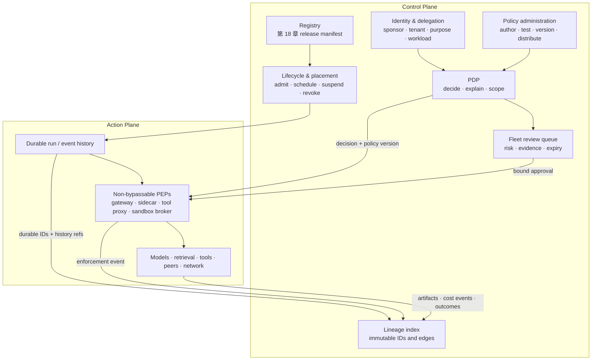

# 第 19 章：Agent Fleet 与控制平面

前面的章节治理的是一个 model–harness 系统：它如何获得权限、执行 run、从失败中恢复、请求审批并产出证据。Fleet 带来了另一类协调问题。许多团队可能发布许多版本，不同 tenant 可能共享基础设施却不能共享权限，工作还可能跨 runtime 迁移，或被委派给其他 agent。Operator 需要对以下问题给出一致答案：哪些对象可以运行、代表谁运行、受哪个 release 和 policy 约束，以及如何收回这些权限。

本书把 **agent control plane（agent 控制平面）**作为一种借鉴自分布式系统的架构约定，而不是某个产品的名称，也不声称它是唯一的行业标准分层。例如，Kubernetes 文档中的 control plane 负责管理 cluster state，worker node 则运行 workload；这个类比很有用，但 agent fleet 不是 Kubernetes cluster，也不必照搬其组件边界（[Kubernetes — Components](https://kubernetes.io/docs/concepts/overview/components/)）。本章中，**action plane（动作平面）**执行 model call、retrieval、tool call、代码执行和 agent-to-agent 交互；**control plane（控制平面）**管理 fleet 范围的 registry、identity、policy administration 与 decision、placement、lifecycle、review queue 和 evidence index。真正的 enforcement 仍然发生在 action path 上明确且不可绕过的位置。

### 19.1 控制平面负责治理，Runtime 负责执行

应区分以下四类责任：

| 责任主体 | 负责 | 不会因此变成 |
|---|---|---|
| **Model** | 提议：文本、plan、候选 action 和 interpretation | Executor、credential holder、policy authority 或最终事实来源 |
| **Harness** | 模型邻近的 context assembly、tool mediation、validation、loop control 和 evidence capture | Fleet 范围的 release、tenant 或 identity 可信来源 |
| **Runtime** | Durable execution state、event history、queue、retry、scheduling、worker、sandbox 和 cancellation | Policy author；也不会仅因为保存了 event 就自动成为完整 audit system |
| **Control plane** | Registry、identity、policy administration 与 decision、desired state、placement constraint、revocation、review queue 和 lineage index | 必须由单个 process 实现的服务、特定 vendor product，或每项 action 都必须经过的集中式 hop |

集中式管理可以与分布式执行并存。Control-plane API 可以发布 desired release、signed policy bundle 或 revocation epoch；本地 gateway、sidecar、tool proxy 和 sandbox broker 再靠近受保护资源执行这些状态。反过来，把一个 service 放在网络上并称作“control plane”，并不会赋予它实际权限。只有当每项相关 action 都会到达一个真正能阻断它的 enforcement point 时，它的 decision 才有意义。

控制平面也不会取代[第 10 章](./10-state-event-history-production-factors.md)的 runtime contract。Worker 崩溃后，应由 event history 和 checkpoint 恢复 run。控制平面可以决定它应该在哪里恢复、是否仍被允许恢复，却不应从 dashboard 或 sampled trace 中重建 workflow state。

### 19.2 Registry 存储第 18 章定义的 Release Unit

不要再造一套更弱的“agent record”。Fleet 注册和 promotion 的不可变对象，就是[第 18 章](./18-agentops.md)定义的完整 **release manifest**：model/provider 与 inference setting；prompt 与 context policy；tool schema 与 implementation；retrieval snapshot 与 configuration；memory schema 与 policy；sandbox image、capability、network policy 与 limit；policy/approval rule 和 runtime/router version；grader 与 evaluation contract；以及 budget、retry/fallback 和 cache policy。

Registry 只在该 manifest 周围增加 fleet-management binding，而不把它的字段复制到可变列中：

```text
release_id, manifest_digest, release_manifest_ref
publisher_id, accountable_sponsor_id, owner_team_id
release_state, approval_ref, evidence_packet_ref
eligible_tenants, eligible_workload_classes, placement_constraints
endpoints_and_protocol_versions, dependency_release_ids
desired_deployments, observed_deployments
created_at, deprecates_at, revoked_at, revocation_reason
```

Run 启动前，应先把 display name 解析成不可变的 `release_id`，并把该 ID 写入 run。Registration 不等于 approval：`draft`、`evaluated`、`approved`、`deployed`、`suspended`、`deprecated`、`revoked` 和 `retired` 是不同的 fleet state。Release-state transition 应指明 evidence packet 和 accountable approver；rollback 应选择另一份完整且兼容的 manifest，而不是只替换 prompt 或 model。

Discovery metadata 很有用，但并不充分。Public capability card 可以帮助其他 agent 找到 endpoint；内部 registry 则判断这个确切 release 是否获准服务于当前 tenant、purpose、workload class 和 environment。Dependency edge 必须可查询，这样在撤销 tool、policy bundle、sandbox image、publisher 或 model 时，才能找出受影响的 release 和运行中工作。

### 19.3 Identity 是一条链，而不是一把 API Key

Fleet action 涉及多个 identity 和 constraint。“是 agent 做的”过于含糊；只有 user identity 又会丢失实际行动的 release 和 workload。控制平面至少应绑定：

```text
release_version_id          # 第 18 章的不可变 release
sponsor_id                  # 承担责任的人或组织
delegator_chain             # subject 以及每个 acting/delegating principal
tenant_id                   # isolation 与 policy domain
purpose_id                  # 有边界的 task/workflow 正当理由
runtime_id                  # durable execution service 及其 version
workload_id                 # 具体 process/service identity
credential_audience         # 预期 resource/service
issued_at, not_before, expires_at
credential_id, revocation_epoch, revocation_status
session_id, run_id
```

Release identity、runtime identity 与 workload identity 应彼此分离。一个 release 可以有许多并发 workload；一个 runtime 可以托管许多 release；替换 process 不应悄悄改变 release 或 delegator。SPIFFE 可作为一种实现构件，而不是强制标准：它定义了唯一标识 workload 的 SPIFFE ID，以及供 workload 证明身份的 SVID（[SPIFFE — Concepts](https://spiffe.io/docs/latest/spiffe-about/spiffe-concepts/)）。它没有提供本书需要的 sponsor、purpose、release manifest 或 delegation semantic，因此这些仍然是显式的控制平面 claim。

Credential 应短期有效、绑定 audience，并且只在受保护边界呈现。Raw credential 不得进入 model context、message、generated code 或通用 artifact storage。PEP 在使用 credential 前，要校验 issuer、subject/actor chain、tenant、purpose、audience、scope、time bound、revocation state、release status 以及 requested resource/action。

### 19.4 Delegation 只能收窄权限

本书采用单调收窄的 delegation rule：

```text
child_effective_authority =
    parent_effective_authority
    ∩ approved_child_release_policy
    ∩ tenant_and_environment_policy
    ∩ delegated_actions_and_resources
    ∩ purpose, audience, budget, and time bounds
```

每一跳都在链上增加一个 actor，并且可以移除 action、resource、destination、budget 或 time，却不能增加 parent 原本不具备的权限。如果确实需要更大的权限，应由有权 principal 通过 policy 与 approval path 作出新授权；child 不能从 task text 中自行推断。

OAuth 2.0 Token Exchange 区分 subject 与 actor，并定义 `audience`、`resource` 和 `scope` 参数；但它明确把 token trust 和大量 deployment policy 留在规范范围之外（[RFC 8693 — OAuth 2.0 Token Exchange](https://www.rfc-editor.org/rfc/rfc8693.html)）。它可以编码 delegation flow 的一部分，却不会自行保证本书的收窄不变量、revocation propagation 或 purpose binding。这些属性必须由 issuer 和 PDP 执行。

最重要的是，**child 的 output 携带信息，不携带 child 的权限**。Parent A 接受 child B 的 report、plan、artifact 或 tool result 时，A 不会继承 B 的 credential，B 也不会获得 A 的 authority。如果 A 想把该 output 转化为 privileged action，就必须以 A 当前的 identity 和 policy 提交一项新的 action proposal。这是在 fleet 层面防止 trust escalation 和 confused-deputy behavior 的做法。

### 19.5 分开 Policy Administration、Decision 与 Enforcement

即使由同一产品实现多个部分，以下三项功能也必须清晰可见：

| 功能 | Contract | 常见输出 |
|---|---|---|
| **Policy administration** | 人和受治理的自动化负责 author、review、version、test、approve、distribute 与 retire policy bundle | 不可变 policy version、signature、rollout status、revocation epoch |
| **Policy decision point（PDP）** | 根据 identity、tenant、release、resource、action、purpose、delegation、environment、budget 与 policy 计算结果 | `allow`、`deny`、`redact`、`require_approval`、`sandbox`、更窄的 scope/budget、reason 和 decision ID |
| **Policy enforcement point（PEP）** | 截获真实 request，并在受保护 operation 发生前执行 PDP decision | 被阻断或转换的 request、approval gate、sandbox route、enforcement event |

这里存在一个术语陷阱。NIST Zero Trust glossary 把 **Policy Administrator（PA）**定义为通过向 PEP 发出命令来执行 policy engine decision 的组件，并把 policy engine 与 PA 合称 PDP；这个发生在 request time 的 PA，不等同于本书更宽泛的 policy authoring 与 lifecycle 功能（[NIST — Zero Trust Architecture Glossary](https://pages.nist.gov/zero-trust-architecture/glossary.html)）。因此，本章用 **policy administration** 指 authoring/lifecycle，用 **PDP** 指完整的 request-time decision service。

Gateway、sidecar、tool proxy、network egress proxy、retrieval materializer 或 sandbox broker **可以**成为 PEP，但只能针对它不可绕过地介入的 action 才算 PEP。例如，如果 generated code 能绕过 tool proxy 直接访问网络，这个 proxy 就不是 shell egress 的 PEP。NIST IR 7987 把 PEP 描述为执行 reference-mediation function 的组件；本书进一步把完整且抗篡改的 mediation 规定为 fleet invariant（[NIST IR 7987 Rev. 1 — Policy Machine](https://nvlpubs.nist.gov/nistpubs/ir/2015/nist.ir.7987r1.pdf)）。当系统无法确定当前 identity、policy、approval 或 revocation state 时，有后果的 operation 应 fail closed。

Prompt **不是** PEP。“未经审批绝不转账”可以帮助 model 提出更安全的候选 action，却不能阻止被攻陷或判断错误的 model 输出调用。只有当 PEP 在执行前验证了一项与确切不可变 action proposal 绑定的 approval，[第 14 章](./14-human-agent-interaction.md)的 mandatory approval 才真正成为控制。

### 19.6 Lifecycle、Placement 与 Kill Switch

Release lifecycle、run lifecycle 和 sandbox/worker lifecycle 彼此关联，却不能互换。撤销 release 会阻止新 run，但已经签发的 credential 和 active run 仍可能继续，除非其各自状态也经过 reconciliation。Controller 应比较 desired state 与 observed state，并明确处理每项后果：

- scheduling 只接纳对当前 tenant、purpose、workload class、region 和所需 isolation 获批的 release；
- run 拥有 queued、active、waiting for approval、suspended、cancel-requested、completed、failed 和 canceled 等 durable state；
- worker 和 sandbox 使用 lease，以便发现废弃执行，并在不复制 logical run 的前提下恢复；
- upgrade 使用完整 release unit，并遵守[第 18 章](./18-agentops.md)的 canary、monitoring、rollback 和 durable-run compatibility rule。

Fleet **kill switch 是一组协调的状态转换**，不是一条自然语言“stop”消息。根据 credential、run、release、publisher、tenant、tool 或整个 fleet 等不同 scope，控制平面必须：

1. 推进 revocation epoch，并撤销或使受影响 credential 失效；
2. 向每个相关 PEP 发布 deny rule，并停止接纳新工作；
3. 通过 run lifecycle 请求 suspend 或 cancel，停止续租 lease，并在 policy 要求时终止 sandbox；
4. 对 side-effect outcome 为 `unknown` 的 in-flight action 做 reconciliation，而不是盲目 retry；
5. 记录 acknowledgement、无法联系的 enforcement point、exception 和最终 observed state。

RFC 7009 标准化了 OAuth token-revocation request：它会使 token 失效，也可能影响相关 token 或底层 grant，但 access-token revocation 支持和传播行为取决于具体实现（[RFC 7009 — OAuth 2.0 Token Revocation](https://www.rfc-editor.org/rfc/rfc7009.html)）。因此，credential revocation 是 kill switch 必需的 actuator 之一，却不是全部机制。PEP denial 关闭仍然开放的 action path，runtime cancellation 则控制已经开始运行的工作。发送给 model 的消息最多只是一项额外 steering signal。

### 19.7 Trace、Event History、Audit 与 Lineage 是不同产品

这些记录可以共用 identifier 或 storage infrastructure，但它们的 contract 不能合并：

| Evidence product | 规范含义 | 完整性与用途 |
|---|---|---|
| **Trace** | 含 timing、parent/link relation、attribute、event 和 status 的 span | 用于 diagnosis 与 performance evidence；可能被 sampling 或丢弃。OpenTelemetry 明确允许 sampling decision 丢弃 span data（[OpenTelemetry — Trace API](https://opentelemetry.io/docs/specs/otel/trace/api/)；[OpenTelemetry — Trace SDK](https://opentelemetry.io/docs/specs/otel/trace/sdk/)） |
| **Event history** | 用于重建 workflow state 和恢复进度的有序 durable execution event | 声明的 workflow scope 内的 runtime system of record。以 Temporal 为具体例子，其 append-only Event History 会 durable persist，以便在故障后恢复（[Temporal — Events and Event History](https://docs.temporal.io/workflow-execution/event)） |
| **Audit record** | 针对明确 control scope 的受保护 accountability record | 需要必要的 principal、action、object、outcome、timestamp、integrity、retention、access 与 completeness control；NIST SP 800-53 的 Audit and Accountability control family 是相关控制目录，并不意味着普通 log 已经满足它（[NIST SP 800-53 Rev. 5](https://csrc.nist.gov/pubs/sp/800/53/r5/upd1/final)） |
| **Lineage** | 连接 identity、version、input、artifact、decision、action 与 outcome 的 provenance graph | 支持跨产品 causal query；W3C PROV-DM 提供稳定的 entity/activity/agent 与 derivation vocabulary，本章则定义 fleet-specific graph（[W3C — PROV-DM](https://www.w3.org/TR/prov-dm/)） |

Temporal 文档也会非正式地把 Event History 称作“用于 debugging 的 audit log”（[Temporal — Events and Event History](https://docs.temporal.io/workflow-execution/event)）。这并不会让每份 event history 自动成为本书所指的 protected audit record。同样，unsampled trace 仍不会自动变成 durable workflow history；把 audit row 复制进 graph，如果没有表示 causal edge 和 version identity，也不会得到 lineage。

### 19.8 最小 Fleet Lineage Graph

Lineage 应通过不可变 identifier 关联已有的 authoritative record，而不是复制其中的可变 prose。对于每项 consequential action，至少保留足以遍历以下路径的 edge：

```text
session_id → run_id → step_id → action_id → attempt_id → call_id
run_id → release_id → manifest_digest → component artifacts
run_id → sponsor / delegator chain / tenant / purpose / runtime / workload
action_id → policy_decision_id → policy_version + decision inputs
action_id → approval_id → immutable proposal digest + reviewer + expiry
call_id → input/output artifact IDs → content hashes and source versions
call_id → cost_event_id → 第 18 章 cost ledger
action_id → enforcement_event_id → PEP identity and result
records → protected_audit_record_id + trace_id/span_id where available
action_id → external_effect_id → verified outcome or explicit unknown
```

Link 比收集所有 payload 更重要。Reviewer 应能查询：哪个 release 和 policy 产生了昂贵或有害的 outcome，哪些 run 依赖已被撤销的 artifact，以及每项获批 side effect 是否同时具有 PEP event 和独立验证的 result。保存 content hash 与受保护 reference；对敏感 prompt、memory 和 tool content 则遵循[第 18 章](./18-agentops.md)的 privacy lifecycle，进行 minimization 或 redaction。

Cost 属于 lineage，但不能因此把 trace 变成 accounting system。把第 18 章完整 ledger 中的 `cost_event_id` 关联到 `call_id`、`run_id`、`tenant_id` 与 `release_id`；绝不能从 sampled span 推断 fleet 总成本。同样，应关联 protected audit record，而不是假定 lineage index 自身满足 audit retention 和 integrity 要求。

### 19.9 Fleet Review 是跨 Run 的控制界面

[第 14 章](./14-human-agent-interaction.md)定义了 single-action approval contract：mandatory approval 是绑定到确切不可变 proposal 的 runtime gate，而不是对话中的一句“看起来可以”。Fleet 控制平面负责把这些 proposal 交给正确 reviewer 的 **cross-run review queue**。

Queue item 应携带 `tenant_id`、`release_id`、`run_id`、`action_id`、risk class、policy reason、evidence link、uncertainty、proposed side effect、resource version、proposal digest、requested approval scope、expiry，以及当前 run/event state。排序依据应是 risk、deadline、reversibility、uncertainty 与 evidence quality，而不是 arrival order 或 transcript length。Routing 则依据 tenant、domain、region、separation-of-duties rule 和 reviewer authority。

Queue 只是 view，不是 authorization source。只有当 PEP 验证了 approval 的不可变绑定，它才有效。如果 action argument、resource version、identity chain、release、policy、risk class、scope 或 expiry 改变，应把 card 标记为 stale，并要求重新 decision。Cancellation 或 steering 更新 durable run state；关闭浏览器中的 card 并不会取消工作。Queue SLO 应跟踪 age、expired proposal、reassignment、override、未解决的 `unknown` side effect 和 reviewer workload，且不能把沉默视作批准。

### 19.10 带日期的标准快照

下面没有任何一个来源定义了本章的完整控制平面。由于这些界面会变化，引用 protocol 或 product 时必须记录状态和日期：

| 界面 | 在 **2026-07-31** 核验的状态 | 在本章覆盖什么——以及不覆盖什么 |
|---|---|---|
| **A2A** | 页面显示的最新 released specification 为 **1.0.0** | 通过 Agent Card 进行 agent discovery，并定义 message、task、cancellation 与 interoperability。规范明确把 in-task authorization 的 scope、representation、validity 和 revocation semantic 留给实现，因此它不是 fleet authority 或 release registry（[A2A — Protocol Specification](https://a2a-protocol.org/latest/specification/)） |
| **MCP** | 带版本的 authoritative protocol revision **2025-06-18** | 在 host、client 与 server 之间暴露 resource、prompt 和 tool。它是 capability/data integration protocol，而不是 release manifest、sponsor/delegator identity、PDP/PEP topology 或 fleet lifecycle 标准（[MCP — Specification 2025-06-18](https://modelcontextprotocol.io/specification/2025-06-18)） |
| **W3C PROV-DM** | 日期为 **2013-04-30** 的 W3C Recommendation；W3C 将其描述为稳定的参考材料 | 成熟且 domain-agnostic 的 provenance vocabulary；不定义 fleet-specific node、enforcement guarantee 或 retention policy（[W3C — PROV-DM](https://www.w3.org/TR/prov-dm/)） |
| **NIST ZTA terminology** | 当前 NIST reference vocabulary，于 **2026-07-31** 核验 | 为 access control 提供有用的 PDP/PEP/PA definition；不是 agent-control-plane product specification（[NIST — Zero Trust Architecture Glossary](https://pages.nist.gov/zero-trust-architecture/glossary.html)） |

Vendor registry、gateway、identity broker、runtime 和 observability product 可以实现这套设计的一部分。把某个产品当作证据时，应记录 product name、documented feature、release/tier/region、source URL 与 verification date。不要让不断变化的产品标签反过来重定义架构。

---

## 图：Fleet 中的 Decision、Enforcement 与 Evidence



控制平面可以是分布式的。真正的不变量是：approved release 与 identity 到达 PDP，而每项 protected action 都到达能够执行当前 decision 和 revocation state 的 PEP。

---

## 要点

- **Control plane 是本书的约定，不是通用标准：**它治理 fleet-wide state，runtime 与 harness 则执行单次 run。
- **复用完整 release unit：**registry 直接指向第 18 章不可变的 release manifest 与 evidence packet。
- **携带 identity chain：**release、sponsor、delegator、tenant、purpose、runtime、workload、audience、expiry 与 revocation 必须保持可区分。
- **Delegation 只能收窄：**child result 传递的是信息，绝不是 permission；高权限后续动作需要新的 policy decision。
- **分开 policy administration、PDP 与 PEP：**gateway 或 proxy 只有在不可绕过地介入某条 path 时才是 PEP；prompt 永远不是 PEP。
- **Kill switch 需要三类 actuator：**撤销 credential、在 PEP deny，并转换 durable run/worker lifecycle。
- **Trace、event history、audit 与 lineage 的保证不同：**用 durable ID 关联它们，但不要把其中一个当作另一个。
- **Lineage 关联 authoritative record：**包括 release、identity、policy、approval、PEP action、artifact、cost event、protected audit reference 与 verified outcome。
- **Fleet review 延续第 14 章：**跨 run 工作按 risk 和 evidence 排序，而确切 approval 仍由 runtime enforcement。

## 延伸阅读

- Kubernetes, *Components*. https://kubernetes.io/docs/concepts/overview/components/
- NIST, *Implementing a Zero Trust Architecture — Glossary*. https://pages.nist.gov/zero-trust-architecture/glossary.html
- NIST, *NIST IR 7987 Rev. 1: Policy Machine: Features, Architecture, and Specification*. https://nvlpubs.nist.gov/nistpubs/ir/2015/nist.ir.7987r1.pdf
- IETF, *RFC 8693: OAuth 2.0 Token Exchange*. https://www.rfc-editor.org/rfc/rfc8693.html
- IETF, *RFC 7009: OAuth 2.0 Token Revocation*. https://www.rfc-editor.org/rfc/rfc7009.html
- SPIFFE, *SPIFFE Concepts*. https://spiffe.io/docs/latest/spiffe-about/spiffe-concepts/
- OpenTelemetry, *Trace API* and *Trace SDK*. https://opentelemetry.io/docs/specs/otel/trace/api/ and https://opentelemetry.io/docs/specs/otel/trace/sdk/
- Temporal, *Events and Event History*. https://docs.temporal.io/workflow-execution/event
- NIST, *SP 800-53 Rev. 5*. https://csrc.nist.gov/pubs/sp/800/53/r5/upd1/final
- W3C, *PROV-DM: The PROV Data Model*. https://www.w3.org/TR/prov-dm/
- A2A Protocol, *Protocol Specification*. https://a2a-protocol.org/latest/specification/
- Model Context Protocol, *Specification 2025-06-18*. https://modelcontextprotocol.io/specification/2025-06-18
