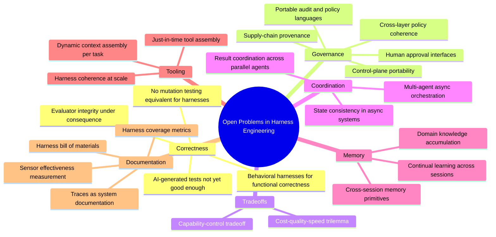

# 第 19 章：展望

### 19.1 这个领域仍然年轻

本书使用的许多词汇——例如 initializer agents、context firewalls、sprint contracts、reasoning sandwiches、ambient affordances，以及 computational controls 与 inferential controls——都是在最近十二到十八个月里才进入 agent engineering 的主流讨论。部分底层思想虽然出现得更早，但这套共享语言仍然很新。本书引用的多数文章也发表于 2025 和 2026 年。

这个变化速度可以量化。METR 发现，前沿模型完成任务的*时间视野（time horizon）*——也就是成功率达到 50% 时，它所能完成的人类任务长度——大约每七个月翻一番（第 7.11 节） ([Kwa et al. - Measuring AI Ability to Complete Long Tasks](https://arxiv.org/abs/2503.14499))。因此，任何讨论 harness 应提供哪些能力的书，描述的都是一个不断移动的目标。

LangChain 对这条演进路径的判断很直接：随着模型能力提高，今天由 harness 承担的部分职责会被模型吸收。模型会越来越擅长规划、自我验证和维持长周期的一致性，系统也就不必再通过上下文注入这些能力。但模型变强并不会让有价值的 harness 设计越来越少；harness 的重点只会转向新的问题 ([LangChain - The Anatomy of an Agent Harness](https://blog.langchain.com/the-anatomy-of-an-agent-harness/); [Anthropic - Harness Design for Long-Running Application Development](https://www.anthropic.com/engineering/harness-design-long-running-apps))。

### 19.2 开放问题

现有文献反复提到以下开放问题：

- **面向功能正确性的 behavioral harness**。围绕 maintainability 和 architectural fitness，软件工程已经积累了几十年的工具；但对于一个更基本的问题——应用的实际行为是否符合用户意图——behavioral harness 还没有同等成熟的工具。多数团队目前依赖 AI 生成测试，而普遍看法是，这些测试仍不足以解决问题 ([Thoughtworks - Harness Engineering](https://martinfowler.com/articles/exploring-gen-ai/harness-engineering.html))。
- **规模化 harness 的一致性**。随着 guide 和 sensor 越来越多，如何保证它们彼此一致？一个 sensor 从未触发，究竟说明系统质量很高，还是检测能力不足？Harness coverage 至今还没有类似 code coverage 或 mutation testing 的衡量方法。
- **控制平面可迁移性**。Registry、identity、policy、gateway 和 audit 系统已经出现，但它们的 schema 与 authority model 仍然依赖具体平台。Agent 在不同云或组织之间迁移时，仍很难完整保留 provenance、policy 含义和 revocation 语义（第 18 章）。
- **跨层 governance 一致性**。OpenReview 综述指出，policy、permission prompt、audit log、constitutional instruction 和 runtime hook 往往分散在不同层中。这些机制未必能顺利组合，反而可能相互干扰。业界仍缺少可迁移的 policy language 和 audit language ([OpenReview - Agent Harness Engineering: A Survey](https://openreview.net/pdf?id=3hXEPbG0dh))。
- **标准化 readiness reporting**。模型分数取决于 execution environment、tool surface、context policy、retry 规则和 governance gate。因此，benchmark 报告需要附带一份 harness bill of materials，说明得分所依赖的配置；但目前还没有被广泛采用的披露格式 ([OpenReview - Agent Harness Engineering: A Survey](https://openreview.net/pdf?id=3hXEPbG0dh))。
- **Cost-quality-speed 三难**。更强的 sandbox、更丰富的 observability、更深入的验证和更严格的治理，通常都会增加成本与延迟。成熟的 harness 必须明确规定：哪些检查需要同步执行，哪些可以离线执行，以及哪些风险值得采用成本更高的控制 ([OpenReview - Agent Harness Engineering: A Survey](https://openreview.net/pdf?id=3hXEPbG0dh))。
- **Capability-control 权衡**。增加工具、memory、自治能力和网络访问范围，可以扩大任务覆盖面；同时也会增加工具选择错误、prompt injection 暴露面、provenance 风险和 audit 负担。Capability 和 control 位于同一条设计轴上，不能被当作两个互不相关的问题。
- **超越同步编排的多 agent 协调**。Anthropic 的研究系统以同步方式运行 sub-agent。异步协调或许能释放更多并行能力，但也会让结果协调、状态一致性和错误传播变得更难 ([Anthropic - How We Built Our Multi-Agent Research System](https://www.anthropic.com/engineering/multi-agent-research-system))。
- **Harness 层的持续学习**。Agent 在开始新 session 时，往往无法继承此前获得的知识。如何通过 memory primitive 让它们在多个 session 中不断积累对代码库或特定领域的理解，仍是一个活跃的研究方向 ([LangChain - Improving Deep Agents with Harness Engineering](https://blog.langchain.com/improving-deep-agents-with-harness-engineering/))。
- **Human-in-the-loop 审批**。目前还没有成熟的界面标准，用来决定 harness 应在何时暂停并请求人工判断，以及应展示多少上下文才能帮助 operator 决策而不令其负担过重。Approval gate 太粗，容易变成例行盖章；太细，又会抵消自治本身的价值。
- **Just-in-time tool assembly**。Harness 不必预先配置所有可能用到的能力，而可以根据当前任务，动态组装所需工具和上下文。LangChain 等团队正在探索这一方向 ([LangChain - Improving Deep Agents with Harness Engineering](https://blog.langchain.com/improving-deep-agents-with-harness-engineering/))。
- **Trace 作为文档**。LangChain 提出：“在软件中，代码记录 app；在 AI 中，trace 记录 app。”这一观察指向一种不同的系统文档模式，但相关实践还没有完全成形 ([LangChain - The Anatomy of an Agent Harness](https://blog.langchain.com/the-anatomy-of-an-agent-harness/))。
- **端到端供应链治理**。工具完整性只是问题的一部分。Agent 还依赖 MCP server、外部 package、dataset、retrieval source，以及模型生成的 dependency name。如何记录并验证整条供应链的 provenance，仍然缺少成熟方案 ([OpenReview - Agent Harness Engineering: A Survey](https://openreview.net/pdf?id=3hXEPbG0dh))。
- **后果压力下的 evaluator integrity**。Model judge 的判断可能受到其 verdict 将如何被使用的影响，generator 也可能学会针对已知 grader 进行优化。盲评、abstention、ensemble 和 meta-eval 都有帮助，但目前没有通用方法能让语义 verifier 既可扩展，又不受判决后果影响（第 10 章）。

### 19.3 长期建议

有几条原则贯穿了大部分相关文献：

- **把上下文视为有限资源**。找出能够产生预期结果的最小高信号 token 集合。
- **采用能够解决问题的最简单方案**。Agent 的成本很高；许多任务用 workflow 就已足够，还有一些任务根本不需要两者。
- **阅读 transcript**。它能揭示 agent 在哪里产生困惑、选错工具，或不再使用 harness 提供的指导。
- **持续检验真正关键的组件**。模型变化时，要对各组件进行压力测试；移除不再产生价值的部分，调优仍然关键的部分。
- **根据模型调整 harness，但以持久原则为基础**。不同模型所需的 prompt 和工具会发生变化；context engineering、工具设计、evaluation、sandboxing 和 self-verification 等核心工作仍会存在。

这个领域才刚刚发展到可以尝试编写教材的阶段。本书明知内容会比大多数教材更快过时，仍希望提供一套当前可用的整理。随着讨论继续发展，书中的引用也为读者保留了返回原始资料的路径。

---

## 图：开放问题 Mindmap

---

## 要点

- **共享词汇仍然很新**：许多术语直到 2025—2026 年才得到广泛使用，尽管其底层思想出现得更早。
- **模型会吸收部分 harness 能力，但 harness 的工作重心会移动**：随着模型原生能力增强，harness engineering 会转向更困难的问题，而不是消失。
- **开放问题已经横跨完整的 ETCLOVG 栈**：包括 behavioral correctness、evaluator integrity、控制平面可迁移性、harness 与 governance 一致性、readiness reporting、cost-quality-speed、capability-control、异步协调、持续学习、just-in-time tool assembly，以及将 trace 用作文档。
- **五条长期原则适用于不同场景**：把上下文视为有限资源、采用最简单可行方案、阅读 transcript、检验关键组件，并根据模型调整 harness。
- **Harness engineering 是一项持续工作**：它不是模型变强后就能丢弃的脚手架，而是围绕能力不断增强的核心，持续构建有效系统的工程实践。

## 延伸阅读

- Vivek Trivedy, *The Anatomy of an Agent Harness*, LangChain, Mar 2026. https://blog.langchain.com/the-anatomy-of-an-agent-harness/
- Prithvi Rajasekaran, *Harness Design for Long-Running Application Development*, Anthropic, Mar 2026. https://www.anthropic.com/engineering/harness-design-long-running-apps
- Birgitta Böckeler, *Harness Engineering for Coding Agent Users*, Thoughtworks / martinfowler.com, Apr 2026. https://martinfowler.com/articles/exploring-gen-ai/harness-engineering.html
- Jeremy Hadfield et al., *How We Built Our Multi-Agent Research System*, Anthropic, Jun 2025. https://www.anthropic.com/engineering/multi-agent-research-system
- Vivek Trivedy, *Improving Deep Agents with Harness Engineering*, LangChain, Feb 2026. https://blog.langchain.com/improving-deep-agents-with-harness-engineering/
- *Awesome Harness Engineering* reading list: https://github.com/walkinglabs/awesome-harness-engineering
- *Agent Harness Engineering: A Survey*, OpenReview / TMLR submission, 2026. https://openreview.net/pdf?id=3hXEPbG0dh
- Thomas Kwa et al., *Measuring AI Ability to Complete Long Tasks*, METR / arXiv, Mar 2025. https://arxiv.org/abs/2503.14499
