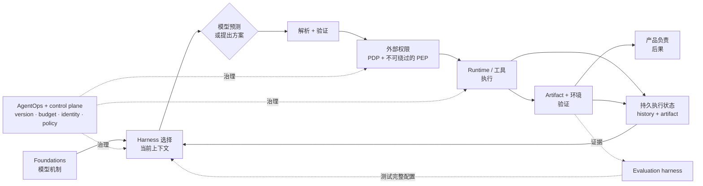

# 第 20 章：展望

本卷从一条有意精确定义的边界出发：agent 不是一个仅凭流畅文字便获得权限的模型。它是嵌入外部系统的模型；外部系统选择输入、治理动作、保存状态并检查结果。产品、模型能力、协议和主流脚手架都会变化。这条边界告诉我们：当它们变化时，哪些主张仍然需要由外部保证来成立。

因此，最后一章不预测某种必然胜出的 agent 架构。它收束两卷的论证，区分持久原则和有时效性的实现证据，列出开放的工程问题，并给出一张导航图：从《LLM 基础》中的模型机制，走到本书对应的系统责任。

### 20.1 不变的责任边界

最终原则与[《LLM 基础》第 14 章](../llm-foundations-zh/14-operational-mental-model.md)完全一致：

> **模型负责预测或提出方案。外部系统负责上下文选择、持久状态、权限、执行、验证和后果。**

“外部系统”不是某个必须存在的单一服务。[第 1 章](./01-what-is-an-agent-harness.md)把它划分为 agent harness、runtime、产品/应用、平台/控制平面和 evaluation harness。一次部署可以合并这些层，也可以把一部分交给 provider，但仍然必须明确：每项保证究竟由哪个组件提供。

| 责任 | 模型的合理角色 | 外部 owner 与所需保证 |
|---|---|---|
| **上下文选择** | 解释给定的表示；提示缺失信息 | Agent harness 为每次调用选择、限定、序列化输入，并追踪其 provenance |
| **持久状态** | 提出状态转换或总结进度 | Runtime 与产品持久化执行/业务状态；上下文和 memory 不能是唯一事实来源 |
| **工具表面与执行** | 选择工具并提出结构化参数 | Harness 暴露契约；dispatcher/runtime 验证、授权、执行、关联调用，并规范化结果 |
| **权限** | 表达意图、请求访问或要求审核 | 产品/平台 policy 作出决定；不可绕过的 PEP 执行当前决策和强制审批 |
| **验证** | 给出 critique、估计或候选判断 | Runtime、产品、evaluation harness 和人检查 artifact、环境状态、流程规则与结果 |
| **后果** | 预测或描述预期效果 | Runtime 与集成系统创建、记录、对账、补偿或回滚效果，并继续为其负责 |

由 provider 执行的工具、托管 memory 功能或模型生成的 critique，可能会移动实现边界。它们不会消除以下问题：谁授权操作、什么状态具有权威性、什么证据能证明结果，以及谁处理失败。流畅度、置信度、schema 有效性，或者模型自称工作已经完成，本身都不能提供这些保证。

### 20.2 持久的设计原则

以下原则应当能够跨越模型家族和产品名称的变化：

1. **把方案与效果分开。** 把解析、验证、授权、必要时审批、执行和结果确认视为彼此不同的生命周期阶段。
2. **把上下文视为经过选择的视图。** 上下文是单次调用的有限输入；memory、artifact、执行状态、event history、trace、eval trajectory、cost ledger、audit record 和 lineage 各有不同契约。
3. **采用满足任务所需的最低动态控制机制。** 确定性 workflow、有界 hybrid node 和模型主导的 loop 都是应当评估的选择，不是必须逐级攀升的自治阶梯。
4. **把硬保证放在无法绕过的路径上。** Prompt 指令与模型自我约束属于纵深防御；权限、sandbox、egress、预算和强制审批需要外部强制执行。
5. **验证真正相关的结果。** API 成功响应、美观的 artifact、整洁的 transcript 或通过的局部检查，只能证明它实际测量到的性质。
6. **围绕中断与歧义做设计。** 持久化 identity、checkpoint、预算、审批状态、幂等记录，以及 `partial` 或 `unknown` 结果，使恢复不至于退化成盲目重试。
7. **评估并发布完整配置。** 模型、prompt、工具、retrieval、memory、runtime、sandbox、policy、grader、cache 和预算共同决定一个结果能够支持什么主张。
8. **明确区分各种证据保证。** 关联 trace、event history、eval trajectory、cost ledger、audit record 和 lineage，但不要把它们当作彼此的同义词。

这些是关于责任归属与证据的原则，不承诺某种实现永远最优。模型变强后，团队可以在受控评估的支持下移除 planner、reset、evaluator 或工具选择辅助。模型不能因此批准自己的权限，不能事后让未知副作用变得安全，也不能把采样后的 observability 变成完整记录。

### 20.3 持久原则与时变主张

读者在依赖一项主张之前，应当先判断它属于哪一类：

| 主张类别 | 示例 | 必要处理方式 |
|---|---|---|
| **持久的责任边界** | 模型提出方案；外部系统授权并执行 | 作为长期设计原则陈述，并检验所声称的外部保证 |
| **依赖 workload 的设计选择** | 重置上下文、使用独立 grader、延迟提供工具，或选择 routing cascade | 说明任务、模型加 harness 配置、预算、对照和测得结果 |
| **协议或标准状态** | 规范版本、conformance level 或章节成熟度 | 引用官方版本、发布/状态和核验日期；不要据此推断实现覆盖率 |
| **厂商产品行为** | Cache 匹配、retention、托管工具、模型限制、价格或区域支持 | 引用当前官方产品文档，并注明模型/tier/区域和核验日期 |
| **研究测量或趋势** | Benchmark 分数或拟合的能力时间视野 | 保留任务分布、harness、metric、不确定性、更新日期和局限；不要把测量改写成预测 |

下面的快照展示这种标注纪律。它**不是**排名，也**不是**预测；每一行均于 **2026-07-31** 核验：

| 项目 | 核验时的状态或成熟度 | 该状态不能证明什么 |
|---|---|---|
| OpenTelemetry Trace SDK | 规范将 SDK 标为“**除非另有说明，否则为 Stable**”；个别章节可以有其他状态（[OpenTelemetry — Trace SDK](https://opentelemetry.io/docs/specs/otel/trace/sdk/)） | 导出的 trace 是完整、未采样、适合 replay，或可作为合规 audit record |
| MCP tools 契约，版本 `2025-06-18` | 一份带日期的协议规范，用于发现和调用已暴露的工具，包括可选的工具列表变更通知（[MCP — Tools Specification](https://modelcontextprotocol.io/specification/2025-06-18/server/tools)） | 当前授权、不可绕过的强制执行、资源所有权或已经验证的外部结果 |
| NIST AI RMF 1.0 | 已发布的自愿性风险管理框架；NIST 页面说明 1.0 正在修订（[NIST — AI Risk Management Framework](https://www.nist.gov/itl/ai-risk-management-framework)） | 法律合规、产品认证或某一种强制的 agent 架构 |
| OpenAI prompt caching | 在所述日期核验的有效 provider 产品文档；匹配、breakpoint、retention 和计费因 provider/模型而异（[OpenAI — Prompt caching](https://developers.openai.com/api/docs/guides/prompt-caching)） | 可移植的 cache 契约，或跨用户/tenant 复用应用响应的权限 |
| METR Time Horizon 1.1 | 最后更新于 **2026-05-08** 的研究测量页面，在其声明的软件任务分布上拟合可靠性与人类专家用时的关系（[METR — Task-Completion Time Horizons](https://metr.org/time-horizons/)） | 任意已部署 agent 可以自治运行多久，或对所有职业与环境的预测 |
| Anthropic 长时运行 harness 案例 | 一项带日期的厂商工程案例：随着被测模型和任务边界变化，任务分解与 evaluator 脚手架也随之调整（[Anthropic — Harness Design for Long-Running Application Development](https://www.anthropic.com/engineering/harness-design-long-running-apps)） | 未来模型必然会吸收某个特定 harness 组件这一普遍规律 |

当某一条带日期的记录发生变化时，更新该行及其核验日期。不要仅仅因为 provider 把某个机制移到了 API 之后，就改变这条不变的责任边界。

### 20.4 按责任分类的开放问题

这些是工程和研究问题，不是对某种未来方案必然胜出的断言。要证明取得了进展，应当给出明确契约、有代表性的证据和失败分析。

| 类别 | 开放问题 | 能够支持进展的证据 |
|---|---|---|
| **上下文** | Harness 应当如何测量选择、compaction、reset、retrieval 和 memory consolidation 所丢失的信息？动态工具/上下文组装如何保留授权、provenance、invalidation 和 provider cache 的正确性？ | Resume 测试、对抗性遗漏案例、provenance 覆盖率、跨 scope 负向测试，以及在声明任务切片上测得的质量/成本/延迟 |
| **状态** | 在旧 run 仍须可恢复时，长时运行配置应当如何迁移？在诚实的 replay 契约下，branch、并发 worker、补偿、删除和非确定性模型/工具结果应当如何组合？ | 跨版本恢复演练、invariant 检查、重复/未知效果测试、记录输出的确定性复用，以及明确的迁移/回滚证据 |
| **工具** | Schema 如何可移植地表达 effect class、幂等性、审批重要性、postcondition、取消和 partial result？Computer use 与 peer-agent 接口应暴露多少状态，才能支持安全验证？ | 跨实现契约测试、注入的 timeout/race 案例、postcondition recall、安全重试测试，以及独立于模型文字的结果证据 |
| **安全** | Identity、delegated authority、retrieval ACL、sandbox、egress、供应链 provenance、PDP 决策和分布式 PEP 如何无缺口地组合？如何测量 prompt injection 的残余风险，而不是宣称问题已经解决？ | 不可绕过测试、撤销延迟、最小权限分析、对抗性内容/工具套件、跨 tenant 测试，以及受保护的决策与效果记录 |
| **评估** | 随着任务、模型和用户分布变化，suite 如何保持代表性？Grader integrity、maker/checker 相关失败、污染、基础设施波动和延迟业务结果应如何影响发布主张？ | 带版本的任务与 grader、隔离的重复试验、calibration/adjudication set、按切片报告的不确定性、原始失败计数，以及与发布后结果的 join |
| **运维** | 系统如何针对每个成功且符合 policy 的结果，联合优化成本、延迟、可靠性、隐私和人工注意力？完整 ledger 与 policy event 如何同采样 telemetry、retention、删除和事件响应共存？ | 完整且已对账的 counter、五类监控、预算强制测试、隐私生命周期证据、canary 对照、回滚演练和事件时间线 |
| **身份与标准** | 哪些可移植契约应当跨组织表达 agent version、sponsor、delegator、tenant、purpose、credential audience、approval、lineage、revocation 和 audit semantics？哪些部分属于协议，哪些属于本地 policy？ | 带版本的 conformance profile、多厂商互操作测试、明确的成熟度级别、负向授权测试、provenance 连续性，以及 revocation/kill-switch 演示 |

这些类别会相互作用。Semantic cache 同时涉及上下文、安全和运维；异步 peer-agent 任务同时涉及状态、工具、身份与评估。分类不会消除耦合，而是让每项缺失的保证变得可见。

### 20.5 两卷导航

下表给出了从《LLM 基础》中的模型机制走到《Agent Harness》工程责任的最短路径。仓库中的[完整 Foundations → Harness source map](./source-map.md)维护了包含更充分边界说明的版本。

| Foundations 机制 | 模型侧边界 | Harness 责任 | 在 Harness 中继续阅读 |
|---|---|---|---|
| [1. Token 与模型输出](../llm-foundations-zh/01-llm-as-token-machine.md) | 生成 token 概率或结构化输出，而不是外部效果 | 解析方案、关联调用、治理 dispatch 并验证效果 | [第 1 章](./01-what-is-an-agent-harness.md)、[第 6 章](./06-tools-invocation-lifecycle.md) |
| [2. Tokenization](../llm-foundations-zh/02-tokenization.md) | 输入成本取决于表示方式和具体模型 | 测量真实契约，并强制执行上下文/视觉预算 | [第 3 章](./03-context-as-finite-resource.md)、[第 15 章](./15-computer-use-multimodal-agents.md) |
| [3. Next-token prediction](../llm-foundations-zh/03-next-token-prediction.md) | 流畅续写不能证明事实、权限、执行或完成 | 把方案与效果分开，并依据独立证据/结果评分 | [第 1 章](./01-what-is-an-agent-harness.md)、[第 11 章](./11-evaluation.md) |
| [4. Attention](../llm-foundations-zh/04-transformer-attention.md) | 作用于当前输入；不会创建持久 memory | 选择/排序上下文，并在外部持久化状态、memory、artifact 与 provenance | [第 3 章](./03-context-as-finite-resource.md)、[第 5 章](./05-compaction-memory-context-handoffs.md)、[第 10 章](./10-state-event-history-production-factors.md) |
| [5. 训练数据与 scaling](../llm-foundations-zh/05-training-data-and-scaling.md) | 广泛能力不能证明 workload readiness | 评估并发布精确的模型加 harness 配置 | [第 11 章](./11-evaluation.md)、[第 18 章](./18-agentops.md) |
| [6. Inference 与 sampling](../llm-foundations-zh/06-inference-and-sampling.md) | 每次尝试可能不同；constrained decoding 可保证形状，不能保证语义或权限 | 运行重复试验，并验证语义、权限与结果 | [第 6 章](./06-tools-invocation-lifecycle.md)、[第 11 章](./11-evaluation.md) |
| [7. Post-training](../llm-foundations-zh/07-post-training.md) | 遵循指令是一种习得行为，不是访问控制 | 组合模型可见指导，但在 prompt 之外强制保护动作 | [第 2 章](./02-system-prompts-instructions-policy.md)、[第 7 章](./07-sandboxing-runtime-enforcement.md) |
| [8. Prompting 与 in-context learning](../llm-foundations-zh/08-prompting-and-in-context-learning.md) | Prompt 结构会引导行为；不可信文字仍然能引导方案 | 追踪组装 provenance，分离数据与权限，并在 prompt 之外执行控制 | [第 2 章](./02-system-prompts-instructions-policy.md)、[第 4 章](./04-production-retrieval-grounding.md)、[第 7 章](./07-sandboxing-runtime-enforcement.md) |
| [9. Context window 与 cache](../llm-foundations-zh/09-context-window-and-kv-cache.md) | 上下文有限；每次请求的 KV state 不等同于所有跨请求 cache | 预算/转换上下文，并正确限定各 provider cache、response cache 和 semantic cache 的 scope | [第 3 章](./03-context-as-finite-resource.md)、[第 5 章](./05-compaction-memory-context-handoffs.md)、[第 18 章](./18-agentops.md) |
| [10. 知识、hallucination 与 uncertainty](../llm-foundations-zh/10-knowledge-hallucination-uncertainty.md) | 合理性与口头置信不能充当已验证证据 | 检索受治理的来源、保留 citation/provenance、支持 abstention，并评价 grounding/结果 | [第 4 章](./04-production-retrieval-grounding.md)、[第 11 章](./11-evaluation.md)、[第 13 章](./13-loop-engineering.md) |
| [11. Embedding 与 retrieval](../llm-foundations-zh/11-embeddings-and-retrieval.md) | 相似度和最小 RAG 不会运营生产数据生命周期 | 负责 ingestion、ACL、freshness、删除、index versioning、reranking 与 retrieval eval | [第 4 章](./04-production-retrieval-grounding.md) |
| [12. Reasoning、工具与 agent](../llm-foundations-zh/12-reasoning-tools-and-agents.md) | 工具/computer action 是方案，其结果会作为上下文返回 | 完成调用、授权、重试、computer use、审批和结果生命周期 | [第 6 章](./06-tools-invocation-lifecycle.md)、[第 7 章](./07-sandboxing-runtime-enforcement.md)、[第 14 章](./14-human-agent-interaction.md)、[第 15 章](./15-computer-use-multimodal-agents.md) |
| [13. 模型行为评估](../llm-foundations-zh/13-evaluation-for-llm-behavior.md) | 模型级任务与 grader 不能证明系统可靠性或外部状态 | 评估完整 trajectory、artifact、环境、基础设施、policy 与 release | [第 11 章](./11-evaluation.md)、[第 16 章](./16-infrastructure-noise.md)、[第 17 章](./17-trace-driven-iteration.md) |
| [14. Operational mental model](../llm-foundations-zh/14-operational-mental-model.md) | 模型预测止于权限、持久化、执行和后果之前 | 在 harness、runtime、产品、control plane/PEP 与 evaluation harness 之间分配责任 | [第 1 章](./01-what-is-an-agent-harness.md)、[第 18 章](./18-agentops.md)、[第 19 章](./19-agent-fleets-control-plane.md)、[第 20 章](./20-outlook.md) |

### 20.6 后续修订规则

当模型、产品、协议或 benchmark 发生变化时，提出四个问题：

1. **哪个被测组件变得更关键或更不关键？** 重新运行相关任务与风险切片；不要从 release announcement 推断答案。
2. **是实现位置移动了，还是保证消失了？** Provider 托管的机制仍然需要 owner、契约、证据和失败路径。
3. **哪项陈述已经过时？** 更新版本、状态、日期、scope 与来源；把历史案例结果保留为历史案例。
4. **责任边界仍然成立吗？** 如果模型仍然只负责预测或提出方案，而另一个系统负责效果、状态、权限、验证或后果，边界就没有移动。

这个领域可以快速变化，而本书的结论不必因此变复杂。让模型做它擅长的事。把权限与持久证据放在能够提供它们的系统里。测量完整配置，并且只陈述证据真正支持的主张。

---

## 图：一条边界，多个外部 owner

模型仍然是能力的核心。外围系统仍然要为把这种能力转化为受治理、可恢复、经过验证的工作承担责任。

---

## 要点

- **不变的责任边界具有持久性：**模型负责预测或提出方案；外部系统负责上下文选择、持久状态、权限、执行、验证和后果。
- **外部责任分散在多个组件中：**agent harness、runtime、产品、control plane/PEP 与 evaluation harness 提供不同保证。
- **原则、设计、标准、产品和测量的老化速度不同：**相应标注版本、成熟度、scope、日期和证据。
- **开放问题归入七个责任组：**上下文、状态、工具、安全、评估、运维和身份/标准。
- **两卷共同构成一张地图：**《LLM 基础》解释模型机制；《Agent Harness》实现并检验该机制边界产生的责任。
- **能力提升不等于权限转移：**只有当受控证据支持变更时才移除脚手架，同时保留外部保证。

## 延伸阅读

- OpenTelemetry，*Trace SDK*。https://opentelemetry.io/docs/specs/otel/trace/sdk/
- Model Context Protocol，*Tools Specification*，版本 2025-06-18。https://modelcontextprotocol.io/specification/2025-06-18/server/tools
- NIST，*AI Risk Management Framework*。https://www.nist.gov/itl/ai-risk-management-framework
- OpenAI，*Prompt caching*（产品文档；核验于 2026-07-31）。https://developers.openai.com/api/docs/guides/prompt-caching
- METR，*Task-Completion Time Horizons of Frontier AI Models*，Time Horizon 1.1，更新于 2026-05-08。https://metr.org/time-horizons/
- Anthropic，*Harness Design for Long-Running Application Development*，2026 年 3 月。https://www.anthropic.com/engineering/harness-design-long-running-apps
