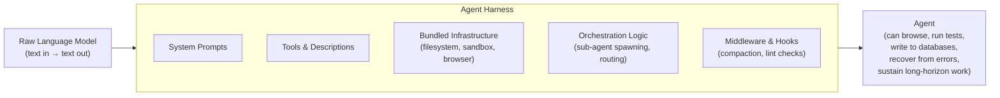

# Preface

This book is about the system that surrounds a language model when it is asked to do real work. That system has a name now — *the harness* — and a small but rapidly maturing body of literature describing how to build it. The chapters below stitch that literature into a single narrative. Readers who want to follow any thread back to its source will find the original article cited at the relevant claim.

The premise of the field is simple. As Vivek Trivedy of LangChain puts it: "Agent = Model + Harness. **If you're not the model, you're the harness.**" ([LangChain — The Anatomy of an Agent Harness](https://blog.langchain.com/the-anatomy-of-an-agent-harness/)). Everything else — system prompts, tools, sandboxes, memory, sub-agents, control flow, evaluation infrastructure — is the harness. The work of designing it well is what we will study.

---

## The Core Equation

---

## Key Takeaways

- A language model alone cannot maintain state, execute code, or access real-time knowledge — these are all harness-level features.
- Harness engineering is distinct from prompt engineering: it iterates on the entire system, not just individual prompts.
- The field is young — most canonical articles were published in 2025 and 2026 — but is maturing rapidly.
- Every claim in this textbook is cited so readers can follow threads back to primary sources.

## Further Reading

- Vivek Trivedy, *The Anatomy of an Agent Harness*, LangChain, Mar 2026. https://blog.langchain.com/the-anatomy-of-an-agent-harness/
- *Awesome Harness Engineering* reading list: https://github.com/walkinglabs/awesome-harness-engineering
