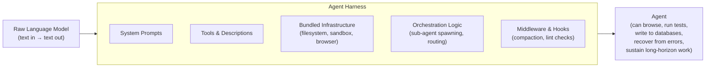

# Preface

This book is about the system that surrounds a language model when it is asked to do real work. That system has a name now — *the harness* — and a small but rapidly maturing body of literature describing how to build it. The chapters below stitch that literature into a single narrative. Readers who want to follow any thread back to its source will find the original article cited at the relevant claim.

The premise of the field is simple. As Vivek Trivedy of LangChain puts it: "Agent = Model + Harness. **If you're not the model, you're the harness.**" ([LangChain — The Anatomy of an Agent Harness](https://blog.langchain.com/the-anatomy-of-an-agent-harness/)). Everything else — system prompts, tools, sandboxes, memory, sub-agents, control flow, evaluation infrastructure — is the harness. The work of designing it well is what we will study.

Throughout the book, a model should be understood as a component that consumes tokens and emits tokens. It may emit text for a user, or structured text that requests an action, but the action itself is always carried out by surrounding software. That distinction — model output versus real-world effect — is the reason the later chapters spend so much time on context, tools, state, tests, sandboxes, and evaluation.

The model internals this book relies on — tokens, attention and the KV-cache, the context window, sampling, retrieval, and the tool-call protocol — are covered in the companion stage-1 volume; here we name each concept in a line and build the harness-engineering layer on top of it. The genuinely new material is mostly software engineering: context, tools, state, sandboxes, and evaluation.

## Before You Start

This is the second book in a two-part sequence. It assumes you have read *[LLM Foundations for Harness Engineering](../llm-foundations/)* and are comfortable with tokens, attention and the KV-cache, the context window, sampling, post-training, retrieval, the agent loop, the tool-call protocol, prompt injection, and pass@k/pass^k. Where this book names a Foundations concept, it points back (for example, "Foundations ch 9") rather than re-deriving it. A reader arriving without the stage-1 material can still follow the narrative, but should treat the one-line recaps as pointers, not as the full teaching.

---

## The Core Equation

```mermaid
flowchart LR
    A["Raw Language Model<br/>(text in → text out)"] --> B["Agent Harness"]
    B --> C["Agent<br/>(can browse, run tests,<br/>write to databases,<br/>recover from errors,<br/>sustain long-horizon work)"]

    subgraph B["Agent Harness"]
        direction TB
        SP["System Prompts"]
        T["Tools & Descriptions"]
        I["Bundled Infrastructure<br/>(filesystem, sandbox, browser)"]
        O["Orchestration Logic<br/>(sub-agent spawning, routing)"]
        M["Middleware & Hooks<br/>(compaction, lint checks)"]
    end
```

---

## Key Takeaways

- A language model alone cannot maintain state, execute code, or access real-time knowledge — these are all harness-level features.
- Harness engineering is distinct from prompt engineering: it iterates on the entire system, not just individual prompts.
- The field is young — most canonical articles were published in 2025 and 2026 — but is maturing rapidly.
- Every claim in this textbook is cited so readers can follow threads back to primary sources.

## Further Reading

- Vivek Trivedy, *The Anatomy of an Agent Harness*, LangChain, Mar 2026. https://blog.langchain.com/the-anatomy-of-an-agent-harness/
- *Awesome Harness Engineering* reading list: https://github.com/walkinglabs/awesome-harness-engineering
