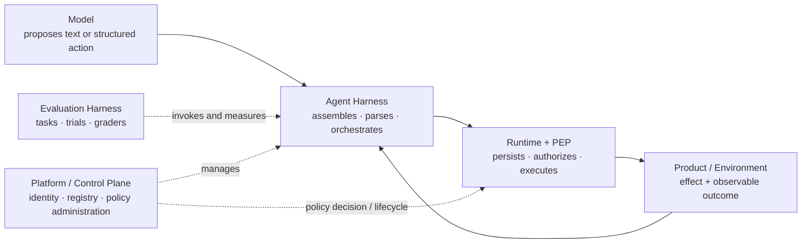

# Preface

This book examines the systems that surround a language model when the model is asked to do real work. The chapters that follow bring the agent-harness literature into one engineering narrative. Substantive factual claims cite their sources where they appear so that readers can verify both the evidence and its scope.

The field starts from a simple premise. As Vivek Trivedy of LangChain puts it: "Agent = Model + Harness. **If you're not the model, you're the harness.**" ([LangChain — The Anatomy of an Agent Harness](https://blog.langchain.com/the-anatomy-of-an-agent-harness/)). That sentence is a useful responsibility boundary, but it is deliberately coarse. This book will distinguish the model-facing *agent harness* from the durable runtime, the user-facing product, the fleet platform or control plane, and the separate evaluation harness. Anthropic uses the same narrower distinction when it defines an agent harness as the system that processes inputs and orchestrates tool calls, while an evaluation harness runs trials, records them, grades them, and aggregates results ([Anthropic — Demystifying Evals for AI Agents](https://www.anthropic.com/engineering/demystifying-evals-for-ai-agents)).

Throughout the book, think of the model as a component that consumes a current input representation and produces text or structured output. A tool call is a proposal, not an executed side effect: application code validates and runs the named tool, then returns a tool result to the model ([Anthropic — How Tool Use Works](https://platform.claude.com/docs/en/agents-and-tools/tool-use/how-tool-use-works)). This distinction between model output and real-world effect explains why later chapters devote so much attention to context, tools, state, permissions, tests, sandboxes, and evaluation.

The companion stage-1 volume covers the model behavior this book relies on: tokens, attention, the per-request KV cache, provider prompt caching, the context window, sampling, retrieval, and the model side of tool calling. It ends with a six-part boundary: the model predicts; the external system owns context selection, durable state, tool execution, permissions, verification, and consequences ([*LLM Foundations*, Chapter 14](../llm-foundations/14-operational-mental-model.md)). This volume implements those external responsibilities. It does not re-derive the model mechanics.

## Before You Start

This is the second book in a two-part sequence. It assumes you have read *[LLM Foundations for Harness Engineering](../llm-foundations/)* and are comfortable with tokens, attention, context windows, sampling, post-training, retrieval, model-generated tool calls, prompt injection, and pass@k/pass^k. When this book uses a Foundations concept, it points back to the relevant chapter instead of deriving it again. Readers who have not completed the first volume can still follow the narrative, but should treat the short recaps as pointers rather than complete explanations. Provider prices, cache lifetimes, model capabilities, and benchmark scores change; whenever they appear here, read them as dated examples rather than permanent definitions.

---

## The Core Equation

```mermaid
flowchart LR
    M["Model<br/>proposes text or structured action"] --> H["Agent Harness<br/>assembles · parses · orchestrates"]
    H --> R["Runtime + PEP<br/>persists · authorizes · executes"]
    R --> P["Product / Environment<br/>effect + observable outcome"]
    P --> H
    E["Evaluation Harness<br/>tasks · trials · graders"] -. "invokes and measures" .-> H
    C["Platform / Control Plane<br/>identity · registry · policy administration"] -. "manages" .-> H
    C -. "policy decision / lifecycle" .-> R
```

---

## Key Takeaways

- A language model call does not own durable application state, execute real tools, or enforce permissions; external software provides those capabilities.
- Harness engineering is distinct from prompt engineering: it improves the entire system, not just individual prompts.
- "Harness" is a broad responsibility shorthand; later chapters separate the agent harness, runtime, product, platform, and evaluation harness when architecture depends on the distinction.
- Time-sensitive provider and product claims are labeled as dated examples rather than definitions.
- Substantive factual claims are cited in the chapter text so readers can inspect their original scope.

## Further Reading

- Vivek Trivedy, *The Anatomy of an Agent Harness*, LangChain, Mar 2026. https://blog.langchain.com/the-anatomy-of-an-agent-harness/
- Mikaela Grace et al., *Demystifying Evals for AI Agents*, Anthropic, Jan 2026. https://www.anthropic.com/engineering/demystifying-evals-for-ai-agents
- Anthropic, *How Tool Use Works*. https://platform.claude.com/docs/en/agents-and-tools/tool-use/how-tool-use-works
- *Awesome Harness Engineering* reading list: https://github.com/walkinglabs/awesome-harness-engineering
