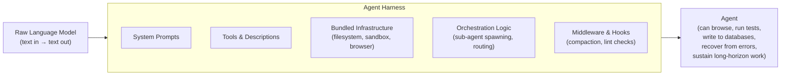

# Preface

This book examines the system that surrounds a language model when the model is asked to do real work. That system now has a name — *the harness* — and a small but rapidly maturing body of literature on how to build it. The chapters that follow bring that literature together into a single narrative. Each claim cites the relevant original article so that readers can trace any thread back to its source.

The field starts from a simple premise. As Vivek Trivedy of LangChain puts it: "Agent = Model + Harness. **If you're not the model, you're the harness.**" ([LangChain — The Anatomy of an Agent Harness](https://blog.langchain.com/the-anatomy-of-an-agent-harness/)). In this framing, everything around the model — system prompts, tools, sandboxes, memory, sub-agents, control flow, and evaluation infrastructure — belongs to the harness. This book studies how to design that surrounding system well.

Throughout the book, think of the model as a component that consumes tokens and emits tokens. Its output may be text for a user or structured text that requests an action, but surrounding software always carries out the action itself. This distinction between model output and real-world effect explains why later chapters devote so much attention to context, tools, state, tests, sandboxes, and evaluation.

The companion stage-1 volume covers the model internals this book relies on: tokens, attention and the KV-cache, the context window, sampling, retrieval, and the tool-call protocol. Here, we briefly name those concepts and build the harness-engineering layer on top of them. Most of the new material is software engineering: context, tools, state, sandboxes, and evaluation.

## Before You Start

This is the second book in a two-part sequence. It assumes you have read *[LLM Foundations for Harness Engineering](../llm-foundations/)* and are comfortable with tokens, attention and the KV-cache, the context window, sampling, post-training, retrieval, the agent loop, the tool-call protocol, prompt injection, and pass@k/pass^k. When this book uses a Foundations concept, it points back to the relevant chapter (for example, "Foundations ch 9") instead of deriving the concept again. Readers who have not completed the stage-1 material can still follow the narrative, but should treat the one-line recaps as pointers rather than complete explanations.

---

## The Core Equation

```mermaid
flowchart LR
    A["Raw Language Model<br/>(text in → text out)"] --> B["Agent Harness"]
    B --> C["Agent<br/>(can browse, run tests,<br/>write to databases,<br/>recover from errors,<br/>sustain long-horizon work)"]

    subgraph B["Agent Harness"]
        direction TB
        SP["System Prompts"]
        T["Tools & Descriptions"]
        I["Bundled Infrastructure<br/>(filesystem, sandbox, browser)"]
        O["Orchestration Logic<br/>(sub-agent spawning, routing)"]
        M["Middleware & Hooks<br/>(compaction, lint checks)"]
    end
```

---

## Key Takeaways

- A language model alone cannot maintain state, execute code, or access real-time knowledge — these are all harness-level features.
- Harness engineering is distinct from prompt engineering: it improves the entire system, not just individual prompts.
- The field is young — most canonical articles were published in 2025 and 2026 — but is maturing rapidly.
- Every claim in this textbook is cited so readers can follow threads back to primary sources.

## Further Reading

- Vivek Trivedy, *The Anatomy of an Agent Harness*, LangChain, Mar 2026. https://blog.langchain.com/the-anatomy-of-an-agent-harness/
- *Awesome Harness Engineering* reading list: https://github.com/walkinglabs/awesome-harness-engineering
