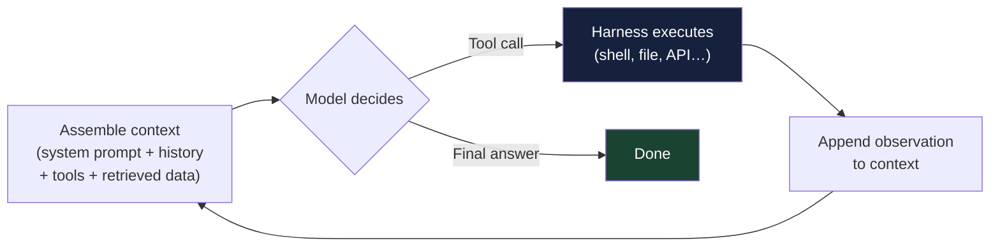
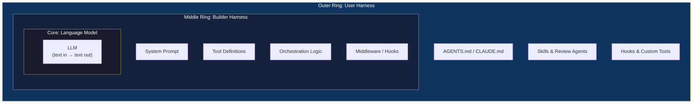

# Chapter 1: What Is an Agent Harness?

### 1.1 The Model + Harness Equation

A raw language model takes text in and produces text out. That is the entirety of its native capability. To turn that into an agent — something that can browse a codebase, run tests, write to a database, talk to a user, recover from errors, and sustain progress across hours of work — every additional capability must be built around the model. LangChain enumerates the harness as system prompts, tools and their descriptions, bundled infrastructure (filesystem, sandbox, browser), orchestration logic such as sub-agent spawning and model routing, and hooks or middleware for deterministic execution like compaction, continuation, and lint checks ([LangChain — The Anatomy of an Agent Harness](https://blog.langchain.com/the-anatomy-of-an-agent-harness/)).

This framing matters because it forces the design question into the open. Out of the box, a model cannot maintain durable state across interactions, execute code, access real-time knowledge, or set up environments and install packages to complete work; these are all harness-level features ([LangChain — The Anatomy of an Agent Harness](https://blog.langchain.com/the-anatomy-of-an-agent-harness/)). Even basic chat — the appearance of a model "remembering" what was just said — is a harness pattern: a while-loop that tracks previous messages and appends new ones to context.

HumanLayer's working definition is essentially the same equation, viewed from the perspective of someone configuring a coding agent: "coding agent = AI model(s) + harness," where the harness is the agent's runtime, or its peripherals — what the model uses to interact with its environment ([HumanLayer — Skill Issue: Harness Engineering for Coding Agents](https://www.humanlayer.dev/blog/skill-issue-harness-engineering-for-coding-agents)).

### 1.2 The Agent Loop

Before examining the harness piece by piece, it is worth seeing the cycle that every agent runs. A raw model call is one-shot — text in, text out. An *agent* wraps that call in a loop:

1. **Assemble context** — the system prompt, the conversation and event history so far, the tool definitions, and any just-retrieved data are concatenated into the model's input.
2. **The model decides** — it emits either a final answer or a *tool call*: structured output, typically JSON, naming a tool and its arguments.
3. **The harness executes** — deterministic harness code parses the tool call, runs it (a shell command, a file read, an API request), and captures the result.
4. **Append the observation** — the tool result is appended to the context as a new message.
5. **Repeat** — the loop runs again with the now-longer context, until the model returns a final answer or a stop condition is reached.

A tool call is therefore not magic and not direct agency. It is structured output produced by the model and interpreted by code; HumanLayer later makes this explicit as the principle that "tools are just structured outputs" ([HumanLayer — 12-Factor Agents](https://www.humanlayer.dev/blog/12-factor-agents)). The same is true for every apparent "action" in an agent transcript: file edits, shell commands, browser clicks, database writes, and messages to humans become real only when the harness accepts the model's request and executes it.

Anthropic calls the model at the centre of this loop the *augmented LLM* — a model equipped with retrieval, tools, and memory, able to generate its own queries, select tools, and decide what to retain ([Anthropic — Building Effective Agents](https://www.anthropic.com/engineering/building-effective-agents)). The pattern of interleaving reasoning with tool calls is often called *ReAct* (reason + act) in the research literature ([Yao et al. — ReAct](https://arxiv.org/abs/2210.03629)); whether or not the model thinks in visible text before each call, the loop structure is the same.

Two consequences of this loop shape the rest of the book. First, **context grows monotonically**: every turn appends a tool call and its observation, so an N-step task accumulates N rounds of history. This is why Chapter 2 treats context as a finite resource, and why compaction, sub-agents, and memory exist at all. Second, **the model never executes anything itself** — it only emits a request, and deterministic harness code decides what to honour. That gap between request and execution is the insertion point for every guardrail, sandbox, hook, and approval gate in the later chapters: the harness is what sits in the loop, between what the model asks for and what actually happens.

### 1.3 Bounded Contexts: Inner and Outer Harness

The word "harness" is used loosely, and writers from Thoughtworks have noted that it covers different layers depending on whom you ask. Birgitta Böckeler proposes thinking of three concentric rings: the model at the core, the coding agent's *builder harness* in the middle (the system prompt and tools shipped by Anthropic, OpenAI, etc.), and the *user harness* on the outside (the AGENTS.md, hooks, skills, and review agents the team adds to fit their codebase) ([Thoughtworks / Martin Fowler — Harness Engineering](https://martinfowler.com/articles/exploring-gen-ai/harness-engineering.html)). Most working engineers operate primarily in the outer ring.

### 1.4 Why Harnesses Exist: Working Backwards from Model Deficits

LangChain offers a useful derivation: list the agent behaviors you want, then list what models cannot natively do, and the harness components fall out as necessary remediation ([LangChain — The Anatomy of an Agent Harness](https://blog.langchain.com/the-anatomy-of-an-agent-harness/)). Filesystems exist because models can only operate on what is in the context window, and a filesystem provides durable storage, an offload surface, and a collaboration surface for multiple agents and humans. Bash and code execution exist because pre-defining every tool the agent might need is intractable, and giving the model a general-purpose execution channel lets it design its own tools on the fly. Sandboxes exist because that execution has to happen somewhere safe. Memory and search exist because models have no knowledge beyond their weights and current context, so any new information has to be injected. Compaction, tool-result offloading, and skills exist because the context window is finite and degrades as it fills.

Each piece is a response to a specific limitation, and the harness as a whole is the sum of those responses.

### 1.5 The Historical Arc: From Prompt Engineering to Harness Engineering

Anthropic frames the recent shift as a natural progression. In the early days of LLM applications, the dominant work was *prompt engineering*: writing and organizing instructions for one-shot tasks. As applications grew into multi-turn agents that operate over longer time horizons, the relevant work shifted to *context engineering* — strategies for curating and maintaining the optimal set of tokens (information) during LLM inference, including everything that lands in context outside of the prompts themselves ([Anthropic — Effective Context Engineering for AI Agents](https://www.anthropic.com/engineering/effective-context-engineering-for-ai-agents)).

Harness engineering sits one level up from context engineering. It is the practice, as Mitchell Hashimoto has put it, of taking the time to engineer a solution every time the agent makes a mistake, so that it never makes that mistake again ([HumanLayer — Skill Issue: Harness Engineering for Coding Agents](https://www.humanlayer.dev/blog/skill-issue-harness-engineering-for-coding-agents) quoting Hashimoto). Where prompt engineering tunes a single prompt, harness engineering iterates on the entire system in which prompts run.

### 1.6 Frameworks, Runtimes, and Harnesses

These three terms are sometimes used interchangeably. LangChain's Harrison Chase distinguishes them as follows ([LangChain — Agent Frameworks, Runtimes, and Harnesses, Oh My!](https://blog.langchain.com/agent-frameworks-runtimes-and-harnesses-oh-my/)):

A *framework* — like LangChain itself, Vercel's AI SDK, CrewAI, the OpenAI Agents SDK, or Google ADK — provides abstractions that make it easier to get started and standardize how applications are built. A *runtime* — like LangGraph, Temporal, or Inngest — provides infrastructure-level concerns: durable execution, streaming, human-in-the-loop support, thread-level and cross-thread persistence. A *harness* — like LangChain's DeepAgents or Anthropic's Claude Agent SDK — sits a level higher again: it ships with default prompts, opinionated tool handling, planning tools, filesystem access, and other "batteries included" features. Lines blur (LangGraph is reasonably described as both runtime and framework), but the distinction is useful when deciding what to adopt.

### 1.7 The Skeptical Counter-Position

The harness-engineering frame is not without dissent. HumanLayer's argument in "Skill Issue" is that most teams blame the model — "GPT-6 will fix it," "we just need better instruction-following" — when the actual issue is harness configuration ([HumanLayer — Skill Issue: Harness Engineering for Coding Agents](https://www.humanlayer.dev/blog/skill-issue-harness-engineering-for-coding-agents)). As models improve, existing failure modes will disappear, but smarter models will be given harder problems and continue to fail in unexpected ways, because unexpected failures are a fundamental property of non-deterministic systems. The implication is that harness engineering is permanent work, not scaffolding to be discarded once models get good enough.

LangChain reaches a similar conclusion: as models become more capable, some of what lives in the harness today will be absorbed into the model, but harness engineering will remain useful — both for patching over deficiencies and for engineering systems around model intelligence to make it more effective ([LangChain — The Anatomy of an Agent Harness](https://blog.langchain.com/the-anatomy-of-an-agent-harness/)).

---

## Diagram: Model → Harness Layers

---

## Key Takeaways

- **Agent = Model + Harness**: every capability beyond raw text I/O must be engineered into the surrounding system.
- **The agent loop is the foundation**: assemble context, the model emits a tool call, the harness executes it, the result is appended — and the cycle repeats, growing context every turn.
- **Tool calls are structured requests**: the model proposes actions in text; the harness decides which requests become real effects.
- **Three concentric layers**: the LLM core, the builder harness (shipped by the AI lab), and the user harness (built by the team).
- **Harness components derive from model deficits**: filesystem, sandbox, memory, compaction each address a specific limitation.
- **Harness engineering is permanent work**: as models improve, harder problems are tackled and new failure modes emerge.
- **Framework ≠ Runtime ≠ Harness**: understanding the distinction helps in making adoption decisions.

## Further Reading

- Vivek Trivedy, *The Anatomy of an Agent Harness*, LangChain, Mar 2026. https://blog.langchain.com/the-anatomy-of-an-agent-harness/
- Harrison Chase, *Agent Frameworks, Runtimes, and Harnesses, Oh My!*, LangChain, Oct 2025. https://blog.langchain.com/agent-frameworks-runtimes-and-harnesses-oh-my/
- Kyle Brunet, *Skill Issue: Harness Engineering for Coding Agents*, HumanLayer, Mar 2026. https://www.humanlayer.dev/blog/skill-issue-harness-engineering-for-coding-agents
- Birgitta Böckeler, *Harness Engineering for Coding Agent Users*, Thoughtworks / martinfowler.com, Apr 2026. https://martinfowler.com/articles/exploring-gen-ai/harness-engineering.html
- Anthropic Applied AI Team, *Effective Context Engineering for AI Agents*, Anthropic, Sep 2025. https://www.anthropic.com/engineering/effective-context-engineering-for-ai-agents
- Erik Schluntz and Barry Zhang, *Building Effective Agents*, Anthropic, Dec 2024. https://www.anthropic.com/engineering/building-effective-agents
