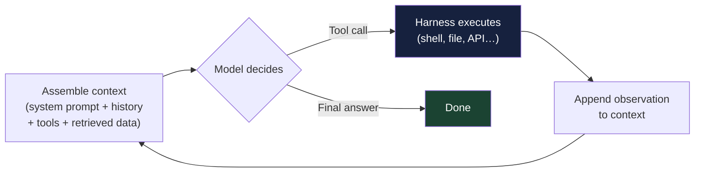
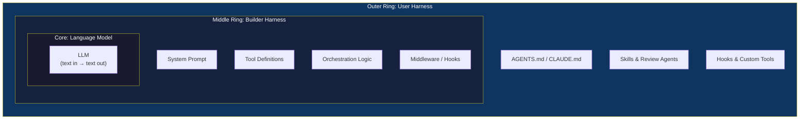

# Chapter 1: What Is an Agent Harness?

### 1.1 The Model + Harness Equation

A raw language model takes text in and produces text out. The companion volume covers its native capabilities and limitations (see Foundations ch 1). Turning that model into an agent requires building every additional capability around it: browsing a codebase, running tests, writing to a database, talking to a user, recovering from errors, and sustaining progress across hours of work. LangChain describes the resulting harness as a combination of system prompts; tools and their descriptions; bundled infrastructure such as a filesystem, sandbox, and browser; orchestration logic such as sub-agent spawning and model routing; and hooks or middleware for deterministic operations such as compaction, continuation, and lint checks ([LangChain — The Anatomy of an Agent Harness](https://blog.langchain.com/the-anatomy-of-an-agent-harness/)).

This framing makes the design problem explicit. On its own, a model cannot maintain durable state across interactions, execute code, access real-time knowledge, or set up environments and install packages. All of these are harness-level features ([LangChain — The Anatomy of an Agent Harness](https://blog.langchain.com/the-anatomy-of-an-agent-harness/)). Even basic chat relies on a harness pattern: a while-loop tracks previous messages and adds new ones to the context, creating the appearance that the model "remembers" what was just said.

HumanLayer offers essentially the same equation from the perspective of someone configuring a coding agent: "coding agent = AI model(s) + harness." It describes the harness as the agent's runtime or peripherals — the components through which the model interacts with its environment ([HumanLayer — Skill Issue: Harness Engineering for Coding Agents](https://www.humanlayer.dev/blog/skill-issue-harness-engineering-for-coding-agents)).

### 1.2 The Agent Loop

The companion volume introduces the agent loop and a key principle behind it: a tool call is structured output for the harness to execute, not a direct action taken by the model (see Foundations ch 1 and ch 12). Briefly, a raw model call is one-shot: text goes in and text comes out. An *agent* wraps that call in a loop. The harness assembles the context, and the model emits either a final answer or a *tool call* — structured output, typically JSON, that names a tool and supplies its arguments. Deterministic harness code then executes the call, appends the observation to the context, and starts the next iteration with that expanded context.

HumanLayer captures the same idea in the phrase "tools are just structured outputs" ([HumanLayer — 12-Factor Agents](https://www.humanlayer.dev/blog/12-factor-agents)). File edits, shell commands, browser clicks, and database writes become real only when the harness accepts the model's request and executes it. The model at the centre of this loop is what Anthropic calls the *augmented LLM* and what the research literature describes as *ReAct* (reason + act) (mechanics in Foundations ch 12).

Two consequences of this loop shape the rest of the book. First, **context grows monotonically**: each turn appends a tool call and its observation, so an N-step task accumulates N rounds of history. Chapter 2 therefore treats context as a finite resource; compaction, sub-agents, and memory all help manage it. Second, **the model never executes anything itself**. It emits a request, and deterministic harness code decides whether and how to honour it. The gap between request and execution is where the later chapters place guardrails, sandboxes, hooks, and approval gates. The harness occupies that gap, sitting between what the model asks for and what actually happens.

```mermaid
flowchart LR
    A["Assemble context<br/>(system prompt + history<br/>+ tools + retrieved data)"] --> B{"Model decides"}
    B -->|"Tool call"| C["Harness executes<br/>(shell, file, API…)"]
    C --> D["Append observation<br/>to context"]
    D --> A
    B -->|"Final answer"| E["Done"]

    style C fill:#16213e,color:#fff
    style E fill:#1b4332,color:#fff
```

### 1.3 Bounded Contexts: Inner and Outer Harness

The word "harness" is used loosely, and Thoughtworks writers have noted that its boundaries vary depending on whom you ask. Birgitta Böckeler proposes three concentric rings: the model at the core; the coding agent's *builder harness* in the middle, including the system prompt and tools shipped by Anthropic, OpenAI, and others; and the *user harness* on the outside, including the AGENTS.md files, hooks, skills, and review agents that a team adds for its codebase ([Thoughtworks / Martin Fowler — Harness Engineering](https://martinfowler.com/articles/exploring-gen-ai/harness-engineering.html)). Most working engineers operate primarily in this outer ring.

The OpenReview paper *Agent Harness Engineering: A Survey* defines this boundary more formally. It describes a harness as the software and interface substrate that governs how foundation models perceive context, call tools, act over time, and remain auditable in a deployment environment ([OpenReview — Agent Harness Engineering: A Survey](https://openreview.net/pdf?id=3hXEPbG0dh)). The paper treats the harness as a potential *binding constraint*: for long-horizon agents, reliability often depends as much on the surrounding substrate as on raw model quality.

### 1.4 ETCLOVG: A Seven-Layer Map

The survey organizes the harness design space using the acronym **ETCLOVG**: Execution environment, Tool interface, Context, Lifecycle, Observability, Verification, and Governance ([OpenReview — Agent Harness Engineering: A Survey](https://openreview.net/pdf?id=3hXEPbG0dh)). This map is useful because it prevents the concept of a harness from being reduced to prompts or tools alone.

- **Execution environment**: the sandbox, browser, operating system, code runner, or managed cloud where actions become real effects.
- **Tool interface**: protocols, schemas, registries, function calling, MCP/A2A-style boundaries, and tool-selection policies.
- **Context**: prompt assembly, retrieval, memory, compaction, state compression, and what the model is allowed to see.
- **Lifecycle**: task startup, planning, checkpoint/resume, failure recovery, handoff, session termination, and long-running state.
- **Observability**: traces, telemetry, cost attribution, latency, token accounting, and failure forensics.
- **Verification**: eval harnesses, graders, task suites, outcome checks, and readiness gates.
- **Governance**: permissions, policy languages, audit trails, human approval, constitutional or rule-based controls, and cross-layer security.

The chapters that follow can largely be read as a tour through these seven layers. Context and memory dominate Chapters 2-3; tools and execution appear in Chapters 4-5; lifecycle appears in Chapters 7-9; and verification, observability, and governance are developed in Chapters 10-12 and revisited in the outlook.

### 1.5 Why Harnesses Exist: Working Backwards from Model Deficits

LangChain offers a useful way to derive the components of a harness: list the agent behaviors you want, then identify what models cannot natively do. The necessary harness components follow from those gaps ([LangChain — The Anatomy of an Agent Harness](https://blog.langchain.com/the-anatomy-of-an-agent-harness/)).

For example, models can operate only on information available in the context window. A filesystem therefore provides durable storage, a place to offload information, and a shared workspace for agents and humans. Bash and code execution address a different limitation: it is impractical to define in advance every tool an agent might need, so a general-purpose execution channel allows the model to create tools as needed. Sandboxes give that execution a safe environment. Memory and search inject information that is absent from the model's weights and current context. Compaction, tool-result offloading, and skills help manage a finite context window whose performance degrades as it fills.

Each component addresses a specific limitation. The harness is the system formed by those responses.

### 1.6 The Historical Arc: From Prompt Engineering to Harness Engineering

Anthropic presents the recent shift as a natural progression. In the early days of LLM applications, the dominant practice was *prompt engineering*: writing and organizing instructions for one-shot tasks. As applications developed into multi-turn agents operating over longer time horizons, the focus expanded to *context engineering*. This means curating and maintaining the most useful set of tokens during inference, including information that enters the context outside the prompts themselves ([Anthropic — Effective Context Engineering for AI Agents](https://www.anthropic.com/engineering/effective-context-engineering-for-ai-agents)).

Harness engineering sits one level above context engineering. As Mitchell Hashimoto has put it, the practice means taking the time to engineer a solution whenever the agent makes a mistake so that it does not make the same mistake again ([HumanLayer — Skill Issue: Harness Engineering for Coding Agents](https://www.humanlayer.dev/blog/skill-issue-harness-engineering-for-coding-agents) quoting Hashimoto). Prompt engineering tunes an individual prompt; harness engineering improves the entire system in which prompts run.

A further reframing arrived in 2026 under the name *loop engineering*. As agents began to run unattended over longer horizons, the main unit of work shifted again: from the prompt, to the context, and then to the *loop* that decides what to prompt, when to prompt it, and whether the result is good enough ([Addy Osmani — Loop Engineering](https://addyosmani.com/blog/loop-engineering/)). Loop engineering is not so much a rival to harness engineering as an operator-facing view of its outer control loop: the triggers, verifiers, and stop rules that surround the agent. Chapter 8 develops this idea in full.

### 1.7 Frameworks, Runtimes, and Harnesses

These three terms are sometimes used interchangeably. LangChain's Harrison Chase distinguishes them as follows ([LangChain — Agent Frameworks, Runtimes, and Harnesses, Oh My!](https://blog.langchain.com/agent-frameworks-runtimes-and-harnesses-oh-my/)):

A *framework* — such as LangChain, Vercel's AI SDK, CrewAI, the OpenAI Agents SDK, or Google ADK — provides abstractions that help developers get started and standardize how applications are built. A *runtime* — such as LangGraph, Temporal, or Inngest — handles infrastructure concerns including durable execution, streaming, human-in-the-loop support, and thread-level and cross-thread persistence. A *harness* — such as LangChain's DeepAgents or Anthropic's Claude Agent SDK — sits one level higher. It includes default prompts, opinionated tool handling, planning tools, filesystem access, and other "batteries included" features. The boundaries are not absolute; for example, LangGraph can reasonably be described as both a runtime and a framework. Even so, the distinction is useful when deciding what to adopt.

### 1.8 Will Better Models Make Harnesses Obsolete?

One question shadows the harness-engineering frame: will better models make the surrounding system less important? HumanLayer argues in "Skill Issue" that teams often blame the model — "GPT-6 will fix it," or "we just need better instruction-following" — when the real problem is harness configuration ([HumanLayer — Skill Issue: Harness Engineering for Coding Agents](https://www.humanlayer.dev/blog/skill-issue-harness-engineering-for-coding-agents)). Better models will eliminate some current failure modes, but they will also be assigned harder problems and will continue to fail in unexpected ways. Such failures are a fundamental property of non-deterministic systems. The implication is that harness engineering is ongoing work, not temporary scaffolding to discard once models become capable enough.

LangChain reaches a similar conclusion. As models become more capable, some features that live in the harness today will be absorbed into the model. Harness engineering will nevertheless remain useful, both for addressing model deficiencies and for building systems that make model intelligence more effective ([LangChain — The Anatomy of an Agent Harness](https://blog.langchain.com/the-anatomy-of-an-agent-harness/)).

---

## Diagram: Model → Harness Layers

```mermaid
flowchart TB
    subgraph UH["Outer Ring: User Harness"]
        direction TB
        AM["AGENTS.md / CLAUDE.md"]
        SK["Skills & Review Agents"]
        HK["Hooks & Custom Tools"]

        subgraph BH["Middle Ring: Builder Harness"]
            direction TB
            SP["System Prompt"]
            TD["Tool Definitions"]
            OL["Orchestration Logic"]
            MW["Middleware / Hooks"]

            subgraph MODEL["Core: Language Model"]
                LM["LLM<br/>(text in → text out)"]
            end
        end
    end

    style MODEL fill:#1a1a2e,color:#fff
    style BH fill:#16213e,color:#fff
    style UH fill:#0f3460,color:#fff
```

---

## Key Takeaways

- **Agent = Model + Harness**: every capability beyond raw text I/O must be engineered into the surrounding system.
- **The agent loop is the foundation**: assemble context, the model emits a tool call, the harness executes it, the result is appended — and the cycle repeats, growing context every turn.
- **Tool calls are structured requests**: the model proposes actions in text; the harness decides which requests become real effects.
- **Three concentric layers**: the LLM core, the builder harness (shipped by the AI lab), and the user harness (built by the team).
- **ETCLOVG gives a systems map**: execution, tools, context, lifecycle, observability, verification, and governance are all harness layers.
- **Harness components derive from model deficits**: filesystem, sandbox, memory, compaction each address a specific limitation.
- **Harness engineering is ongoing work**: as models improve, harder problems are tackled and new failure modes emerge.
- **Framework ≠ Runtime ≠ Harness**: understanding the distinction helps teams make adoption decisions.

## Further Reading

- Vivek Trivedy, *The Anatomy of an Agent Harness*, LangChain, Mar 2026. https://blog.langchain.com/the-anatomy-of-an-agent-harness/
- Harrison Chase, *Agent Frameworks, Runtimes, and Harnesses, Oh My!*, LangChain, Oct 2025. https://blog.langchain.com/agent-frameworks-runtimes-and-harnesses-oh-my/
- Kyle Brunet, *Skill Issue: Harness Engineering for Coding Agents*, HumanLayer, Mar 2026. https://www.humanlayer.dev/blog/skill-issue-harness-engineering-for-coding-agents
- Birgitta Böckeler, *Harness Engineering for Coding Agent Users*, Thoughtworks / martinfowler.com, Apr 2026. https://martinfowler.com/articles/exploring-gen-ai/harness-engineering.html
- Anthropic Applied AI Team, *Effective Context Engineering for AI Agents*, Anthropic, Sep 2025. https://www.anthropic.com/engineering/effective-context-engineering-for-ai-agents
- Erik Schluntz and Barry Zhang, *Building Effective Agents*, Anthropic, Dec 2024. https://www.anthropic.com/engineering/building-effective-agents
- *Agent Harness Engineering: A Survey*, OpenReview / TMLR submission, 2026. https://openreview.net/pdf?id=3hXEPbG0dh
