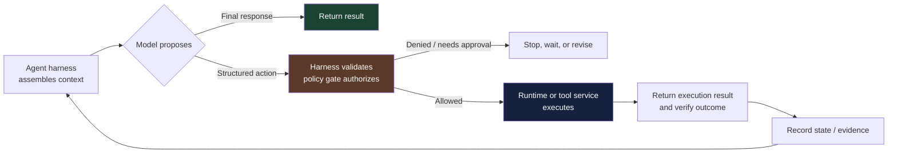

# Chapter 1: What Is an Agent Harness?

### 1.1 From a Useful Shorthand to a Precise Boundary

The companion *LLM Foundations* volume uses **harness** as a deliberately coarse shorthand for the external system around a model. At that resolution, the central equation is useful:

> **Agent behavior = model behavior + surrounding-system behavior**

A model receives the representation assembled for the current inference and generates tokens or structured output. It does not, by itself, preserve durable application state, grant permissions, run a shell command, write a database row, or verify that a requested real-world change occurred. Those responsibilities sit outside the model in the [model–system responsibility boundary](../llm-foundations/14-operational-mental-model.md).

This book needs a finer vocabulary because “everything outside the model” is too broad for designing a production system. Anthropic, for example, defines an **agent harness** (or scaffold) as the system that enables a model to act as an agent by processing inputs, orchestrating tool calls, and returning results; it separately defines the **evaluation harness** that creates and runs tests around that system ([Anthropic — Demystifying Evals for AI Agents](https://www.anthropic.com/engineering/demystifying-evals-for-ai-agents)). We adopt that distinction and add explicit runtime, product, and platform layers below.

Accordingly, this book uses **agent harness** for the model-adjacent loop controller, and **surrounding system** when a claim applies more broadly. The coarse “model + harness” equation remains a teaching aid, not a claim that one process, library, or team owns every external responsibility.

### 1.2 The Minimum Agent Loop: Proposal Is Not Effect

*LLM Foundations* introduces model-side tool use and the minimal loop ([Foundations ch 12](../llm-foundations/12-reasoning-tools-and-agents.md)). The engineering boundary is worth making explicit:

1. The agent harness **assembles context** from instructions, selected history or memory, tool schemas, retrieved data, and current state.
2. The model **proposes** a final response or a structured action such as a tool call.
3. The harness **parses and validates** that proposal, then routes it through any required authorization or approval gate.
4. A runtime or tool service **executes** an allowed action.
5. The surrounding system receives an execution result and, where consequences matter, checks the resulting environment or business outcome.
6. State is recorded and the next model input is assembled, or the run stops.

This is a contract, not a metaphor. In Anthropic's documented client-tool loop, the model emits a structured `tool_use` request, application code executes it, and a `tool_result` returns to the conversation. Provider-executed tools move the executor to provider infrastructure, but they still do not make the model itself the executor ([Anthropic — How Tool Use Works](https://platform.claude.com/docs/en/agents-and-tools/tool-use/how-tool-use-works)).

```mermaid
flowchart LR
    A["Agent harness<br/>assembles context"] --> B{"Model proposes"}
    B -->|"Final response"| F["Return result"]
    B -->|"Structured action"| C["Harness validates<br/>policy gate authorizes"]
    C -->|"Denied / needs approval"| G["Stop, wait, or revise"]
    C -->|"Allowed"| D["Runtime or tool service<br/>executes"]
    D --> E["Return execution result<br/>and verify outcome"]
    E --> H["Record state / evidence"]
    H --> A

    style C fill:#5b3a29,color:#fff
    style D fill:#16213e,color:#fff
    style F fill:#1b4332,color:#fff
```

The decisive boundary is between **proposal** and **effect**. A schema-valid request is not automatically authorized, and a successful API response is not always proof of the intended outcome. The model may explain, request, or recommend an action; it cannot grant itself authority. Later chapters turn the validation, authorization, execution, and outcome-confirmation stages into concrete designs.

### 1.3 Context Does Not Have to Grow Monotonically

In the simplest append-only implementation, each loop iteration adds the model's request and the tool result to a transcript. That transcript grows monotonically. A production harness, however, does not have to resend the entire raw transcript on every call. It may trim messages, offload artifacts, compact older material, reset a context, retrieve selected memory, or expose tools only when needed. Anthropic describes context engineering as curating the token set available during inference rather than merely accumulating conversation text ([Anthropic — Effective Context Engineering for AI Agents](https://www.anthropic.com/engineering/effective-context-engineering-for-ai-agents)).

The accurate invariant is therefore not “context always grows,” but **the run keeps producing information that must be managed**. The next context is a selected, serialized view of that information. Selection and compression can lose evidence or change behavior, so the system must preserve durable state, artifacts, provenance, and unresolved uncertainty outside the model input. Context is finite input to one call, not the system's database or event history; the underlying mechanism is covered in [Foundations ch 9](../llm-foundations/09-context-window-and-kv-cache.md).

### 1.4 Six System Layers Used in This Book

The following levels are the book's architectural convention. Real products may combine several levels in one service or split one level across vendors, but the responsibilities remain distinguishable.

| Layer | Definition in this book | Typical responsibilities |
|---|---|---|
| **Model** | The probabilistic component that consumes the current representation and generates tokens or structured output | Language and multimodal inference, action proposals, classifications, plans |
| **Agent harness** | The model-adjacent system that assembles inputs, parses outputs, and drives one or more agent loops | Prompt/context assembly, tool exposure, loop control, handoff coordination |
| **Runtime** | The execution substrate that makes work durable and runs allowed operations | Scheduling, queues, checkpoints, retry semantics, sandboxes, worker lifecycle |
| **Product / application** | The user-facing workflow and domain system in which the agent is embedded | UX, domain logic, business state, review surfaces, user communication |
| **Platform / control plane** | The management layer for many tenants, versions, agents, and runtimes | Registry, identity, policy administration and decision, rollout, fleet lifecycle |
| **Evaluation harness** | The test system that creates trials, invokes the system under test, captures evidence, and applies graders | Task environments, isolation, repeated trials, transcripts, outcomes, reports |

These are not concentric boxes in every deployment. For example, an authorization decision may come from a platform service while an enforcement point in the runtime blocks the action. Likewise, a provider-executed tool may supply part of the runtime even though the product owns the workflow.

A **framework** is different from these layers: it is a set of abstractions or libraries used to implement one or more of them. Calling something a framework says how developers build with it, not which production responsibility it owns.

### 1.5 Who Owns the Six External Responsibilities?

The Foundations volume closes with six responsibilities that must remain outside model prediction: context, state, tools, permissions, verification, and consequences. At the finer resolution used here, ownership looks like this:

| Responsibility | Primary owner in the surrounding system | Model's legitimate role |
|---|---|---|
| **Context** | Agent harness selects and serializes the model-visible view | Consume the supplied context; suggest information that may be needed |
| **State** | Runtime persists execution state; product owns domain and business state | Propose state transitions; never serve as the sole durable record |
| **Tools** | Agent harness exposes contracts; runtime or tool service executes them | Select a tool and propose arguments |
| **Permissions** | Product/platform policy decides; a non-bypassable runtime enforcement point applies the decision | Request access or explain intent; never self-grant authority |
| **Verification** | Runtime, product, and evaluation harness apply tests, environment checks, graders, or human review | Offer a critique or hypothesis as one fallible signal |
| **Consequences** | Runtime and integrated external systems produce and record effects; product owns their meaning | Predict or describe intended effects |

“Harness owns these responsibilities” is correct at the Foundations book's coarse boundary. In this book, the table prevents that shorthand from hiding which subsystem must actually implement a guarantee.

### 1.6 Agent Harness and Evaluation Harness Are Different Systems

An **agent harness** is part of the system being evaluated. An **evaluation harness** surrounds that system during a test: it provisions a task and environment, invokes the model-plus-agent-harness combination, records a trial, inspects its transcript or final environment state, applies graders, and aggregates results. Anthropic's evaluation terminology makes the same separation and notes that evaluating an “agent” evaluates the model and its agent harness together ([Anthropic — Demystifying Evals for AI Agents](https://www.anthropic.com/engineering/demystifying-evals-for-ai-agents)).

The distinction matters operationally. A production trace may supply evidence to an evaluation, but production observability is not automatically an evaluation harness. Conversely, a test runner may imitate tools and environments without being the runtime that serves users. Keeping these systems separate makes it possible to change the agent harness while holding the test infrastructure stable enough to measure the change.

### 1.7 Two Useful Maps, Neither a Universal Standard

Practitioners use several overlapping maps for the surrounding system. They answer different questions and should not be mistaken for canonical layers.

Birgitta Böckeler proposes three concentric scopes for coding agents: the model; a **builder harness** shipped by a model or agent vendor; and a **user harness** containing repository instructions, hooks, skills, and review agents added by the adopting team ([Thoughtworks / Martin Fowler — Harness Engineering](https://martinfowler.com/articles/exploring-gen-ai/harness-engineering.html)). This is an ownership and customization map. A builder harness or user harness may each contain pieces of the agent-harness, runtime, product, and evaluation layers defined above.

The 2026 manuscript *Agent Harness Engineering: A Survey* proposes **ETCLOVG** as a map of engineering concerns: Execution environment, Tool interface, Context, Lifecycle, Observability, Verification, and Governance ([OpenReview — Agent Harness Engineering: A Survey](https://openreview.net/pdf?id=3hXEPbG0dh)). We use it as a coverage checklist, not as an industry standard or a deployment architecture:

- **Execution environment**: where allowed actions become effects.
- **Tool interface**: schemas, protocols, registries, and selection policies.
- **Context**: assembly, retrieval, memory injection, and compaction.
- **Lifecycle**: startup, checkpoints, recovery, handoffs, and termination.
- **Observability**: traces, telemetry, latency, cost, and failure evidence.
- **Verification**: outcome checks, test suites, graders, and release gates.
- **Governance**: identity, permissions, approvals, policy, and audit evidence.

The six system levels answer **where a responsibility lives**. ETCLOVG asks **which concerns must be covered**. The builder/user rings ask **who supplies or customizes a component**. A single component can occupy one level, cover several concerns, and be customized by more than one party.

### 1.8 Framework, Runtime, Harness, and Product Labels

Vendor and practitioner literature does not use these labels uniformly. One LangChain taxonomy describes frameworks as developer abstractions, runtimes as durable execution infrastructure, and harnesses as more opinionated, “batteries-included” agent systems; it also acknowledges overlapping cases ([LangChain — Agent Frameworks, Runtimes, and Harnesses, Oh My!](https://blog.langchain.com/agent-frameworks-runtimes-and-harnesses-oh-my/)). That taxonomy is useful for comparing products, but it is not a protocol specification.

This book therefore classifies a component by the responsibility it performs, not by the label on its website. A library called an “agent runtime” may contain agent-harness logic. A product sold as an “agent platform” may bundle runtime, control-plane, evaluation, and application features. The six-layer vocabulary lets us discuss those functions without forcing every vendor into one box.

### 1.9 Prompt, Context, Harness, and Loop Engineering

Prompt engineering, context engineering, harness engineering, and loop engineering are best treated as complementary lenses:

- **Prompt engineering** shapes model-visible instructions and examples.
- **Context engineering** selects and maintains the information available for a particular inference; Anthropic explicitly frames it as curating the token set used during inference ([Anthropic — Effective Context Engineering for AI Agents](https://www.anthropic.com/engineering/effective-context-engineering-for-ai-agents)).
- **Harness engineering** designs the model-adjacent control and interfaces that turn proposals into governed work.
- **Loop engineering** is a practitioner term for designing repeated invocation, feedback, verification, budgets, and stop rules ([Addy Osmani — Loop Engineering](https://addyosmani.com/blog/loop-engineering/)).

These terms do not describe a mandatory historical ladder, and none replaces the others. A reliable system usually needs decisions at all four scopes.

### 1.10 Why the Boundary Persists as Models Improve

More capable models can reduce failures and absorb behavior that previously required elaborate prompting or orchestration. They do not erase the distinction between a probabilistic proposal and an authorized, recorded external effect. As long as an agent can spend money, modify data, communicate externally, or operate infrastructure, some surrounding system must still own credentials, policy enforcement, execution, durable state, verification, and recovery.

What changes is the placement and complexity of those mechanisms. A provider may execute a tool server-side; a product may move planning from explicit workflow code into the model; a runtime may make recovery transparent. The implementation boundary can move, but the responsibility boundary remains visible. That is the organizing principle for the rest of this book.

---

## Key Takeaways

- **“Model + harness” is a coarse equation**: it separates model prediction from the surrounding system, but production design needs finer layers.
- **An agent harness is model-adjacent**: it assembles inputs, interprets proposals, and drives loops; it is not automatically the whole product or platform.
- **Proposal is not effect**: validation, authorization, execution, and outcome confirmation occur outside the model.
- **Context is assembled, not inevitably appended forever**: monotonic growth describes a naive transcript, not every harness.
- **Runtime, product, platform, and evaluation harness have distinct jobs** even when one vendor bundles them.
- **Context, state, tools, permissions, verification, and consequences all have external owners**; the model contributes proposals and fallible judgments.
- **ETCLOVG and builder/user rings are useful maps, not universal standards**.
- **Better models may move implementation boundaries, but they do not assume authority over real-world consequences**.

## Further Reading

- Anthropic, *How Tool Use Works*. https://platform.claude.com/docs/en/agents-and-tools/tool-use/how-tool-use-works
- Anthropic, *Demystifying Evals for AI Agents*, Jan 2026. https://www.anthropic.com/engineering/demystifying-evals-for-ai-agents
- Anthropic, *Effective Context Engineering for AI Agents*, Sep 2025. https://www.anthropic.com/engineering/effective-context-engineering-for-ai-agents
- Erik Schluntz and Barry Zhang, *Building Effective Agents*, Anthropic, Dec 2024. https://www.anthropic.com/engineering/building-effective-agents
- Birgitta Böckeler, *Harness Engineering for Coding Agent Users*, Thoughtworks / martinfowler.com, Apr 2026. https://martinfowler.com/articles/exploring-gen-ai/harness-engineering.html
- Harrison Chase, *Agent Frameworks, Runtimes, and Harnesses, Oh My!*, LangChain, Oct 2025. https://blog.langchain.com/agent-frameworks-runtimes-and-harnesses-oh-my/
- *Agent Harness Engineering: A Survey*, OpenReview manuscript, 2026. https://openreview.net/pdf?id=3hXEPbG0dh
