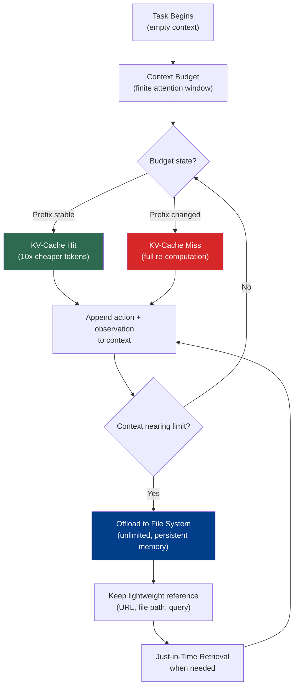

# Chapter 2: Context as a Finite Resource

### 2.1 Context Rot and the Attention Budget

The single most important operating constraint for agent harnesses is that useful context is not the same thing as maximum context length. Anthropic calls the failure mode "context rot" and links it to needle-in-a-haystack benchmarks: as the number of tokens increases, the model's ability to accurately recall information from that context can decrease ([Anthropic — Effective Context Engineering for AI Agents](https://www.anthropic.com/engineering/effective-context-engineering-for-ai-agents)). The effect varies by model, task, and where the relevant information sits in the context, so the practical claim should be read probabilistically rather than as a hard law for every prompt.

Anthropic's mechanistic explanation is not that transformers literally "run out" of attention, but that long contexts create many more pairwise token relationships for the model to represent, while training data and positional mechanisms are usually stronger on shorter and more local dependencies. Position encoding interpolation and other long-context techniques let models handle longer sequences than they were originally trained on, but can still degrade positional resolution or retrieval reliability ([Anthropic — Effective Context Engineering for AI Agents](https://www.anthropic.com/engineering/effective-context-engineering-for-ai-agents)).

The practical conclusion: context is a finite resource with diminishing marginal returns. Anthropic phrases it as an "attention budget" that every new token spends. HumanLayer puts it more bluntly: even as models support longer context windows, production builders should usually prefer small, focused prompts and contexts; in their experience, open-ended "tool-calling loops" often become hard to recover from after roughly 10–20 turns ([HumanLayer — 12-Factor Agents](https://www.humanlayer.dev/blog/12-factor-agents)).

A bigger context window helps when the missing information genuinely needs to be present, but it does not automatically buy better attention or instruction-following. As HumanLayer points out, extended-context releases often use techniques like YaRN to extend sequence length rather than increasing the model's effective instruction budget; for needle-in-a-haystack-style tasks, a bigger window can simply make the haystack bigger ([HumanLayer — Skill Issue: Harness Engineering for Coding Agents](https://www.humanlayer.dev/blog/skill-issue-harness-engineering-for-coding-agents)).

### 2.2 The Anatomy of Effective Context

Given the budget constraint, the goal — Anthropic's phrasing — is "the smallest possible set of high-signal tokens that maximize the likelihood of some desired outcome" ([Anthropic — Effective Context Engineering for AI Agents](https://www.anthropic.com/engineering/effective-context-engineering-for-ai-agents)). Concretely:

System prompts should be at the right *altitude* — neither hardcoded if-else logic for every edge case nor vague high-level guidance, but specific enough to guide behavior while leaving the model strong heuristics. Anthropic recommends organizing prompts into sections (`<background_information>`, `<instructions>`, `## Tool guidance`, etc.) using XML or Markdown delimiters, though formatting matters less as models improve.

Tools define the contract between agent and environment. They should be self-contained, clearly described, and minimally overlapping. The most common failure Anthropic sees is bloated tool sets that cover too much functionality with ambiguous decision points; "if a human engineer can't definitively say which tool should be used in a given situation, an AI agent can't be expected to do better."

Examples (few-shot) should be diverse and canonical, not a laundry list of every edge case. Anthropic's analogy: for an LLM, examples are the "pictures" worth a thousand words.

### 2.3 The KV-Cache: Why Stable Prefixes Pay Off

A practical lever that does not appear in the academic literature on context engineering but is central to production agent design is the KV-cache. Manus argues it is "the single most important metric for a production-stage AI agent" ([Manus — Context Engineering for AI Agents: Lessons from Building Manus](https://manus.im/blog/Context-Engineering-for-AI-Agents-Lessons-from-Building-Manus)).

The mechanics: a typical agent receives input, picks an action from its tool space, executes it, and appends the action and observation to context for the next turn. Context grows with every step while output stays short, making the prefilling-to-decoding ratio extremely skewed — Manus reports an average input-to-output token ratio of 100:1. Identical prefixes can be served from the KV-cache, dropping time-to-first-token and inference cost. Manus cites Claude Sonnet pricing where cached input tokens cost $0.30 per million and uncached cost $3 per million — a 10x difference.

Manus's three rules for keeping the cache hot: keep the prompt prefix stable (a single-token difference invalidates the cache from that point on, so common mistakes like timestamping system prompts to the second are costly); make context append-only, with deterministic JSON serialization (some libraries do not guarantee key ordering, which silently breaks the cache); and mark cache breakpoints explicitly when the inference framework requires it.

### 2.4 Mask, Don't Remove

Manus's second principle is about action spaces. As tool counts grow — and MCP (the Model Context Protocol — see Chapter 4) made this easy by letting users plug in hundreds of tools — the impulse is to dynamically load and unload tools mid-iteration. Manus's experiments produce a clear rule: avoid this. Tool definitions live near the front of context, so any change invalidates the cache for everything downstream; and previous turns may reference tools that no longer exist, leading to schema violations or hallucinated calls ([Manus — Context Engineering for AI Agents: Lessons from Building Manus](https://manus.im/blog/Context-Engineering-for-AI-Agents-Lessons-from-Building-Manus)).

The alternative is action masking: keep the stable tool surface in context, then constrain which actions can be selected at a given state. Depending on the provider and harness, this may be implemented with logit constraints, tool-choice controls, response prefill, or a runtime validator that rejects disallowed actions. Manus uses consistent action-name prefixes — `browser_*` for browser tools, `shell_*` for shell tools — so an entire group can be enforced or excluded with a simple constraint.

### 2.5 The File System as the Ultimate Context

Even with a 128K-token window (Manus's figure at the time; current windows are larger, but the dynamic is unchanged), real agentic work overruns context regularly. Observations from web pages and PDFs are huge; performance degrades long before the technical limit; and long inputs are expensive even with caching ([Manus — Context Engineering for AI Agents: Lessons from Building Manus](https://manus.im/blog/Context-Engineering-for-AI-Agents-Lessons-from-Building-Manus)).

Manus's solution, and one Anthropic and LangChain converge on, is to treat the filesystem as the agent's working memory: much larger than context, persistent across turns, directly operable by the agent, and indexed by paths the agent can use as references. It is not "memory" in the human sense; without good filenames, summaries, indexes, or retrieval habits, the agent can still fail to find what it wrote. Manus's compression strategies are deliberately *restorable* — a web page can be dropped from context as long as the URL is preserved, and a document's contents can be omitted if its path remains.

LangChain calls the filesystem "arguably the most foundational harness primitive" because it provides a workspace for reading data, code, and documentation; lets agents offload work incrementally instead of holding it all in context; and acts as a natural collaboration surface for multi-agent and human-agent coordination ([LangChain — The Anatomy of an Agent Harness](https://blog.langchain.com/the-anatomy-of-an-agent-harness/)). Adding git on top brings versioning, rollback, and branching.

### 2.6 Just-in-Time Retrieval

The traditional pattern — embed everything, retrieve top-k chunks, prepend to context — is being supplemented by a *just-in-time* approach. Rather than pre-processing everything up front, agents maintain lightweight identifiers (file paths, queries, links) and dynamically load data into context when needed ([Anthropic — Effective Context Engineering for AI Agents](https://www.anthropic.com/engineering/effective-context-engineering-for-ai-agents)).

Anthropic's Claude Code uses this pattern for large-codebase work: the model writes targeted queries, stores results, and uses tools such as `head` and `tail` to analyze large data without loading it all. The metadata of file paths itself is informative — `test_utils.py` in a `tests/` folder implies a different role than the same name in `src/core_logic/`. Folder hierarchies, naming, and timestamps all become signals an agent can use to navigate.

The trade-off: runtime exploration is slower than retrieving pre-computed data, and an agent without proper tool guidance will waste context chasing dead ends. The hybrid pattern is now common — provide a small amount of high-value context up front, such as project instructions in `CLAUDE.md` or `AGENTS.md`, and let the agent explore the rest on demand.

---

## Diagram: Context Budget → KV-Cache → File System as Memory

---

## Key Takeaways

- **Context rot is real enough to design around**: larger contexts can help, but they do not remove the need for curation.
- **The KV-cache is a major production metric**: stable prefixes can matter as much as model quality for latency and cost.
- **Mask tools when possible, don't churn them casually**: dynamically adding/removing tools mid-run can break cache locality and cause schema violations.
- **The filesystem is working memory, not magic memory**: it is larger and persistent, but it still needs paths, summaries, and retrieval discipline.
- **Just-in-time retrieval often beats pre-loading**: maintain lightweight identifiers and load data only when needed.

## Further Reading

- Anthropic Applied AI Team, *Effective Context Engineering for AI Agents*, Anthropic, Sep 2025. https://www.anthropic.com/engineering/effective-context-engineering-for-ai-agents
- Yichao 'Peak' Ji, *Context Engineering for AI Agents: Lessons from Building Manus*, Manus, Jul 2025. https://manus.im/blog/Context-Engineering-for-AI-Agents-Lessons-from-Building-Manus
- Dex Horthy, *12-Factor Agents*, HumanLayer, Apr 2025. https://www.humanlayer.dev/blog/12-factor-agents
- Kyle Brunet, *Skill Issue: Harness Engineering for Coding Agents*, HumanLayer, Mar 2026. https://www.humanlayer.dev/blog/skill-issue-harness-engineering-for-coding-agents
- Vivek Trivedy, *The Anatomy of an Agent Harness*, LangChain, Mar 2026. https://blog.langchain.com/the-anatomy-of-an-agent-harness/
