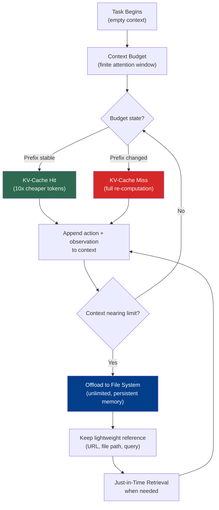

# Chapter 2: Context as a Finite Resource

### 2.1 Context Rot and the Attention Budget

The most important operating constraint for an agent harness is that useful context is not the same as the largest context a model can accept. The underlying failure mode is *context rot*: model output can degrade as the input grows. The companion volume introduces a two-layer model of this effect—degradation from length itself, compounded by the accumulation of irrelevant material (see Foundations ch 9). Here, context rot serves as the chapter's governing design constraint. Anthropic connects the same failure mode to needle-in-a-haystack benchmarks: as a context contains more tokens, the model may become less accurate at recalling information from it ([Anthropic — Effective Context Engineering for AI Agents](https://www.anthropic.com/engineering/effective-context-engineering-for-ai-agents)). The effect varies by model, task, and the position of the relevant information, so treat it as a probabilistic tendency rather than a hard law for every prompt.

Anthropic's mechanistic explanation is not that transformers literally "run out" of attention. Rather, long contexts create many more pairwise token relationships for the model to represent, while training data and positional mechanisms are typically stronger at shorter, more local dependencies. Position-encoding interpolation and other long-context techniques let models process sequences longer than those seen during training, but they can still reduce positional resolution or retrieval reliability ([Anthropic — Effective Context Engineering for AI Agents](https://www.anthropic.com/engineering/effective-context-engineering-for-ai-agents)).

The practical conclusion is that context is a finite resource with diminishing marginal returns. Anthropic describes it as an "attention budget" that every additional token consumes. HumanLayer puts the point more bluntly: even as models support longer context windows, production systems should usually favor small, focused prompts and contexts. In its experience, open-ended "tool-calling loops" often become difficult to recover after roughly 10–20 turns ([HumanLayer — 12-Factor Agents](https://www.humanlayer.dev/blog/12-factor-agents)).

A larger context window helps when the model genuinely needs access to more information, but it does not automatically improve attention or instruction-following. As HumanLayer notes, extended-context releases often use techniques such as YaRN to increase sequence length rather than the model's effective instruction budget. For needle-in-a-haystack tasks, a larger window can simply create a larger haystack ([HumanLayer — Skill Issue: Harness Engineering for Coding Agents](https://www.humanlayer.dev/blog/skill-issue-harness-engineering-for-coding-agents)).

### 2.2 The Anatomy of Effective Context

Given this budget constraint, the goal, in Anthropic's words, is "the smallest possible set of high-signal tokens that maximize the likelihood of some desired outcome" ([Anthropic — Effective Context Engineering for AI Agents](https://www.anthropic.com/engineering/effective-context-engineering-for-ai-agents)). In practice, that goal applies to several parts of the harness:

System prompts should operate at the right *altitude*. They should avoid both hardcoded if-else logic for every edge case and vague, high-level advice. Instead, they should be specific enough to guide behavior while leaving the model room to apply strong heuristics. Anthropic recommends organizing prompts into sections (`<background_information>`, `<instructions>`, `## Tool guidance`, etc.) with XML or Markdown delimiters, although formatting becomes less important as models improve.

Tools define the contract between the agent and its environment. Each tool should be self-contained and clearly described, with as little overlap as possible. The most common failure Anthropic sees is a bloated tool set that covers too much functionality and creates ambiguous decision points: "if a human engineer can't definitively say which tool should be used in a given situation, an AI agent can't be expected to do better."

Few-shot examples should be diverse and canonical, not a catalog of every edge case. Anthropic's analogy is that, for an LLM, examples are the "pictures" worth a thousand words.

### 2.3 The KV-Cache: Why Stable Prefixes Pay Off

The companion volume explains the KV-cache and the prefix-stability rule: change an early token, such as a timestamp in the system prompt, and every token after that point must be recomputed (see Foundations ch 9). Here, the focus is on the cache as a production cost lever. Although it receives little attention in the academic literature on context engineering, the KV-cache is central to production agent design. Manus argues that its hit rate is "the single most important metric for a production-stage AI agent" ([Manus — Context Engineering for AI Agents: Lessons from Building Manus](https://manus.im/blog/Context-Engineering-for-AI-Agents-Lessons-from-Building-Manus)).

The cache dominates the cost model because of how a typical agent loop works. The agent receives input, selects and executes an action from its tool space, then appends the action and observation to the context for the next turn. The context grows at every step while the output remains short, producing a highly skewed prefill-to-decoding ratio; Manus reports an average input-to-output token ratio of 100:1. When the prefix is unchanged, the KV-cache can serve it again, reducing both time-to-first-token and inference cost. Manus cites Claude Sonnet pricing in which cached input tokens cost $0.30 per million, compared with $3 per million for uncached input—a 10x difference.

Manus offers three rules for keeping the cache hot. First, keep the prompt prefix stable: a one-token difference invalidates the cache from that point onward, so seemingly minor changes such as adding a timestamp with second-level precision to the system prompt are costly. Second, make the context append-only and use deterministic JSON serialization; some libraries do not guarantee key ordering, which can silently break the cache. Third, mark cache breakpoints explicitly when the inference framework requires them.

### 2.4 Mask, Don't Remove

Manus's second principle concerns the action space. As the number of tools grows—and MCP (the Model Context Protocol; see Chapter 4) makes it easy to connect hundreds of them—it is tempting to load and unload tools dynamically during an agent loop. Manus's experiments suggest a clear rule: avoid doing so. Tool definitions appear near the beginning of the context, so changing them invalidates the cache for everything that follows. Earlier turns may also refer to tools that are no longer available, causing schema violations or hallucinated calls ([Manus — Context Engineering for AI Agents: Lessons from Building Manus](https://manus.im/blog/Context-Engineering-for-AI-Agents-Lessons-from-Building-Manus)).

The alternative is action masking: keep a stable tool surface in the context, but constrain which actions the agent may select in a given state. Depending on the provider and harness, the implementation may use logit constraints, tool-choice controls, response prefill, or a runtime validator that rejects disallowed actions ([Manus — Context Engineering for AI Agents: Lessons from Building Manus](https://manus.im/blog/Context-Engineering-for-AI-Agents-Lessons-from-Building-Manus)). Manus gives related actions consistent name prefixes—`browser_*` for browser tools and `shell_*` for shell tools—so a simple constraint can allow or exclude an entire group.

### 2.5 The File System as the Ultimate Context

Even with a 128K-token window (Manus's figure at the time; current windows are larger, but the underlying dynamic is unchanged), real agentic work regularly exceeds the available context. Web pages and PDFs can produce enormous observations, performance may degrade well before the technical limit, and long inputs remain expensive even when cached ([Manus — Context Engineering for AI Agents: Lessons from Building Manus](https://manus.im/blog/Context-Engineering-for-AI-Agents-Lessons-from-Building-Manus)).

The solution proposed by Manus, and echoed by Anthropic and LangChain, is to use the filesystem as the agent's working memory. It is far larger than the context window, persists across turns, can be manipulated directly by the agent, and gives stored artifacts paths that the agent can reference. However, it is not "memory" in the human sense. Without clear filenames, summaries, indexes, and sound retrieval habits, an agent can still fail to find what it wrote. Manus therefore favors compression strategies that are deliberately *restorable*: a web page can leave the context if its URL remains, and a document's contents can be omitted if the agent retains its path.

LangChain calls the filesystem "arguably the most foundational harness primitive." It provides a workspace for data, code, and documentation; lets agents offload work incrementally instead of keeping everything in context; and creates a natural collaboration surface for coordination among agents and humans ([LangChain — The Anatomy of an Agent Harness](https://blog.langchain.com/the-anatomy-of-an-agent-harness/)). Adding git provides versioning, rollback, and branching.

For coding agents, this principle becomes stronger: the repository should be the system of record. OpenAI's Codex harness guidance argues that successful agent-first repositories keep the context an agent needs close to the code. An `AGENTS.md` file directs the agent to the right places, short design documents explain the local architecture, and structural checks encode the rules that matter ([OpenAI — Harness Engineering](https://openai.com/index/harness-engineering/)). A decision that exists only in Slack, a ticket, or a senior engineer's memory is not reliable context for a fresh agent session.

This does not mean putting more text into the prompt. It means making repository facts discoverable. One useful cold-start test is to open a new agent session without an oral briefing and ask five questions: What is this system? How is it organized? How do I run it? How do I verify it? What is its current state? If repository files and standard commands cannot supply the answers, the harness has a knowledge-visibility gap. Closing that gap usually requires small documents near the code, stable entry points, progress files, and verification commands—not one enormous root instruction file.

### 2.6 Just-in-Time Retrieval

The traditional pattern—embed everything, retrieve the top-k chunks, and prepend them to the context (the RAG pipeline; see Foundations ch 11)—is increasingly supplemented by a *just-in-time* approach. Instead of pre-processing everything in advance, agents retain lightweight identifiers such as file paths, queries, and links, then load the underlying data into context when needed ([Anthropic — Effective Context Engineering for AI Agents](https://www.anthropic.com/engineering/effective-context-engineering-for-ai-agents)).

Anthropic's Claude Code uses this pattern when working with large codebases. The model writes targeted queries, stores their results, and uses tools such as `head` and `tail` to inspect large datasets without loading them in full. File-path metadata is informative in its own right: `test_utils.py` in a `tests/` folder suggests a different role from a file with the same name in `src/core_logic/`. Folder hierarchies, names, and timestamps all become navigation signals.

The trade-off is that runtime exploration is slower than retrieving precomputed data, and an agent without clear tool guidance can waste context on dead ends. A hybrid pattern is therefore common: provide a small amount of high-value context up front, such as project instructions in `CLAUDE.md` or `AGENTS.md`, and let the agent explore everything else on demand.

---

## Diagram: Context Budget → KV-Cache → File System as Memory

```mermaid
flowchart TD
    A["Task Begins<br/>(empty context)"] --> B["Context Budget<br/>(finite attention window)"]
    B --> C{Budget state?}
    C -->|"Prefix stable"| D["KV-Cache Hit<br/>(10x cheaper tokens)"]
    C -->|"Prefix changed"| E["KV-Cache Miss<br/>(full re-computation)"]
    D --> F["Append action + observation<br/>to context"]
    E --> F
    F --> G{Context nearing limit?}
    G -->|No| C
    G -->|Yes| H["Offload to File System<br/>(unlimited, persistent memory)"]
    H --> I["Keep lightweight reference<br/>(URL, file path, query)"]
    I --> J["Just-in-Time Retrieval<br/>when needed"]
    J --> F

    style D fill:#2d6a4f,color:#fff
    style E fill:#d62828,color:#fff
    style H fill:#023e8a,color:#fff
```

---

## Key Takeaways

- **Context rot is real enough to design around**: larger contexts can help, but they do not remove the need for curation.
- **The KV-cache is a major production metric**: stable prefixes can matter as much as model quality for latency and cost.
- **Mask tools when possible, don't churn them casually**: dynamically adding/removing tools mid-run can break cache locality and cause schema violations.
- **The filesystem is working memory, not magic memory**: it is larger and persistent, but it still needs paths, summaries, and retrieval discipline.
- **The repository is the agent's system of record**: critical project facts need to be discoverable from repo files and commands during a cold start.
- **Just-in-time retrieval often beats pre-loading**: maintain lightweight identifiers and load data only when needed.

## Further Reading

- Anthropic Applied AI Team, *Effective Context Engineering for AI Agents*, Anthropic, Sep 2025. https://www.anthropic.com/engineering/effective-context-engineering-for-ai-agents
- Yichao 'Peak' Ji, *Context Engineering for AI Agents: Lessons from Building Manus*, Manus, Jul 2025. https://manus.im/blog/Context-Engineering-for-AI-Agents-Lessons-from-Building-Manus
- Dex Horthy, *12-Factor Agents*, HumanLayer, Apr 2025. https://www.humanlayer.dev/blog/12-factor-agents
- Kyle Brunet, *Skill Issue: Harness Engineering for Coding Agents*, HumanLayer, Mar 2026. https://www.humanlayer.dev/blog/skill-issue-harness-engineering-for-coding-agents
- Vivek Trivedy, *The Anatomy of an Agent Harness*, LangChain, Mar 2026. https://blog.langchain.com/the-anatomy-of-an-agent-harness/
- OpenAI, *Harness Engineering: Leveraging Codex in an Agent-First World*, Feb 2026. https://openai.com/index/harness-engineering/
