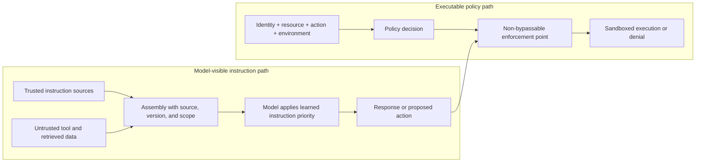

# Chapter 2: System Prompts, Instructions, and Policy Boundaries

The *LLM Foundations* volume established two facts that this chapter turns into engineering practice. First, role markers, delimiters, and instructions are serialized into model input; post-training can make the model respond differently to them, but does not turn them into infallible control channels. Second, a model can propose an action but cannot grant itself permission or produce the external effect ([Foundations, Chapter 8](../llm-foundations/08-prompting-and-in-context-learning.md), [Foundations, Chapter 14](../llm-foundations/14-operational-mental-model.md)).

The instruction layer therefore has an important but bounded job: shape model behavior. It is not the place where hard authorization is enforced. This chapter explains how to compose, version, cache, and evaluate model-visible instructions while keeping executable policy in the harness and runtime.

### 2.1 Instructions Are Model Input, Not Executable Policy

An agent's system prompt is not merely the question typed into a chat box. It is a maintained, model-facing artifact that may define the agent's role, objectives, tool-use guidance, response contract, and rules for handling uncertainty. HumanLayer's phrase *own your prompts* captures the operational lesson: do not let important behavior disappear inside unversioned framework defaults ([HumanLayer — 12-Factor Agents](https://www.humanlayer.dev/blog/12-factor-agents)).

Calling the prompt “application code” is useful as an ownership metaphor, but it must not erase a crucial difference. Code in the runtime executes deterministic checks. Prompt text conditions a probabilistic model. A sentence such as “never send data outside this tenant” can reduce unsafe proposals, but it cannot inspect credentials, block network egress, or make a dispatch path non-bypassable. Those controls belong outside the model.

The prompt is not persistent state inside the model either. The harness selects and assembles instructions for a call, the provider serializes the applicable roles and content, and the model conditions its next output on that representation. Later calls see an instruction only if the surrounding system supplies it again.

### 2.2 Instruction Priority Is a Behavioral Defense

Agents receive content from several sources: platform or system instructions, developer and project instructions, user requests, examples, tool results, and retrieved documents. Providers can train models to follow an intended priority among these sources. *The Instruction Hierarchy* formalizes this as a training objective: higher-priority instructions should dominate conflicting lower-priority text ([Wallace et al. — The Instruction Hierarchy](https://arxiv.org/abs/2404.13208)).

That is a behavioral defense, not a hard boundary. Role names and exact priority orders are provider-specific, and even models trained for hierarchy following can fail under conflict. IHEval found substantial degradation when instructions at different priority levels conflicted, which is evidence against treating placement as an enforcement guarantee ([IHEval: Evaluating Language Models on Following the Instruction Hierarchy](https://arxiv.org/abs/2502.08745)).

Three concepts should remain separate:

- **Instruction priority** is the behavior the model is intended to exhibit when model-visible texts conflict.
- **Source trust** is the harness's classification of who supplied a segment and what that source is allowed to influence.
- **Authorization** is an executable decision about whether a particular identity may perform a particular action on a resource.

Placing trusted instructions in the provider's higher-priority role can improve compliance. It does not give the model authority. Conversely, content returned by a tool or retrieved from a document should be classified as untrusted data even when it contains imperative language. Headings, XML tags, quoted blocks, and phrases such as “treat this as data” can reduce ordinary ambiguity, but they do not isolate that content like a parser or access-control boundary ([Foundations, Chapter 8](../llm-foundations/08-prompting-and-in-context-learning.md)).

Prompt injection exploits this residual ambiguity. Hierarchy training and explicit data labeling can lower the chance that the model follows injected text; the executable controls in the next section limit consequences when the behavioral defense fails.

### 2.3 Model-Visible Policy and Executable Policy

Production systems normally need both kinds of policy, but they serve different purposes:

| Model-visible policy | Executable policy |
|---|---|
| Describes desired behavior and decision criteria | Computes and enforces allow, deny, redact, constrain, or require-approval decisions |
| Helps the model choose a tool, abstain, ask a question, or propose escalation | Controls tool availability, arguments, credentials, files, network destinations, budgets, and side effects |
| Can be followed imperfectly | Must sit on a non-bypassable dispatch path for the guarantee it claims |
| Is evaluated as model behavior | Is tested as software and security policy |

For example, the instruction “ask before sending an email” is useful model-visible guidance. The hard guarantee is a runtime gate that intercepts every email dispatch, checks identity and policy, and requires a valid approval record when the action is in scope. A model-generated statement that approval exists is not proof of approval. The same separation applies to file deletion, purchases, credential use, data export, and access to tenant-scoped retrieval.

[Chapter 7](./07-sandboxing-runtime-enforcement.md) develops sandboxing and policy enforcement points, [Chapter 14](./14-human-agent-interaction.md) distinguishes consultation from mandatory approval, and [Chapter 19](./19-agent-fleets-control-plane.md) covers policy administration and distributed enforcement. The responsibility boundary is the same one summarized in Foundations: the model proposes; the surrounding system authorizes, validates, executes, and owns the consequences ([Foundations, Chapter 14](../llm-foundations/14-operational-mental-model.md)).

### 2.4 Put Each Kind of Information in the Right Place

Not every relevant fact belongs in a system message. Overloading the instruction prefix consumes the finite context budget described in [Chapter 3](./03-context-as-finite-resource.md), makes conflicts harder to diagnose, and increases the blast radius of every edit. A useful division of responsibility is:

- **System or developer instructions:** durable role, objectives, high-value behavioral rules, cross-tool guidance, and response contracts. Use the highest applicable provider role, but do not infer a security guarantee from that placement.
- **Tool descriptions and schemas:** what each tool does, its parameters, and the result contract. The complete invocation and enforcement path belongs to [Chapter 6](./06-tools-invocation-lifecycle.md).
- **Retrieved context:** current, large, tenant-scoped, or task-specific evidence. Preserve source and access-control metadata, and treat the returned content as untrusted input; [Chapter 4](./04-production-retrieval-grounding.md) covers the production data path.
- **Executable policy:** identity, resource permissions, argument constraints, approval requirements, sandbox limits, and egress rules enforced outside the model.

Duplicating the same rule across all four locations creates sources of truth that can drift. Prefer one canonical executable policy for hard controls, then derive concise model-visible guidance and human-facing explanations from the same policy reference where practical.

### 2.5 Dynamic Assembly Needs Provenance

Most production agents do not use one fixed prompt string. The harness assembles an ordered set of segments: provider or builder instructions, application policy guidance, project instructions, task-scoped skills, retrieved evidence, the user request, and prior observations. Dynamic assembly is safer to debug when the system records an assembly manifest outside the model context.

For each segment, the manifest should identify at least:

- a stable segment ID and content version or hash;
- source and owner;
- scope, such as global, tenant, repository, directory, task, or turn;
- applicable model and instruction role;
- creation or retrieval time when freshness matters; and
- the policy, artifact, or retrieval record from which the segment was derived.

The manifest supports questions that raw prompt text cannot answer reliably: Which version was active? Why was this segment in scope? Which source won a conflict? Was tenant-specific content mixed into another tenant's call? It also lets traces refer to instruction versions without copying secrets or personal data into every observability record.

Assembly should reject or surface ambiguous conflicts rather than silently depend on accidental string order. A narrower scope may refine a broad convention, but it must not override a higher-trust restriction unless the executable policy explicitly permits that relationship. Timestamps and request IDs should normally remain in the manifest or a volatile suffix; placing them near the beginning destroys a reusable prefix without adding authority.

### 2.6 Stable Prefixes and Provider Prompt Caches

Instruction layout can affect cost and latency when a provider offers cross-request prompt caching. This is a **provider prompt cache**, distinct from the per-request KV cache used during one generation. Providers expose different eligibility rules, cache breakpoints, retention periods, data controls, and prices, so those properties must be checked against the current API contract rather than stated as universal facts ([OpenAI — Prompt Caching](https://developers.openai.com/api/docs/guides/prompt-caching), [Anthropic — Prompt Caching](https://platform.claude.com/docs/en/build-with-claude/prompt-caching)).

Where reuse depends on matching a prefix, place stable, reusable material before volatile content. Base instructions and stable examples may belong near the front; the current task, fresh retrieval, request-specific identifiers, and timestamps belong later. Tool catalogs require an explicit strategy: a stable full catalog, deferred loading or tool search, and a stable meta-tool surface have different cache, context, and authorization tradeoffs, discussed in Chapters [3](./03-context-as-finite-resource.md) and [6](./06-tools-invocation-lifecycle.md).

Cacheability is not correctness. A byte-identical prefix can still contain stale or conflicting policy. Version changes that affect behavior should intentionally invalidate the relevant cached prefix, and cache telemetry should be interpreted using the provider's documented semantics.

### 2.7 Treat Instructions as Versioned, Evaluated Artifacts

Changing an instruction can change tool selection, refusal behavior, output structure, latency, and cost. Prompt changes therefore need an owner, version control, review, and evaluation against representative tasks. Compare outcomes and failure categories, not just whether the new wording looks clearer. [Chapter 11](./11-evaluation.md) defines trials and graders; [Chapter 17](./17-trace-driven-iteration.md) shows how traces help locate the segment or interaction that contributed to a failure.

The evaluated unit is the full configuration, not the prompt in isolation: instruction version, model and provider settings, tool schemas, retrieval configuration, and executable policy all interact. A prompt tuned for one model may regress on another. Store the configuration identity with each trial and production trace, while applying appropriate access control and redaction to sensitive prompt content.

### 2.8 Choose the Right Altitude and Verifiable Outputs

Anthropic describes instruction design as choosing the *right altitude*. Instructions that are too low-level become a growing list of brittle special cases; instructions that are too abstract provide little signal for action ([Anthropic — Effective Context Engineering for AI Agents](https://www.anthropic.com/engineering/effective-context-engineering-for-ai-agents)). The useful middle specifies objectives, constraints, decision criteria, and observable completion conditions while leaving room for the model to handle variation.

When a failure appears in a trace, another sentence is only one possible fix. The better intervention may be a clearer tool schema, a deterministic validator, different retrieved evidence, a sandbox rule, or a new eval case. Move stable invariants into executable checks whenever they can be expressed deterministically.

Output contracts should request artifacts that humans and software can inspect: a plan, current status, concise rationale, cited evidence, proposed tool arguments, test results, or a structured uncertainty field. Do not make access to hidden chain-of-thought a correctness or audit requirement. Visible reasoning is generated text and is not proof that the answer is correct or a faithful account of private model computation; verify claims and outcomes independently ([Foundations, Chapter 8](../llm-foundations/08-prompting-and-in-context-learning.md)).

### 2.9 Layered and Scoped Instructions

Coding agents often combine builder instructions supplied by the agent product, organization or project instructions such as `AGENTS.md`, directory-scoped conventions, and task-specific skills. These layers form the model-visible instruction set, but their names do not by themselves establish trust. The harness should resolve scope and provenance before assembly, then measure whether the resulting configuration improves outcomes.

Scoped review rules are a useful example. A high-signal rule names a concrete defect, states where it applies, and explains how to recognize it—“flag a new endpoint that bypasses `authorize()`” rather than “follow security best practices.” Directory-level rules can keep guidance close to the code it governs, while linters and tests enforce deterministic invariants ([OpenAI — Custom Code Review Rules for Codex](https://developers.openai.com/blog/custom-code-review-rules-for-codex)). More instruction text is not automatically better: overlapping rules consume context, create conflicts, and can increase false positives.

---

## Diagram: Behavioral Guidance and Executable Enforcement

*The upper path shapes probabilistic behavior. The lower path enforces what may actually happen. Labels and priority help the first path; only the second can provide an execution guarantee.*

---

## Key Takeaways

- **Instruction priority is behavioral, not authoritative:** trained role priority and delimiters reduce confusion but do not grant permission or enforce policy.
- **Separate guidance from guarantees:** model-visible policy shapes proposals; executable policy authorizes and constrains dispatch.
- **Record assembly provenance:** version, source, scope, tenant, and policy references make dynamic prompts debuggable and auditable without exposing hidden reasoning.
- **Name the right cache:** cross-request reuse is a provider prompt-cache contract, not the per-request KV cache; matching, retention, and billing are provider-specific.
- **Version and evaluate the full configuration:** prompts interact with models, tools, retrieval, and runtime policy.
- **Ask for verifiable outputs:** plans, rationale, evidence, actions, and results are useful interfaces; hidden chain-of-thought is not a security or audit primitive.

## Further Reading

- Eric Wallace et al., *The Instruction Hierarchy: Training LLMs to Prioritize Privileged Instructions*, OpenAI, Apr 2024. https://arxiv.org/abs/2404.13208
- Zhihan Zhang et al., *IHEval: Evaluating Language Models on Following the Instruction Hierarchy*, 2025. https://arxiv.org/abs/2502.08745
- OpenAI, *Prompt Caching*. https://developers.openai.com/api/docs/guides/prompt-caching
- Anthropic, *Prompt Caching*. https://platform.claude.com/docs/en/build-with-claude/prompt-caching
- Anthropic Applied AI Team, *Effective Context Engineering for AI Agents*, Sep 2025. https://www.anthropic.com/engineering/effective-context-engineering-for-ai-agents
- Dex Horthy, *12-Factor Agents*, HumanLayer, Apr 2025. https://www.humanlayer.dev/blog/12-factor-agents
- OpenAI, *Custom Code Review Rules for Codex*, Jul 2026. https://developers.openai.com/blog/custom-code-review-rules-for-codex
