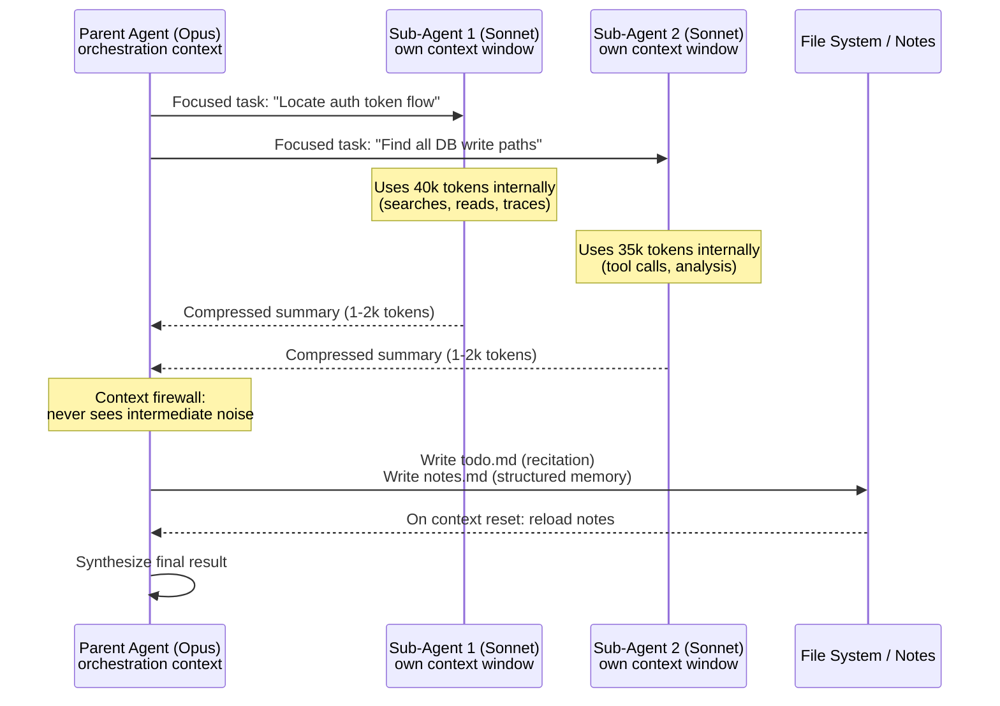

# Chapter 3: Compaction, Memory, and the Sub-Agent Pattern

Even with disciplined context engineering, long-horizon tasks exceed any single context window. The literature converges on three techniques.

### 3.1 Compaction

Compaction takes a conversation nearing the context window limit, summarizes it, and reinitiates a new context window with the summary ([Anthropic — Effective Context Engineering for AI Agents](https://www.anthropic.com/engineering/effective-context-engineering-for-ai-agents)). In Claude Code, the message history is passed to the model with instructions to preserve architectural decisions, unresolved bugs, and implementation details while discarding redundant tool outputs. The agent continues with the compressed context plus the most recently accessed files.

Anthropic's advice on compaction prompts: tune them on real complex traces, maximize recall first to ensure all relevant information is captured, then iterate on precision to remove the superfluous. The lightest-touch form is tool-result clearing — once a tool has been called and the result acted on, the raw result can usually be discarded.

The important caveat is that compaction is lossy. It is best for preserving decisions, goals, constraints, and pointers to artifacts, not for preserving every detail of a long debugging trace. A good harness therefore combines compaction with restorable references: commit hashes, file paths, issue IDs, URLs, and short notes that let a later agent reload primary evidence when the summary is too thin.

### 3.2 Structured Note-Taking

The complementary pattern is *agentic memory*: having the agent regularly write notes to disk that can be reloaded later. Anthropic offers Claude playing Pokémon as a clean example — across thousands of game steps, the agent maintains tallies ("for the last 1,234 steps I've been training my Pokémon in Route 1, Pikachu has gained 8 levels toward the target of 10"), develops maps of regions, and tracks combat strategies, allowing it to resume multi-hour training sequences after context resets ([Anthropic — Effective Context Engineering for AI Agents](https://www.anthropic.com/engineering/effective-context-engineering-for-ai-agents)).

Manus's todo.md trick is a specialized form of this — but with a twist explored in the next section.

### 3.3 Recitation: Manipulating Attention Through the End of Context

Manus reports that when its agent handles complex tasks, it creates a `todo.md` file and rewrites it step-by-step as the task progresses, checking off completed items. This is not just for organization. A typical Manus task takes ~50 tool calls on average; in long contexts the model is vulnerable to drifting off-topic or forgetting earlier goals. By repeatedly rewriting the todo list, the agent recites its objectives into the *end* of the context, pushing the global plan into the model's recent attention span and avoiding the well-known "lost-in-the-middle" problem ([Manus — Context Engineering for AI Agents: Lessons from Building Manus](https://manus.im/blog/Context-Engineering-for-AI-Agents-Lessons-from-Building-Manus)).

### 3.4 Sub-Agents and the Context Firewall

The third pattern, and the most architecturally consequential, is sub-agent decomposition. A specialized sub-agent handles a focused task with its own context window, may use tens of thousands of tokens internally, and returns only a condensed 1,000–2,000 token summary to the parent ([Anthropic — Effective Context Engineering for AI Agents](https://www.anthropic.com/engineering/effective-context-engineering-for-ai-agents)). HumanLayer calls this the *context firewall*: the parent thread, responsible for orchestration, never sees the intermediate noise from sub-agent work and stays out of the "dumb zone" for far longer ([HumanLayer — Skill Issue: Harness Engineering for Coding Agents](https://www.humanlayer.dev/blog/skill-issue-harness-engineering-for-coding-agents)).

HumanLayer is emphatic about what does and does not work here. Setting up "frontend engineer" and "backend engineer" personas as sub-agents does not work; using sub-agents for context control does. Good sub-agent use cases are tasks with a simple final answer but many intermediate tool calls — locating a definition in the codebase, tracing information flow across services, running broad research.

Sub-agents also help with cost control: HumanLayer uses an expensive model (Opus) for the orchestrator and a cheaper model (Sonnet or Haiku) for sub-agents. There is no need to burn Opus tokens on a `grep`.

Anthropic's multi-agent research system is the canonical example of this pattern at scale. A lead agent analyzes the query and spawns specialized sub-agents to explore aspects in parallel; each sub-agent uses its own context window; results are compressed back to the lead, which synthesizes a final report. The lead-agent-as-Opus, sub-agents-as-Sonnet configuration outperformed single-agent Opus by 90.2% on Anthropic's internal research evaluation ([Anthropic — How We Built Our Multi-Agent Research System](https://www.anthropic.com/engineering/multi-agent-research-system)). The mechanism is largely token economics: in their analysis, three factors explained 95% of performance variance on the BrowseComp benchmark, with token usage alone explaining 80%.

The catch is cost. Multi-agent systems use roughly 15× more tokens than chats and 4× more than single-agent runs in Anthropic's data, so they only make economic sense for high-value tasks where parallelization actually helps. They are a poor fit for tightly coupled subtasks that share mutable state — many implementation-heavy coding tasks fall into this category — but they can still help coding workflows when the delegated work is read-only, investigative, or cleanly separated by ownership boundary. Current models are also not strong at real-time coordination across agents, so the coordinator must keep task boundaries explicit.

### 3.5 Don't Few-Shot Yourself Into a Rut

Manus offers a counter-intuitive principle: too much consistency in the context can be harmful. Models are excellent mimics — they imitate patterns in context. If the trace is full of similar past action-observation pairs, the model will follow that pattern even when it is no longer optimal, leading to drift, overgeneralization, and hallucination. Manus's example is reviewing a batch of 20 résumés, where the agent falls into a rhythm and starts repeating actions for their own sake ([Manus — Context Engineering for AI Agents: Lessons from Building Manus](https://manus.im/blog/Context-Engineering-for-AI-Agents-Lessons-from-Building-Manus)).

Their fix: introduce small, structured variation — different serialization templates, alternate phrasing, minor reordering, controlled noise. Diversity in the trace keeps attention spread.

### 3.6 Keep the Wrong Stuff In

The complementary principle: do not erase useful errors. The natural impulse is to retry failed actions and hide the failed traces, but Manus argues this removes evidence the model needs to update its priors away from similar mistakes ([Manus — Context Engineering for AI Agents: Lessons from Building Manus](https://manus.im/blog/Context-Engineering-for-AI-Agents-Lessons-from-Building-Manus)). Leaving the latest failed action and relevant stack trace in context lets the model implicitly learn from it. This does not mean preserving unlimited logs forever; repeated identical failures should be compacted into a short diagnosis plus a retry counter. Manus calls error recovery "one of the clearest indicators of true agentic behavior" — and notes it is underrepresented in academic benchmarks, which tend to focus on success under ideal conditions.

HumanLayer formalizes this as Factor 9: compact errors into context. The agent's *self-healing* property — reading an error and adjusting its next call — is one of the genuine benefits of LLM agents, and it works only when the error is visible ([HumanLayer — 12-Factor Agents](https://www.humanlayer.dev/blog/12-factor-agents)). With a counter to limit consecutive identical errors, this pattern is robust.

---

## Diagram: Parent Agent → Sub-Agent → Compressed Result (Context Firewall)

---

## Key Takeaways

- **Compaction extends task horizons but loses detail**: preserve key decisions and restorable references, not every raw observation.
- **Structured note-taking enables multi-session continuity**: agents that write progress to disk can resume work after context resets.
- **Recitation defeats "lost-in-the-middle"**: repeatedly rewriting a todo list pushes goals into the model's recent attention span.
- **The context firewall is the sub-agent pattern's key value**: the parent never sees intermediate noise; it receives only condensed results.
- **Leave useful errors in context**: self-healing only works when the relevant error trace is visible, but repeated failures should be compacted.

## Further Reading

- Anthropic Applied AI Team, *Effective Context Engineering for AI Agents*, Anthropic, Sep 2025. https://www.anthropic.com/engineering/effective-context-engineering-for-ai-agents
- Yichao 'Peak' Ji, *Context Engineering for AI Agents: Lessons from Building Manus*, Manus, Jul 2025. https://manus.im/blog/Context-Engineering-for-AI-Agents-Lessons-from-Building-Manus
- Kyle Brunet, *Skill Issue: Harness Engineering for Coding Agents*, HumanLayer, Mar 2026. https://www.humanlayer.dev/blog/skill-issue-harness-engineering-for-coding-agents
- Jeremy Hadfield et al., *How We Built Our Multi-Agent Research System*, Anthropic, Jun 2025. https://www.anthropic.com/engineering/multi-agent-research-system
- Dex Horthy, *12-Factor Agents*, HumanLayer, Apr 2025. https://www.humanlayer.dev/blog/12-factor-agents
