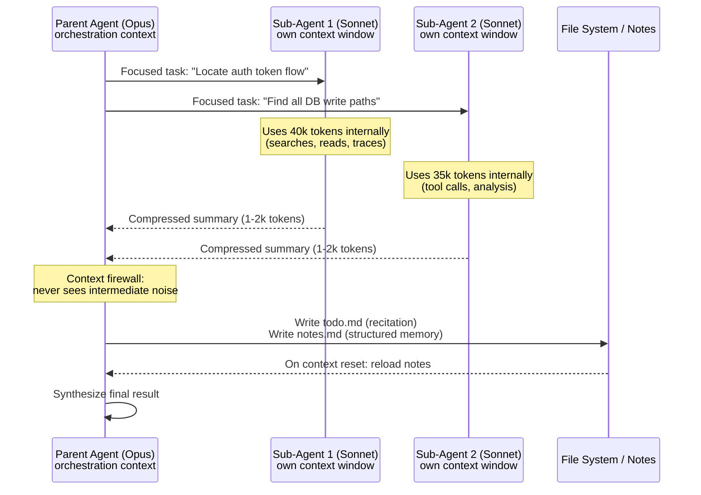

# Chapter 3: Compaction, Memory, and the Sub-Agent Pattern

Even with disciplined context engineering, long-horizon tasks exceed any single context window. The literature converges on three techniques.

### 3.1 Compaction

Compaction takes a conversation nearing the context window limit, summarizes it, and reinitiates a new context window with the summary ([Anthropic — Effective Context Engineering for AI Agents](https://www.anthropic.com/engineering/effective-context-engineering-for-ai-agents)). In Claude Code, the message history is passed to the model with instructions to preserve architectural decisions, unresolved bugs, and implementation details while discarding redundant tool outputs. The agent continues with the compressed context plus the most recently accessed files. The trigger — typically a token or percentage watermark on context usage — is itself a tuned parameter: fire too late and you risk overflow mid-turn, fire too early and you discard still-useful detail.

Anthropic's advice on compaction prompts: tune them on real complex traces, maximize recall first to ensure all relevant information is captured, then iterate on precision to remove the superfluous. The lightest-touch form is tool-result clearing — once a tool has been called and the result acted on, the raw result can usually be discarded.

The important caveat is that compaction is lossy. It is best for preserving decisions, goals, constraints, and pointers to artifacts, not for preserving every detail of a long debugging trace. A good harness therefore combines compaction with restorable references: commit hashes, file paths, issue IDs, URLs, and short notes that let a later agent reload primary evidence when the summary is too thin.

### 3.2 Structured Note-Taking

The complementary pattern is *agentic memory*: having the agent regularly write notes to disk that can be reloaded later. Anthropic offers Claude playing Pokémon as a clean example — across thousands of game steps, the agent maintains tallies ("for the last 1,234 steps I've been training my Pokémon in Route 1, Pikachu has gained 8 levels toward the target of 10"), develops maps of regions, and tracks combat strategies, allowing it to resume multi-hour training sequences after context resets ([Anthropic — Effective Context Engineering for AI Agents](https://www.anthropic.com/engineering/effective-context-engineering-for-ai-agents)).

Manus's todo.md trick is a specialized form of this — but with a twist explored in the next section.

### 3.3 Recitation: Manipulating Attention Through the End of Context

Manus reports that when its agent handles complex tasks, it creates a `todo.md` file and rewrites it step-by-step as the task progresses, checking off completed items. This is not just for organization. A typical Manus task takes ~50 tool calls on average; in long contexts the model is vulnerable to drifting off-topic or forgetting earlier goals. By repeatedly rewriting the todo list, the agent recites its objectives into the *end* of the context, pushing the global plan into the model's recent attention span and avoiding the well-known "lost-in-the-middle" problem (the underlying effect is covered in the companion volume, *LLM Foundations* ch9) ([Manus — Context Engineering for AI Agents: Lessons from Building Manus](https://manus.im/blog/Context-Engineering-for-AI-Agents-Lessons-from-Building-Manus)).

### 3.4 Sub-Agents and the Context Firewall

The third pattern, and the most architecturally consequential, is sub-agent decomposition. A specialized sub-agent handles a focused task with its own context window, may use tens of thousands of tokens internally, and returns only a condensed 1,000–2,000 token summary to the parent ([Anthropic — Effective Context Engineering for AI Agents](https://www.anthropic.com/engineering/effective-context-engineering-for-ai-agents)). HumanLayer calls this the *context firewall*: the parent thread, responsible for orchestration, never sees the intermediate noise from sub-agent work and stays out of the "dumb zone" for far longer ([HumanLayer — Skill Issue: Harness Engineering for Coding Agents](https://www.humanlayer.dev/blog/skill-issue-harness-engineering-for-coding-agents)).

HumanLayer is emphatic about what does and does not work here. Setting up "frontend engineer" and "backend engineer" personas as sub-agents does not work; using sub-agents for context control does. Good sub-agent use cases are tasks with a simple final answer but many intermediate tool calls — locating a definition in the codebase, tracing information flow across services, running broad research.

Sub-agents also help with cost control: HumanLayer uses an expensive model (Opus) for the orchestrator and a cheaper model (Sonnet or Haiku) for sub-agents. There is no need to burn Opus tokens on a `grep`.

Anthropic's multi-agent research system is the canonical example of this pattern at scale. A lead agent analyzes the query and spawns specialized sub-agents to explore aspects in parallel; each sub-agent uses its own context window; results are compressed back to the lead, which synthesizes a final report. The lead-agent-as-Opus, sub-agents-as-Sonnet configuration outperformed single-agent Opus by 90.2% — a relative improvement — on Anthropic's internal research evaluation ([Anthropic — How We Built Our Multi-Agent Research System](https://www.anthropic.com/engineering/multi-agent-research-system)). The mechanism is largely token economics: in their analysis, three factors explained 95% of performance variance on the BrowseComp benchmark, with token usage alone explaining 80%.

The catch is cost. In Anthropic's data, single-agent runs use roughly 4× the tokens of a chat and multi-agent systems roughly 15× — so a multi-agent system costs on the order of 4× a single agent (a derived ratio, not a figure the source states directly). They therefore only make economic sense for high-value tasks where parallelization actually helps. They are a poor fit for tightly coupled subtasks that share mutable state — many implementation-heavy coding tasks fall into this category — but they can still help coding workflows when the delegated work is read-only, investigative, or cleanly separated by ownership boundary. Current models are also not strong at real-time coordination across agents, so the coordinator must keep task boundaries explicit.

### 3.5 Don't Few-Shot Yourself Into a Rut

Manus offers a counter-intuitive principle: too much consistency in the context can be harmful. Models are excellent mimics — they imitate patterns in context. If the trace is full of similar past action-observation pairs, the model will follow that pattern even when it is no longer optimal, leading to drift, overgeneralization, and hallucination. Manus's example is reviewing a batch of 20 résumés, where the agent falls into a rhythm and starts repeating actions for their own sake ([Manus — Context Engineering for AI Agents: Lessons from Building Manus](https://manus.im/blog/Context-Engineering-for-AI-Agents-Lessons-from-Building-Manus)).

Their fix: introduce small, structured variation — different serialization templates, alternate phrasing, minor reordering, controlled noise. Diversity in the trace keeps attention spread.

### 3.6 Keep the Wrong Stuff In

The complementary principle: do not erase useful errors. The natural impulse is to retry failed actions and hide the failed traces, but Manus argues this removes evidence the model needs to update its priors away from similar mistakes ([Manus — Context Engineering for AI Agents: Lessons from Building Manus](https://manus.im/blog/Context-Engineering-for-AI-Agents-Lessons-from-Building-Manus)). Leaving the latest failed action and relevant stack trace in context lets the model implicitly learn from it. This does not mean preserving unlimited logs forever; repeated identical failures should be compacted into a short diagnosis plus a retry counter. Manus calls error recovery "one of the clearest indicators of true agentic behavior" — and notes it is underrepresented in academic benchmarks, which tend to focus on success under ideal conditions.

HumanLayer formalizes this as Factor 9: compact errors into context. The agent's *self-healing* property — reading an error and adjusting its next call — is one of the genuine benefits of LLM agents, and it works only when the error is visible ([HumanLayer — 12-Factor Agents](https://www.humanlayer.dev/blog/12-factor-agents)). With a counter to limit consecutive identical errors, this pattern is robust.

### 3.7 Cost, Latency, and Model Routing

The sub-agent pattern above already used cost as a design variable — an expensive model orchestrating, cheaper models doing the legwork. It is worth making the general principle explicit: cost and latency are first-class harness concerns, not afterthoughts.

Three levers recur across the literature:

- **Model routing.** Not every step needs the strongest model. A harness can route cheap, high-volume work — a `grep`, a classification, a short summary — to a small fast model, and reserve the frontier model for reasoning-heavy steps. HumanLayer uses Opus for the orchestrator and Sonnet or Haiku for sub-agents ([HumanLayer — Skill Issue: Harness Engineering for Coding Agents](https://www.humanlayer.dev/blog/skill-issue-harness-engineering-for-coding-agents)); Anthropic's research system makes the same lead-agent / sub-agent split (chapter 7).
- **The KV-cache.** Stable context prefixes are served from cache at roughly a tenth of the price, and a fraction of the latency, of uncached tokens (mechanics covered in the companion volume, *LLM Foundations* ch9; see also chapter 2). Cache discipline is often the single largest cost lever in a production agent.
- **Token accounting.** Agentic workloads are prefill-heavy — Manus reports a ~100:1 input-to-output ratio — and cost scales with context length. Multi-agent systems can burn roughly 15× the tokens of a single chat, which is why they pay off only on high-value tasks.

Latency has its own structure. Time-to-first-token is dominated by prefill, and therefore by cache hits; end-to-end latency is dominated by the number of *sequential* model round-trips. Parallel tool calls and parallel sub-agents cut wall-clock time substantially — up to 90% on Anthropic's research workloads (chapter 7) — without reducing total token cost. The general rule: treat tokens, dollars, and seconds as explicit budgets, and know which lever moves which.

### 3.8 Named Memory Architectures

Sections 3.1–3.3 treated compaction, note-taking, and recitation as harness *techniques*. The research literature also packages these ideas into named memory *systems* worth knowing in their own right.

- **MemGPT** draws an explicit analogy to an operating system: it treats the context window as fast "main memory" and external stores as "disk," and lets the model issue function calls to page information in and out of a fixed-size context — *virtual context management*. This is how a bounded window can present the appearance of a much larger one ([Packer et al. — MemGPT: Towards LLMs as Operating Systems](https://arxiv.org/abs/2310.08560)). The system is now productized as Letta.
- **Mem0** is a memory layer that dynamically *extracts* salient facts from a conversation, *consolidates* them against what is already stored, and *retrieves* them on later turns; a graph variant additionally captures relations between entities. Its reported win is operational — far lower token cost and latency than replaying full history across long multi-session dialogues ([Chhikara et al. — Mem0: Building Production-Ready AI Agents with Scalable Long-Term Memory](https://arxiv.org/abs/2504.19413)).
- **Sleep-time compute** puts the gaps between requests to work: instead of sitting idle, the agent processes its context offline — anticipating likely future questions and precomputing inferences — so that later queries need less test-time compute. On some benchmarks this cut the inference budget for a given accuracy by roughly 5× ([Lin et al. — Sleep-time Compute: Beyond Inference Scaling at Test-time](https://arxiv.org/abs/2504.13171)).

The harness lens is the one from §3.1: managed memory is powerful but lossy, and it adds its own failure surface — the wrong memory retrieved, a bad consolidation, a stale fact asserted with confidence. These systems earn their place when sessions are long and cross-session recall genuinely matters; on short tasks they are overhead layered on the note-taking that §3.2 already provides.

### 3.9 Multi-Agent Topologies and Why They Fail

Section 3.4 introduced the sub-agent as a context-firewall device and the orchestrator-worker configuration; Chapters 6 and 7 develop orchestration further. Beyond orchestrator-worker, practitioners reach for a small vocabulary of multi-agent *topologies*:

- **Orchestrator–worker (supervisor)**: a lead agent decomposes a task, delegates to workers, and synthesizes their results (Ch 6, 7).
- **Hierarchical**: supervisors of supervisors, for tasks deep enough that one lead cannot hold the whole decomposition.
- **Blackboard / shared memory**: agents coordinate by reading and writing a common workspace rather than messaging each other directly — useful when many agents contribute to one evolving artifact.
- **Debate / voting**: several agents argue or vote to raise reliability, the multi-agent form of the parallelization-voting pattern (§6.3).

The temptation is to equate more agents with more capability. The empirical record is more sobering. The MAST study hand-annotated over 200 tasks across seven popular multi-agent frameworks and derived a taxonomy of 14 failure modes grouped into three categories: **specification issues** (underspecified roles and prompts), **inter-agent misalignment** (agents talking past each other, dropping information, or diverging from the shared goal), and **task verification** (weak or absent checking of the final result) ([Cemri et al. — Why Do Multi-Agent LLM Systems Fail?](https://arxiv.org/abs/2503.13657)). The headline is that a large share of failures are not raw model incapability but *coordination and verification* breakdowns — exactly the surfaces the harness owns.

The practical guidance falls out of the taxonomy: prefer the simplest topology that works (§6.1); keep task boundaries explicit so workers do not overlap or drop work (§3.4, Ch 7); and treat verification as a first-class agent rather than an afterthought (the generator–evaluator split of Ch 7), because MAST identifies weak verification as one of the three leading failure families.

### 3.10 Memory Poisoning and Trust Escalation

Persistent memory changes the security model. An injected instruction in a web page normally threatens one run; if the agent summarizes that instruction into a durable note, preference store, or shared blackboard, the attack can survive a context reset and steer later runs. Anthropic calls this **persistent memory poisoning**: untrusted content crosses a write boundary into state that future agents treat as trusted ([Anthropic — How We Contain Claude](https://www.anthropic.com/engineering/how-we-contain-claude)).

The defense is to treat memory as a provenance-bearing store, not as a neutral extension of context:

- label each memory by source, authorizing identity, creation time, and trust class;
- separate observations from instructions, and never promote retrieved content into policy automatically;
- require review or deterministic validation before untrusted findings enter durable shared memory;
- support expiry, supersession, and rollback so a poisoned fact can be removed from every future context;
- re-check authorization at retrieval time, because a fact the writer could see is not necessarily a fact the reader may see.

Multi-agent systems add **trust escalation**. A low-privilege worker can return a plausible summary to a higher-privilege coordinator, which then acts with authority the worker never had. Compression makes this especially dangerous because provenance and uncertainty are often the first details lost. A sub-agent result should therefore carry citations or artifact pointers, confidence or unresolved questions, and the identity and permissions under which it was produced. The parent must validate the evidence before turning the result into a privileged action. Chapter 5 develops the containment controls; Chapter 18 develops the identity and control-plane model that makes them enforceable across a fleet.

---

## Diagram: Parent Agent → Sub-Agent → Compressed Result (Context Firewall)

```mermaid
sequenceDiagram
    participant PA as Parent Agent (Opus)<br/>orchestration context
    participant SA1 as Sub-Agent 1 (Sonnet)<br/>own context window
    participant SA2 as Sub-Agent 2 (Sonnet)<br/>own context window
    participant FS as File System / Notes

    PA->>SA1: Focused task: "Locate auth token flow"
    PA->>SA2: Focused task: "Find all DB write paths"
    Note over SA1: Uses 40k tokens internally<br/>(searches, reads, traces)
    Note over SA2: Uses 35k tokens internally<br/>(tool calls, analysis)
    SA1-->>PA: Compressed summary (1-2k tokens)
    SA2-->>PA: Compressed summary (1-2k tokens)
    Note over PA: Context firewall:<br/>never sees intermediate noise
    PA->>FS: Write todo.md (recitation)<br/>Write notes.md (structured memory)
    FS-->>PA: On context reset: reload notes
    PA->>PA: Synthesize final result
```

---

## Key Takeaways

- **Compaction extends task horizons but loses detail**: preserve key decisions and restorable references, not every raw observation.
- **Structured note-taking enables multi-session continuity**: agents that write progress to disk can resume work after context resets.
- **Recitation defeats "lost-in-the-middle"**: repeatedly rewriting a todo list pushes goals into the model's recent attention span.
- **The context firewall is the sub-agent pattern's key value**: the parent never sees intermediate noise; it receives only condensed results.
- **Leave useful errors in context**: self-healing only works when the relevant error trace is visible, but repeated failures should be compacted.
- **Cost and latency are design variables**: route cheap work to small models, keep the KV-cache warm, and parallelize for wall-clock speed.
- **Named memory systems package the memory patterns**: MemGPT (OS-style virtual context), Mem0 (extract–consolidate–retrieve), and sleep-time compute (offline pre-processing) are worth knowing — but each adds its own retrieval and staleness failure surface.
- **More agents multiply coordination failure, not just cost**: the MAST taxonomy finds that specification gaps, inter-agent misalignment, and weak verification — all harness-owned surfaces — dominate multi-agent failures; prefer the simplest topology and make verification first-class.
- **Durable memory is a trust boundary**: retain provenance, separate data from instructions, and validate before promoting untrusted findings into shared state; otherwise one injected page can steer many future runs.
- **Delegation must not silently escalate authority**: a parent should verify a worker's evidence before acting with privileges the worker did not possess.

## Further Reading

- Anthropic Applied AI Team, *Effective Context Engineering for AI Agents*, Anthropic, Sep 2025. https://www.anthropic.com/engineering/effective-context-engineering-for-ai-agents
- Yichao 'Peak' Ji, *Context Engineering for AI Agents: Lessons from Building Manus*, Manus, Jul 2025. https://manus.im/blog/Context-Engineering-for-AI-Agents-Lessons-from-Building-Manus
- Kyle Brunet, *Skill Issue: Harness Engineering for Coding Agents*, HumanLayer, Mar 2026. https://www.humanlayer.dev/blog/skill-issue-harness-engineering-for-coding-agents
- Jeremy Hadfield et al., *How We Built Our Multi-Agent Research System*, Anthropic, Jun 2025. https://www.anthropic.com/engineering/multi-agent-research-system
- Dex Horthy, *12-Factor Agents*, HumanLayer, Apr 2025. https://www.humanlayer.dev/blog/12-factor-agents
- Charles Packer et al., *MemGPT: Towards LLMs as Operating Systems*, arXiv, Oct 2023. https://arxiv.org/abs/2310.08560
- Prateek Chhikara et al., *Mem0: Building Production-Ready AI Agents with Scalable Long-Term Memory*, arXiv, Apr 2025. https://arxiv.org/abs/2504.19413
- Kevin Lin et al., *Sleep-time Compute: Beyond Inference Scaling at Test-time*, arXiv, Apr 2025. https://arxiv.org/abs/2504.13171
- Mert Cemri et al., *Why Do Multi-Agent LLM Systems Fail?*, arXiv, Mar 2025. https://arxiv.org/abs/2503.13657
- Anthropic Safeguards Research Team, *How We Contain Claude*, Anthropic, May 2026. https://www.anthropic.com/engineering/how-we-contain-claude
