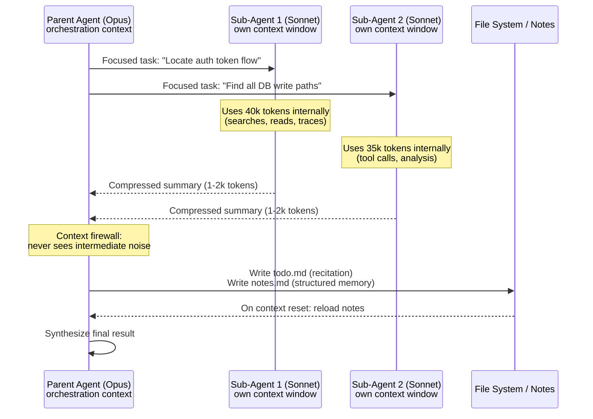

# Chapter 3: Compaction, Memory, and the Sub-Agent Pattern

Even with disciplined context engineering, a long-horizon task can exceed any single context window. The literature converges on three techniques for continuing beyond that limit.

### 3.1 Compaction

Compaction summarizes a conversation as it approaches the context-window limit, then starts a new context window from that summary ([Anthropic — Effective Context Engineering for AI Agents](https://www.anthropic.com/engineering/effective-context-engineering-for-ai-agents)). In Claude Code, the harness passes the message history to the model with instructions to preserve architectural decisions, unresolved bugs, and implementation details while discarding redundant tool output. The agent then continues from the compressed context and the files it accessed most recently. The compaction trigger—usually a token threshold or a percentage of context usage—must itself be tuned. Trigger too late, and the context may overflow in the middle of a turn; trigger too early, and the summary may discard details that are still useful.

Anthropic recommends tuning compaction prompts on real, complex traces. Start by maximizing recall so that the summary captures all relevant information; then improve precision by removing material that does not help the agent continue. The lightest form of compaction is tool-result clearing: after the agent has acted on a tool result, the raw output can usually be discarded.

The key caveat is that compaction is lossy. It is well suited to preserving decisions, goals, constraints, and pointers to artifacts, but not every detail of a long debugging trace. A good harness therefore pairs compaction with restorable references—commit hashes, file paths, issue IDs, URLs, and short notes—so that a later agent can reload the primary evidence when the summary is too thin.

### 3.2 Structured Note-Taking

The complementary pattern is *agentic memory*: the agent regularly writes structured notes to disk and reloads them later. Anthropic illustrates the pattern with Claude playing Pokémon. Across thousands of game steps, the agent maintains progress tallies ("for the last 1,234 steps I've been training my Pokémon in Route 1, Pikachu has gained 8 levels toward the target of 10"), develops maps of regions, and records combat strategies. Those notes let it resume multi-hour training sequences after a context reset ([Anthropic — Effective Context Engineering for AI Agents](https://www.anthropic.com/engineering/effective-context-engineering-for-ai-agents)).

Manus's `todo.md` technique is a specialized form of structured note-taking, with an additional purpose explored in the next section.

### 3.3 Recitation: Manipulating Attention Through the End of Context

Manus reports that its agent creates a `todo.md` file for complex tasks, then rewrites the file step by step as work progresses and checks off completed items. The purpose is not merely organizational. A typical Manus task averages about 50 tool calls, and over a long context the model can drift off task or lose sight of earlier goals. Rewriting the todo list repeatedly recites those goals at the *end* of the context. This keeps the global plan in the model's recent attention span and helps counter the well-known "lost-in-the-middle" problem (the companion volume, *LLM Foundations* ch9, covers the underlying effect) ([Manus — Context Engineering for AI Agents: Lessons from Building Manus](https://manus.im/blog/Context-Engineering-for-AI-Agents-Lessons-from-Building-Manus)).

### 3.4 Sub-Agents and the Context Firewall

The third pattern—and the one with the greatest architectural consequences—is sub-agent decomposition. A specialized sub-agent receives a focused task and its own context window. It may consume tens of thousands of tokens while working, but returns only a condensed summary of 1,000–2,000 tokens to the parent ([Anthropic — Effective Context Engineering for AI Agents](https://www.anthropic.com/engineering/effective-context-engineering-for-ai-agents)). HumanLayer calls this boundary the *context firewall*. Because the parent thread handles orchestration without seeing the sub-agent's intermediate noise, its context remains useful for much longer and is less likely to enter the "dumb zone" ([HumanLayer — Skill Issue: Harness Engineering for Coding Agents](https://www.humanlayer.dev/blog/skill-issue-harness-engineering-for-coding-agents)).

HumanLayer distinguishes sharply between role-playing and context control. Assigning generic "frontend engineer" and "backend engineer" personas to sub-agents is not the useful pattern; delegating bounded work to protect the parent's context is. The best sub-agent tasks have a compact final answer but require many intermediate tool calls—for example, locating a definition in a codebase, tracing information flow across services, or conducting broad research.

Sub-agents can also control cost. HumanLayer uses an expensive model (Opus) for orchestration and cheaper models (Sonnet or Haiku) for delegated work. A simple operation such as `grep` does not require the orchestrator's most capable model.

Anthropic's multi-agent research system is the canonical example of this pattern at scale. A lead agent analyzes a query and asks specialized sub-agents to investigate different aspects in parallel. Each sub-agent works in its own context window and returns a compressed result; the lead then synthesizes those results into a final report. On Anthropic's internal research evaluation, a configuration with Opus as the lead and Sonnet as the sub-agents outperformed single-agent Opus by 90.2%—a relative improvement ([Anthropic — How We Built Our Multi-Agent Research System](https://www.anthropic.com/engineering/multi-agent-research-system)). The mechanism is largely one of token economics. In Anthropic's analysis, three factors explained 95% of the performance variance on the BrowseComp benchmark, and token usage alone explained 80%.

The catch is cost. In Anthropic's data, single-agent runs use roughly 4× as many tokens as a chat, while multi-agent systems use roughly 15×. A multi-agent system therefore costs on the order of 4× as much as a single agent—a derived ratio, not a figure stated directly by the source. This architecture makes economic sense only for high-value work that benefits from parallelism. It is a poor fit for tightly coupled subtasks that share mutable state, a category that includes many implementation-heavy coding tasks. It can still help coding workflows when delegated tasks are read-only, investigative, or separated by clear ownership boundaries. Because current models are also weak at real-time coordination across agents, the coordinator must define those boundaries explicitly.

### 3.5 Don't Few-Shot Yourself Into a Rut

Manus offers a counterintuitive principle: too much consistency in the context can be harmful. Models are strong mimics of the patterns they see. If a trace contains many similar action-observation pairs, the model may continue the pattern after it stops being useful, leading to drift, overgeneralization, or hallucination. In Manus's example, an agent reviewing a batch of 20 résumés falls into a rhythm and begins repeating actions for their own sake ([Manus — Context Engineering for AI Agents: Lessons from Building Manus](https://manus.im/blog/Context-Engineering-for-AI-Agents-Lessons-from-Building-Manus)).

The proposed fix is to introduce small, structured variations: different serialization templates, alternate phrasing, minor reordering, or controlled noise. Diversity in the trace prevents one pattern from dominating the model's attention.

### 3.6 Keep the Wrong Stuff In

The complementary principle is to retain useful errors. The natural impulse is to retry a failed action and hide its trace, but Manus argues that doing so removes the evidence the model needs to avoid the same mistake ([Manus — Context Engineering for AI Agents: Lessons from Building Manus](https://manus.im/blog/Context-Engineering-for-AI-Agents-Lessons-from-Building-Manus)). Keeping the most recent failed action and its relevant stack trace in context allows the model to adjust its next attempt. This does not mean preserving unlimited logs indefinitely. Repeated, identical failures should be compacted into a short diagnosis and a retry counter. Manus calls error recovery "one of the clearest indicators of true agentic behavior" and notes that academic benchmarks underrepresent it because they tend to measure success under ideal conditions.

HumanLayer formalizes this idea as Factor 9: compact errors into context. An agent's ability to read an error and adjust its next call—its *self-healing* property—is one of the genuine benefits of LLM agents, and it works only when the error remains visible ([HumanLayer — 12-Factor Agents](https://www.humanlayer.dev/blog/12-factor-agents)). Combined with a counter that limits consecutive identical errors, the pattern is robust.

### 3.7 Cost, Latency, and Model Routing

The sub-agent pattern already treats cost as a design variable: an expensive model orchestrates while cheaper models perform the supporting work. The broader principle is worth stating explicitly. Cost and latency are first-class harness concerns, not afterthoughts.

Three levers recur across the literature:

- **Model routing.** Not every step requires the strongest model. A harness can send inexpensive, high-volume work—a `grep`, a classification, or a short summary—to a small, fast model and reserve the frontier model for reasoning-intensive steps. HumanLayer uses Opus for the orchestrator and Sonnet or Haiku for sub-agents ([HumanLayer — Skill Issue: Harness Engineering for Coding Agents](https://www.humanlayer.dev/blog/skill-issue-harness-engineering-for-coding-agents)); Anthropic's research system uses the same lead-agent / sub-agent split (chapter 7).
- **The KV-cache.** Stable context prefixes can be served from the cache at roughly one-tenth the price and a fraction of the latency of uncached tokens (the companion volume, *LLM Foundations* ch9, explains the mechanics; see also chapter 2). In production agents, cache discipline is often the largest single cost lever.
- **Token accounting.** Agentic workloads are prefill-heavy—Manus reports an input-to-output ratio of about 100:1—and cost grows with context length. Multi-agent systems can consume roughly 15× the tokens of a single chat, so they pay off only on high-value tasks.

Latency has a different structure. Time-to-first-token is dominated by prefill and therefore by cache hits; end-to-end latency is dominated by the number of *sequential* model round-trips. Parallel tool calls and sub-agents can reduce wall-clock time substantially—by up to 90% on Anthropic's research workloads (chapter 7)—without reducing total token cost. The general rule is to treat tokens, dollars, and seconds as separate, explicit budgets and understand which design lever affects each one.

### 3.8 Named Memory Architectures

Sections 3.1–3.3 presented compaction, note-taking, and recitation as harness *techniques*. The research literature also combines these ideas into named memory *systems* that are useful to recognize.

- **MemGPT** uses an explicit operating-system analogy. It treats the context window as fast "main memory" and external stores as "disk," then lets the model issue function calls that page information into and out of a fixed-size context. This *virtual context management* makes a bounded window appear much larger ([Packer et al. — MemGPT: Towards LLMs as Operating Systems](https://arxiv.org/abs/2310.08560)). The system is now productized as Letta.
- **Mem0** is a memory layer that dynamically *extracts* salient facts from a conversation, *consolidates* them with existing stored information, and *retrieves* them on later turns. A graph variant also captures relationships between entities. Its reported advantage is operational: much lower token cost and latency than replaying the complete history of long, multi-session dialogues ([Chhikara et al. — Mem0: Building Production-Ready AI Agents with Scalable Long-Term Memory](https://arxiv.org/abs/2504.19413)).
- **Sleep-time compute** uses the idle periods between requests. The agent processes its context offline, anticipating likely future questions and precomputing inferences so that later queries require less test-time compute. On some benchmarks, this approach reduced the inference budget needed for a given level of accuracy by roughly 5× ([Lin et al. — Sleep-time Compute: Beyond Inference Scaling at Test-time](https://arxiv.org/abs/2504.13171)).

The harness-level caveat is the same one introduced in §3.1: managed memory is powerful but lossy, and it creates new failure modes. The system may retrieve the wrong memory, consolidate information incorrectly, or assert a stale fact with confidence. These architectures justify their complexity when sessions are long and cross-session recall genuinely matters. For short tasks, they may add overhead without providing more value than the structured notes described in §3.2.

### 3.9 Multi-Agent Topologies and Why They Fail

Section 3.4 introduced sub-agents as context firewalls and described the orchestrator-worker configuration; Chapters 6 and 7 develop orchestration in more detail. Practitioners also use several other multi-agent *topologies*:

- **Orchestrator–worker (supervisor)**: a lead agent decomposes a task, delegates parts to workers, and synthesizes their results (Ch 6, 7).
- **Hierarchical**: supervisors manage other supervisors when a task decomposition is too deep for one lead to hold in context.
- **Blackboard / shared memory**: agents coordinate by reading and writing to a common workspace instead of messaging one another directly. This works well when many agents contribute to a single, evolving artifact.
- **Debate / voting**: several agents debate or vote to improve reliability. This is the multi-agent form of the parallelization-voting pattern (§6.3).

It is tempting to equate more agents with greater capability, but the empirical record is more sobering. The MAST study manually annotated more than 200 tasks across seven popular multi-agent frameworks and produced a taxonomy of 14 failure modes. It groups them into three categories: **specification issues** (underspecified roles and prompts), **inter-agent misalignment** (agents talking past one another, dropping information, or diverging from the shared goal), and **task verification** (weak or absent checks of the final result) ([Cemri et al. — Why Do Multi-Agent LLM Systems Fail?](https://arxiv.org/abs/2503.13657)). Many failures therefore come not from a lack of raw model capability, but from breakdowns in *coordination and verification*—precisely the surfaces that the harness controls.

The taxonomy leads directly to practical guidance. Prefer the simplest topology that works (§6.1). Define task boundaries explicitly so that workers neither duplicate nor omit work (§3.4, Ch 7). Treat verification as a first-class responsibility rather than an afterthought—the generator–evaluator split described in Ch 7—because MAST identifies weak verification as one of the three main families of failure.

### 3.10 Memory Poisoning and Trust Escalation

Persistent memory changes the security model. An injected instruction on a web page would normally threaten only one run. If the agent incorporates that instruction into a durable note, preference store, or shared blackboard, however, the attack can survive a context reset and influence later runs. Anthropic calls this **persistent memory poisoning**: untrusted content crosses a write boundary into state that future agents treat as trusted ([Anthropic — How We Contain Claude](https://www.anthropic.com/engineering/how-we-contain-claude)).

The defense is to treat memory as a provenance-bearing store, not as a neutral extension of context:

- label every memory with its source, the identity that authorized the write, its creation time, and its trust class;
- separate observations from instructions, and never promote retrieved content to policy automatically;
- require review or deterministic validation before untrusted findings enter durable, shared memory;
- support expiry, supersession, and rollback so that a poisoned fact can be removed from all future contexts;
- check authorization again at retrieval time, because a fact visible to the writer is not necessarily one that the reader may access.

Multi-agent systems introduce another risk: **trust escalation**. A low-privilege worker can return a plausible summary to a higher-privilege coordinator, which may then act with authority the worker never possessed. Compression makes this path especially dangerous because provenance and uncertainty are often the first details to disappear. A sub-agent result should therefore include citations or pointers to artifacts, a confidence level and any unresolved questions, and the identity and permissions under which the work was performed. Before turning that result into a privileged action, the parent must validate the evidence. Chapter 5 develops the relevant containment controls; Chapter 18 describes the identity and control-plane model that makes them enforceable across a fleet.

---

## Diagram: Parent Agent → Sub-Agent → Compressed Result (Context Firewall)

```mermaid
sequenceDiagram
    participant PA as Parent Agent (Opus)<br/>orchestration context
    participant SA1 as Sub-Agent 1 (Sonnet)<br/>own context window
    participant SA2 as Sub-Agent 2 (Sonnet)<br/>own context window
    participant FS as File System / Notes

    PA->>SA1: Focused task: "Locate auth token flow"
    PA->>SA2: Focused task: "Find all DB write paths"
    Note over SA1: Uses 40k tokens internally<br/>(searches, reads, traces)
    Note over SA2: Uses 35k tokens internally<br/>(tool calls, analysis)
    SA1-->>PA: Compressed summary (1-2k tokens)
    SA2-->>PA: Compressed summary (1-2k tokens)
    Note over PA: Context firewall:<br/>never sees intermediate noise
    PA->>FS: Write todo.md (recitation)<br/>Write notes.md (structured memory)
    FS-->>PA: On context reset: reload notes
    PA->>PA: Synthesize final result
```

---

## Key Takeaways

- **Compaction extends task horizons but loses detail**: preserve key decisions and restorable references, not every raw observation.
- **Structured note-taking enables multi-session continuity**: agents that write progress to disk can resume work after context resets.
- **Recitation defeats "lost-in-the-middle"**: repeatedly rewriting a todo list pushes goals into the model's recent attention span.
- **The context firewall is the sub-agent pattern's key value**: the parent never sees intermediate noise; it receives only condensed results.
- **Leave useful errors in context**: self-healing only works when the relevant error trace is visible, but repeated failures should be compacted.
- **Cost and latency are design variables**: route cheap work to small models, keep the KV-cache warm, and parallelize for wall-clock speed.
- **Named memory systems package the memory patterns**: MemGPT (OS-style virtual context), Mem0 (extract–consolidate–retrieve), and sleep-time compute (offline pre-processing) are useful reference points, but each introduces its own retrieval and staleness failure modes.
- **More agents multiply coordination failures, not just cost**: the MAST taxonomy finds that specification gaps, inter-agent misalignment, and weak verification—all surfaces owned by the harness—dominate multi-agent failures. Prefer the simplest topology and make verification first-class.
- **Durable memory is a trust boundary**: retain provenance, separate data from instructions, and validate before promoting untrusted findings into shared state; otherwise one injected page can steer many future runs.
- **Delegation must not silently escalate authority**: a parent should verify a worker's evidence before acting with privileges the worker did not possess.

## Further Reading

- Anthropic Applied AI Team, *Effective Context Engineering for AI Agents*, Anthropic, Sep 2025. https://www.anthropic.com/engineering/effective-context-engineering-for-ai-agents
- Yichao 'Peak' Ji, *Context Engineering for AI Agents: Lessons from Building Manus*, Manus, Jul 2025. https://manus.im/blog/Context-Engineering-for-AI-Agents-Lessons-from-Building-Manus
- Kyle Brunet, *Skill Issue: Harness Engineering for Coding Agents*, HumanLayer, Mar 2026. https://www.humanlayer.dev/blog/skill-issue-harness-engineering-for-coding-agents
- Jeremy Hadfield et al., *How We Built Our Multi-Agent Research System*, Anthropic, Jun 2025. https://www.anthropic.com/engineering/multi-agent-research-system
- Dex Horthy, *12-Factor Agents*, HumanLayer, Apr 2025. https://www.humanlayer.dev/blog/12-factor-agents
- Charles Packer et al., *MemGPT: Towards LLMs as Operating Systems*, arXiv, Oct 2023. https://arxiv.org/abs/2310.08560
- Prateek Chhikara et al., *Mem0: Building Production-Ready AI Agents with Scalable Long-Term Memory*, arXiv, Apr 2025. https://arxiv.org/abs/2504.19413
- Kevin Lin et al., *Sleep-time Compute: Beyond Inference Scaling at Test-time*, arXiv, Apr 2025. https://arxiv.org/abs/2504.13171
- Mert Cemri et al., *Why Do Multi-Agent LLM Systems Fail?*, arXiv, Mar 2025. https://arxiv.org/abs/2503.13657
- Anthropic Safeguards Research Team, *How We Contain Claude*, Anthropic, May 2026. https://www.anthropic.com/engineering/how-we-contain-claude
