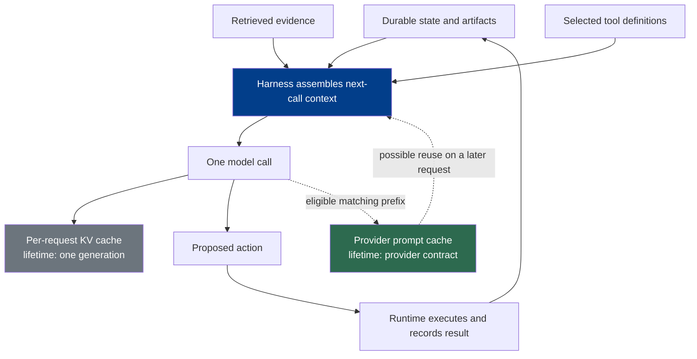

# Chapter 3: Context as a Finite Resource

This chapter owns per-call context selection and cache lifetimes; later chapters own retrieval pipelines, memory, and durable state.

### 3.1 Context Is a Budget, Not a Memory Store

*Context* is the token and multimodal representation visible to one model call. It is finite, assembled for a particular call, and should not be confused with durable execution state or memory. Foundations Chapter 9 explains the model-side limit; this chapter asks what the harness should place inside that limit.

More available context can help, but filling the window is not automatically useful. Anthropic describes context as an "attention budget": additional material can dilute relevant signals, and retrieval accuracy can vary with model, task, length, and information position ([Anthropic — Effective Context Engineering for AI Agents](https://www.anthropic.com/engineering/effective-context-engineering-for-ai-agents)). Treat this *context rot* as a probabilistic engineering risk, not as a fixed turn count or a law that every longer prompt performs worse.

A naive agent loop makes the problem visible:

1. assemble the instructions, tools, transcript, and current task data;
2. ask the model to propose an action;
3. execute the authorized action and append its result;
4. repeat with the enlarged transcript.

Only this append-only baseline grows monotonically. A production harness may trim low-value material, clear bulky tool results, offload artifacts, compact earlier turns, reset the context, retrieve information on demand, or defer tool definitions. Each transformation changes what the next call can see, so it needs explicit correctness criteria and recoverable references; Chapter 5 covers those loss and provenance questions in depth.

### 3.2 Assemble the Smallest Sufficient Context

The practical objective is the smallest set of high-signal inputs that is sufficient for the next decision, an approach Anthropic describes as finding the smallest set of tokens that maximizes the likelihood of the desired outcome ([Anthropic — Effective Context Engineering for AI Agents](https://www.anthropic.com/engineering/effective-context-engineering-for-ai-agents)). A useful assembly order is:

- stable instructions and behavioral guidance;
- only the tools that the model may need to discover;
- task state represented in a compact, structured form;
- recent actions and observations needed for local continuity;
- retrieved evidence and artifact references relevant to this step.

Structure helps navigation but does not create a security boundary. Markdown headings, XML tags, and clear labels can separate instructions from evidence, while authorization and mandatory policy checks remain responsibilities of the harness and runtime (see Chapters 2 and 7). Tool descriptions should also be distinct enough that the model can choose among them; overlapping or ambiguous interfaces consume context and increase selection errors ([Anthropic — Effective Context Engineering for AI Agents](https://www.anthropic.com/engineering/effective-context-engineering-for-ai-agents)).

Few-shot examples deserve the same discipline. Prefer a small set of representative examples that expose the intended decision boundary. A catalog of every edge case can crowd out the live task without guaranteeing generalization.

### 3.3 Three Different Objects: Context, KV Cache, and Prompt Cache

Three related concepts have different lifetimes:

| Object | Lifetime and owner | What it means for the harness |
|---|---|---|
| Context | One model call; assembled by the harness | The complete model-visible input for that call. It is not durable state. |
| Per-request KV cache | One generation; managed by the inference system | Reuses attention key/value state for tokens already processed during that generation. |
| Cross-request provider prompt cache | Across eligible requests; exposed by a provider contract | Reuses an exact or otherwise provider-defined prefix. Eligibility, matching, breakpoints, retention, data controls, metrics, latency, and billing are provider-specific. |

The third mechanism may internally reuse KV-derived state, but that implementation detail does not make it the same product contract as the per-request KV cache. OpenAI documents automatic caching for eligible exact prompt prefixes and exposes cached-token information in response usage, while Anthropic documents explicit cache breakpoints, prefix matching, and configurable cache lifetimes ([OpenAI — Prompt Caching](https://developers.openai.com/api/docs/guides/prompt-caching); [Anthropic — Prompt Caching](https://platform.claude.com/docs/en/build-with-claude/prompt-caching)). Code and prose should therefore say *provider prompt-cache hit* when discussing reuse between independent API requests.

Agent loops often make cross-request prompt caching valuable because a large prefix may remain stable while a short action and observation are appended. This is workload-dependent rather than universal. In a July 2025 report about Manus, Yichao “Peak” Ji described an average input-to-output ratio near 100:1 and cited then-current Claude Sonnet prices of $0.30 per million cached input tokens versus $3 per million uncached input tokens ([Manus — Context Engineering for AI Agents: Lessons from Building Manus](https://manus.im/blog/Context-Engineering-for-AI-Agents-Lessons-from-Building-Manus)). Those figures are a named historical case, not current pricing, a cross-provider ratio, or a forecast for another workload.

### 3.4 Design and Debug the Cacheable Prefix

Cache-aware design starts with the provider's contract. Both OpenAI and Anthropic require matching prefix content for reuse, but their eligibility rules, cache controls, lifetimes, and accounting differ; applications should consult the selected model's current documentation rather than encode a universal threshold or price ([OpenAI — Prompt Caching](https://developers.openai.com/api/docs/guides/prompt-caching); [Anthropic — Prompt Caching](https://platform.claude.com/docs/en/build-with-claude/prompt-caching)).

Put stable material before volatile material when the API's matching rules reward prefix stability. Keep timestamps, request identifiers, user-specific state, and current observations after the reusable boundary when semantics allow. Deterministic serialization matters too: changing field order or whitespace can change the serialized prefix even when the underlying object appears equivalent.

When a cache hit rate falls, check the following before changing the agent design:

- **Prefix boundary:** Which exact bytes or tokens are inside the reusable prefix?
- **Dynamic fields:** Did a timestamp, nonce, request ID, tenant value, or rotating instruction move into that prefix?
- **Tool definitions:** Did their descriptions, order, schemas, or availability change?
- **Serialization:** Is prompt and tool JSON produced deterministically?
- **Cache controls:** Does this provider require or support an explicit breakpoint, and is it placed correctly?
- **Provider metrics:** Are cached-input usage and latency measured from provider responses rather than inferred from total tokens?
- **Current contract:** Do the model, region, retention mode, and data-control settings remain eligible under the provider's current documentation?

### 3.5 Tool Catalogs: Three Valid Strategies

There is no universal rule that an agent must keep every tool definition permanently in context. MCP explicitly permits a server to notify clients that its tool list changed, so dynamic catalogs are supported by the protocol even though a particular model or cache design may make them costly ([MCP — Tools Specification](https://modelcontextprotocol.io/specification/2025-06-18/server/tools)). Three patterns are common:

1. **Stable catalog plus action masking.** Keep definitions stable for model continuity and prompt-cache locality, but let a deterministic runtime reject actions that are unavailable in the current state. Manus reports using this pattern, including consistent name prefixes for related actions, in its own provider and workload setup ([Manus — Context Engineering for AI Agents: Lessons from Building Manus](https://manus.im/blog/Context-Engineering-for-AI-Agents-Lessons-from-Building-Manus)). Its “mask, don't remove” advice is a case study, not a protocol requirement.
2. **Deferred loading or tool search.** Keep a large catalog out of the initial model input and load relevant definitions when discovered. Anthropic's tool-search interface supports `defer_loading` and describes how deferred definitions are expanded when selected while remaining compatible with its prompt-caching design ([Anthropic — Tool Reference](https://platform.claude.com/docs/en/agents-and-tools/tool-use/tool-reference)).
3. **Stable meta-tool or code surface.** Expose a small, stable search/registry or code-execution interface and resolve a larger capability catalog behind it. This reduces schema volume but adds a discovery step and does not remove the need to validate and authorize the final capability at dispatch.

Choose among these patterns with evaluation data. Relevant variables include catalog size, model tool-selection quality, provider cache behavior, latency, token cost, permission scope, and the risk of a stale tool reference. A dynamic tool-list change must never carry forward authorization merely because an earlier version exposed a tool; Chapter 6 defines the invocation and authorization lifecycle.

### 3.6 Offload Working Material to Artifacts

Large observations, source documents, intermediate calculations, and generated outputs do not all belong in the live context. A filesystem or artifact store gives them durable, addressable locations. The context can then carry a short summary plus a path, URI, version, or content hash that lets the harness restore the underlying evidence when needed.

This storage is *working material*, not automatic memory. Without meaningful names, indexes, provenance, access checks, and retrieval conventions, an agent may fail to find an artifact or may retrieve one from the wrong task or tenant. LangChain describes the filesystem as a foundational harness primitive because it supports incremental offloading and collaboration, while still requiring the harness to decide what should return to context ([LangChain — The Anatomy of an Agent Harness](https://blog.langchain.com/the-anatomy-of-an-agent-harness/)).

For coding agents, the repository is often the system of record for project facts. OpenAI's Codex harness guidance recommends keeping navigational instructions, design knowledge, and mechanically checked constraints close to the code so a fresh session can discover how the system works and how to verify changes ([OpenAI — Harness Engineering](https://openai.com/index/harness-engineering/)). That principle favors short, local, discoverable documents and standard verification commands over a single ever-growing prompt.

### 3.7 Just-in-Time Selection, Not the Whole Retrieval Pipeline

Just-in-time retrieval is a context-selection technique: retain lightweight identifiers such as paths, links, and queries, then load the underlying material only when the next decision requires it ([Anthropic — Effective Context Engineering for AI Agents](https://www.anthropic.com/engineering/effective-context-engineering-for-ai-agents)). It complements precomputed retrieval rather than replacing it. A hybrid system might preload a small set of high-value instructions, retrieve indexed evidence for the task, and let the agent inspect artifacts on demand.

This chapter stops at the context boundary: what to load, when to load it, and what reference to retain after offloading. Chapter 4 follows the production data path—ingestion, parsing, chunking, ACL-aware indexing, freshness, hybrid retrieval, reranking, provenance, and retrieval evaluation. Foundations Chapter 11 supplies the embedding and retrieval concepts on which that pipeline depends.

---

## Diagram: Context Selection and Cache Lifetimes

---

## Key Takeaways

- **Context is per-call input, not durable memory:** the harness selects it from state, artifacts, retrieved evidence, and recent interaction.
- **Only a naive append-only transcript grows monotonically:** production loops may trim, offload, compact, reset, retrieve, or defer tools.
- **KV cache and provider prompt cache have different lifetimes:** use the provider term for cross-request reuse and treat its rules and prices as provider-specific.
- **Stable tools are one strategy, not a law:** compare masking, deferred loading/tool search, and a stable meta-tool with workload-specific evaluations.
- **Artifacts make context restorable:** paths and provenance let large material leave the window without becoming irrecoverable.
- **Just-in-time retrieval is context selection:** Chapter 4 owns the production retrieval pipeline.

## Further Reading

- Anthropic Applied AI Team, *Effective Context Engineering for AI Agents*, Anthropic, Sep 2025. https://www.anthropic.com/engineering/effective-context-engineering-for-ai-agents
- OpenAI, *Prompt Caching*. https://developers.openai.com/api/docs/guides/prompt-caching
- Anthropic, *Prompt Caching*. https://platform.claude.com/docs/en/build-with-claude/prompt-caching
- Model Context Protocol, *Tools Specification*, Jun 2025. https://modelcontextprotocol.io/specification/2025-06-18/server/tools
- Anthropic, *Tool Reference*. https://platform.claude.com/docs/en/agents-and-tools/tool-use/tool-reference
- Yichao 'Peak' Ji, *Context Engineering for AI Agents: Lessons from Building Manus*, Manus, Jul 2025. https://manus.im/blog/Context-Engineering-for-AI-Agents-Lessons-from-Building-Manus
- Vivek Trivedy, *The Anatomy of an Agent Harness*, LangChain, Mar 2026. https://blog.langchain.com/the-anatomy-of-an-agent-harness/
- OpenAI, *Harness Engineering: Leveraging Codex in an Agent-First World*, Feb 2026. https://openai.com/index/harness-engineering/
