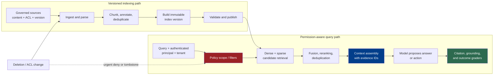

# Chapter 4: Production Retrieval and Grounding

Foundations Chapter 11 explains retrieval embeddings, lexical and dense search, chunking, reranking, and retrieval metrics. This chapter takes over at the production boundary: how a harness turns changing, permissioned source data into evidence that a model may use safely and that an operator can trace back to its origin.

Retrieval-augmented generation changes a model's input rather than its weights: a system retrieves external information and supplies it for the current generation ([Lewis et al. — Retrieval-Augmented Generation for Knowledge-Intensive NLP Tasks](https://arxiv.org/abs/2005.11401)). In production, that apparently simple operation is a data lifecycle, an authorization decision, a context-selection step, and an evaluation problem.

### 4.1 Retrieval, Grounding, and Outcome Are Different Claims

This book uses three terms deliberately:

- **Retrieval** selects candidate evidence from a governed corpus for a particular query, identity, and task.
- **Grounding** asks whether the generated claims are supported by the evidence actually supplied to the model.
- **Task outcome** asks whether the overall workflow produced the right external result.

A relevant chunk can be retrieved but ignored. An answer can faithfully summarize a retrieved chunk that is stale or wrong. A well-cited answer can still fail the user's task. Conversely, an answer may be correct from parametric knowledge while lacking support in the retrieved corpus. These are separate failure modes and need separate graders.

The harness should therefore treat retrieval output as a structured evidence product, not as an anonymous string:

```text
EvidenceItem {
  source_id, source_version, chunk_id,
  title, location, content_hash,
  retrieved_at, index_version,
  acl_scope, retrieval_scores,
  text
}
```

The exact schema is application-specific. The invariant is that text remains attached to source identity, version, location, authorization scope, and the index that produced it. Those fields make later citation checks, deletion, incident review, and reproducible evaluation possible.

### 4.2 Build an Index from Governed Source Records

An indexing pipeline should begin from a declared system of record rather than from whichever copy a crawler happens to find. A practical source record includes a stable source ID, source version or modification marker, tenant, content type, owner, access policy or ACL reference, and deletion status. The ingest job records when and how it observed that state.

The production path is:

1. **Ingest:** enumerate or receive source changes, preserving source identity and permissions.
2. **Parse:** extract text and structure while retaining page, heading, table, code-symbol, or timestamp locations.
3. **Chunk:** create retrievable units without detaching claims from necessary qualifiers.
4. **Annotate:** attach provenance, tenant, ACL, language, timestamps, document type, and other filterable metadata.
5. **Deduplicate:** identify exact copies by content hash and near-duplicates by an evaluated rule; retain every source relationship even if only one body is indexed.
6. **Represent:** create the lexical fields and retrieval embeddings required by the chosen retrievers.
7. **Publish:** write immutable records to a named index version and make that version eligible for serving only after validation.

Chunk size, boundary, overlap, and document context affect retrieval behavior; they are tuning variables, not neutral preprocessing details. Anthropic's Contextual Retrieval report, for example, prepends document-specific context before creating both embeddings and a BM25 index, but that is one evaluated preprocessing design rather than a universal requirement ([Anthropic — Contextual Retrieval](https://www.anthropic.com/engineering/contextual-retrieval)).

Record the versions of the parser, chunker, metadata schema, embedding model and mode, lexical analyzer, and contextualization prompt or model. Without that manifest, “the index changed” cannot be decomposed into a corpus change, a preprocessing change, or a retrieval-model change.

Deduplication must not erase provenance. If the same policy paragraph appears in three controlled sources, the index may avoid sending all three copies to the model, but it still needs to know which source versions contain the text and which access rules apply. A content hash proves equality of bytes under a chosen normalization; it does not prove that two source records have the same authority or lifecycle.

### 4.3 Execute an ACL-Aware Query Path

At query time, the harness assembles more than a search string. It binds the request to a tenant and principal, derives mandatory filters, formulates one or more retrieval queries, and carries the current index and policy versions through the result.

A robust query path has these stages:

1. **Formulate the query:** use the user's request plus the minimum workflow state needed for retrieval; preserve the original query alongside any rewrite.
2. **Apply scope:** select the tenant, corpus, time range, document type, and authorization filters before evidence is exposed.
3. **Generate candidates:** run dense and/or sparse retrieval according to the workload.
4. **Fuse:** combine ranks or normalized scores; raw scores from different retrievers are not automatically comparable.
5. **Rerank:** apply a more expensive relevance model to a bounded candidate set when evaluation justifies the extra work.
6. **Deduplicate and diversify:** avoid spending result slots and context on equivalent passages when the task needs broader evidence.
7. **Assemble context:** select evidence within a token budget, preserve source labels, and keep quoted evidence distinct from instructions.
8. **Return evidence metadata:** make source and version identifiers available to the model-facing prompt and to downstream citation validation.

Dense and lexical retrieval capture different signals, and reranking can only reorder candidates that first-stage retrieval supplied. Anthropic's published implementation combines embeddings, BM25, rank fusion, deduplication, and reranking in this order; its measured results belong to its evaluated corpora, models, candidate counts, and metric, not to every RAG system ([Anthropic — Contextual Retrieval](https://www.anthropic.com/engineering/contextual-retrieval)).

Query rewriting is also fallible. Log the original query, each derived query, the filters, candidate IDs, stage scores, and selected evidence. A rewrite that silently drops an identifier or negation can make the search look healthy while making the result irrelevant.

### 4.4 Freshness, Deletion, and Index Migration

An index is a derived view, not the source of truth. Its lifecycle should make four states observable for each source record: current, pending update, tombstoned, or failed. “The ingestion job ran” is weaker than “all changes through source watermark W are represented in serving index V.”

Define freshness service levels by source class. A product catalog may tolerate minutes; revoked access or a deleted confidential document may require exclusion from retrieval before the slower text and vector cleanup completes. The safe pattern is to make a tombstone or deny marker effective on the serving path first, then perform physical deletion and compaction asynchronously.

Re-index when a parser, chunker, embedding model, lexical analyzer, or schema change makes old and new records incompatible. Build and validate a new immutable index version, compare it with the current version on a fixed eval set, and then switch the serving pointer. Elasticsearch index aliases are one vendor-specific example of changing which index an application uses and supporting reindexing without downtime; the architectural lesson is versioned publication, not dependence on that API ([Elastic — Aliases](https://www.elastic.co/guide/en/elasticsearch/reference/current/aliases.html)).

Every migration needs explicit handling for:

- **Backfill:** can every live source record be reproduced in the new schema?
- **Dual writes or change capture:** how are edits arriving during the backfill applied to both versions?
- **Validation:** do document counts, ACL coverage, sampled content hashes, and retrieval evals pass?
- **Cutover and rollback:** which serving version handled each request, and can traffic return to the prior version?
- **Retirement:** when may the old index and its sensitive copies be deleted?

A source deletion, ACL revocation, or legal hold is not merely another relevance update. Track it through ingestion, index publication, caches, replicas, backups, and citation surfaces with an auditable completion state.

### 4.5 Enforce Permission at Retrieval

Permission checks belong on the retrieval path, not only in the interface that displays the final answer. Bind the authenticated principal, tenant, groups or roles, resource scope, purpose where applicable, and policy version to the search request. Only authorized candidates should be eligible for context assembly.

Microsoft's documented security-filter pattern illustrates the mechanism: principal identifiers are stored in filterable metadata and supplied in the query so nonmatching documents are excluded from results. Microsoft also warns that this pattern is string-based filtering rather than authentication by itself, so the application must authenticate the caller and construct the filter correctly ([Microsoft — Security filters for trimming results in Azure AI Search](https://learn.microsoft.com/en-us/azure/search/search-security-trimming-for-azure-search)).

Treat the following as correctness invariants:

- every chunk inherits the current permission semantics of its source;
- ACL changes propagate on a measured, high-priority path;
- all retrieval modes—including dense, sparse, hybrid, reranking, cache hits, and direct document lookup—apply equivalent scope;
- a reranker never receives candidates the calling service is not allowed to disclose;
- evidence caches vary by tenant and authorization scope as well as query and index version;
- citations resolve through an authorization check at view time instead of becoming permanent capability URLs.

Post-filtering an already assembled top-`k` list is not equivalent to permission-aware retrieval: it can leave too few authorized candidates and may expose restricted text to intermediate services, logs, or models. If a search backend cannot enforce the policy directly, place an unavoidable policy enforcement point before any untrusted consumer sees candidate content and retrieve enough authorized candidates under that design.

Tenant isolation is a system property, not just a metadata field. Depending on risk, it may require separate indexes, encryption keys, service identities, network boundaries, or retention policies. Whichever design is chosen, cross-tenant negative tests belong in every retrieval release suite.

### 4.6 Retrieved Content Is Untrusted Content

Retrieval relevance does not grant instruction authority. A web page, uploaded PDF, ticket, code comment, or internal document can contain text that attempts to redirect the model or cause tool use. NIST defines prompt injection as an attack that exploits the concatenation of untrusted input with a higher-trust prompt, which is exactly the boundary a retrieval system creates ([NIST AI 100-2e2025 — Adversarial Machine Learning Taxonomy](https://nvlpubs.nist.gov/nistpubs/ai/NIST.AI.100-2e2025.pdf)).

The harness should:

- label retrieved spans as evidence, never as system or developer instructions;
- preserve source and trust metadata through query rewriting, reranking, and context assembly;
- delimit evidence for model navigation without claiming that delimiters are a security boundary;
- minimize content to what the current question needs;
- require normal authorization and mandatory approval gates for any action suggested by retrieved text;
- keep secrets and high-impact tools outside the model's authority even when a passage requests them;
- record which evidence preceded an action so an incident can be reconstructed.

Instruction priority is a behavioral defense discussed in Chapter 2. Sandboxes, credential brokers, allowlists, policy enforcement points, and approval gates in Chapter 7 provide the executable boundary. Retrieval filtering can reduce exposure to known malicious material, but a classifier or blocklist is not a proof that the remaining text is safe.

### 4.7 Preserve Citations and Provenance

A citation has at least two independent correctness conditions:

1. **Attribution:** the citation resolves to the source version and location actually supplied.
2. **Support:** that passage supports the claim attached to it.

Research on citation-enabled generation evaluates citation correctness and completeness separately from general answer quality, reinforcing that adding source markers is not enough ([Gao et al. — Enabling Large Language Models to Generate Text with Citations](https://arxiv.org/abs/2305.14627)).

Give the model stable evidence IDs rather than asking it to reproduce arbitrary URLs. After generation, parse claim-to-evidence links, verify that every ID came from the authorized evidence set, and render a human-facing citation from the stored source record. Where stakes justify it, use entailment checks or human review to test support; do not relabel a retrieved passage as “verified” merely because it ranked highly.

Provenance should survive answer generation. A stored output can point to `source_id + source_version + location + content_hash`, while the interface separately resolves the latest authorized view. This lets an operator distinguish “what the model saw then” from “what the source says now.”

### 4.8 Evaluate the Pipeline, Including No-Answer Cases

Tune retrieval with end-to-end trials rather than one aggregate relevance number. An evaluation harness should pin the corpus snapshot, index version, identity and ACL set, query transformations, model versions, and grader versions. Anthropic's agent-evaluation guidance similarly treats the environment, trial, transcript, outcome, and graders as distinct components that must be defined and stabilized ([Anthropic — Demystifying Evals for AI Agents](https://www.anthropic.com/engineering/demystifying-evals-for-ai-agents)).

Use a layered scorecard:

| Layer | Questions and example measurements |
|---|---|
| Corpus and index | Are expected sources present, current, deduplicated, and permission-complete? What is deletion and ACL-propagation lag? |
| Candidate retrieval | Recall@`k`, Precision@`k`, MRR, NDCG, and misses by query cohort; Foundations Chapter 11 defines these metrics. |
| Selection | Does fusion or reranking improve useful evidence within the context budget? How often are results duplicated or mutually conflicting? |
| Abstention | When the corpus lacks support or all candidates fall outside the authorized scope, does the system return a calibrated no-evidence state rather than fabricate support? |
| Grounding and citation | Which claims are supported, unsupported, contradicted, or missing citations? Do citations resolve to the exact source version used? |
| Task outcome | Did the answer or agent workflow solve the task, and did it avoid disallowed actions or data disclosure? |
| Operations | Ingestion lag, query latency by stage, failure rate, tokens, reranker calls, and cost per successful outcome. |

Include answerable, unanswerable, stale-source, conflicting-source, deleted-source, revoked-ACL, cross-tenant, exact-identifier, paraphrase, and adversarial-document cases. A no-answer decision is part of the task definition, not an exception to omit from the dataset.

Tune candidate count, final top-`k`, fusion weights, reranker cutoff, and no-evidence threshold together. Larger candidate sets may improve recall but increase search and reranking work; more final passages consume model context and can add distraction. Anthropic reports this latency/cost/quality tradeoff for its reranking setup and explicitly recommends workload-specific experiments ([Anthropic — Contextual Retrieval](https://www.anthropic.com/engineering/contextual-retrieval)). Raw similarity or reranker scores should not be treated as portable probabilities; calibrate thresholds for the exact model, corpus, index, and query cohorts.

Report both stage latency and end-to-end latency. At minimum, separate query formulation, embedding, sparse and dense search, fusion, reranking, context assembly, and generation. Optimize cost per successful, policy-compliant outcome—not merely cost per query or Recall@`k`.

### 4.9 Case Study: Contextual Retrieval, Not a Universal Baseline

Anthropic's 2024 Contextual Retrieval report is a useful named example of a combined pipeline. It added chunk-specific context before embedding and BM25 indexing, fused lexical and dense candidates, deduplicated them, and tested a reranking stage. Its published improvements were measured with particular corpora, embedding configurations, candidate counts, top-20 recall-based failure rate, and a specific reranker ([Anthropic — Contextual Retrieval](https://www.anthropic.com/engineering/contextual-retrieval)).

The transferable lesson is the experimental method: define the corpus and metric, vary one pipeline component, measure retrieval and downstream behavior, and include cost and latency. The reported percentage improvements and preferred top-`k` are not defaults for another corpus. A production team should reproduce the comparison on its own documents, permissions, questions, and outcome graders before adopting the design.

---

## Diagram: The Governed Retrieval Path



---

## Key Takeaways

- **Retrieval is a governed data pipeline:** ingestion, parsing, chunking, metadata, ACLs, index versions, and deletion are part of answer correctness.
- **Permission applies before evidence exposure:** bind identity and tenant to every retrieval mode, cache, reranker, and citation resolver.
- **Retrieved text is untrusted:** relevance does not give a passage instruction authority or permission to cause side effects.
- **Evidence needs durable provenance:** preserve source version, location, content hash, index version, and authorization scope.
- **Retrieval, grounding, citation, and outcome require different graders:** success at one layer does not prove success at the next.
- **Tune the whole system:** top-`k`, thresholds, reranking, abstention, latency, and cost are workload-specific decisions.
- **Named results remain named cases:** Anthropic's Contextual Retrieval findings motivate an experiment; they are not universal performance guarantees.

## Further Reading

- Patrick Lewis et al., *Retrieval-Augmented Generation for Knowledge-Intensive NLP Tasks*, 2020. https://arxiv.org/abs/2005.11401
- Anthropic, *Introducing Contextual Retrieval*, Sep 2024. https://www.anthropic.com/engineering/contextual-retrieval
- Microsoft, *Security filters for trimming results in Azure AI Search*. https://learn.microsoft.com/en-us/azure/search/search-security-trimming-for-azure-search
- Elastic, *Aliases*. https://www.elastic.co/guide/en/elasticsearch/reference/current/aliases.html
- NIST, *Adversarial Machine Learning: A Taxonomy and Terminology of Attacks and Mitigations*, NIST AI 100-2e2025. https://nvlpubs.nist.gov/nistpubs/ai/NIST.AI.100-2e2025.pdf
- Tianyu Gao et al., *Enabling Large Language Models to Generate Text with Citations*, 2023. https://arxiv.org/abs/2305.14627
- Anthropic, *Demystifying Evals for AI Agents*. https://www.anthropic.com/engineering/demystifying-evals-for-ai-agents
