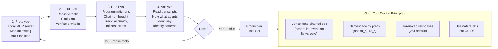

# Chapter 4: Tools and the Agent–Computer Interface

### 4.1 Why Tool Design Is Different

Anthropic introduces the term *agent–computer interface* (ACI) by analogy with HCI: as much engineering should go into how an agent uses tools as goes into how a human uses a screen ([Anthropic — Building Effective Agents](https://www.anthropic.com/engineering/building-effective-agents)). Three concrete recommendations for tool format:

- Give the model enough tokens to "think" before it has to commit to syntax it cannot easily un-write.
- Keep formats close to what the model has seen in training data.
- Avoid formatting overhead like accurate line-counting in diff headers or excessive string-escaping in JSON-embedded code.

When Anthropic built its SWE-bench agent, it spent more time optimizing tool schemas than the prompt itself. A specific improvement: switching tools from relative to absolute filepaths fixed nearly all path-related errors after the agent moved out of the root directory.

### 4.2 Choosing the Right Tools — and the Right Number

Anthropic's later "Writing Effective Tools for Agents" elaborates on the central trap: more tools do not lead to better outcomes ([Anthropic — Writing Effective Tools for Agents](https://www.anthropic.com/engineering/writing-tools-for-agents)). A common error is wrapping every API endpoint as a tool whether or not it suits an agent. Agents have different *affordances* than traditional software: an agent searching an address book by `list_contacts` has to read every contact token-by-token, brute-force, because its context is limited; the right tool is `search_contacts` or `message_contact`.

Tools should consolidate frequently-chained operations. Rather than `list_users`, `list_events`, and `create_event`, build `schedule_event`. Rather than `read_logs`, build `search_logs`. Rather than `get_customer_by_id` + `list_transactions` + `list_notes`, build `get_customer_context`.

### 4.3 Namespacing

When agents have access to dozens of MCP servers and hundreds of tools, name collisions and ambiguous purpose become critical failure modes. Anthropic recommends grouping related tools under common prefixes — service prefixes (`asana_*`, `jira_*`) and resource prefixes within those (`asana_projects_*`, `asana_users_*`). They report that prefix vs. suffix namespacing schemes have non-trivial effects on tool-use evaluations and that the right scheme is workload-specific ([Anthropic — Writing Effective Tools for Agents](https://www.anthropic.com/engineering/writing-tools-for-agents)).

Manus uses the same pattern for action-space control: by giving all browser tools a `browser_` prefix and all shell tools a `shell_` prefix, they can mask large groups of tools at once with simple logit constraints ([Manus — Context Engineering for AI Agents: Lessons from Building Manus](https://manus.im/blog/Context-Engineering-for-AI-Agents-Lessons-from-Building-Manus)).

### 4.4 Returning Meaningful Context

Tool responses should prioritize relevance over flexibility, and natural-language identifiers over technical ones. Anthropic finds that resolving alphanumeric UUIDs to semantically meaningful labels (or even 0-indexed IDs) significantly improves Claude's precision and reduces hallucinations ([Anthropic — Writing Effective Tools for Agents](https://www.anthropic.com/engineering/writing-tools-for-agents)). Where both are needed — natural names for the agent, technical IDs for downstream calls — a `response_format` enum with `concise` and `detailed` modes works well: concise responses can be a third the size of detailed ones in their Slack examples.

### 4.5 Token-Efficient Responses

Tool responses are a major source of context bloat. Anthropic restricts Claude Code's tool responses to 25,000 tokens by default, and recommends a combination of pagination, range selection, filtering, and truncation with sensible defaults ([Anthropic — Writing Effective Tools for Agents](https://www.anthropic.com/engineering/writing-tools-for-agents)). Truncated responses should include guidance steering the agent toward more efficient strategies (small targeted searches over one broad search, for instance), and error responses should be helpful, not opaque tracebacks.

HumanLayer's "back-pressure" practice in their own codebase is a direct application of this: their build and test hooks swallow output on success, surfacing only errors. Early on they had the agent run the full test suite after every change, and 4,000 lines of passing tests would flood the context window, causing the agent to lose track of the actual task and start hallucinating about test files ([HumanLayer — Skill Issue: Harness Engineering for Coding Agents](https://www.humanlayer.dev/blog/skill-issue-harness-engineering-for-coding-agents)).

### 4.6 Prompt-Engineering Tool Descriptions

Anthropic positions this as one of the most effective levers, and reports that it took precise refinements to tool descriptions for Claude Sonnet 3.5 to achieve state-of-the-art on SWE-bench Verified ([Anthropic — Writing Effective Tools for Agents](https://www.anthropic.com/engineering/writing-tools-for-agents)). The advice: write the tool description as you would for a new junior engineer joining the team. Make implicit context explicit (specialized query formats, niche terminology, relationships between resources). Use unambiguous parameter names — `user_id` rather than `user`. Run many examples in a workbench, look at the mistakes, and iterate.

A concrete debugging example: when Anthropic launched Claude's web search tool, traces revealed that Claude was needlessly appending `2025` to the `query` parameter, biasing results. Fixing it required no model retraining — only a clearer tool description.

### 4.7 Code Execution as a Meta-Tool

A more recent shift: instead of presenting MCP tools as direct calls, present them as a code API that the agent invokes by writing code. Anthropic's "Code Execution with MCP" makes the case that for agents with hundreds of tools across dozens of MCP servers, the standard pattern of loading every tool definition into context up front and passing every intermediate result through the model is wasteful ([Anthropic — Code Execution with MCP](https://www.anthropic.com/engineering/code-execution-with-mcp)).

The alternative: expose MCP servers as a filesystem of TypeScript files, one per tool, each file containing a typed wrapper around `callMCPTool`. The agent discovers tools by listing directories and reading the specific tool files it needs. In Anthropic's Google Drive → Salesforce example, this drops token usage from 150,000 to 2,000 — a 98.7% saving.

The benefits compound:

- **Progressive disclosure**: tools are loaded only when needed, addressing the up-front context cost.
- **Context-efficient results**: the agent can filter a 10,000-row spreadsheet to five matching rows in the execution environment before any data crosses into the model's context.
- **Better control flow**: loops, conditionals, and error handling use familiar code patterns, saving on time-to-first-token because the runtime evaluates the conditions, not the model.
- **Privacy-preserving operations**: intermediate results stay in the execution environment by default; only what the agent explicitly logs reaches the model. With a correctly designed proxy, PII can be tokenized at the MCP-client boundary so raw values need not reach the model.
- **State persistence and skills**: agents can save working code as reusable functions backed by `SKILL.md` files, building up a toolbox over time.

Cloudflare reported similar findings under the name "Code Mode," reinforcing the conclusion: LLMs are good at writing code, and developers should let them ([Anthropic — Code Execution with MCP](https://www.anthropic.com/engineering/code-execution-with-mcp)).

The catch: code execution requires sandboxing infrastructure, which has its own operational and security cost.

### 4.8 Iterative Tool Refinement With Evals

Anthropic's recommended workflow for tool development has four stages ([Anthropic — Writing Effective Tools for Agents](https://www.anthropic.com/engineering/writing-tools-for-agents)):

1. **Prototype** the tools in a local MCP server, test by hand, collect intuition.
2. **Build an evaluation** with realistic tasks (multiple tool calls, real data, no toy sandboxes), each paired with verifiable success criteria.
3. **Run the evaluation** programmatically, capturing traces that include planning summaries, tool calls, tool results, runtime, token counts, and tool errors. Where a model exposes a visible thinking mode, that can help debug behavior, but the eval should not depend on access to hidden chain-of-thought.
4. **Analyze results** by reading transcripts, paying attention to what agents *don't* say (LLMs do not always say what they mean), and refactor tools accordingly.

Anthropic ran this loop on their own internal Slack and Asana tools and found that a Claude-optimized version of human-written tools outperformed expert manual implementations on held-out test sets — a result that validates the loop and is an early instance of agents improving their own tools.

---

## Diagram: Tool Design Pipeline — Prototype → Eval → Iterate

---

## Key Takeaways

- **Tool design deserves as much care as prompt design**: the ACI (agent–computer interface) analogy with HCI is apt.
- **More tools hurt, not help**: consolidate frequently-chained operations into single, purpose-built tools.
- **Namespacing is not cosmetic**: it enables logit-level masking of tool groups and prevents collision in large MCP environments.
- **Tool responses are a major source of context bloat**: cap, paginate, filter, and truncate by default.
- **Code execution as meta-tool is a step-change**: exposing MCP tools as a typed code API cut token usage by 98.7% in Anthropic's example.
- **The four-stage eval loop is the recommended workflow**: prototype → build eval → run eval → analyze transcripts → iterate.

## Further Reading

- Ken Aizawa, *Writing Effective Tools for Agents — with Agents*, Anthropic, Sep 2025. https://www.anthropic.com/engineering/writing-tools-for-agents
- Adam Jones and Conor Kelly, *Code Execution with MCP: Building More Efficient Agents*, Anthropic, Nov 2025. https://www.anthropic.com/engineering/code-execution-with-mcp
- Erik Schluntz and Barry Zhang, *Building Effective Agents*, Anthropic, Dec 2024. https://www.anthropic.com/engineering/building-effective-agents
- Yichao 'Peak' Ji, *Context Engineering for AI Agents: Lessons from Building Manus*, Manus, Jul 2025. https://manus.im/blog/Context-Engineering-for-AI-Agents-Lessons-from-Building-Manus
- Kyle Brunet, *Skill Issue: Harness Engineering for Coding Agents*, HumanLayer, Mar 2026. https://www.humanlayer.dev/blog/skill-issue-harness-engineering-for-coding-agents
