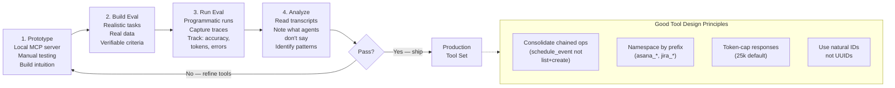

# Chapter 4: Tools and the Agent–Computer Interface

### 4.1 Why Tool Design Is Different

Anthropic uses the term *agent–computer interface* (ACI) by analogy with HCI: designing how an agent uses tools deserves as much engineering attention as designing how a human uses a screen ([Anthropic — Building Effective Agents](https://www.anthropic.com/engineering/building-effective-agents)). It offers three concrete recommendations for tool formats:

- Give the model enough tokens to "think" before it must commit to syntax that is difficult to revise.
- Keep formats close to what the model has seen in training data.
- Avoid unnecessary formatting work, such as exact line counting in diff headers or excessive string escaping in code embedded in JSON.

When Anthropic built its SWE-bench agent, the team spent more time optimizing tool schemas than optimizing the prompt itself. One change illustrates the impact: switching from relative to absolute file paths eliminated nearly all path-related errors that occurred after the agent moved out of the repository root ([Anthropic — Building Effective Agents](https://www.anthropic.com/engineering/building-effective-agents)).

### 4.2 Choosing the Right Tools — and the Right Number

Anthropic's later "Writing Effective Tools for Agents" develops a central warning: giving an agent more tools does not necessarily improve its results ([Anthropic — Writing Effective Tools for Agents](https://www.anthropic.com/engineering/writing-tools-for-agents)). A common mistake is to wrap every API endpoint as a tool, whether or not that endpoint suits the way an agent works. Agents need different *affordances* from traditional software. For example, an agent using `list_contacts` to search an address book must scan every contact token by token, consuming limited context. A purpose-built `search_contacts` or `message_contact` tool gives it a more direct path.

Good tools also consolidate operations that agents frequently chain together. Instead of exposing `list_users`, `list_events`, and `create_event` separately, provide `schedule_event`. Replace `read_logs` with `search_logs`. Combine `get_customer_by_id` + `list_transactions` + `list_notes` into `get_customer_context`.

### 4.3 Where Tools Come From: The Model Context Protocol

The rest of this chapter assumes that an agent has access to a well-designed set of tools. In practice, many of those tools are delivered through a standard interface: the *Model Context Protocol* (MCP). Briefly, MCP is an open client–server standard. An *MCP server* exposes tools—and optionally resources and reusable prompts—through a uniform protocol. Any compatible *client*, such as Claude Code, an IDE, or a custom agent, can then discover and call them without a bespoke integration. Foundations ch 12 covers the transport mechanics and the risks of untrusted results; here, the focus is MCP as a surface for harness design ([Anthropic — Code Execution with MCP](https://www.anthropic.com/engineering/code-execution-with-mcp)).

MCP's main value is composability. A team can connect independently maintained Google Drive, Salesforce, and internal database servers to the same agent, which sees them as one combined tool surface. This is why MCP recurs throughout this book: it provides the substrate for the namespacing, masking, and code-execution patterns discussed below.

The downside is that MCP also makes it trivial to provide too many tools. As Chapter 2 noted, users can connect hundreds of them, leaving the model's context crowded with tool definitions. That is exactly the kind of bloat addressed by Chapter 2's *mask, don't remove* rule and by the consolidation advice above. MCP is plumbing, not a substitute for tool design: a poorly designed MCP server merely delivers poorly designed tools at scale. The practices in this chapter—consolidating frequently chained operations, namespacing tools, capping responses, and writing descriptions like onboarding documentation—apply whether a tool is hand-written or delivered through MCP.

MCP also creates a deployment boundary. An internal server should not have to become public simply because a hosted agent needs to reach it. OpenAI's secure MCP tunnel places an **outbound-only client** inside the private network. The client connects to an explicitly configured destination, preserves streaming and authentication, and remains an inspectable process under the customer's control; no inbound port is required ([OpenAI — Connect Private MCP Servers to OpenAI Products](https://developers.openai.com/blog/connect-private-mcp-servers-to-openai-products)). The broader pattern goes beyond networking: access to a private capability should be initiated by the side that owns it, restricted to named destinations, and audited as delegated authority.

### 4.4 Four Integration Boundaries

The OpenReview survey argues that tool and protocol standards are easiest to compare by the boundary they cross, rather than by vendor or release date ([OpenReview — Agent Harness Engineering: A Survey](https://openreview.net/pdf?id=3hXEPbG0dh)):

- **Model -> Function**: structured invocation such as function calling, where the model emits a machine-readable request for deterministic code.
- **Agent -> External capability**: MCP-style decoupling, where an agent runtime discovers tools, resources, and prompts exposed by external servers.
- **Agent -> Agent**: A2A-style delegation, where one agentic application hands work to another opaque agent with its own state and tools.
- **Agent -> Repo/environment**: version-controlled policy and affordances, such as AGENTS.md, local skills, repo commands, and environment-specific tool rules.

This view explains why MCP, A2A, OpenAPI, function calling, and AGENTS.md are not direct substitutes: each addresses a different integration problem. A harness designer must first identify the boundary involved, then choose a protocol and governance model that preserves provenance, permissions, cost information, and evidence of failure across it.

### 4.5 Namespacing

When agents can access dozens of MCP servers and hundreds of tools, name collisions and unclear purposes become serious failure modes. Anthropic recommends grouping related tools under shared prefixes: service-level prefixes such as `asana_*` and `jira_*`, followed by resource-level prefixes such as `asana_projects_*` and `asana_users_*`. Its evaluations show that choosing prefix or suffix namespacing can materially affect tool-use performance, and that the best scheme depends on the workload ([Anthropic — Writing Effective Tools for Agents](https://www.anthropic.com/engineering/writing-tools-for-agents)).

Manus applies the same pattern to control the agent's action space. By prefixing all browser tools with `browser_` and all shell tools with `shell_`, the harness can mask entire tool groups at once using simple logit constraints ([Manus — Context Engineering for AI Agents: Lessons from Building Manus](https://manus.im/blog/Context-Engineering-for-AI-Agents-Lessons-from-Building-Manus)).

### 4.6 Returning Meaningful Context

Tool responses should favor relevance over flexibility and human-readable identifiers over opaque technical ones. Anthropic finds that replacing alphanumeric UUIDs with meaningful labels—or even zero-indexed IDs—significantly improves Claude's precision and reduces hallucinations ([Anthropic — Writing Effective Tools for Agents](https://www.anthropic.com/engineering/writing-tools-for-agents)). When an agent needs readable names but downstream calls still require technical IDs, a `response_format` enum with `concise` and `detailed` modes works well. In Anthropic's Slack examples, concise responses can be one-third the size of detailed ones.

### 4.7 Token-Efficient Responses

Tool responses are a major source of context bloat. Anthropic limits Claude Code's tool responses to 25,000 tokens by default and recommends combining sensible defaults with pagination, range selection, filtering, and truncation ([Anthropic — Writing Effective Tools for Agents](https://www.anthropic.com/engineering/writing-tools-for-agents)). When a response is truncated, it should guide the agent toward a more efficient strategy—for example, several targeted searches instead of one broad search. Errors should likewise offer useful next steps rather than only an opaque traceback.

HumanLayer applies this idea through "back-pressure": its build and test hooks stay silent on success and surface only errors. Earlier, the team had the agent run the full test suite after every change. Four thousand lines of passing test output would flood the context window, causing the agent to lose track of its task and begin hallucinating about test files ([HumanLayer — Skill Issue: Harness Engineering for Coding Agents](https://www.humanlayer.dev/blog/skill-issue-harness-engineering-for-coding-agents)).

### 4.8 Prompt-Engineering Tool Descriptions

Anthropic describes tool descriptions as one of the most effective design levers. It reports that refining them was a key factor in achieving state-of-the-art results on SWE-bench Verified with Claude Sonnet 3.5 ([Anthropic — Writing Effective Tools for Agents](https://www.anthropic.com/engineering/writing-tools-for-agents)). Write each description as if you were onboarding a junior engineer. Spell out context that might otherwise remain implicit, including specialized query formats, domain-specific terminology, and relationships between resources. Prefer unambiguous parameter names such as `user_id` over `user`. Then run many examples in a workbench, study the mistakes, and iterate.

One debugging example shows the value of this approach. When Anthropic launched Claude's web search tool, traces revealed that Claude was unnecessarily appending `2025` to the `query` parameter and biasing the results. The fix required no model retraining, only a clearer tool description.

### 4.9 Code Execution as a Meta-Tool

A newer approach is to expose MCP tools through a code API rather than as direct calls, allowing the agent to invoke them by writing code. Anthropic's "Code Execution with MCP" argues that the standard pattern becomes wasteful when an agent has hundreds of tools spread across dozens of MCP servers: every tool definition is loaded into context up front, and every intermediate result passes through the model ([Anthropic — Code Execution with MCP](https://www.anthropic.com/engineering/code-execution-with-mcp)).

The alternative is to represent MCP servers as a filesystem of TypeScript files, with one typed `callMCPTool` wrapper per tool. The agent discovers tools by listing directories and reads only the files it needs. In Anthropic's Google Drive → Salesforce example, this reduces token use from 150,000 to 2,000—a 98.7% saving.

This design has several reinforcing benefits:

- **Progressive disclosure**: tools are loaded only when needed, addressing the up-front context cost.
- **Context-efficient results**: the agent can filter a 10,000-row spreadsheet to five matching rows in the execution environment before any data crosses into the model's context.
- **Better control flow**: loops, conditionals, and error handling use familiar code patterns. The runtime, rather than the model, evaluates conditions, reducing time to first token.
- **Privacy-preserving operations**: intermediate results stay in the execution environment by default; only what the agent explicitly logs reaches the model. With a correctly designed proxy, PII can be tokenized at the MCP-client boundary so raw values need not reach the model.
- **State persistence and skills**: agents can save working code as reusable functions backed by `SKILL.md` files, building up a toolbox over time.

Cloudflare reported similar findings under the name "Code Mode." Together, these results support a straightforward conclusion: LLMs are good at writing code, so tool interfaces should make use of that ability ([Anthropic — Code Execution with MCP](https://www.anthropic.com/engineering/code-execution-with-mcp)).

OpenAI's **programmatic tool calling** applies the same idea within a Responses API turn. The model writes a short program that calls permitted tools, filters or joins their results, and returns only the compact output to the model. This works well for bounded dataflow operations—filtering, joining, ranking, deduplicating, aggregating, and validating—because deterministic runtime control replaces many model round trips. It works poorly when each observation substantially changes the next judgment, when every action requires separate approval, or when all source results must remain visible for citation or review ([OpenAI — Programmatic Tool Calling](https://developers.openai.com/api/docs/guides/tools-programmatic-tool-calling)). Use code to compress mechanical orchestration, not to conceal consequential decisions.

Code execution does introduce a tradeoff: it requires sandboxing infrastructure, with its own operational and security costs. It also changes what must be audited. The harness needs to record the program, the tools it was permitted to call, and the side effects it produced—not just the final compact result.

### 4.10 Iterative Tool Refinement With Evals

Anthropic's recommended workflow for tool development has four stages ([Anthropic — Writing Effective Tools for Agents](https://www.anthropic.com/engineering/writing-tools-for-agents)):

1. **Prototype** the tools in a local MCP server, test by hand, collect intuition.
2. **Build an evaluation** with realistic tasks (multiple tool calls, real data, no toy sandboxes), each paired with verifiable success criteria.
3. **Run the evaluation** programmatically, capturing traces that include planning summaries, tool calls, tool results, runtime, token counts, and tool errors. Where a model exposes a visible thinking mode, that can help debug behavior, but the eval should not depend on access to hidden chain-of-thought.
4. **Analyze results** by reading transcripts, paying attention to what agents *do not* say (LLMs do not always state what they mean), and refactor the tools accordingly.

Anthropic applied this loop to its internal Slack and Asana tools. On held-out test sets, versions optimized with Claude outperformed expert-built implementations. The result both supports the workflow and offers an early example of agents improving their own tools.

### 4.11 The Agent-to-Agent Boundary: A2A

The preceding sections cover three of the four integration boundaries in §4.4: model-to-function, agent-to-external-capability (MCP), and agent-to-repo/environment. The fourth, *agent-to-agent*, has an emerging standard of its own. The **Agent2Agent (A2A) protocol**, introduced by Google in April 2025 and donated to the Linux Foundation in June 2025, is an open standard that lets one agentic application delegate work to another *opaque* agent—a peer with its own model, tools, memory, and hidden internal state ([Agent2Agent (A2A) Protocol](https://github.com/a2aproject/A2A); [Linux Foundation — Agent2Agent Protocol Project](https://www.linuxfoundation.org/press/linux-foundation-launches-the-agent2agent-protocol-project-to-enable-secure-intelligent-communication-between-ai-agents)).

The protocol deliberately uses conventional web mechanics. Communication runs over JSON-RPC 2.0 and HTTP(S). Each agent publishes an *Agent Card* that describes its capabilities for discovery. A task lifecycle then covers submission, negotiation of an interaction format—text, files, or structured data—and streaming results back to the caller.

The contrast with MCP is what matters. MCP connects an agent *downward* to tools and resources that it controls and can inspect. A2A connects an agent *across* to a peer that it cannot control or inspect. The primary engineering concern therefore shifts from tool-schema design to *trust and provenance across an organizational boundary*. Because the caller cannot inspect the peer's context or sandbox, an A2A response is untrusted content in the sense defined by Chapter 5. The lethal-trifecta discipline applies to peer agents just as it does to web pages, and governance—scoped identity, delegated authorization, and audit—must cover the A2A call rather than end at the local process (Ch 5, Ch 17). A2A does not eliminate the trust problem; it standardizes the boundary at which that problem must be solved.

This boundary also suggests a practical topology rule. Native multi-agent execution is most useful when tasks are **independent, bounded, and mergeable**, as with parallel research threads, isolated reviews, or separate artifacts. It is usually a poor fit for sequential dependencies or for several writers changing the same state, where coordination overhead and race conditions dominate. In those cases, retain a single owner and use ordinary tools or a deterministic workflow. When peer agents are appropriate, the control plane described in Chapter 18 must still resolve identity, delegated authority, version, lineage, and revocation for every call.

---

## Diagram: Tool Design Pipeline — Prototype → Eval → Iterate

```mermaid
flowchart LR
    A["1. Prototype<br/>Local MCP server<br/>Manual testing<br/>Build intuition"] --> B["2. Build Eval<br/>Realistic tasks<br/>Real data<br/>Verifiable criteria"]
    B --> C["3. Run Eval<br/>Programmatic runs<br/>Capture traces<br/>Track: accuracy,<br/>tokens, errors"]
    C --> D["4. Analyze<br/>Read transcripts<br/>Note what agents<br/>don't say<br/>Identify patterns"]
    D --> E{Pass?}
    E -->|"No — refine tools"| A
    E -->|"Yes — ship"| F["Production<br/>Tool Set"]

    subgraph DESIGN["Good Tool Design Principles"]
        G["Consolidate chained ops<br/>(schedule_event not<br/>list+create)"]
        H["Namespace by prefix<br/>(asana_*, jira_*)"]
        I["Token-cap responses<br/>(25k default)"]
        J["Use natural IDs<br/>not UUIDs"]
    end

    F -.-> DESIGN
```

---

## Key Takeaways

- **Tool design deserves as much care as prompt design**: the ACI (agent–computer interface) is to agents what HCI is to people.
- **More tools can hurt rather than help**: consolidate frequently chained operations into purpose-built tools.
- **MCP standardizes where tools come from**: it makes tools composable across independent servers, but also makes over-supply easy—tool-design discipline still applies.
- **Tool protocols cross different boundaries**: function calling, MCP, A2A, and repo-local policy are complementary, not interchangeable.
- **Namespacing is not cosmetic**: it enables logit-level masking of tool groups and prevents collisions in large MCP environments.
- **Tool responses are a major source of context bloat**: cap, paginate, filter, and truncate by default.
- **Code execution as a meta-tool is a step change**: exposing MCP tools as a typed code API cut token use by 98.7% in Anthropic's example.
- **Programmatic tool calling is for bounded dataflow**: filter, join, rank, deduplicate, aggregate, and validate in code; keep adaptive judgment, approvals, and citation-bearing evidence visible to the agent.
- **Private MCP connectivity should be outbound-only**: initiate the connection from the network that owns the capability, constrain its destination, and audit it as delegated authority.
- **The four-stage eval loop is the recommended workflow**: prototype → build eval → run eval → analyze transcripts → iterate.
- **A2A standardizes the agent-to-agent boundary**: it lets one agent delegate to an opaque peer through JSON-RPC and Agent Cards, shifting the concern from tool-schema design to trust and provenance across an organizational boundary, where the lethal-trifecta and governance rules of Ch 5 apply.
- **Parallel agents need independent ownership**: shared mutable state and sequential dependencies usually call for one owner plus deterministic orchestration.

## Further Reading

- Ken Aizawa, *Writing Effective Tools for Agents — with Agents*, Anthropic, Sep 2025. https://www.anthropic.com/engineering/writing-tools-for-agents
- Adam Jones and Conor Kelly, *Code Execution with MCP: Building More Efficient Agents*, Anthropic, Nov 2025. https://www.anthropic.com/engineering/code-execution-with-mcp
- Erik Schluntz and Barry Zhang, *Building Effective Agents*, Anthropic, Dec 2024. https://www.anthropic.com/engineering/building-effective-agents
- Yichao 'Peak' Ji, *Context Engineering for AI Agents: Lessons from Building Manus*, Manus, Jul 2025. https://manus.im/blog/Context-Engineering-for-AI-Agents-Lessons-from-Building-Manus
- Kyle Brunet, *Skill Issue: Harness Engineering for Coding Agents*, HumanLayer, Mar 2026. https://www.humanlayer.dev/blog/skill-issue-harness-engineering-for-coding-agents
- *Agent Harness Engineering: A Survey*, OpenReview / TMLR submission, 2026. https://openreview.net/pdf?id=3hXEPbG0dh
- *Agent2Agent (A2A) Protocol*, Google / Linux Foundation, 2025. https://github.com/a2aproject/A2A
- Linux Foundation, *Linux Foundation Launches the Agent2Agent Protocol Project*, Jun 2025. https://www.linuxfoundation.org/press/linux-foundation-launches-the-agent2agent-protocol-project-to-enable-secure-intelligent-communication-between-ai-agents
- OpenAI, *Connect Private MCP Servers to OpenAI Products*, Jun 2026. https://developers.openai.com/blog/connect-private-mcp-servers-to-openai-products
- OpenAI, *Programmatic Tool Calling*, 2026. https://developers.openai.com/api/docs/guides/tools-programmatic-tool-calling
