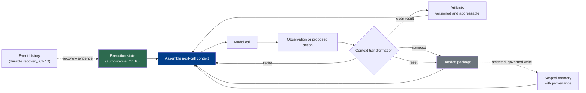

# Chapter 5: Compaction, Memory, and Context Handoffs

A long-horizon task can outlive any one model call and eventually any one context window. Continuity therefore cannot mean “keep appending the transcript.” The harness must transform what the next call sees while preserving enough evidence to recover what was omitted. Foundations Chapter 9 establishes that context is finite, temporary input rather than persistent state; this chapter develops the harness mechanisms that follow from that boundary ([*LLM Foundations*, Chapter 9](../llm-foundations/09-context-window-and-kv-cache.md)).

The central design question is not simply how to make context shorter. It is:

> What may be lost now, what must remain authoritative elsewhere, and how can a later call recover the evidence?

### 5.1 Five Objects That Must Not Collapse into One

Context engineering becomes unsafe when every form of continuity is called “memory.” This book uses five distinct objects:

| Object | Meaning | Source of authority |
|---|---|---|
| **Context** | The token and multimodal representation visible to one model call | The harness assembles it for that call; it expires as model-visible input when the call ends |
| **Memory** | Information stored so that a future call can retrieve or receive it | A memory store with explicit scope, provenance, update, access, and forgetting rules |
| **Execution state** | Structured workflow facts such as the current step, pending action, budget, and approval status | The application or runtime state machine |
| **Artifact** | An addressable work product such as a file, diff, report, dataset, build, or recorded tool output | The artifact store or underlying system of record, identified by a path, URI, version, or content hash |
| **Event history** | An ordered record used to recover durable workflow execution | The runtime's durable history; a replay claim requires recorded model and tool results to be reused rather than silently recomputed |

The model-side distinction between temporary context and persistent state comes from Foundations Chapters 9 and 14 ([*LLM Foundations*, Chapter 9](../llm-foundations/09-context-window-and-kv-cache.md); [*LLM Foundations*, Chapter 14](../llm-foundations/14-operational-mental-model.md)). Temporal provides one concrete durable-execution design in which persisted workflow-history events are used to reconstruct workflow state after failure ([Temporal — History Service](https://github.com/temporalio/temporal/blob/main/docs/architecture/history-service.md)). That implementation is an example, not a requirement that every harness use Temporal.

A compaction summary may become context for the next call, an artifact for inspection, and a candidate memory for later retrieval. It is still not automatically the authoritative execution state or the event history. If the summary says an approval was granted but the runtime state says it is pending, the runtime state wins. Chapter 10 owns execution state, checkpoints, and event histories; this chapter stays with context transformations, memory, and handoff artifacts.

### 5.2 Transformations Have Different Loss Models

The harness has several ways to keep a task within its context budget. They are not interchangeable:

| Technique | Transformation | What can be lost or go wrong | Recovery path |
|---|---|---|---|
| **Tool-result clearing** | Replace a bulky observation with a compact conclusion and pointer | Raw fields, ordering, warnings, or an error detail may disappear | Reload the recorded result or artifact |
| **Recitation** | Restate a goal, plan, or constraint near the end of the current context | Nothing is intentionally removed, but stale or incorrect material can be amplified | Compare with authoritative task state and source evidence |
| **Compaction** | Summarize selected earlier context into a smaller representation | Omitted rationale, minority evidence, exact wording, provenance, or uncertainty | Follow citations and artifact pointers back to primary material |
| **Context reset plus handoff** | Start a new context from a deliberately constructed handoff package | Any fact absent from the package is no longer model-visible | Read authoritative state, artifacts, event history, or memory on demand |
| **Retrieval** | Select external material and inject it into a later call | Relevant evidence can be missed; stale, unauthorized, or misleading material can be selected | Re-query, inspect provenance, and evaluate the retrieval pipeline |

Compaction and clearing reduce material already in context. Reset changes the continuity boundary. Retrieval brings selected external material back. Recitation changes salience without creating persistence. Chapter 4 covers retrieval quality and permission-aware production pipelines; Chapter 3 covers the per-call budget and provider prompt cache behavior.

These choices also have different cache consequences. Rewriting an early prefix may prevent a cross-request **provider prompt cache** match, but matching, retention, and billing are provider-specific contracts rather than correctness guarantees ([OpenAI — Prompt Caching](https://developers.openai.com/api/docs/guides/prompt-caching); [Anthropic — Prompt Caching](https://platform.claude.com/docs/en/build-with-claude/prompt-caching)). Never retain stale or unsafe content merely to preserve a cache hit.

### 5.3 Compaction Is a Lossy, Testable Contract

Compaction summarizes older interaction as the context approaches a chosen budget, then uses the summary as part of a later context. Anthropic recommends tuning compaction prompts on realistic, complex trajectories: first improve recall so continuation-critical information survives, then improve precision by removing material that no longer helps ([Anthropic — Effective Context Engineering for AI Agents](https://www.anthropic.com/engineering/effective-context-engineering-for-ai-agents)). A trigger based on token count or context utilization is an implementation policy, not a universal threshold; triggering too late risks exhausting the window, while triggering too early creates avoidable information loss.

A production compaction should have a schema. At minimum, preserve:

- **decisions** already made, including rationale when it constrains later work;
- **open tasks** and the next expected action, without marking incomplete work as done;
- **constraints**, including user requirements and references to applicable policy checks;
- **artifact pointers**, preferably with a version, commit, or content hash;
- **provenance**, linking important claims to their source observations or documents;
- **unresolved uncertainty**, including conflicting hypotheses and evidence still needed.

Recent actionable failures may also belong in the next context, but they need a lifecycle. Retain the latest error when its exact message, failed arguments, or stack trace can change the next attempt. If the same failure repeats, replace duplicate output with a diagnosis, retry count, and pointer to the raw log. Manus describes retaining useful failures so the model can adapt, while the 12-Factor Agents formulation recommends compacting errors into the next context ([Manus — Context Engineering for AI Agents: Lessons from Building Manus](https://manus.im/blog/Context-Engineering-for-AI-Agents-Lessons-from-Building-Manus); [HumanLayer — 12-Factor Agents](https://www.humanlayer.dev/blog/12-factor-agents)). Neither practice justifies keeping unlimited logs in the live window.

Compaction should be evaluated as a transformation, not judged by how polished its prose sounds. Useful tests resume representative tasks from the compacted package and measure whether the agent preserves required constraints, identifies the next step, locates cited artifacts, retains calibrated uncertainty, and avoids repeating resolved or exhausted work. Compare against an uncompressed baseline where feasible, and include adversarial cases in which an important caveat appears only once or conflicts with the majority of the trace.

### 5.4 Memory Is a Governed Information Product

Structured note-taking turns selected information into a reusable product. Anthropic describes agents maintaining progress notes, maps, and strategies across thousands of game steps, then reloading those notes after context reset ([Anthropic — Effective Context Engineering for AI Agents](https://www.anthropic.com/engineering/effective-context-engineering-for-ai-agents)). The important mechanism is not the filename or prose format. It is the write–retrieve lifecycle around the note.

Each memory item should answer:

- **Scope:** which task, user, tenant, repository, or agent may use it?
- **Provenance:** which observation, source, identity, and tool produced it?
- **Type:** is it an observation, a user preference, a derived conclusion, or an instruction candidate?
- **Freshness:** when was it created, when must it be revalidated, and what can supersede it?
- **Authority:** who authorized the write, and may the future reader access the underlying evidence?
- **Forgetting:** how is it expired, deleted, rolled back, or corrected?

Memory is not automatically true because it is persistent. Retrieval can select the wrong item, consolidation can merge incompatible facts, and a once-correct item can become stale. MemGPT explores virtual context management by moving information between a bounded model context and external storage ([Packer et al. — MemGPT: Towards LLMs as Operating Systems](https://arxiv.org/abs/2310.08560)). Mem0 explores extracting, consolidating, and retrieving memories rather than replaying a complete multi-session history ([Chhikara et al. — Mem0: Building Production-Ready AI Agents with Scalable Long-Term Memory](https://arxiv.org/abs/2504.19413)). These are useful architectural case studies, not evidence that every short task needs a memory subsystem.

Persistent memory is also a trust boundary. Untrusted text copied from a webpage into a shared note can influence later runs long after the original context is gone. Treat observations as data, never promote retrieved content into policy merely because a model summarized it, and re-check authorization when reading as well as writing. Anthropic describes this cross-run risk as persistent memory poisoning and emphasizes containment around agent-accessible state ([Anthropic — How We Contain Claude](https://www.anthropic.com/engineering/how-we-contain-claude)).

### 5.5 Recitation and Clearing Serve Local Continuity

Recitation deliberately rewrites a short task representation—often a checklist—near the end of the current context. Manus reports using a repeatedly updated `todo.md` to keep a long task's goals salient during action-heavy trajectories ([Manus — Context Engineering for AI Agents: Lessons from Building Manus](https://manus.im/blog/Context-Engineering-for-AI-Agents-Lessons-from-Building-Manus)). This is an attention-management technique, not durable state and not a correctness mechanism. The checklist should be regenerated from or reconciled with authoritative task state; otherwise recitation can keep an obsolete plan salient.

The motivation is consistent with the empirical “lost in the middle” result: in the evaluated retrieval and question-answering settings, model performance varied with the position of relevant information in long inputs ([Liu et al. — Lost in the Middle](https://arxiv.org/abs/2307.03172)). That result does not prove that every model or task has the same positional curve, so recitation should be validated on the target workload.

Tool-result clearing is the narrowest lossy operation. Clear a result only after preserving what the next decision needs: the derived conclusion, any material warning or unresolved error, the action taken because of it, and a restorable pointer to the original output. Clearing is especially risky before a side effect has been confirmed, while a result is disputed, or when exact fields may be needed for audit or debugging. The raw output belongs in an artifact store or appropriate record, not indefinitely in the live context.

### 5.6 Handoffs Are Typed Interfaces, Not Trusted Summaries

A context handoff occurs whenever work crosses a context boundary: after reset, between sessions, from a sub-agent to a parent, or from one model configuration to another. Treat it like an interface with a schema rather than an informal paragraph.

A robust handoff package contains:

1. **Task identity and bounded scope** — what was requested, what was deliberately excluded, and the completion criterion.
2. **Worker identity and authority scope** — which agent/model/tooling performed the work and which resources it could access.
3. **Claims and decisions** — the concise result, clearly separated from observations and proposals.
4. **Evidence and provenance** — inline citations plus addressable artifacts, versions, queries, commands, or tool-call identifiers.
5. **External effects** — actions attempted, confirmed outcomes, failures, and any pending approval.
6. **Uncertainty and open questions** — confidence limits, conflicts, missing evidence, and assumptions.
7. **Verification status** — tests or checks actually run, with their results and pointers to complete output.
8. **Next action** — what the receiver should do, including any revalidation required before a privileged action.

Sub-agents are valuable context firewalls because they can perform a tool-heavy investigation in an independent window and return a compact result to the parent ([Anthropic — Effective Context Engineering for AI Agents](https://www.anthropic.com/engineering/effective-context-engineering-for-ai-agents); [HumanLayer — Skill Issue: Harness Engineering for Coding Agents](https://www.humanlayer.dev/blog/skill-issue-harness-engineering-for-coding-agents)). The firewall removes intermediate noise; it does not make the result more trustworthy.

In particular, a high-privilege parent must not treat a low-privilege worker's summary as authorization or verified fact. The parent should inspect the cited evidence, re-check current policy at action dispatch, and independently confirm high-impact outcomes. Identity and scope must travel with the result so the receiver knows what the worker could and could not observe. A handoff artifact can inform execution state, but only the runtime or application may commit that state transition; Chapters 6, 7, and 19 develop dispatch, enforcement, and fleet identity.

### 5.7 A Context-Continuity Loop

The dashed memory edge is deliberate: not every summary should become durable memory. Promotion requires an explicit write policy, provenance, scope, and lifecycle. Likewise, the event history supports recovery but is not simply poured into every model call.

---

## Key Takeaways

- **Context, memory, execution state, artifacts, and event history are different objects:** a summary can reference authoritative state but does not replace it.
- **Every context transformation has a loss model:** clearing, recitation, compaction, reset, and retrieval fail in different ways and need different recovery paths.
- **Compaction needs a schema and an evaluation:** preserve decisions, open tasks, constraints, artifact pointers, provenance, and unresolved uncertainty.
- **Useful errors have a lifecycle:** retain recent actionable detail, compact repeated noise, and keep raw evidence recoverable.
- **Memory is governed, scoped, and revisable:** persistence does not make a model-generated note true or authorized.
- **Recitation changes salience, not authority:** reconcile repeated plans with the actual task state.
- **A context firewall is not a trust firewall:** sub-agent results need evidence, identity and authority scope, uncertainty, verification status, and addressable artifacts.
- **A high-privilege parent must revalidate before acting:** a worker's summary is neither authorization nor confirmed outcome.
- **Use provider prompt cache for cross-request reuse:** never call it the per-request KV cache or sacrifice correctness merely to preserve a hit.

## Further Reading

- Anthropic Applied AI Team, *Effective Context Engineering for AI Agents*, Anthropic, Sep 2025. https://www.anthropic.com/engineering/effective-context-engineering-for-ai-agents
- OpenAI, *Prompt Caching*. https://developers.openai.com/api/docs/guides/prompt-caching
- Anthropic, *Prompt Caching*. https://platform.claude.com/docs/en/build-with-claude/prompt-caching
- Yichao 'Peak' Ji, *Context Engineering for AI Agents: Lessons from Building Manus*, Manus, Jul 2025. https://manus.im/blog/Context-Engineering-for-AI-Agents-Lessons-from-Building-Manus
- Kyle Brunet, *Skill Issue: Harness Engineering for Coding Agents*, HumanLayer, Mar 2026. https://www.humanlayer.dev/blog/skill-issue-harness-engineering-for-coding-agents
- Dex Horthy, *12-Factor Agents*, HumanLayer, Apr 2025. https://www.humanlayer.dev/blog/12-factor-agents
- Charles Packer et al., *MemGPT: Towards LLMs as Operating Systems*, arXiv, Oct 2023. https://arxiv.org/abs/2310.08560
- Prateek Chhikara et al., *Mem0: Building Production-Ready AI Agents with Scalable Long-Term Memory*, arXiv, Apr 2025. https://arxiv.org/abs/2504.19413
- Nelson F. Liu et al., *Lost in the Middle: How Language Models Use Long Contexts*, TACL, 2024. https://arxiv.org/abs/2307.03172
- Anthropic Safeguards Research Team, *How We Contain Claude*, Anthropic, May 2026. https://www.anthropic.com/engineering/how-we-contain-claude
- Temporal, *History Service*. https://github.com/temporalio/temporal/blob/main/docs/architecture/history-service.md
