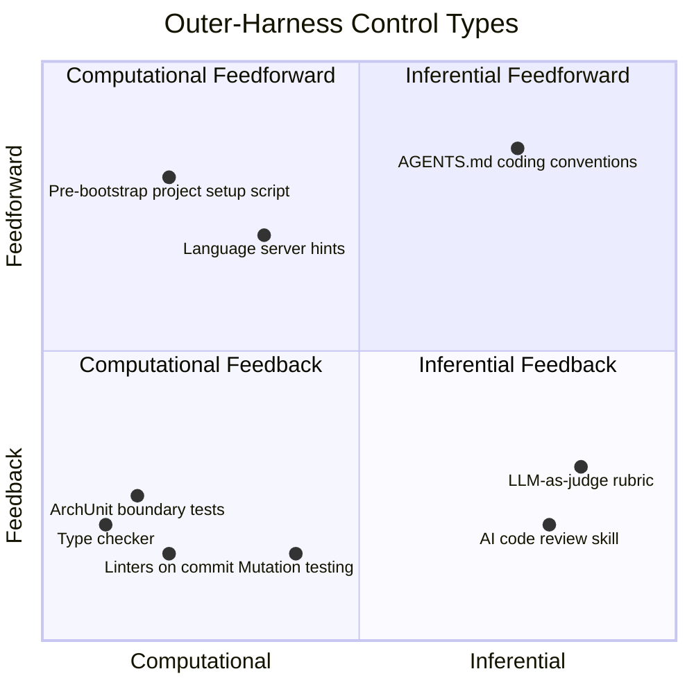

# Chapter 5: Sandboxing, Guardrails, and Safe Autonomy

### 5.1 The Agent Security Threat Model

Most of this chapter is about *mitigations* — sandboxes, hooks, approval gates. It is worth first stating plainly what they mitigate. An agent that reads untrusted content and can act on the world has a specific risk profile ([Anthropic — Beyond Permission Prompts](https://www.anthropic.com/engineering/claude-code-sandboxing)):

- **Prompt injection** — instructions hidden in content the agent reads (a web page, an issue comment, a source file, a tool result) are interpreted by the model as if they were commands. The model cannot reliably separate data from instructions; anything that reaches context can steer it.
- **Data exfiltration** — a steered agent with network access can send secrets — SSH keys, API tokens, proprietary source — to an attacker-controlled destination.
- **Destructive action** — a steered agent with filesystem or shell access can delete or corrupt files, or commit and push bad code.
- **Tool and supply-chain risk** — a malicious or compromised MCP server, package, or dependency can introduce hostile tools or instructions that the agent then trusts.

The combination practitioners worry about most is sometimes called the *lethal trifecta*: access to private data, exposure to untrusted content, and the ability to communicate externally ([Simon Willison — The lethal trifecta for AI agents](https://simonwillison.net/2025/Jun/16/the-lethal-trifecta/)). Any one alone is survivable; all three in a single agent mean one injected instruction can read a secret and send it out. Most controls in this chapter work by breaking one leg of the trifecta — network isolation removes external communication, filesystem isolation removes private-data access, and approval gates put a human in the path of consequential actions.

The framing to carry into the rest of the chapter: the model is not a trusted component. It is a capable but steerable core, and the harness is what stands between a hostile instruction and a real-world consequence.

### 5.2 The Permission Fatigue Problem

Coding agents that run with no oversight are dangerous; coding agents that ask permission for every action are unusable. Anthropic frames this as approval fatigue: "Constantly clicking 'approve' slows down development cycles and can lead to 'approval fatigue,' where users might not pay close attention to what they're approving, and in turn making development less safe" ([Anthropic — Beyond Permission Prompts: Making Claude Code More Secure and Autonomous](https://www.anthropic.com/engineering/claude-code-sandboxing)). The solution is structural: define boundaries within which the agent can act freely, and only ask for permission when those boundaries are crossed.

In their internal usage, sandboxing safely reduces permission prompts by 84%.

### 5.3 Filesystem and Network Isolation Must Be Paired

Claude Code's sandbox enforces two boundaries simultaneously, and Anthropic argues both are required. Filesystem isolation prevents a prompt-injected agent from modifying sensitive files; network isolation prevents it from leaking data or downloading malware. Without network isolation, a compromised agent could exfiltrate SSH keys; without filesystem isolation, a compromised agent could escape the sandbox and reach the network ([Anthropic — Beyond Permission Prompts](https://www.anthropic.com/engineering/claude-code-sandboxing)).

The implementation builds on OS-level primitives — Linux bubblewrap and macOS seatbelt — and covers not just direct Claude Code interactions but any subprocess. Network access is funneled through a Unix domain socket to a proxy that enforces domain restrictions and handles user confirmation for newly requested domains. The runtime is open-sourced.

Claude Code on the web extends this to a cloud sandbox where sensitive credentials (git credentials, signing keys) are never inside the sandbox with the agent at all. A custom proxy handles git interactions, attaching scoped credentials only after validating that the operation is permitted (e.g., pushing only to the configured branch).

### 5.4 Hooks and Middleware as Programmatic Enforcement

The sandbox is one form of programmatic guardrail; hooks and middleware are another, finer-grained one. Claude Code supports user-defined commands or scripts that run automatically on lifecycle events — at agent start, after a tool call, on stop, and so on ([HumanLayer — Skill Issue: Harness Engineering for Coding Agents](https://www.humanlayer.dev/blog/skill-issue-harness-engineering-for-coding-agents)). LangChain's middleware concept is structurally similar. Some hooks are fully deterministic scripts; others are procedural checkpoints that inject context back into the model. The reliability comes from the harness executing them automatically, not from the model remembering a rule.

Common uses are notifications (sounds when an agent finishes), automated approvals or denials (deny migration commands; ask the user to run them instead), integrations (post a Slack message, open a PR), and verification (run typecheck and build on stop, surface errors to the agent so it has to fix them before finishing). HumanLayer's example hook runs Biome and TypeScript in parallel on every Claude stop, exits silently on success, and on failure surfaces only the errors with exit code 2, telling the harness to re-engage the agent.

LangChain reports this kind of middleware was central to lifting their deepagents-cli from Top 30 to Top 5 on Terminal-Bench 2.0. Their `PreCompletionChecklistMiddleware` intercepts the agent before exit and reminds it to run a verification pass against the task spec; a `LocalContextMiddleware` runs at start to map the working directory and discover available tools; a `LoopDetectionMiddleware` tracks per-file edit counts and prompts the agent to reconsider after N edits to the same file, breaking "doom loops" of small variations on a broken approach ([LangChain — Improving Deep Agents with Harness Engineering](https://blog.langchain.com/improving-deep-agents-with-harness-engineering/)).

### 5.5 Feedforward and Feedback: A Cybernetic View

Thoughtworks' Birgitta Böckeler offers a higher-level taxonomy ([Thoughtworks — Harness Engineering](https://martinfowler.com/articles/exploring-gen-ai/harness-engineering.html)). Outer-harness controls fall into two directions:

- **Guides (feedforward)** anticipate the agent's behavior and steer it before it acts. They increase the probability of good output on the first attempt — instructions in AGENTS.md, skills, reference documentation, language-server hints.
- **Sensors (feedback)** observe after the agent acts and help it self-correct. Tests, linters, type checkers, AI code review.

A harness with only feedforward guides keeps issuing rules but never learns whether they work; a harness with only feedback sensors keeps catching the same mistake without preventing recurrence. Both are needed.

Within each direction there is a second axis:

- **Computational** controls — linters, type checkers, structural tests — are deterministic, run in milliseconds to seconds, and produce reliable results.
- **Inferential** controls — semantic analysis, AI code review, LLM-as-judge — handle nuance but are slower, more expensive, and non-deterministic.

The two axes are independent. Coding conventions in AGENTS.md are inferential feedforward. ArchUnit tests checking module boundaries on commit are computational feedback. A `/code-review` skill is inferential feedback. A pre-bootstrap script that sets up the project structure is computational feedforward. A well-engineered harness mixes all four.

### 5.6 Three Regulation Categories

Böckeler further distinguishes harnesses by what they regulate ([Thoughtworks — Harness Engineering](https://martinfowler.com/articles/exploring-gen-ai/harness-engineering.html)):

- **Maintainability harness** — internal code quality, duplication, complexity, coverage, style. The easiest category, with a long history of pre-existing tooling.
- **Architecture fitness harness** — performance, observability, debuggability. Captures cross-cutting "fitness functions" of the application.
- **Behavior harness** — does the application functionally behave the way it should? This is the unsolved category. Today, most teams rely on functional specs as feedforward and AI-generated test suites as feedback, occasionally augmented with mutation testing — and Böckeler is candid that trusting AI-generated tests "is not good enough yet."

The point of these categories is to make it possible to assess harness coverage. A harness that is strong on maintainability but weak on behavior gives a false sense of safety.

### 5.7 Timing: Keep Quality Left

Continuous integration teaches that the earlier you find issues the cheaper they are to fix, and the same holds for harness design. Fast computational sensors (linters, fast tests) should run before commit; expensive computational and inferential sensors (mutation testing, broader code review) run post-integration in the pipeline; continuous-drift sensors (dead-code detection, dependency scanners, log-anomaly judges) run outside the change lifecycle altogether ([Thoughtworks — Harness Engineering](https://martinfowler.com/articles/exploring-gen-ai/harness-engineering.html)).

The OpenAI Codex team's harness, as Böckeler notes, follows the same shape: layered architecture enforced by custom linters and structural tests, plus recurring "garbage collection" passes that scan for drift and have agents suggest fixes.

### 5.8 Harnessability and Ambient Affordances

Not every codebase is equally amenable to harnessing. A strongly-typed language brings type-checking sensors for free; clear module boundaries afford architectural constraint rules; opinionated frameworks like Spring abstract away details the agent does not have to worry about ([Thoughtworks — Harness Engineering](https://martinfowler.com/articles/exploring-gen-ai/harness-engineering.html)).

Ned Letcher's term *ambient affordances* captures this: properties of the environment itself that make it legible, navigable, and tractable to agents. Greenfield teams can engineer affordances in from day one; legacy teams face the inverse — the harness is most needed where it is hardest to build.

Anticipating the future, Böckeler suggests *harness templates* — bundled guides and sensors per service topology (CRUD service in JVM, event processor in Go, dashboard in Node) — that ride along with existing service templates. Ashby's Law of Requisite Variety makes the case formally: a regulator must have at least as much variety as the system it governs, so committing to a constrained topology is itself a variety-reduction move that makes a comprehensive harness more achievable.

---

## Diagram: Feedforward/Feedback × Computational/Inferential Quadrant

---

## Key Takeaways

- **The threat model comes first**: prompt injection, data exfiltration, destructive action, and supply-chain risk — the *lethal trifecta* of private data + untrusted content + external communication is the core danger every control targets.
- **Sandboxing reduces permission prompts by 84%** while maintaining safety — structural boundaries beat approval dialogs.
- **Filesystem and network isolation must be paired**: each addresses a different attack vector, and either alone is insufficient.
- **Hooks and middleware are programmatic enforcement**: they run regardless of model memory, making them more reliable than prompt-only constraints.
- **Feedforward and feedback are both required**: guides without sensors have no learning loop; sensors without guides react but don't prevent.
- **Three categories of harness coverage**: maintainability (well-tooled), architecture fitness (achievable), and behavior (the unsolved problem).
- **Ambient affordances matter**: strongly-typed languages and opinionated frameworks make harnessing easier from day one.

## Further Reading

- David Dworken and Oliver Weller-Davies, *Beyond Permission Prompts: Making Claude Code More Secure and Autonomous*, Anthropic, Oct 2025. https://www.anthropic.com/engineering/claude-code-sandboxing
- Birgitta Böckeler, *Harness Engineering for Coding Agent Users*, Thoughtworks / martinfowler.com, Apr 2026. https://martinfowler.com/articles/exploring-gen-ai/harness-engineering.html
- Kyle Brunet, *Skill Issue: Harness Engineering for Coding Agents*, HumanLayer, Mar 2026. https://www.humanlayer.dev/blog/skill-issue-harness-engineering-for-coding-agents
- Vivek Trivedy, *Improving Deep Agents with Harness Engineering*, LangChain, Feb 2026. https://blog.langchain.com/improving-deep-agents-with-harness-engineering/
