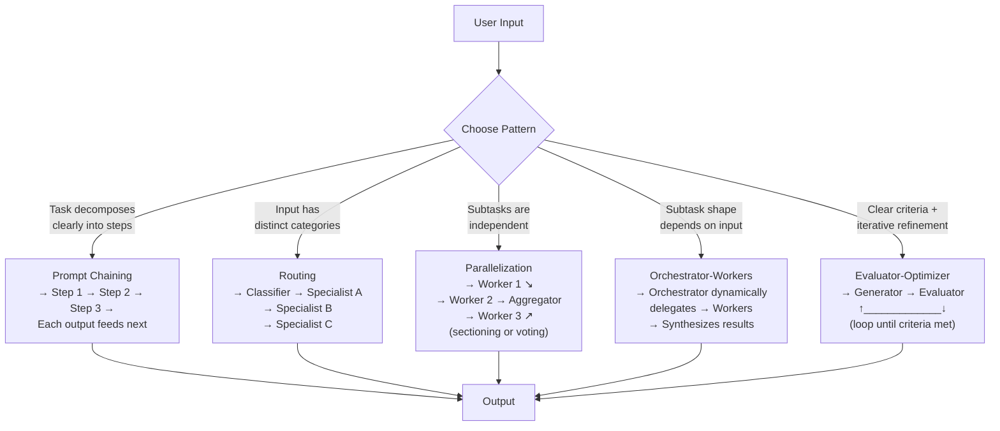

# Chapter 6: Agentic Workflow Patterns

### 6.1 Workflows vs. Agents

Anthropic distinguishes two architectures within the broader category of "agentic systems" ([Anthropic — Building Effective Agents](https://www.anthropic.com/engineering/building-effective-agents)):

- **Workflows** orchestrate LLMs and tools through predefined code paths.
- **Agents** dynamically direct their own processes and tool usage.

The first principle they push is to find the simplest solution and only add complexity when needed. Many use cases do not need agents at all — single LLM calls with retrieval and in-context examples are usually enough. Workflows give predictability and consistency for well-defined tasks; agents are right when flexibility and model-driven decision-making are needed at scale.

### 6.2 The Augmented LLM

The basic building block is the *augmented LLM*: a model with retrieval, tools, and memory. Modern models can actively use these — generating their own queries, selecting tools, deciding what to retain ([Anthropic — Building Effective Agents](https://www.anthropic.com/engineering/building-effective-agents)). MCP is one increasingly common way to expose these augmentations.

### 6.3 Compositional Workflow Patterns

From simplest to most flexible:

**Prompt chaining** decomposes a task into sequential steps, each LLM call processing the previous output, with optional programmatic gates. Use it when a task can be cleanly decomposed and you want to trade latency for accuracy by making each call simpler. Example: write a marketing copy, then translate it.

**Routing** classifies an input and dispatches it to a specialized follow-up. Use when distinct categories benefit from separate handling and classification can be done reliably. Example: route customer service queries to refund-handling, technical-support, or general-question pipelines.

**Parallelization** runs LLM calls simultaneously and aggregates outputs. Two variants — *sectioning* breaks into independent subtasks, *voting* runs the same task multiple times. Use for speed or when multiple perspectives improve confidence (vulnerability review across multiple prompts, content-moderation with multiple votes).

**Orchestrator-workers** has a central LLM that dynamically breaks down tasks, delegates to worker LLMs, and synthesizes results. Differs from parallelization because subtasks are not pre-defined. Use for complex tasks where the subtask shape depends on input — coding agents touching many files, research over many sources.

**Evaluator-optimizer** has one LLM generating, another critiquing, in a loop. Use when there are clear evaluation criteria and iterative refinement provides measurable value. The two indicators: human feedback measurably improves output, and an LLM can plausibly produce that feedback. Examples: literary translation with critic, multi-round research with relevance evaluator.

### 6.4 Three Principles for Agent Implementation

Anthropic ends with three rules ([Anthropic — Building Effective Agents](https://www.anthropic.com/engineering/building-effective-agents)):

1. **Maintain simplicity** in agent design.
2. **Prioritize transparency** by explicitly showing the agent's planning steps.
3. **Carefully craft the agent–computer interface** through tool documentation and testing.

Frameworks help you start fast but can introduce abstraction layers that obscure the underlying prompts and tool calls. Anthropic recommends starting with direct API calls when you are still learning the shape of the problem, then reaching for a framework when the repeated patterns and operational needs justify it.

### 6.5 The Micro-Agent Pattern

HumanLayer's pragmatic version of the same insight ([HumanLayer — 12-Factor Agents](https://www.humanlayer.dev/blog/12-factor-agents)): the "loop until done" pattern hits a wall around 10–20 turns, after which agents lose coherence. What works is sprinkling small, focused agents into a broader deterministic DAG. Their deploybot example has deterministic code handling staging deployment, e2e tests, and the actual prod deploy commands; the LLM only intervenes to interpret human plaintext feedback ("can you deploy the backend first?") and propose updated steps. By keeping the agent's domain to 5–10 steps, error spin-outs become rare.

The principle generalizes: when the model gets smarter, agents may grow to handle more steps, but the small-focused-agent approach lets you ship results today and expand scope incrementally as model capabilities allow.

---

## Diagram: The Five Workflow Patterns

---

## Key Takeaways

- **Start with the simplest pattern**: many tasks need only a single LLM call; adding agent loops is often premature.
- **Workflows give predictability; agents give flexibility**: choose based on whether the subtask structure is known ahead of time.
- **Five patterns cover most cases**: chaining, routing, parallelization, orchestrator-workers, and evaluator-optimizer.
- **The micro-agent approach scales well today**: 5–10 step focused agents embedded in a deterministic DAG outperform "loop until done" for most tasks.
- **Preserve visibility before abstraction**: direct API calls make early behavior easier to inspect; frameworks pay off once patterns stabilize.

## Further Reading

- Erik Schluntz and Barry Zhang, *Building Effective Agents*, Anthropic, Dec 2024. https://www.anthropic.com/engineering/building-effective-agents
- Dex Horthy, *12-Factor Agents*, HumanLayer, Apr 2025. https://www.humanlayer.dev/blog/12-factor-agents
- Vivek Trivedy, *The Anatomy of an Agent Harness*, LangChain, Mar 2026. https://blog.langchain.com/the-anatomy-of-an-agent-harness/
