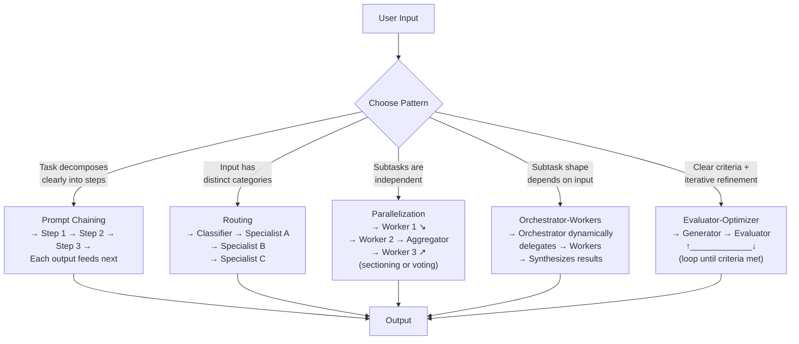

# Chapter 6: Agentic Workflow Patterns

### 6.1 Workflows vs. Agents

Anthropic distinguishes two architectures within the broader category of "agentic systems" ([Anthropic — Building Effective Agents](https://www.anthropic.com/engineering/building-effective-agents)):

- **Workflows** orchestrate LLMs and tools through predefined code paths.
- **Agents** dynamically direct their own processes and tool usage.

Anthropic's first principle is to use the simplest solution that works and add complexity only when the task demands it. Many use cases do not need agents at all: a single LLM call, supplemented by retrieval and in-context examples, is often enough. Workflows provide predictability and consistency for well-defined tasks. Agents are a better fit when the path cannot be specified in advance and the system needs model-driven decisions at scale.

### 6.2 The Augmented LLM

The basic building block is the *augmented LLM*: a model connected to retrieval, tools, and memory. Modern models can use these capabilities actively by generating queries, selecting tools, and deciding what information to retain ([Anthropic — Building Effective Agents](https://www.anthropic.com/engineering/building-effective-agents)). MCP (see Ch 4) is an increasingly common way to make these capabilities available to the model.

### 6.3 Compositional Workflow Patterns

The following patterns progress from the simplest and most constrained to the most flexible:

**Prompt chaining** breaks a task into sequential steps. Each LLM call processes the previous call's output, with optional programmatic checks between steps. Use it when the task decomposes cleanly and simpler calls can improve accuracy enough to justify the added latency. For example, one call might draft marketing copy and a second translate it. The main failure mode is propagation: latency accumulates across the chain, and an early error can contaminate every later step. Add gates at important boundaries.

**Routing** classifies an input and dispatches it to a specialized path. Use it when inputs fall into distinct categories that benefit from different handling, and when those categories can be identified reliably. A customer-service system, for example, might route requests to refund, technical-support, or general-question pipelines. Because misclassified and ambiguous inputs can fail silently, instrument the classifier and monitor its error rate.

**Parallelization** runs LLM calls simultaneously and then aggregates their outputs. It has two common variants: *sectioning* divides the work into independent subtasks, while *voting* runs the same task multiple times. Use parallelization to reduce latency or when multiple perspectives improve confidence, as in vulnerability reviews with several prompts or content moderation with multiple votes. Voting multiplies token cost by the number of runs, however, and correlated errors can make unanimous results falsely reassuring.

**Orchestrator-workers** uses a central LLM to break down a task dynamically, delegate subtasks to worker LLMs, and synthesize their results. Unlike basic parallelization, the subtasks are not defined in advance. This pattern suits complex work whose decomposition depends on the input, such as a coding task that spans many files or research across many sources. Its main risk is uncontrolled fan-out, so cap both the number of workers and the total token budget.

**Evaluator-optimizer** places generation and critique in a loop, usually with one LLM producing an answer and another evaluating it. Use this pattern when the evaluation criteria are clear and iterative refinement produces measurable gains. Two signals indicate a good fit: human feedback reliably improves the output, and an LLM can plausibly provide similar feedback. Examples include literary translation with a critic and multi-round research with a relevance evaluator. Because the loop may never converge, set a maximum number of iterations; every round adds latency and cost.

### 6.4 Three Principles for Agent Implementation

Anthropic concludes with three implementation rules ([Anthropic — Building Effective Agents](https://www.anthropic.com/engineering/building-effective-agents)):

1. **Maintain simplicity** in agent design.
2. **Prioritize transparency** by explicitly showing the agent's planning steps.
3. **Carefully craft the agent–computer interface** through tool documentation and testing.

Frameworks can accelerate early development, but their abstraction layers may obscure the prompts and tool calls that determine system behavior. Anthropic recommends starting with direct API calls while learning the shape of the problem. Adopt a framework once repeated patterns and operational requirements make the additional abstraction worthwhile.

### 6.5 The Micro-Agent Pattern

HumanLayer offers a pragmatic version of the same idea ([HumanLayer — 12-Factor Agents](https://www.humanlayer.dev/blog/12-factor-agents)). The "loop until done" pattern tends to hit a wall after roughly 10–20 turns. Beyond that point, accumulated context and per-turn errors cause agents to lose coherence (see Ch 2, Context as a Finite Resource).

A more reliable design embeds small, focused agents within a deterministic DAG—a directed acyclic graph of steps defined in code. LangChain describes the same harness shape ([LangChain — The Anatomy of an Agent Harness](https://blog.langchain.com/the-anatomy-of-an-agent-harness/)). In its deploybot example, deterministic code handles the staging deployment, end-to-end tests, and production deployment commands. The LLM intervenes only to interpret plain-language feedback, such as "can you deploy the backend first?", and propose revised steps. Limiting the agent's scope to 5–10 steps makes runaway errors much less common.

The principle generalizes as models improve. More capable agents may eventually manage longer sequences, but small, focused agents let teams ship reliable systems now and expand their scope incrementally as model capabilities grow.

### 6.6 Reasoning and Self-Correction Patterns

The five patterns in §6.3 are compositional *control-flow* patterns: they determine how calls are orchestrated. A parallel line of research examines *reasoning* patterns—ways for a single agent, or a tight loop, to structure deliberation and self-correction. These patterns complement workflow patterns rather than replace them. The following names recur frequently in the literature:

- **ReAct** interleaves reasoning and action: the model thinks, calls a tool, observes the result, and repeats. It is the foundation of most agent loops (Ch 1; *LLM Foundations* Ch 12).
- **Reflexion** adds a memory of self-critique. After a failed attempt, the agent records a natural-language reflection on *why* it failed and retries with that reflection in context. The authors describe this as "verbal reinforcement learning" without a weight update ([Shinn et al. — Reflexion](https://arxiv.org/abs/2303.11366)).
- **Self-Refine** collapses the evaluator-optimizer pattern (§6.3) into one model: it generates, critiques its own output, and revises, iterating until satisfied ([Madaan et al. — Self-Refine](https://arxiv.org/abs/2303.17651)).
- **CRITIC** grounds critique in *external tools*—such as search, code execution, and calculators—rather than introspection alone. Corrections are checked against evidence from the world instead of the model's own confidence ([Gou et al. — CRITIC](https://arxiv.org/abs/2305.11738)).
- **Tree of Thoughts (ToT)** replaces the single reasoning chain with a search over branches, using lookahead and backtracking to explore multiple partial solutions before committing ([Yao et al. — Tree of Thoughts](https://arxiv.org/abs/2305.10601)).
- **LATS** unifies reasoning, acting, and planning by running Monte Carlo Tree Search over agent trajectories, with an LM value function and reflection guiding the search ([Zhou et al. — Language Agent Tree Search](https://arxiv.org/abs/2310.04406)).
- **ReWOO** separates planning from execution. A *Planner* writes the full plan up front, *Workers* execute the tool calls, and a *Solver* composes the answer. This structure reduces token use because the agent does not re-reason after every observation ([Xu et al. — ReWOO](https://arxiv.org/abs/2305.18323)).

From a harness perspective, these patterns make similar tradeoffs: they spend tokens and latency to gain reliability. As §6.1 and Chapter 14 warn, that trade is worthwhile for difficult, verifiable tasks but becomes unnecessary overhead for easy ones. Self-correction is more trustworthy when it is *grounded* in tools or tests—as in CRITIC, the verifier-gated cascades of Ch 14, and the generator–evaluator split of Ch 7—than when it relies only on the model critiquing itself. This supports the book's recurring principle that verification is stronger than introspection (Ch 7, Ch 10).

---

## Diagram: The Five Workflow Patterns

```mermaid
flowchart TD
    INPUT["User Input"] --> CHOICE{Choose Pattern}

    CHOICE -->|"Task decomposes<br/>clearly into steps"| CHAIN["Prompt Chaining<br/>→ Step 1 → Step 2 → Step 3 →<br/>Each output feeds next"]
    CHOICE -->|"Input has<br/>distinct categories"| ROUTE["Routing<br/>→ Classifier → Specialist A<br/>                → Specialist B<br/>                → Specialist C"]
    CHOICE -->|"Subtasks are<br/>independent"| PARALLEL["Parallelization<br/>→ Worker 1 ↘<br/>→ Worker 2 → Aggregator<br/>→ Worker 3 ↗<br/>(sectioning or voting)"]
    CHOICE -->|"Subtask shape<br/>depends on input"| ORCH["Orchestrator-Workers<br/>→ Orchestrator dynamically<br/>  delegates → Workers<br/>  → Synthesizes results"]
    CHOICE -->|"Clear criteria +<br/>iterative refinement"| EVALOPT["Evaluator-Optimizer<br/>→ Generator → Evaluator<br/>      ↑_____________↓<br/>   (loop until criteria met)"]

    CHAIN --> OUT["Output"]
    ROUTE --> OUT
    PARALLEL --> OUT
    ORCH --> OUT
    EVALOPT --> OUT
```

---

## Key Takeaways

- **Start with the simplest pattern**: many tasks need only a single LLM call; adding agent loops is often premature.
- **Workflows give predictability; agents give flexibility**: choose based on whether the subtask structure is known ahead of time.
- **Five patterns cover most cases**: chaining, routing, parallelization, orchestrator-workers, and evaluator-optimizer.
- **The micro-agent approach scales well today**: focused agents that handle 5–10 steps within a deterministic DAG outperform "loop until done" for most tasks.
- **Preserve visibility before abstraction**: direct API calls make early behavior easier to inspect; frameworks pay off once patterns stabilize.
- **Reasoning patterns compose with workflow patterns**: Reflexion, Self-Refine, CRITIC, Tree of Thoughts, LATS, and ReWOO structure a model's deliberation. They are most valuable for difficult, verifiable tasks, and most trustworthy when self-correction is grounded in tools or tests rather than introspection.

## Further Reading

- Erik Schluntz and Barry Zhang, *Building Effective Agents*, Anthropic, Dec 2024. https://www.anthropic.com/engineering/building-effective-agents
- Dex Horthy, *12-Factor Agents*, HumanLayer, Apr 2025. https://www.humanlayer.dev/blog/12-factor-agents
- Vivek Trivedy, *The Anatomy of an Agent Harness*, LangChain, Mar 2026. https://blog.langchain.com/the-anatomy-of-an-agent-harness/
- Noah Shinn et al., *Reflexion: Language Agents with Verbal Reinforcement Learning*, arXiv, Mar 2023. https://arxiv.org/abs/2303.11366
- Aman Madaan et al., *Self-Refine: Iterative Refinement with Self-Feedback*, arXiv, Mar 2023. https://arxiv.org/abs/2303.17651
- Zhibin Gou et al., *CRITIC: Large Language Models Can Self-Correct with Tool-Interactive Critiquing*, arXiv, May 2023. https://arxiv.org/abs/2305.11738
- Shunyu Yao et al., *Tree of Thoughts: Deliberate Problem Solving with Large Language Models*, arXiv, May 2023. https://arxiv.org/abs/2305.10601
- Andy Zhou et al., *Language Agent Tree Search Unifies Reasoning, Acting, and Planning in Language Models*, arXiv, Oct 2023. https://arxiv.org/abs/2310.04406
- Binfeng Xu et al., *ReWOO: Decoupling Reasoning from Observations for Efficient Augmented Language Models*, arXiv, May 2023. https://arxiv.org/abs/2305.18323
