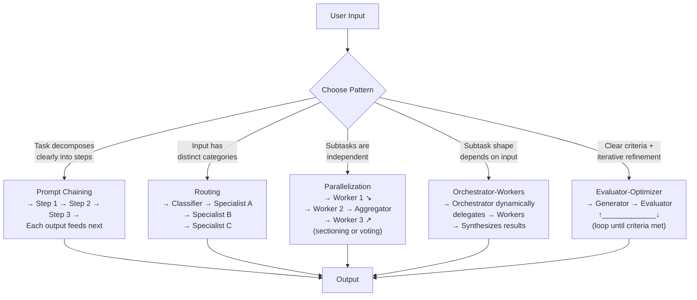

# Chapter 6: Agentic Workflow Patterns

### 6.1 Workflows vs. Agents

Anthropic distinguishes two architectures within the broader category of "agentic systems" ([Anthropic — Building Effective Agents](https://www.anthropic.com/engineering/building-effective-agents)):

- **Workflows** orchestrate LLMs and tools through predefined code paths.
- **Agents** dynamically direct their own processes and tool usage.

The first principle they push is to find the simplest solution and only add complexity when needed. Many use cases do not need agents at all — single LLM calls with retrieval and in-context examples are usually enough. Workflows give predictability and consistency for well-defined tasks; agents are right when flexibility and model-driven decision-making are needed at scale.

### 6.2 The Augmented LLM

The basic building block is the *augmented LLM*: a model with retrieval, tools, and memory. Modern models can actively use these — generating their own queries, selecting tools, deciding what to retain ([Anthropic — Building Effective Agents](https://www.anthropic.com/engineering/building-effective-agents)). MCP (see ch4) is one increasingly common way to expose these augmentations.

### 6.3 Compositional Workflow Patterns

From simplest to most flexible:

**Prompt chaining** decomposes a task into sequential steps, each LLM call processing the previous output, with optional programmatic gates. Use it when a task can be cleanly decomposed and you want to trade latency for accuracy by making each call simpler. Example: write a marketing copy, then translate it. Failure mode: latency compounds across steps, and an error in an early call propagates downstream — gate aggressively.

**Routing** classifies an input and dispatches it to a specialized follow-up. Use when distinct categories benefit from separate handling and classification can be done reliably. Example: route customer service queries to refund-handling, technical-support, or general-question pipelines. Failure mode: it breaks silently on misclassification and ambiguous inputs — instrument the classifier and watch its error rate.

**Parallelization** runs LLM calls simultaneously and aggregates outputs. Two variants — *sectioning* breaks into independent subtasks, *voting* runs the same task multiple times. Use for speed or when multiple perspectives improve confidence (vulnerability review across multiple prompts, content-moderation with multiple votes). Failure mode: voting multiplies token cost N-fold, and correlated errors can make N agreeing votes falsely reassuring.

**Orchestrator-workers** has a central LLM that dynamically breaks down tasks, delegates to worker LLMs, and synthesizes results. Differs from parallelization because subtasks are not pre-defined. Use for complex tasks where the subtask shape depends on input — coding agents touching many files, research over many sources. Failure mode: the orchestrator can fan out unboundedly — cap the worker count and the total token budget.

**Evaluator-optimizer** has one LLM generating, another critiquing, in a loop. Use when there are clear evaluation criteria and iterative refinement provides measurable value. The two indicators: human feedback measurably improves output, and an LLM can plausibly produce that feedback. Examples: literary translation with critic, multi-round research with relevance evaluator. Failure mode: the loop may not converge — bound the iteration count, since each round adds latency and cost.

### 6.4 Three Principles for Agent Implementation

Anthropic ends with three rules ([Anthropic — Building Effective Agents](https://www.anthropic.com/engineering/building-effective-agents)):

1. **Maintain simplicity** in agent design.
2. **Prioritize transparency** by explicitly showing the agent's planning steps.
3. **Carefully craft the agent–computer interface** through tool documentation and testing.

Frameworks help you start fast but can introduce abstraction layers that obscure the underlying prompts and tool calls. Anthropic recommends starting with direct API calls when you are still learning the shape of the problem, then reaching for a framework when the repeated patterns and operational needs justify it.

### 6.5 The Micro-Agent Pattern

HumanLayer's pragmatic version of the same insight ([HumanLayer — 12-Factor Agents](https://www.humanlayer.dev/blog/12-factor-agents)): the "loop until done" pattern hits a wall around 10–20 turns, after which agents lose coherence as accumulated context and per-turn error compound (see ch2, Context as a Finite Resource). What works is sprinkling small, focused agents into a broader deterministic DAG (directed acyclic graph of code-defined steps). Embedding LLM micro-agents in deterministic code this way is the harness shape LangChain describes too ([LangChain — The Anatomy of an Agent Harness](https://blog.langchain.com/the-anatomy-of-an-agent-harness/)). Their deploybot example has deterministic code handling staging deployment, e2e tests, and the actual prod deploy commands; the LLM only intervenes to interpret human plaintext feedback ("can you deploy the backend first?") and propose updated steps. By keeping the agent's domain to 5–10 steps, error spin-outs become rare.

The principle generalizes: when the model gets smarter, agents may grow to handle more steps, but the small-focused-agent approach lets you ship results today and expand scope incrementally as model capabilities allow.

### 6.6 Reasoning and Self-Correction Patterns

The five patterns of §6.3 are compositional *control-flow* patterns — they orchestrate calls. A parallel line of research contributes *reasoning* patterns: ways a single agent, or a tight loop, structures its own deliberation and self-correction. They compose with the workflow patterns rather than replacing them, and most are named research artifacts worth recognizing.

- **ReAct** interleaves reasoning and acting — the model thinks, calls a tool, observes, and repeats. It is the base pattern under most agent loops (Ch 1; *LLM Foundations* ch 12).
- **Reflexion** adds a memory of self-critique: after a failed attempt, the agent writes a natural-language reflection on *why* it failed and retries with that reflection in context — "verbal reinforcement learning" without any weight update ([Shinn et al. — Reflexion](https://arxiv.org/abs/2303.11366)).
- **Self-Refine** collapses the evaluator-optimizer pattern (§6.3) into one model: it generates, critiques its own output, and revises, iterating until satisfied ([Madaan et al. — Self-Refine](https://arxiv.org/abs/2303.17651)).
- **CRITIC** grounds that critique in *external tools* — search, code execution, calculators — rather than introspection alone, so the correction is checked against the world instead of the model's own confidence ([Gou et al. — CRITIC](https://arxiv.org/abs/2305.11738)).
- **Tree of Thoughts (ToT)** replaces the single reasoning chain with a search over branches, using lookahead and backtracking to explore multiple partial solutions before committing ([Yao et al. — Tree of Thoughts](https://arxiv.org/abs/2305.10601)).
- **LATS** unifies reasoning, acting, and planning by running Monte Carlo Tree Search over agent trajectories, with an LM value function and reflection guiding the search ([Zhou et al. — Language Agent Tree Search](https://arxiv.org/abs/2310.04406)).
- **ReWOO** decouples planning from execution: a *Planner* writes the full plan up front, *Workers* execute the tool calls, and a *Solver* composes the answer — cutting tokens by not re-reasoning after every observation ([Xu et al. — ReWOO](https://arxiv.org/abs/2305.18323)).

The harness lens ties them together. Each mostly trades tokens and latency for reliability, and — as §6.1 and Chapter 14 warn — that trade pays off on hard, checkable tasks and is pure overhead on easy ones. The more trustworthy patterns are the ones whose self-correction is *grounded* in tools or tests (CRITIC here; the verifier-gated cascades of Ch 14; the generator–evaluator split of Ch 7) rather than resting on the model critiquing itself, matching the book's recurring theme that verification beats introspection (Ch 7, Ch 10).

---

## Diagram: The Five Workflow Patterns

```mermaid
flowchart TD
    INPUT["User Input"] --> CHOICE{Choose Pattern}

    CHOICE -->|"Task decomposes<br/>clearly into steps"| CHAIN["Prompt Chaining<br/>→ Step 1 → Step 2 → Step 3 →<br/>Each output feeds next"]
    CHOICE -->|"Input has<br/>distinct categories"| ROUTE["Routing<br/>→ Classifier → Specialist A<br/>                → Specialist B<br/>                → Specialist C"]
    CHOICE -->|"Subtasks are<br/>independent"| PARALLEL["Parallelization<br/>→ Worker 1 ↘<br/>→ Worker 2 → Aggregator<br/>→ Worker 3 ↗<br/>(sectioning or voting)"]
    CHOICE -->|"Subtask shape<br/>depends on input"| ORCH["Orchestrator-Workers<br/>→ Orchestrator dynamically<br/>  delegates → Workers<br/>  → Synthesizes results"]
    CHOICE -->|"Clear criteria +<br/>iterative refinement"| EVALOPT["Evaluator-Optimizer<br/>→ Generator → Evaluator<br/>      ↑_____________↓<br/>   (loop until criteria met)"]

    CHAIN --> OUT["Output"]
    ROUTE --> OUT
    PARALLEL --> OUT
    ORCH --> OUT
    EVALOPT --> OUT
```

---

## Key Takeaways

- **Start with the simplest pattern**: many tasks need only a single LLM call; adding agent loops is often premature.
- **Workflows give predictability; agents give flexibility**: choose based on whether the subtask structure is known ahead of time.
- **Five patterns cover most cases**: chaining, routing, parallelization, orchestrator-workers, and evaluator-optimizer.
- **The micro-agent approach scales well today**: 5–10 step focused agents embedded in a deterministic DAG outperform "loop until done" for most tasks.
- **Preserve visibility before abstraction**: direct API calls make early behavior easier to inspect; frameworks pay off once patterns stabilize.
- **Reasoning patterns compose with workflow patterns**: Reflexion, Self-Refine, CRITIC, Tree of Thoughts, LATS, and ReWOO structure a model's own deliberation — most valuable on hard, checkable tasks, and most trustworthy when the self-correction is grounded in tools or tests rather than introspection.

## Further Reading

- Erik Schluntz and Barry Zhang, *Building Effective Agents*, Anthropic, Dec 2024. https://www.anthropic.com/engineering/building-effective-agents
- Dex Horthy, *12-Factor Agents*, HumanLayer, Apr 2025. https://www.humanlayer.dev/blog/12-factor-agents
- Vivek Trivedy, *The Anatomy of an Agent Harness*, LangChain, Mar 2026. https://blog.langchain.com/the-anatomy-of-an-agent-harness/
- Noah Shinn et al., *Reflexion: Language Agents with Verbal Reinforcement Learning*, arXiv, Mar 2023. https://arxiv.org/abs/2303.11366
- Aman Madaan et al., *Self-Refine: Iterative Refinement with Self-Feedback*, arXiv, Mar 2023. https://arxiv.org/abs/2303.17651
- Zhibin Gou et al., *CRITIC: Large Language Models Can Self-Correct with Tool-Interactive Critiquing*, arXiv, May 2023. https://arxiv.org/abs/2305.11738
- Shunyu Yao et al., *Tree of Thoughts: Deliberate Problem Solving with Large Language Models*, arXiv, May 2023. https://arxiv.org/abs/2305.10601
- Andy Zhou et al., *Language Agent Tree Search Unifies Reasoning, Acting, and Planning in Language Models*, arXiv, Oct 2023. https://arxiv.org/abs/2310.04406
- Binfeng Xu et al., *ReWOO: Decoupling Reasoning from Observations for Efficient Augmented Language Models*, arXiv, May 2023. https://arxiv.org/abs/2305.18323
