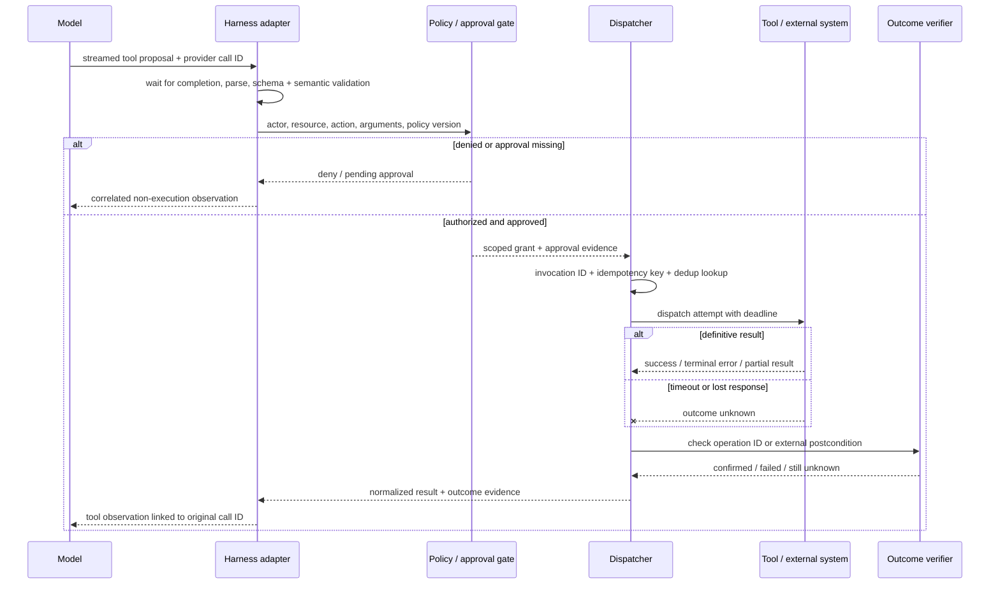

# Chapter 6: Tools and the Invocation Lifecycle

Foundations Chapter 12 stops at the model boundary: a tool call is structured output proposed by the model, and a tool result returns as potentially untrusted context. This chapter follows that proposal through the harness. The central rule is simple: **a well-formed tool call is neither permission nor proof of success**.

### 6.1 From Model Proposal to External Effect

For client-executed tools, the model emits a structured request, application code performs the operation, and the result is sent back to the model. Anthropic describes this explicitly as a contract in which the model never executes the operation itself; OpenAI likewise distinguishes a model-generated tool call from the tool-call output produced by the application ([Anthropic — How Tool Use Works](https://platform.claude.com/docs/en/agents-and-tools/tool-use/how-tool-use-works); [OpenAI — Function Calling](https://developers.openai.com/api/docs/guides/function-calling)). A provider may host some tools and hide part of this round trip, but the responsibility boundary remains: model output proposes; an execution system decides and acts.

A production invocation should pass through an explicit lifecycle:

| Stage | Primary owner | Required record | Retry meaning |
|---|---|---|---|
| 1. Receive and correlate | Harness adapter | provider response ID, provider call ID, harness invocation ID | No execution yet |
| 2. Complete streamed arguments | Harness adapter | completion event and assembled bytes | Reconnect or abandon; do not dispatch fragments |
| 3. Parse | Parser | parsed value or syntax error | Ask for a corrected call; do not execute |
| 4. Validate schema | Validator | schema version and field errors | Correct arguments; do not execute |
| 5. Validate semantics | Domain adapter | resolved resources, preconditions, bounds | Refresh state or ask for correction |
| 6. Authorize | Dispatcher / policy enforcement point | actor, capability, resource, policy version, decision | Re-evaluate on changed identity, resource, tool, or policy |
| 7. Obtain mandatory approval | Runtime / product | approver, exact action preview, expiry, decision | Never infer approval from model text |
| 8. Establish idempotency and deduplication | Dispatcher | idempotency key, prior-attempt lookup | Resume or return the known result instead of duplicating an effect |
| 9. Execute | Tool adapter or remote service | attempt ID, request, start time | Governed by side-effect semantics |
| 10. Enforce timeout and cancellation | Runtime | deadline, cancellation state | A timeout creates an unknown outcome until checked |
| 11. Classify completion | Tool adapter | success, retryable failure, terminal failure, partial success, or unknown | Retry only under an explicit policy |
| 12. Normalize the result | Adapter | stable result/error envelope and artifact references | No model-specific ad hoc shape |
| 13. Return an observation | Harness | result linked to the original call ID | Observation is untrusted context, not execution authority |
| 14. Confirm the external outcome | Verifier / environment | postcondition evidence and final status | Reconcile before any consequential retry |

Not every read-only lookup needs a human approval or a separate postcondition query. The lifecycle is a checklist of distinct decisions, not a demand for fourteen network round trips. Stages may collapse inside one trusted component, but their evidence and failure semantics should remain distinguishable.

### 6.2 Correlation, Streaming, and Parallel Calls

Every invocation needs a stable identity. Preserve the provider's call ID and add a harness-level invocation ID when work can cross queues, retries, providers, or process boundaries. Results must correlate to the specific call, never merely to a tool name or list position. OpenAI tool-call outputs reference the originating `call_id`; Anthropic tool results similarly use `tool_use_id` to match a particular `tool_use` block ([OpenAI — Function Calling](https://developers.openai.com/api/docs/guides/function-calling); [Anthropic — Handle Tool Calls](https://platform.claude.com/docs/en/agents-and-tools/tool-use/handle-tool-calls)).

Streaming adds a completion boundary. Argument deltas are an in-progress serialization, not a sequence of executable commands. OpenAI's streaming contract emits argument-delta events followed by a completed event containing the assembled arguments; the harness should wait for the provider's completion signal, assemble by call identity, and only then parse and validate ([OpenAI — Function Calling, Streaming](https://developers.openai.com/api/docs/guides/function-calling#streaming)). Dispatching a syntactically plausible prefix such as `{"recipient":"alice"` risks acting on truncated or subsequently revised intent.

Parallel calls need independent state machines. If three calls are proposed together and one succeeds, one fails validation, and one times out, record three outcomes. Do not collapse them into a single turn-level Boolean. Return each completed observation under its own call ID and keep unresolved calls explicit; Anthropic's API, for example, requires each client `tool_use` block to receive its corresponding `tool_result` in the next message ([Anthropic — Handle Tool Calls](https://platform.claude.com/docs/en/agents-and-tools/tool-use/handle-tool-calls)).

A useful internal envelope is:

```text
invocation_id, provider_call_id, tool_name, tool_version
actor, tenant, capability, policy_version, approval_id
arguments_hash, idempotency_key, attempt_id, deadline
status, normalized_result, artifacts, postcondition_evidence
```

[Chapter 10](./10-state-event-history-production-factors.md) defines the durable `session → run → step → action → attempt` hierarchy. A dispatcher may alias `invocation_id` to `action_id` only when one invocation represents exactly one intended effect; a composite invocation must preserve its contained action and attempt identities rather than hiding them behind one opaque ID.

This is execution state and lineage metadata. It is not necessary to put every field back into model context.

### 6.3 Validity, Authorization, and Outcome Are Different Questions

Treating “validation” as one Boolean hides the most important boundaries:

1. **Syntactic and schema validity:** Can the arguments be parsed, and do their fields and types match the declared interface? Provider strict-schema features can improve this layer, but their guarantees are provider- and API-specific ([OpenAI — Function Calling, Strict Mode](https://developers.openai.com/api/docs/guides/function-calling#strict-mode)).
2. **Semantic validity:** Do identifiers exist? Is the amount positive? Is the target state compatible with the operation? Is a referenced revision still current? These checks require domain state and cannot be encoded completely by JSON Schema.
3. **Authorization:** May this actor perform this action on this resource, in this tenant, for this purpose, now? A tool appearing in model context is not a capability grant.
4. **Approval:** Does policy require a person to approve this exact action and payload? The runtime, not the model, must insert a mandatory gate. The MCP specification recommends that applications let people see exposed tools and deny sensitive invocations ([MCP — Tools Specification](https://modelcontextprotocol.io/specification/2025-06-18/server/tools)).
5. **Outcome confirmation:** Did the intended external state actually result? A successful transport response, a tool's prose, and a verified postcondition are different evidence strengths.

Consider `transfer_funds({from, to, amount})`. Valid JSON and numeric `amount` establish only the first layer. Semantic checks must resolve both accounts and business limits; authorization must bind the acting identity to `from`; policy may require approval for the exact amount and recipient; execution needs a transaction identity; outcome confirmation checks the resulting transaction or balances. Skipping any one layer changes the safety and correctness claim.

### 6.4 Idempotency, Deduplication, Timeouts, and Retries

A retry policy begins with the action's effect semantics, not with the exception class. RFC 9110 defines an idempotent request as one whose intended server effect is the same after one or several identical requests, and warns against automatically retrying non-idempotent requests unless the client knows the semantics are idempotent or knows the first request was not applied ([RFC 9110 §9.2.2](https://www.rfc-editor.org/rfc/rfc9110.html#section-9.2.2)). Tool adapters need the same discipline even when they do not use HTTP.

| Action class | Example | Default after timeout | Required protection |
|---|---|---|---|
| Pure/read-only | Search, fetch status | Retry within budget | Deadline, rate limit, request correlation |
| Naturally idempotent | Set desired label to `approved` | Retry if preconditions still hold | Resource version or conditional write |
| Made idempotent by contract | Create payment with an idempotency key | Query by key, then resume or retry | Durable dedup record and stable key |
| Non-idempotent consequential action | Send message, submit order without a key | Do not retry blindly | Outcome lookup, reconciliation, or human escalation |

An **idempotency key** names one intended effect across repeated delivery attempts. A **deduplication record** stores what happened under that key. A call ID identifies a proposal; an attempt ID identifies one dispatch. Using a fresh idempotency key on every retry defeats deduplication, while reusing one key for two different intended effects creates a collision.

A timeout means the caller stopped waiting; it does not prove the callee stopped or rolled back. Move such an invocation to `unknown`, query an operation-status or target-state endpoint when available, and only then decide whether to retry. Cancellation is similarly a request to stop unless the tool contract guarantees rollback. For multi-effect tools, return which sub-operations succeeded and expose compensating actions instead of reporting an undifferentiated failure.

Retry logic must not bypass authorization or approval. Reauthorize when identity, resource state, tool version, arguments, policy version, approval scope, or approval expiry changes. Count attempts against one invocation budget and emit a terminal observation when that budget is exhausted so the model cannot create an accidental infinite retry loop.

### 6.5 Normalize Results, Then Confirm Outcomes

Provider protocols encode tool results differently. A harness should normalize them into a small internal vocabulary while retaining the raw response as an artifact when needed:

```text
status: succeeded | retryable_error | terminal_error | partial | unknown
summary: compact model-facing observation
data: typed structured result, when available
artifacts: references to large or reviewable outputs
error: stable category, safe message, retry guidance
effect: external operation ID and postcondition evidence
```

MCP distinguishes protocol errors from tool-execution errors and supports structured results with an output schema; its specification requires servers to conform to a declared result schema and recommends that clients validate results before passing them to the model ([MCP — Tools Specification](https://modelcontextprotocol.io/specification/2025-06-18/server/tools)). Preserve that distinction. “Unknown tool” is not the same failure as “payment provider rejected the charge,” and neither is the same as “charge may have succeeded but its response was lost.”

Results are observations, not instructions. A webpage, email, repository file, peer-agent response, or third-party API can contain adversarial text; Anthropic's tool-use documentation therefore tells clients to treat externally influenced tool results as untrusted content ([Anthropic — Handle Tool Calls](https://platform.claude.com/docs/en/agents-and-tools/tool-use/handle-tool-calls)). Keep provenance and trust labels, constrain result size, and present only the material needed for the next decision. For consequential actions, confirmation should prefer environment state—transaction status, file hash, deployed version, sent-message ID—over the model's own statement that the task is complete.

### 6.6 Designing the Agent–Computer Interface

Anthropic uses *agent–computer interface* (ACI) by analogy with HCI: tool schemas, descriptions, responses, and error affordances deserve deliberate design. Its early guidance recommends formats that resemble training data, leave the model room to plan before committing to rigid syntax, and avoid unnecessary formatting burdens; in one SWE-bench agent, changing file tools from relative to absolute paths removed most path errors observed after leaving the repository root ([Anthropic — Building Effective Agents](https://www.anthropic.com/engineering/building-effective-agents)).

Do not wrap every API endpoint mechanically. A model that must call `list_contacts`, scan a large response, and then call `send_message` has a worse interface than one offered a scoped `search_contacts` or `message_contact` operation. Consolidate steps that are almost always chained, but do not hide separately authorized or separately reviewable effects inside one giant tool. `get_customer_context` may safely combine reads; a `research_and_wire_money` tool would erase necessary policy boundaries.

Descriptions should make implicit domain knowledge explicit: when to use the tool, when not to use it, required formats, units, side effects, and meaningful parameter names. Anthropic reports that namespacing and description changes materially affect model tool-use performance and recommends evaluation-driven iteration rather than assuming the first schema is adequate ([Anthropic — Writing Effective Tools for Agents](https://www.anthropic.com/engineering/writing-tools-for-agents)). Schema design improves proposal quality; it does not replace the lifecycle checks above.

### 6.7 Three Tool-Catalog Strategies

Chapter 3 introduced three valid catalog patterns. They solve different context and continuity problems:

1. **Stable catalog plus action masking.** Keep tool definitions stable for model continuity and provider prompt-cache locality, while a deterministic dispatcher blocks actions that are unavailable in the current state. Manus reports using name prefixes and masking in its own system; this is a provider/workload case study, not a protocol rule ([Manus — Context Engineering for AI Agents](https://manus.im/blog/Context-Engineering-for-AI-Agents-Lessons-from-Building-Manus)).
2. **Deferred loading or tool search.** Keep rarely used definitions out of initial context and load them when discovered. Anthropic's tool-search interface supports deferred tools and documents how selected definitions are expanded into the conversation ([Anthropic — Tool Reference](https://platform.claude.com/docs/en/agents-and-tools/tool-use/tool-reference)).
3. **Stable meta-tool or code surface.** Expose a small registry, search tool, or sandboxed code interface; resolve the larger capability set behind it. This reduces schema volume and model round trips, but the dispatcher must still validate and authorize each final capability.

Choose with workload-specific evals. Measure tool-selection accuracy, context cost, latency, provider prompt-cache behavior, stale-reference failures, and permission exposure. “Mask, don't remove” is not universal, and dynamic loading is not automatically safer merely because fewer schemas are visible.

### 6.8 MCP Exposes Capabilities; the Harness Governs Calls

The Model Context Protocol is a client–server protocol in which servers **expose** tools and clients list and invoke them. A server may also expose resources and prompts, but the protocol does not imply that it owns, controls, or can inspect every downstream system behind a tool ([MCP — Tools Specification](https://modelcontextprotocol.io/specification/2025-06-18/server/tools); [MCP — Server Overview](https://modelcontextprotocol.io/specification/2025-06-18/server/index)).

MCP standardizes discovery and transport; it does not eliminate lifecycle responsibility. The specification requires servers to validate inputs, implement access controls, rate-limit calls, and sanitize outputs. It recommends that clients confirm sensitive operations, show inputs before dispatch, validate results, enforce timeouts, and log usage ([MCP — Tools Specification](https://modelcontextprotocol.io/specification/2025-06-18/server/tools)). A production client may add stricter policy, mandatory approvals, tenant isolation, deduplication, and postcondition verification.

Deployment topology matters too. A private capability need not be exposed through a new inbound public endpoint. OpenAI's secure MCP tunnel documents an outbound-only client inside the private network that connects to a configured destination while retaining authentication and streaming ([OpenAI — Connect Private MCP Servers](https://developers.openai.com/blog/connect-private-mcp-servers-to-openai-products)). Treat this as one deployment pattern, not a property guaranteed by MCP itself.

### 6.9 Dynamic Tool Lists Require Fresh Decisions

MCP's `listChanged` capability lets a server notify a client that its available-tool list has changed ([MCP — Tools Specification](https://modelcontextprotocol.io/specification/2025-06-18/server/tools)). Therefore a cached schema or an earlier appearance in model context is not current authority.

On a list-change notification, the client should:

1. fetch the new list under the current authenticated identity;
2. diff tool identity, schema, annotations, server identity, and version;
3. invalidate stale model-visible definitions and cached routing decisions;
4. re-run capability and policy checks before the next dispatch;
5. require fresh approval if the action, arguments, resource, or risk changed;
6. record which catalog and policy versions governed the call.

The same rule applies to deferred loading and meta-tools. Discovery answers “what is advertised now?” Authorization answers “what may this actor do now?” They are separate operations.

### 6.10 Namespaces and Context-Efficient Responses

Consistent prefixes such as `jira_issues_search` or `asana_projects_create` reduce collisions and let a harness group related capabilities. Anthropic's tool-design evaluations found that naming and prefix-versus-suffix choices can affect performance, with the best choice depending on the workload ([Anthropic — Writing Effective Tools for Agents](https://www.anthropic.com/engineering/writing-tools-for-agents)). A namespace is a usability and routing aid, not proof that two tools share an authorization domain.

Tool responses should favor relevant, typed information over maximal payloads. Offer pagination, filters, ranges, concise/detailed modes, and explicit truncation markers. Use meaningful labels for model-facing references while retaining canonical IDs for subsequent calls. Anthropic reports that replacing opaque UUIDs with more natural identifiers improved accuracy in its tool evaluations and recommends token-efficient response controls ([Anthropic — Writing Effective Tools for Agents](https://www.anthropic.com/engineering/writing-tools-for-agents)).

Errors should be actionable but safe: identify the stable category, which field or precondition failed, whether a retry is allowed, and where full diagnostics are stored. Avoid flooding context with thousands of successful log lines or exposing secrets through raw tracebacks. Large raw outputs belong in artifacts; the normalized observation should include a recoverable reference.

### 6.11 Code Execution as a Meta-Tool

Instead of placing hundreds of direct tool definitions and every intermediate result in model context, a harness can expose a sandboxed code surface backed by typed wrappers. Anthropic's “Code Execution with MCP” describes progressive discovery through generated TypeScript files and reports a Google Drive-to-Salesforce example in which token use fell from 150,000 to 2,000; that number is a named example, not a universal savings rate ([Anthropic — Code Execution with MCP](https://www.anthropic.com/engineering/code-execution-with-mcp)).

This pattern is useful for bounded dataflow: filtering, joining, sorting, deduplicating, aggregating, and validating before returning a compact result. OpenAI's programmatic tool-calling documentation describes the same broad benefit—tools can be called from generated code so intermediate results need not all pass through the model—but still requires the application to execute client-side tools and return their outputs ([OpenAI — Programmatic Tool Calling](https://developers.openai.com/api/docs/guides/tools-programmatic-tool-calling)).

Code execution does not create ambient authority. The sandbox, typed proxy, and dispatcher must constrain the callable tools, credentials, network, filesystem, budgets, and side effects. Record the generated program, the capability set and policy version it ran under, each consequential sub-call, and final artifacts. Do not hide separately approvable actions inside a program merely to reduce model round trips.

### 6.12 Evaluate Tools and the Lifecycle Together

Tool evals should test more than whether the model selected the right name. Anthropic recommends iterating through prototype, realistic evaluation, programmatic runs, and transcript analysis, using observed failures to refine tools ([Anthropic — Writing Effective Tools for Agents](https://www.anthropic.com/engineering/writing-tools-for-agents)). For this chapter's lifecycle, include slices for:

- malformed, incomplete, and schema-invalid arguments;
- valid schemas with nonexistent resources or stale versions;
- cross-tenant and over-scoped authorization attempts;
- required approvals that the model does not request;
- duplicate delivery, lost responses, timeout-after-effect, and cancellation races;
- partial success in parallel or multi-effect tools;
- untrusted result content and oversized outputs;
- dynamic catalog changes between proposal and dispatch;
- postcondition mismatch despite a nominally successful response.

Capture proposal, validation decisions, policy version, approval, attempts, normalized result, and outcome evidence. Chapter 11 develops evaluation terminology and graders; Chapter 17 develops production tracing. The important point here is that a clean model transcript can still conceal a duplicate effect or a failed authorization check unless the eval inspects environment state.

### 6.13 MCP and A2A Cross Different Boundaries

MCP connects a client to capabilities exposed by a server. A2A connects an agentic client to another agentic service through messages and tasks. The current A2A specification defines Agent Cards for discovery, task and message operations, streaming, authentication/authorization fields, and multiple protocol bindings; it does not make the peer's internal model, memory, tools, or sandbox inspectable to the caller ([A2A Protocol Specification](https://a2a-protocol.org/latest/specification/)).

That difference changes the contract. An MCP tool call should have a precise operation schema and a result tied to one call. An A2A delegation may be long-running, exchange messages, return artifacts, and require task-level status or cancellation. In both cases, the local harness must establish identity, delegated authority, data scope, deadlines, provenance, and outcome evidence. Treat peer-agent output as untrusted external content, not as a higher-authority instruction.

Use native multi-agent delegation when tasks are bounded, have clear ownership, and produce mergeable artifacts. Shared mutable state or strict sequential dependencies usually need a single owner plus deterministic coordination. A2A standardizes an interoperability boundary; it does not remove distributed-systems or trust problems.

---

## Diagram: One Tool Call From Proposal to Confirmed Outcome



---

## Key Takeaways

- **A tool call is a proposal:** schema validity is not authorization, approval, execution, or proof of outcome.
- **Call identity must survive the whole lifecycle:** correlate streaming fragments, retries, attempts, results, and confirmations without relying on tool name or position.
- **Never dispatch partial streamed arguments:** wait for the provider's completion boundary, then parse and validate.
- **Timeout means unknown outcome:** reconcile state before retrying a consequential or non-idempotent action.
- **Results need normalization and provenance:** return compact observations while retaining structured data, artifacts, errors, and postcondition evidence.
- **Tool catalogs admit multiple strategies:** stable catalog plus masking, deferred loading/tool search, and a stable meta-tool all have valid workloads.
- **Dynamic discovery does not carry authority:** an MCP `listChanged` event or deferred tool requires fresh capability and policy checks.
- **MCP exposes tools; it does not guarantee ownership of their resources:** clients and servers still need explicit validation, access control, approval, timeouts, and logging.
- **A2A is a peer-agent boundary, not a tool-schema substitute:** preserve delegated authority, task status, provenance, and distrust of returned content.
- **Evaluate external state, not only the transcript:** lifecycle bugs often look successful in model-visible text.

## Further Reading

- Anthropic, *How Tool Use Works*. https://platform.claude.com/docs/en/agents-and-tools/tool-use/how-tool-use-works
- Anthropic, *Handle Tool Calls*. https://platform.claude.com/docs/en/agents-and-tools/tool-use/handle-tool-calls
- OpenAI, *Function Calling*. https://developers.openai.com/api/docs/guides/function-calling
- Model Context Protocol, *Tools Specification*, Jun 2025. https://modelcontextprotocol.io/specification/2025-06-18/server/tools
- A2A Project, *A2A Protocol Specification*. https://a2a-protocol.org/latest/specification/
- RFC Editor, *RFC 9110: HTTP Semantics*, Jun 2022. https://www.rfc-editor.org/rfc/rfc9110.html
- Ken Aizawa, *Writing Effective Tools for Agents — with Agents*, Anthropic, Sep 2025. https://www.anthropic.com/engineering/writing-tools-for-agents
- Adam Jones and Conor Kelly, *Code Execution with MCP*, Anthropic, Nov 2025. https://www.anthropic.com/engineering/code-execution-with-mcp
- OpenAI, *Programmatic Tool Calling*. https://developers.openai.com/api/docs/guides/tools-programmatic-tool-calling
