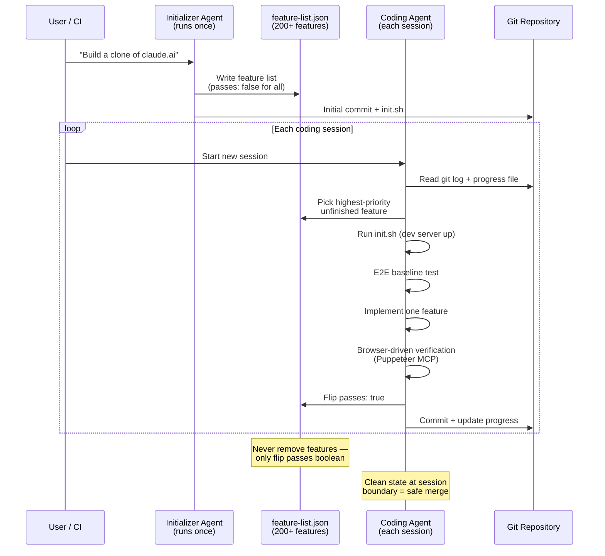

# Chapter 7: Long-Running Agents and Multi-Context-Window Tasks

### 7.1 The Shift-Change Problem

Anthropic's "Effective Harnesses for Long-Running Agents" frames the core challenge with a metaphor: imagine a software project staffed by engineers working in shifts, each one arriving with no memory of what happened before ([Anthropic — Effective Harnesses for Long-Running Agents](https://www.anthropic.com/engineering/effective-harnesses-for-long-running-agents)). Because context windows are limited and most projects exceed one window, agents need a way to bridge sessions.

Compaction alone is not always enough. In Anthropic's long-running app experiments, even with the Claude Agent SDK's automatic compaction, a simple Opus 4.5 loop was not reliable for building a production-quality app from a high-level prompt like "build a clone of claude.ai." The failures clustered in two patterns: the agent tried to one-shot the app and ran out of context mid-implementation, leaving the next session to clean up; or, after some features were built, a later agent declared the job done.

### 7.2 The Initializer + Coding Agent Pattern

Anthropic's solution decomposes the work into two roles ([Anthropic — Effective Harnesses for Long-Running Agents](https://www.anthropic.com/engineering/effective-harnesses-for-long-running-agents)):

The **initializer agent** runs once with a specialized prompt. It produces:
- An `init.sh` script that runs the development server.
- A `claude-progress.txt` log to be updated each session.
- An initial git commit.
- A comprehensive feature-list file (in JSON; Markdown was tried first but the model was more likely to inappropriately edit it). For the claude.ai clone the list ran to over 200 features, each marked `passes: false` initially.

Each entry in the feature list is a JSON object with category, description, steps to verify, and a `passes` boolean. The coding agent is allowed to flip `passes` but is told strongly that removing or editing features is unacceptable.

The **coding agent** runs every subsequent session with a different prompt that asks it to make incremental progress. Each session begins with a structured warm-up:

1. Run `pwd` to confirm the directory.
2. Read git logs and the progress file to see what was last worked on.
3. Read the feature-list file and pick the highest-priority unfinished feature.
4. Run `init.sh` to start the dev server, then run a basic end-to-end test before implementing anything new.
5. Implement one feature.
6. Verify end-to-end (Anthropic uses the Puppeteer MCP for browser-driven verification, since the agent is otherwise prone to declaring features done after passing unit tests but failing in practice).
7. Commit with a descriptive message and update the progress file.

The pattern's benefit is that the agent is forced into a clean state at session boundaries — the kind of state appropriate for merging to a main branch — which means the next agent can start work without first cleaning up the previous one's mess.

### 7.3 Session Lifecycle and Clean Exit

Long-running harnesses need an explicit session lifecycle: start, warm up, choose bounded work, verify, record evidence, and exit cleanly. The last step is load-bearing. If a session ends with failing tests, stale temporary files, an unupdated feature list, or a vague progress note, the next agent spends its first turns reconstructing the previous state instead of advancing the task.

A clean exit should therefore be part of the definition of done:

- The standard startup path still works.
- The relevant build, lint, test, or end-to-end checks have been run, and failures are either fixed or recorded as blockers.
- The progress artifact says what changed, what was verified, what remains uncertain, and the best next action.
- The feature list or task list reflects reality: no item is marked passing without evidence.
- Temporary debugging artifacts, commented-out experiments, and obsolete notes are removed or explicitly quarantined.

OpenAI describes a related maintenance loop in its Codex harness work: agent-generated systems tend to copy whatever patterns already exist in the repository, so architectural rules and "golden principles" need to be written into docs, linters, and recurring cleanup passes rather than left as occasional human taste ([OpenAI — Harness Engineering](https://openai.com/index/harness-engineering/)). Anthropic's initializer/coding-agent pattern reaches the same operational conclusion from the session side: the next session should be able to resume from repository artifacts, not from the previous agent's private memory.

For larger projects, a lightweight quality document is useful alongside the progress log. The progress log answers "what happened in the last session?" A quality document answers "which modules are healthy, risky, hard for agents to understand, or missing verification?" That distinction matters because the next agent should not only know the next feature; it should also know where the codebase is deteriorating.

### 7.4 Generator–Evaluator (GAN-Inspired)

A follow-up by Prithvi Rajasekaran extends the pattern to a harder problem: building production-quality apps from short prompts ([Anthropic — Harness Design for Long-Running Application Development](https://www.anthropic.com/engineering/harness-design-long-running-apps)). The motivating observation: when asked to evaluate their own work, agents reliably skew positive even when output is mediocre. Separating the agent doing the work from the agent judging it is a strong lever, because tuning a separate skeptical evaluator is more tractable than making a generator critical of its own output.

Inspired by Generative Adversarial Networks, the architecture is three agents:

- **Planner** expands a 1–4 sentence prompt into a full product spec, deliberately staying at the product/architecture level rather than detailed technical design (so errors do not cascade), and is encouraged to weave AI features into the spec.
- **Generator** implements the spec one feature at a time using a React + Vite + FastAPI + SQLite stack, with git for version control.
- **Evaluator** uses the Playwright MCP to click through the running application as a user would, testing UI, API endpoints, and database state, then grades against a rubric covering product depth, functionality, visual design, and code quality. Each criterion has a hard threshold, and a single failure causes the sprint to fail with detailed feedback.

The two coordinate via *sprint contracts*: before each sprint, the generator proposes what it will build and how success will be verified; the evaluator reviews until they agree; the generator then builds against the agreed contract. Communication is file-based — one agent writes a file, another reads and responds.

The cost is significant. For a "create a 2D retro game maker" prompt, the solo run took 20 minutes and cost $9, producing an app that looked plausible but where the game itself did not work — entities appeared on screen but nothing responded to input. The full harness took 6 hours and cost $200, producing a working game maker with sprite editor, level editor, AI-assisted level generation, and playable mode. The more-than-20× cost premium bought a working application instead of broken stubs.

### 7.5 Self-Verification Is the Headline Lever

LangChain's Top-30-to-Top-5 case study reaches the same conclusion via a different route ([LangChain — Improving Deep Agents with Harness Engineering](https://blog.langchain.com/improving-deep-agents-with-harness-engineering/)). With trace analysis, they identified the most common failure pattern: the agent wrote a solution, re-read its own code, decided it looked fine, and stopped. They added structured guidance to the system prompt — Plan, Build with verification in mind, Verify by running tests and comparing output to spec, Fix — and a `PreCompletionChecklistMiddleware` that intercepts the agent before exit and forces a verification pass.

This pattern echoes the "Ralph Wiggum loop" that has spread through the developer community: a hook that intercepts the agent's exit attempt and reinjects the original prompt in a clean context window, forcing the agent to continue against its goal ([LangChain — The Anatomy of an Agent Harness](https://blog.langchain.com/the-anatomy-of-an-agent-harness/)).

LangChain's combined changes — context middleware mapping the cwd and tooling, build-verify guidance, loop detection, and a "reasoning sandwich" of high-low-high reasoning compute — improved the score by 13.7 points (from 52.8% to 66.5%) with no model change.

### 7.6 Context Resets vs. Compaction

Anthropic's harness-design follow-up makes an explicit distinction ([Anthropic — Harness Design for Long-Running Application Development](https://www.anthropic.com/engineering/harness-design-long-running-apps)). Compaction summarizes earlier parts of a conversation in place; the same agent continues with a shortened history. A *context reset* clears the context entirely and starts a fresh agent, with a structured handoff carrying the previous agent's state and next steps.

The two address different problems. Compaction preserves continuity. Resets cure "context anxiety" — a tendency Anthropic observed in Sonnet 4.5 where the agent began wrapping up work prematurely as it neared what it believed to be its context limit. Resets give the agent a clean slate; the cost is that the handoff artifact must carry enough state for the next agent to resume cleanly.

When Opus 4.5 largely fixed the context-anxiety behavior on its own, Anthropic was able to drop context resets from the harness entirely. This is an explicit example of the model-harness coupling discussed in chapter 11.

### 7.7 Multi-Agent Research Systems

For tasks with parallel structure — research with many independent threads to explore — the orchestrator-worker pattern from chapter 6 applies. Anthropic's research feature uses Claude Opus 4 as the lead agent and Claude Sonnet 4 as sub-agents ([Anthropic — How We Built Our Multi-Agent Research System](https://www.anthropic.com/engineering/multi-agent-research-system)). The lead analyzes the query, develops a strategy, and spawns parallel sub-agents that each search and return condensed findings; the lead synthesizes; a citation agent then attributes claims to sources.

Eight prompt-engineering principles surface from their experience:

1. **Think like the agent**: simulate prompts in the Console with the exact tools to see step-by-step behavior.
2. **Teach the orchestrator how to delegate**: give sub-agents an objective, output format, tool guidance, and clear task boundaries — vague delegation produces duplicate or misinterpreted work.
3. **Scale effort to query complexity**: explicit rules in the prompt (1 agent / 3–10 calls for fact-finding; 2–4 sub-agents / 10–15 calls each for comparisons; 10+ sub-agents for complex research) prevent over-investment.
4. **Tool design and selection are critical**: explicit heuristics ("examine all available tools first, match tool usage to user intent, prefer specialized tools over generic ones") prevent the agent from sending itself down wrong paths.
5. **Let agents improve themselves**: a tool-testing agent that uses a flawed MCP tool, observes the failure, and rewrites the description produced a 40% decrease in task completion time on subsequent uses.
6. **Start wide, then narrow**: prompt agents to begin with short broad queries and progressively refine — the natural tendency is the opposite.
7. **Guide the thinking process**: extended thinking serves as a controllable scratchpad for planning; interleaved thinking helps sub-agents evaluate quality and refine queries between tool calls.
8. **Parallel tool calling transforms speed**: spinning up sub-agents in parallel and having sub-agents call multiple tools in parallel cut research time by up to 90% on complex queries.

### 7.8 Production Reliability for Stateful Agents

Anthropic's research-system post documents engineering challenges that emerge once agents run for long periods ([Anthropic — How We Built Our Multi-Agent Research System](https://www.anthropic.com/engineering/multi-agent-research-system)):

- **Errors compound**: minor system failures can be catastrophic without checkpoint-and-resume infrastructure. Anthropic combines AI adaptability (letting the agent know when a tool is failing and trusting it to adapt) with deterministic safeguards like retry logic and regular checkpoints.
- **Debugging needs new tooling**: because agents are non-deterministic between runs, full production tracing — observing decision patterns and interaction structures without reading conversation contents — is the primary diagnosis surface.
- **Deployment needs coordination**: rolling out a code change while many agents are running requires *rainbow deployments* that gradually shift traffic from old to new versions while keeping both alive.
- **Synchronous execution creates bottlenecks**: in their current architecture, the lead agent waits for sub-agents to finish before proceeding, simplifying coordination but blocking the system on the slowest sub-agent. Asynchronous execution would unlock more parallelism but adds challenges in result coordination, state consistency, and error propagation.

---

## Diagram: Initializer Agent → Feature-List → Coding Agent Sessions

---

## Key Takeaways

- **The shift-change problem is fundamental**: context limits mean agents need structured handoff mechanisms, not just bigger windows.
- **Initializer + coding agent is a useful long-horizon pattern**: separate roles for planning and incremental execution.
- **Clean exit is part of done**: each session should leave working startup paths, updated state artifacts, verification evidence, and no untracked mess for the next agent.
- **Separating generator from evaluator is a strong lever**: agents skew positive about their own output; an independent evaluator is more reliable.
- **Sprint contracts coordinate multi-agent work**: file-based communication with agreed success criteria before each build sprint.
- **Context resets cure "context anxiety"**: sometimes a fresh start with a structured handoff outperforms compaction.
- **Self-verification is the headline lever**: forcing a verification pass before exit improved scores by 13.7 points with no model change.

## Further Reading

- Justin Young et al., *Effective Harnesses for Long-Running Agents*, Anthropic, Nov 2025. https://www.anthropic.com/engineering/effective-harnesses-for-long-running-agents
- Prithvi Rajasekaran, *Harness Design for Long-Running Application Development*, Anthropic, Mar 2026. https://www.anthropic.com/engineering/harness-design-long-running-apps
- Vivek Trivedy, *Improving Deep Agents with Harness Engineering*, LangChain, Feb 2026. https://blog.langchain.com/improving-deep-agents-with-harness-engineering/
- Jeremy Hadfield et al., *How We Built Our Multi-Agent Research System*, Anthropic, Jun 2025. https://www.anthropic.com/engineering/multi-agent-research-system
- Vivek Trivedy, *The Anatomy of an Agent Harness*, LangChain, Mar 2026. https://blog.langchain.com/the-anatomy-of-an-agent-harness/
- OpenAI, *Harness Engineering: Leveraging Codex in an Agent-First World*, Feb 2026. https://openai.com/index/harness-engineering/
