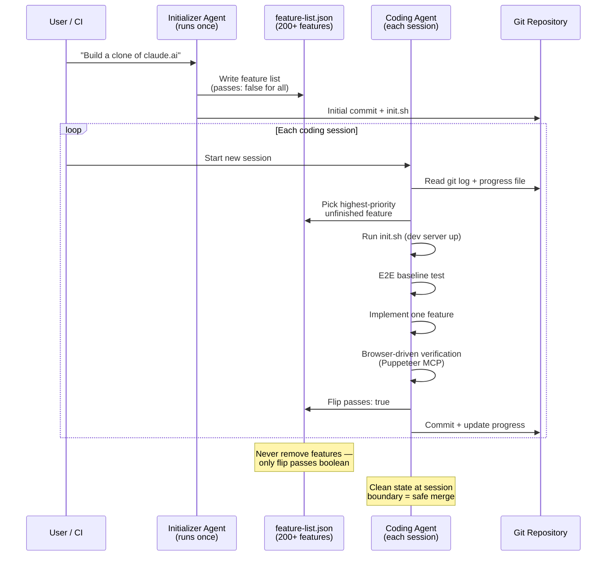

# Chapter 7: Long-Running Agents and Multi-Context-Window Tasks

### 7.1 The Shift-Change Problem

Anthropic's "Effective Harnesses for Long-Running Agents" explains the core challenge through a shift-work metaphor: imagine a software project staffed by engineers who take turns, with each new engineer arriving without any memory of the previous shift ([Anthropic — Effective Harnesses for Long-Running Agents](https://www.anthropic.com/engineering/effective-harnesses-for-long-running-agents)). Context windows impose a similar boundary. Because most substantial projects exceed a single window, agents need a reliable way to carry state from one session to the next.

Compaction alone is not always sufficient. In Anthropic's long-running application experiments, even a simple Opus 4.5 loop with the Claude Agent SDK's automatic compaction could not reliably build a production-quality application from a high-level prompt such as "build a clone of claude.ai." Failures followed two recurring patterns. In one, the agent tried to build the entire application in a single pass, exhausted its context midway through implementation, and left the next session to clean up. In the other, a later agent saw that some features were complete and incorrectly declared the whole project finished.

### 7.2 The Initializer + Coding Agent Pattern

Anthropic addresses this problem by dividing the work between two roles ([Anthropic — Effective Harnesses for Long-Running Agents](https://www.anthropic.com/engineering/effective-harnesses-for-long-running-agents)).

The **initializer agent** runs once with a specialized prompt. It produces:

- An `init.sh` script that runs the development server.
- A `claude-progress.txt` log to be updated each session.
- An initial git commit.
- A comprehensive feature-list file. Anthropic uses JSON because, in its experiments, the model was more likely to edit a Markdown list inappropriately. For the claude.ai clone, the file contained more than 200 features, all initially marked `passes: false`.

Each feature is a JSON object containing a category, a description, verification steps, and a `passes` boolean. The coding agent may change the boolean, but its instructions explicitly prohibit removing or editing the features themselves.

The **coding agent** handles every subsequent session. Its prompt emphasizes incremental progress, and each session begins with a structured warm-up:

1. Run `pwd` to confirm the directory.
2. Read git logs and the progress file to see what was last worked on.
3. Read the feature-list file and pick the highest-priority unfinished feature.
4. Run `init.sh` to start the development server, then run a basic end-to-end test before implementing anything new.
5. Implement one feature.
6. Verify the feature end to end. Anthropic uses the Puppeteer MCP for browser-driven verification because agents may otherwise declare a feature complete after its unit tests pass even when it fails in practice.
7. Commit with a descriptive message and update the progress file.

This pattern makes a clean repository state part of every session boundary—the same standard expected before merging to a main branch. As a result, the next agent can continue the work instead of spending its first turns cleaning up after the previous one.

### 7.3 Session Lifecycle and Clean Exit

Long-running harnesses need an explicit session lifecycle: start, warm up, select a bounded task, verify the result, record evidence, and exit cleanly. The final step is essential. If a session ends with failing tests, stale temporary files, an outdated feature list, or a vague progress note, the next agent must reconstruct the previous state before it can make progress.

A clean exit should therefore be part of the definition of done:

- The standard startup path still works.
- The relevant build, lint, test, or end-to-end checks have run, and any failures are either fixed or recorded as blockers.
- The progress artifact says what changed, what was verified, what remains uncertain, and the best next action.
- The feature list or task list reflects reality: no item is marked passing without evidence.
- Temporary debugging artifacts, commented-out experiments, and obsolete notes are removed or explicitly quarantined.

OpenAI describes a related maintenance loop in its work on the Codex harness. Agent-generated systems tend to reproduce the patterns already present in a repository. Architectural rules and "golden principles" should therefore be encoded in documentation, linters, and recurring cleanup passes rather than depend on occasional human judgment ([OpenAI — Harness Engineering](https://openai.com/index/harness-engineering/)). Viewed from the session boundary, Anthropic's initializer/coding-agent pattern reaches the same operational conclusion: the next session should resume from repository artifacts, not from the previous agent's private memory.

For larger projects, a lightweight quality document can complement the progress log. The progress log answers, "What happened in the last session?" The quality document answers, "Which modules are healthy, risky, difficult for agents to understand, or missing verification?" The distinction matters: the next agent needs to know not only which feature to build next, but also where the codebase may be deteriorating.

### 7.4 Generator–Evaluator (GAN-Inspired)

A follow-up by Prithvi Rajasekaran extends the pattern to a harder problem: building production-quality applications from short prompts ([Anthropic — Harness Design for Long-Running Application Development](https://www.anthropic.com/engineering/harness-design-long-running-apps)). The design begins with an important observation: when agents evaluate their own work, their judgments consistently skew positive, even when the output is mediocre. Separating the agent that produces the work from the agent that judges it is therefore a powerful lever. It is more tractable to tune an independent, skeptical evaluator than to make a generator consistently critical of its own output.

Inspired by Generative Adversarial Networks, the architecture assigns three agents distinct roles:

- **Planner** expands a prompt of one to four sentences into a complete product specification. It deliberately stays at the product and architecture level rather than prescribing a detailed technical design, where early mistakes could cascade. It is also encouraged to incorporate AI features into the specification.
- **Generator** implements the spec one feature at a time using a React + Vite + FastAPI + SQLite stack, with git for version control.
- **Evaluator** uses the Playwright MCP to interact with the running application as a user would. It tests the UI, API endpoints, and database state, then grades the result against a rubric covering product depth, functionality, visual design, and code quality. Every criterion has a hard threshold; failing any one of them fails the sprint and produces detailed feedback.

The generator and evaluator coordinate through *sprint contracts*. Before each sprint, the generator proposes what it will build and how success will be verified. The evaluator reviews the proposal until both agents agree, and the generator then builds against the accepted contract. Communication is file-based: one agent writes a file, and the other reads and responds to it.

The cost is significant. For the prompt "create a 2D retro game maker," the solo run took 20 minutes and cost $9. It produced an application that looked plausible, but the game itself did not work: entities appeared on screen, yet nothing responded to input. The full harness took 6 hours and cost $200, but produced a functioning game maker with a sprite editor, level editor, AI-assisted level generation, and playable mode. The more-than-20× cost premium bought a working application instead of a collection of broken stubs.

### 7.5 Self-Verification Is the Headline Lever

LangChain's Top-30-to-Top-5 case study reaches the same conclusion from a different direction ([LangChain — Improving Deep Agents with Harness Engineering](https://blog.langchain.com/improving-deep-agents-with-harness-engineering/)). Trace analysis revealed a common failure pattern: the agent wrote a solution, reread its own code, decided that it looked correct, and stopped. LangChain added structured guidance to the system prompt—Plan; Build with verification in mind; Verify by running tests and comparing the output with the specification; Fix—and introduced a `PreCompletionChecklistMiddleware` that intercepts the agent before exit and requires a verification pass.

This pattern resembles the "Ralph Wiggum loop" that has spread through the developer community. A hook intercepts the agent's attempt to exit and reinjects the original prompt into a clean context window, requiring the agent to continue working toward the original goal ([LangChain — The Anatomy of an Agent Harness](https://blog.langchain.com/the-anatomy-of-an-agent-harness/)).

Together, LangChain's changes—context middleware that maps the current working directory and tools, build-and-verify guidance, loop detection, and a "reasoning sandwich" of high-low-high reasoning compute—improved the score by 13.7 points, from 52.8% to 66.5%, without changing the model.

### 7.6 Context Resets vs. Compaction

Anthropic's follow-up on harness design draws an explicit distinction between compaction and context reset ([Anthropic — Harness Design for Long-Running Application Development](https://www.anthropic.com/engineering/harness-design-long-running-apps)). Compaction summarizes earlier parts of a conversation in place, allowing the same agent to continue with a shortened history. A *context reset* clears the context completely and starts a fresh agent. A structured handoff carries forward the previous agent's state and next steps.

The two techniques address different problems. Compaction preserves continuity. Resets address "context anxiety," a behavior Anthropic observed in Sonnet 4.5: as the agent approached what it believed was its context limit, it began wrapping up prematurely. A reset provides a clean slate, but the handoff artifact must preserve enough state for the next agent to resume reliably.

When Opus 4.5 largely resolved context anxiety on its own, Anthropic was able to remove context resets from the harness entirely. This is a clear example of the model-harness coupling discussed in Chapter 12.

### 7.7 Managed Agents: Decoupling Brain, Hands, and Session State

The OpenReview survey describes a platform architecture that Anthropic later calls managed agents: separate the model-side **brain**, the execution-side **hands**, and the durable **session/event log** ([OpenReview — Agent Harness Engineering: A Survey](https://openreview.net/pdf?id=3hXEPbG0dh)). The brain decides what should happen. The hands run shell commands, edit files, browse, and call external services within a replaceable environment. The session log records enough state to reconstruct either side.

This split matters for long-running work:

- If the model context is exhausted, a new brain can resume from the event log and the repository artifacts.
- If the sandbox is corrupted, timed out, or compromised, the hands can be rebuilt from a clean image.
- If credentials are required, proxies and vaults can attach them at the boundary instead of placing secrets inside the sandbox.
- If a deployment changes while agents are still running, the platform can keep both old and new worker versions alive during a gradual handoff.

From this perspective, a context reset is only one form of recovery. A production harness for long-running agents also needs environment resets, credential isolation, resumable event logs, and migration rules for sessions already in progress.

Even when a product presents them as a single "agent," three lifecycles should remain distinct:

- the **session** is the durable conversation and event history;
- the **harness run** is one execution of a model, policy, and orchestration configuration;
- the **sandbox** is a replaceable compute environment with its own image, filesystem, and network lease.

Conflating these lifecycles makes recovery unsafe. Replacing a crashed sandbox should not erase the session. Resetting the model context should not silently preserve compromised process state. Upgrading a harness should not rewrite the provenance of earlier events. Store explicit identifiers and versions for all three so the control plane can resume, migrate, or revoke each one independently.

### 7.8 Multi-Agent Research Systems

The orchestrator-worker pattern from Chapter 6 is a natural fit for tasks with parallel structure, such as research that requires many independent lines of inquiry. Anthropic's research feature uses Claude Opus 4 as the lead agent and Claude Sonnet 4 as sub-agents ([Anthropic — How We Built Our Multi-Agent Research System](https://www.anthropic.com/engineering/multi-agent-research-system)). The lead analyzes the query, develops a strategy, and launches sub-agents in parallel. Each sub-agent searches and returns condensed findings, the lead synthesizes them, and a citation agent attributes the resulting claims to sources.

Anthropic draws eight prompt-engineering principles from this experience:

1. **Think like the agent**: simulate prompts in the Console with the exact tools the agent will use, then inspect its behavior step by step.
2. **Teach the orchestrator how to delegate**: give each sub-agent an objective, output format, tool guidance, and clear task boundaries. Vague delegation leads to duplicated or misinterpreted work.
3. **Scale effort to query complexity**: encode explicit effort levels in the prompt—1 agent making 3–10 calls for fact-finding; 2–4 sub-agents making 10–15 calls each for comparisons; and more than 10 sub-agents for complex research—to prevent over-investment.
4. **Treat tool design and selection as critical**: explicit heuristics such as "examine all available tools first, match tool usage to user intent, and prefer specialized tools over generic ones" keep agents from pursuing the wrong path.
5. **Let agents improve themselves**: a tool-testing agent used a flawed MCP tool, observed the failure, and rewrote its description. The change reduced task completion time by 40% on subsequent uses.
6. **Start wide, then narrow**: prompt agents to begin with short, broad queries and refine them progressively. Their natural tendency is often the reverse.
7. **Guide the thinking process**: extended thinking serves as a controllable scratchpad for planning; interleaved thinking helps sub-agents evaluate quality and refine queries between tool calls.
8. **Parallel tool calling transforms speed**: launching sub-agents in parallel, while allowing each one to call multiple tools in parallel, reduced research time by up to 90% for complex queries.

### 7.9 Production Reliability for Stateful Agents

Anthropic's research-system post also documents engineering challenges that emerge when agents run for extended periods ([Anthropic — How We Built Our Multi-Agent Research System](https://www.anthropic.com/engineering/multi-agent-research-system)):

- **Errors compound**: without checkpoint-and-resume infrastructure, minor system failures can become catastrophic. Anthropic combines AI adaptability—informing the agent that a tool is failing and allowing it to adjust—with deterministic safeguards such as retry logic and regular checkpoints.
- **Debugging needs new tooling**: agents behave non-deterministically across runs, so full production tracing becomes the primary diagnostic surface. Such tracing can reveal decision patterns and interaction structures without exposing conversation contents.
- **Deployment needs coordination**: rolling out a code change while many agents are active requires *rainbow deployments*, which shift traffic gradually from old versions to new ones while keeping both available.
- **Synchronous execution creates bottlenecks**: in Anthropic's current architecture, the lead agent waits for all sub-agents to finish before proceeding. This simplifies coordination, but the slowest sub-agent blocks the entire system. Asynchronous execution would enable more parallelism while introducing new challenges in result coordination, state consistency, and error propagation.

### 7.10 Durable Execution: Checkpoint, Replay, and Recovery

Section 7.9 described how errors compound and how Anthropic combines AI adaptability with deterministic checkpoints and retries. *Durable execution* is the broader systems discipline behind that approach. A durable-execution engine records each workflow step in a persistent log. If the process stops because of a machine failure, timeout, deployment, or exhausted context window, it can resume from the last recorded step rather than restart from the beginning.

This idea predates agents. Workflow engines such as Temporal and DBOS use it to provide fault tolerance ([Temporal — Durable Execution Meets AI](https://temporal.io/blog/durable-execution-meets-ai-why-temporal-is-the-perfect-foundation-for-ai)). It maps directly onto the managed-agent architecture in §7.7: the durable event log is what allows a fresh brain to resume after the previous one is gone.

For an agent, the durable unit is its state: the context, tool-call results, and current position in the plan. LangGraph exposes this through a *checkpointer* that saves graph state at each super-step. These checkpoints support resuming after failure, pausing for human input, and even returning to an earlier state. Selectable durability modes trade performance against the amount of work that a crash may lose ([LangChain — Durable Execution](https://docs.langchain.com/oss/python/langgraph/durable-execution)).

The central design tension is *determinism vs. the model*. Replay-based durability assumes that re-executing a step will reproduce its effect. Model calls and tool results, however, are non-deterministic; running them again can diverge from the recorded history. The standard solution is to treat model and tool calls as *side-effecting activities*. Their results are recorded once and replayed from the log instead of being recomputed. This is the same "record the observation, don't recompute it" principle behind ReWOO (§6.6) and context resets (§7.6), elevated to an infrastructure guarantee.

Durable execution therefore turns the "clean exit, resumable from artifacts" discipline in §7.3 from a convention that the agent must remember into a property enforced by the platform. It also limits wasted cost: a crash midway through a task does not discard all the tokens spent before it. Finally, durable state provides the foundation for the rollback behavior that Chapter 17 requires when a harness change misbehaves in production.

Google's Agent Executor makes several consequences of this design concrete at distributed scale ([Google Cloud — Agent Executor](https://cloud.google.com/blog/products/ai-machine-learning/agent-executor-googles-distributed-agent-runtime/)). It recovers state from an event log and snapshots, so losing a connection does not mean losing the task. A **single-writer rule** protects each session from concurrent mutation while still allowing the platform to distribute many sessions. The runtime can also branch a trajectory from an earlier checkpoint. Branching supports human intervention, counterfactual debugging, and experiments with a different model or policy without corrupting the original lineage.

These features illustrate a general rule: durability is more than retry. A robust runtime needs idempotent activities or recorded results, ownership leases, optimistic or single-writer concurrency control, reconnection semantics, and lineage for every branch. Without these safeguards, a "resume" operation can duplicate side effects, while parallel workers can split one coherent history into several incompatible versions.

### 7.11 How Long Is "Long"? The Time-Horizon Metric

This chapter focuses on tasks that exceed a single context window, but the word "long" needs a more precise measure. METR proposes one: a model's *time horizon* is the length of task—measured by the time a skilled human needs to complete it—that the model can complete with 50% reliability. A model with a "50-minute time horizon," for example, succeeds half the time on tasks that take a skilled human about fifty minutes. Across frontier models from 2019 to 2025, this horizon roughly *doubled every seven months* ([Kwa et al. — Measuring AI Ability to Complete Long Tasks](https://arxiv.org/abs/2503.14499); [METR](https://metr.org/blog/2025-03-19-measuring-ai-ability-to-complete-long-tasks/)).

Two implications matter here. First, the time horizon is a property of the *model plus its harness*, not of the model alone. Handoffs, checkpoints, and self-verification can extend the effective horizon beyond what the raw model can sustain by itself. This is the model-harness coupling from Chapter 12, viewed from the capability side.

Second, the metric helps determine when long-running infrastructure is worth building. As the model's intrinsic horizon grows, some scaffolding becomes unnecessary. Anthropic removed context resets and later sprint decomposition as its models improved (§7.6, Ch 12). At the same time, the frontier of *interesting* long-horizon tasks moves outward. Harness engineering shifts to harder problems rather than disappearing (Ch 19).

---

## Diagram: Initializer Agent → Feature-List → Coding Agent Sessions

```mermaid
sequenceDiagram
    participant USER as User / CI
    participant IA as Initializer Agent<br/>(runs once)
    participant FL as feature-list.json<br/>(200+ features)
    participant CA as Coding Agent<br/>(each session)
    participant GIT as Git Repository

    USER->>IA: "Build a clone of claude.ai"
    IA->>FL: Write feature list<br/>(passes: false for all)
    IA->>GIT: Initial commit + init.sh

    loop Each coding session
        USER->>CA: Start new session
        CA->>GIT: Read git log + progress file
        CA->>FL: Pick highest-priority<br/>unfinished feature
        CA->>CA: Run init.sh (dev server up)
        CA->>CA: E2E baseline test
        CA->>CA: Implement one feature
        CA->>CA: Browser-driven verification<br/>(Puppeteer MCP)
        CA->>FL: Flip passes: true
        CA->>GIT: Commit + update progress
    end

    Note over FL: Never remove features —<br/>only flip passes boolean
    Note over CA: Clean state at session<br/>boundary = safe merge
```

---

## Key Takeaways

- **The shift-change problem is fundamental**: context limits mean agents need structured handoff mechanisms, not just bigger windows.
- **Initializer + coding agent is a useful long-horizon pattern**: separate roles for planning and incremental execution.
- **Clean exit is part of done**: each session should leave working startup paths, updated state artifacts, verification evidence, and no untracked mess for the next agent.
- **Separating generator from evaluator is a strong lever**: agents skew positive about their own output; an independent evaluator is more reliable.
- **Sprint contracts coordinate multi-agent work**: file-based communication with agreed success criteria before each build sprint.
- **Context resets address "context anxiety"**: sometimes a fresh start with a structured handoff outperforms compaction.
- **Managed agents decouple brain, hands, and state**: model context, sandbox execution, credentials, and event logs should fail and recover independently.
- **Session, harness run, and sandbox are separate lifecycles**: identify and version them independently so a reset, migration, or revocation affects only the intended layer.
- **Self-verification is the headline lever**: requiring a verification pass before exit improved scores by 13.7 points without changing the model.
- **Durable execution makes resumability an infrastructure guarantee**: persisting each step to a log lets a fresh agent resume after a crash, context exhaustion, or deploy — treat non-deterministic model/tool calls as recorded side effects, not steps to recompute.
- **Distributed durability needs ownership and lineage**: single-writer session state, reconnection, snapshots, idempotent activities, and trajectory branching turn retry into safe recovery.
- **The time horizon measures "how long"**: METR's task-completion horizon—the human task length a model can handle 50% of the time—has doubled roughly every seven months. It is a model-plus-harness property, which is why the machinery in this chapter can extend it.

## Further Reading

- Justin Young et al., *Effective Harnesses for Long-Running Agents*, Anthropic, Nov 2025. https://www.anthropic.com/engineering/effective-harnesses-for-long-running-agents
- Prithvi Rajasekaran, *Harness Design for Long-Running Application Development*, Anthropic, Mar 2026. https://www.anthropic.com/engineering/harness-design-long-running-apps
- Vivek Trivedy, *Improving Deep Agents with Harness Engineering*, LangChain, Feb 2026. https://blog.langchain.com/improving-deep-agents-with-harness-engineering/
- Jeremy Hadfield et al., *How We Built Our Multi-Agent Research System*, Anthropic, Jun 2025. https://www.anthropic.com/engineering/multi-agent-research-system
- Vivek Trivedy, *The Anatomy of an Agent Harness*, LangChain, Mar 2026. https://blog.langchain.com/the-anatomy-of-an-agent-harness/
- OpenAI, *Harness Engineering: Leveraging Codex in an Agent-First World*, Feb 2026. https://openai.com/index/harness-engineering/
- *Agent Harness Engineering: A Survey*, OpenReview / TMLR submission, 2026. https://openreview.net/pdf?id=3hXEPbG0dh
- Temporal, *Durable Execution Meets AI: Why Temporal Is the Perfect Foundation for AI*, 2025. https://temporal.io/blog/durable-execution-meets-ai-why-temporal-is-the-perfect-foundation-for-ai
- LangChain, *Durable Execution* (LangGraph documentation), 2025. https://docs.langchain.com/oss/python/langgraph/durable-execution
- Thomas Kwa et al., *Measuring AI Ability to Complete Long Tasks*, METR / arXiv, Mar 2025. https://arxiv.org/abs/2503.14499
- Google Cloud, *Agent Executor: Google's Distributed Agent Runtime*, 2026. https://cloud.google.com/blog/products/ai-machine-learning/agent-executor-googles-distributed-agent-runtime/
