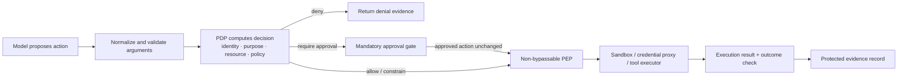
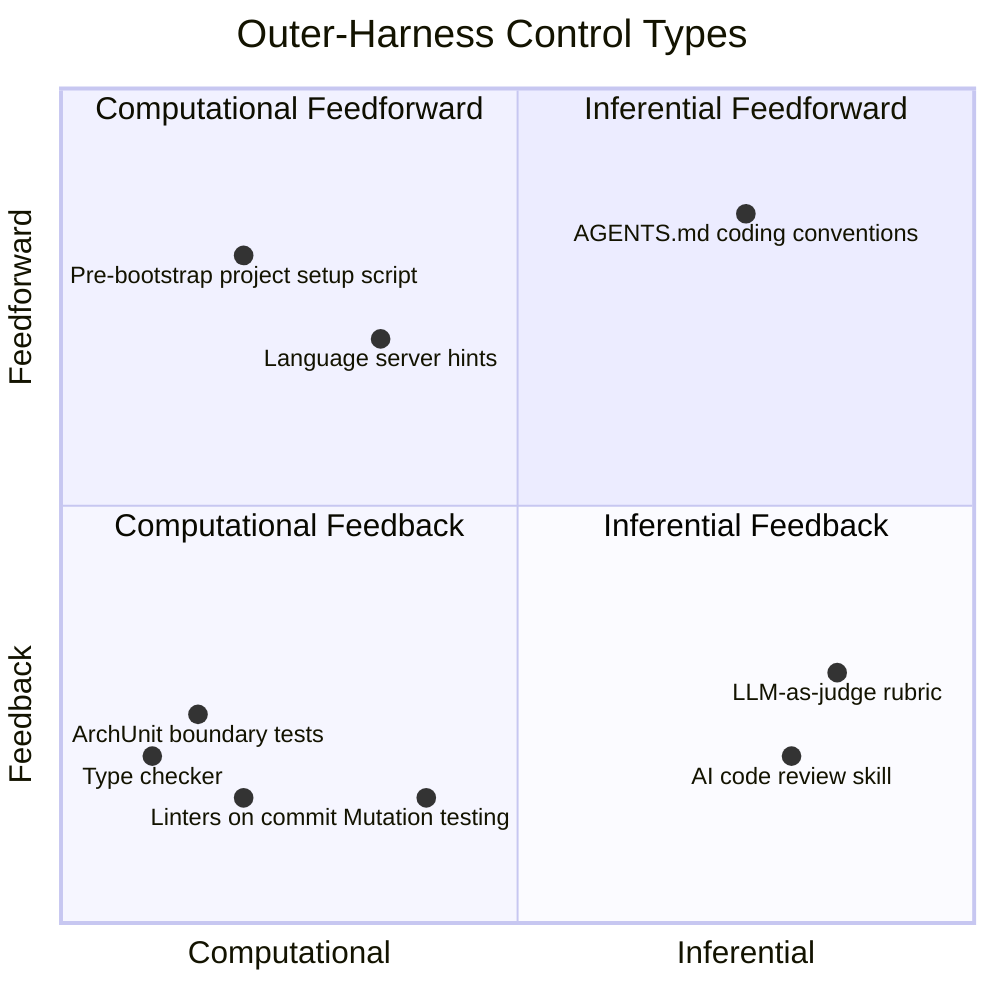

# Chapter 7: Sandboxing, Guardrails, and Runtime Enforcement

### 7.1 The Agent Security Threat Model

Most of this chapter covers *mitigations*: sandboxes, hooks, and approval gates. Before discussing them, we need to be explicit about the risks they address. An agent that can read untrusted content and act on external systems has a distinctive threat profile ([Anthropic — Beyond Permission Prompts](https://www.anthropic.com/engineering/claude-code-sandboxing)):

- **Prompt injection** (see Foundations ch 8, "Prompt Injection as Context Confusion") — the model cannot reliably distinguish data from instructions. Untrusted content that the agent reads—a web page, issue comment, source file, or tool result—can therefore steer it as if that content were a command.
- **Data exfiltration** — a compromised or steered agent with network access can send secrets, such as SSH keys, API tokens, or proprietary source code, to an attacker-controlled destination.
- **Destructive action** — a steered agent with filesystem or shell access can delete or corrupt files, or commit and push harmful code.
- **Tool and supply-chain risk** — a malicious or compromised MCP server, package, or dependency can introduce hostile tools or instructions that the agent may then trust.

The combination practitioners worry about most is sometimes called the *lethal trifecta*: access to private data, exposure to untrusted content, and the ability to communicate externally ([Simon Willison — The lethal trifecta for AI agents](https://simonwillison.net/2025/Jun/16/the-lethal-trifecta/)). Each capability can be manageable on its own. When one agent has all three, however, a single injected instruction can read a secret and send it to an attacker. Most controls in this chapter work by breaking one leg of the trifecta. Network isolation removes external communication, filesystem isolation removes access to private data, and approval gates place a human in the path of consequential actions.

The key premise for the rest of the chapter is that the model is not a trusted component. It is capable, but it can be steered. The harness is what stands between a hostile instruction and a real-world consequence.

Anthropic's later containment work sharpens this threat model along two dimensions ([Anthropic — How We Contain Claude](https://www.anthropic.com/engineering/how-we-contain-claude)). Risk can originate from a **misusing user**, from **model misbehavior**, or from an **external attacker** steering the model through content. Defenses, in turn, can be placed in the **model**, the **execution environment**, or at the **external-content boundary**. This matrix matters because no single defensive layer covers every source of risk. Alignment cannot guarantee that a model will ignore an injection, while a sandbox cannot determine whether a permitted email is semantically harmful. Production containment therefore requires defense in depth across all three layers.

### 7.2 The Permission Fatigue Problem

Coding agents that operate without oversight are dangerous, but agents that request permission for every action are impractical. Anthropic describes the resulting problem as approval fatigue: "Constantly clicking 'approve' slows down development cycles and can lead to 'approval fatigue,' where users might not pay close attention to what they're approving, and in turn making development less safe" ([Anthropic — Beyond Permission Prompts: Making Claude Code More Secure and Autonomous](https://www.anthropic.com/engineering/claude-code-sandboxing)). The solution is structural: establish boundaries within which the agent can act freely, and request permission only when an action crosses one of them.

In Anthropic's internal use, sandboxing safely reduced permission prompts by 84% ([Anthropic — Beyond Permission Prompts](https://www.anthropic.com/engineering/claude-code-sandboxing)).

### 7.3 Sandbox as Cage, Reset Button, and License

The OpenReview survey presents the sandbox as more than a security mechanism. In an agent system, it serves three purposes at once ([OpenReview — Agent Harness Engineering: A Survey](https://openreview.net/pdf?id=3hXEPbG0dh)):

- **Security**: it bounds the blast radius of unpredictable model-generated actions and prompt-injection-driven behavior.
- **Reproducibility**: it gives evals, training trajectories, and long-running sessions a resettable baseline. A container or microVM can be destroyed and rebuilt; a developer workstation cannot.
- **Liveness**: it defines a region where the agent is allowed to act without asking a human on every file write, package install, or network call.

The third purpose is distinctive to agent systems. A sandbox is not only a cage; it is also a license to act. By moving permission decisions from individual actions into session-level configuration, it makes long-horizon autonomy practical without producing constant approval prompts.

Containment should scale with the work. Three recurring patterns form a useful ladder ([Anthropic — How We Contain Claude](https://www.anthropic.com/engineering/how-we-contain-claude)):

- An **ephemeral container** is disposable, cheap, and appropriate for bounded tasks where the agent needs broad freedom inside a small blast radius.
- A **human-in-the-loop sandbox** supports interactive work: safe operations proceed automatically, while boundary crossings suspend for approval.
- A **sealed virtual machine** isolates higher-risk workloads behind a stronger kernel and network boundary, at greater startup and operational cost.

The useful question is not simply "Is it sandboxed?" Instead, ask which resources remain reachable, which state survives a reset, and what authority can cross the boundary. Resettable compute does not neutralize a credential mounted inside the sandbox, a poisoned memory written outside it, or an egress path capable of transmitting private data.

### 7.4 Filesystem and Network Isolation Must Be Paired

Claude Code's sandbox enforces filesystem and network boundaries together, and Anthropic argues that both are necessary. Filesystem isolation prevents a prompt-injected agent from modifying sensitive files. Network isolation prevents it from leaking data or downloading malware. Without the network boundary, a compromised agent could exfiltrate SSH keys. Without the filesystem boundary, it could escape the sandbox and gain network access ([Anthropic — Beyond Permission Prompts](https://www.anthropic.com/engineering/claude-code-sandboxing)).

The implementation builds on OS-level primitives—Linux bubblewrap and macOS seatbelt—and applies to subprocesses as well as direct Claude Code interactions. Network traffic passes through a Unix domain socket to a proxy, which enforces domain restrictions and asks the user to confirm newly requested domains. The runtime is open source ([Anthropic — Beyond Permission Prompts](https://www.anthropic.com/engineering/claude-code-sandboxing)).

Claude Code on the web extends the design to a cloud sandbox in which sensitive credentials, including git credentials and signing keys, never reside inside the sandbox with the agent. A custom proxy handles git interactions and attaches scoped credentials only after confirming that an operation is permitted—for example, that a push targets the configured branch ([Anthropic — How We Contain Claude](https://www.anthropic.com/engineering/how-we-contain-claude)).

An egress allowlist is a **capability grant**, not merely a list of harmless destinations. Access to a package registry permits the agent to download executable code. Access to a source host may permit it to publish content. Access to a general web endpoint can complete the exfiltration leg of the lethal trifecta. Policies should therefore bind network access to a destination, protocol, operation, identity, and task—not to a domain alone—and log the rule that authorized each connection.

Containment must also begin **before trust is established**. Opening a repository can trigger configuration loading, dependency discovery, language servers, hooks, or local listeners before the user sees a trust dialog. Treat project-open and configuration-load paths as hostile. Parse without executing where possible, disable automatic hooks and listeners, and withhold credentials and egress until the workspace has been explicitly trusted ([Anthropic — How We Contain Claude](https://www.anthropic.com/engineering/how-we-contain-claude)).

### 7.5 Identity, Policy Decisions, Enforcement, and Evidence

Sandbox boundaries are necessary, but they are not sufficient. Runtime enforcement asks who the agent represents, which resource and action are in scope, which policy version applies, and what evidence remains after execution. NIST separates the component that computes an access decision—the policy decision point (PDP)—from the policy enforcement point (PEP) that applies the decision to a request for a protected resource ([NIST — Zero Trust Architecture Glossary](https://pages.nist.gov/zero-trust-architecture/glossary.html)). The same split is useful for agent actions even when the implementation does not use those exact product names.

Three design moves matter in production:

- **Identity and delegated authorization:** the agent should act through scoped, short-lived authority, not a user's full ambient credentials. A credential broker or proxy should attach a secret only after the operation has been authorized and only for its intended audience.
- **Policy decision:** a PDP can evaluate identity, tenant, purpose, tool, normalized arguments, resource, session state, environment, and risk. Static allow/deny lists are inspectable but blunt; contextual policy is useful only if its inputs and version are recorded.
- **Policy enforcement:** a PEP on the dispatch path applies allow, deny, redact, constrain, stronger-sandbox, or require-approval outcomes. A rule in a prompt is not a PEP, and an enforcement hook that the agent can bypass cannot support a hard guarantee.
- **Evidence:** record the proposed action, identity, decision and policy version, approval when required, execution result, and verified outcome. A trace can carry some of this evidence, but only records with the required completeness, integrity, retention, identity, and access controls should be described as audit records ([NIST — SP 800-53 Rev. 5, Audit and Accountability controls](https://csrc.nist.gov/pubs/sp/800/53/r5/upd1/final)).

This is also where supply-chain attacks become harness concerns. MCP tool poisoning, tool squatting, rug-pull updates, hallucinated packages, and retrieval-source poisoning all cross the boundary between tool interfaces and governance. A safe harness needs provenance and integrity checks for tools, packages, datasets, and retrieval sources; a prompt that merely says "be careful" is not enough.

### 7.6 Advisory Hooks and Blocking Enforcement

A sandbox is one kind of programmatic guardrail. Hooks and middleware can add finer-grained behavior. Claude Code supports user-defined commands or scripts that run automatically at lifecycle events, such as agent start, after a tool call, or on stop ([HumanLayer — Skill Issue: Harness Engineering for Coding Agents](https://www.humanlayer.dev/blog/skill-issue-harness-engineering-for-coding-agents)). LangChain's middleware follows a similar structure. Some hooks are deterministic scripts; others only inject advice back into the model.

Automatic execution alone does not make every hook an enforcement point. An **advisory hook** can notify, add context, or ask the model to reconsider; the model may still ignore it. A **blocking hook** can support a hard rule only if every relevant action passes through it, denial prevents dispatch, failures are handled safely, and the agent cannot reach the protected resource through another path. The distinction is about placement and bypass resistance, not whether the hook is written in code.

Common uses include notifications, automated approvals or denials, integrations, and verification. A hook might play a sound when an agent finishes, deny a database migration and ask the user to run it, post a Slack message, open a pull request, or run type checking and a build before the agent stops. HumanLayer's example runs Biome and TypeScript in parallel whenever Claude attempts to stop. It exits silently on success; on failure, it returns only the errors with exit code 2, causing the harness to re-engage the agent.

LangChain reports that this kind of middleware helped move deepagents-cli from the Top 30 to the Top 5 on Terminal-Bench 2.0. Its `PreCompletionChecklistMiddleware` intercepts the agent before exit and prompts it to verify its work against the task specification. `LocalContextMiddleware` runs at startup to map the working directory and discover available tools. `LoopDetectionMiddleware` counts edits to each file and, after N edits to the same file, asks the agent to reconsider its approach. This can break "doom loops" in which the agent repeatedly tries small variations of a failing strategy ([LangChain — Improving Deep Agents with Harness Engineering](https://blog.langchain.com/improving-deep-agents-with-harness-engineering/)).

The survey's governance taxonomy places these hooks within a broader pipeline. Pre-invocation checks can deny unsafe tool calls. Post-invocation hooks can mark or redact untrusted outputs before they enter context. Stop hooks can require verification, and escalation hooks can route ambiguous cases to humans. The more consequential an action is, the less its safety should depend on the model remembering an instruction ([OpenReview — Agent Harness Engineering: A Survey](https://openreview.net/pdf?id=3hXEPbG0dh)).

### 7.7 Mandatory Approval Is a Runtime Gate

An agent may call a tool such as `request_human_approval`, which is a useful way to suspend and resume a workflow. It is not sufficient enforcement for high-risk actions because a compromised or mistaken model may simply omit the call. For protected operations, the dispatcher or PEP must classify the normalized action and require an approval record before execution. The MCP tools specification likewise assigns clients a responsibility to present confirmation for tool operations and let a human deny them; that confirmation happens around invocation, not because the model voluntarily requested it ([MCP — Tools Specification](https://modelcontextprotocol.io/specification/2025-06-18/server/tools)).

The approval should bind to the exact action a reviewer saw: agent and delegating identity, tenant, resource, normalized arguments, policy version, risk explanation, expiry, and any execution constraints. If a material argument, destination, credential scope, or policy version changes after approval, the gate must evaluate the new action again. This closes a time-of-check/time-of-use gap in which a harmless proposal is approved but a different action is dispatched.

Retries and fallbacks pass through the same gate. A previous approval does not authorize an altered request, and a previous denial must not be converted into a model instruction that can be argued away. If policy changes while a run is waiting, resume from a fresh decision rather than from stale authority. Chapter 14 develops the human review surface; Chapter 19 places policy administration and distributed PEPs in the fleet architecture.

### 7.8 Feedforward and Feedback: A Cybernetic View

Thoughtworks' Birgitta Böckeler offers a higher-level taxonomy for these controls ([Thoughtworks — Harness Engineering](https://martinfowler.com/articles/exploring-gen-ai/harness-engineering.html)). Outer-harness controls operate in two directions:

- **Guides (feedforward)** anticipate the agent's behavior and steer it before it acts. Examples include instructions in AGENTS.md, skills, reference documentation, and language-server hints. Their goal is to increase the probability of a good result on the first attempt.
- **Sensors (feedback)** observe the agent's work after it acts and help it self-correct. Tests, linters, type checkers, and AI code review all serve this role.

A harness with only feedforward guides keeps issuing rules but never determines whether they work. A harness with only feedback sensors repeatedly catches mistakes without helping prevent them. Both are necessary.

Each direction can be divided along a second axis:

- **Computational** controls — linters, type checkers, structural tests — are deterministic, run in milliseconds to seconds, and produce reliable results.
- **Inferential** controls — semantic analysis, AI code review, LLM-as-judge — handle nuance but are slower, more expensive, and non-deterministic.

The two axes are independent. Coding conventions in AGENTS.md are inferential feedforward; ArchUnit tests that check module boundaries on commit are computational feedback. A `/code-review` skill provides inferential feedback, while a pre-bootstrap script that creates the project structure is computational feedforward. A well-engineered harness combines all four types.

### 7.9 Three Regulation Categories

Böckeler also distinguishes harnesses by the qualities they regulate ([Thoughtworks — Harness Engineering](https://martinfowler.com/articles/exploring-gen-ai/harness-engineering.html)):

- **Maintainability harness** — regulates internal code quality, duplication, complexity, coverage, and style. This is the easiest category because it can draw on a long history of existing tools.
- **Architecture fitness harness** — regulates performance, observability, and debuggability. It captures the application's cross-cutting "fitness functions."
- **Behavior harness** — asks whether the application behaves as intended. This remains the least-solved category. Most teams currently use functional specifications as feedforward and AI-generated test suites as feedback, sometimes supplemented by mutation testing. Böckeler is candid that trusting AI-generated tests "is not good enough yet."

These categories make harness coverage easier to assess. A harness that is strong on maintainability but weak on behavior can create a false sense of safety.

### 7.10 Timing: Keep Quality Left

Continuous integration teaches that the earlier a problem is found, the cheaper it is to fix. The same principle applies to harness design. Fast computational sensors, such as linters and quick tests, should run before commit. More expensive computational and inferential sensors, such as mutation testing and broader code review, can run after integration in the pipeline. Continuous-drift sensors—including dead-code detection, dependency scanners, and log-anomaly judges—operate outside the change lifecycle altogether ([Thoughtworks — Harness Engineering](https://martinfowler.com/articles/exploring-gen-ai/harness-engineering.html)).

As Böckeler notes, the OpenAI Codex team's harness follows the same pattern: custom linters and structural tests enforce a layered architecture, while recurring "garbage collection" passes scan for drift and ask agents to suggest fixes.

### 7.11 Harnessability, Agentic Readiness, and Ambient Affordances

Not every codebase is equally easy to harness. A strongly typed language provides type-checking sensors by default. Clear module boundaries make architectural constraints enforceable. Opinionated frameworks such as Spring hide details that the agent would otherwise need to manage ([Thoughtworks — Harness Engineering](https://martinfowler.com/articles/exploring-gen-ai/harness-engineering.html)).

The term *ambient affordances*, which Böckeler credits to Ned Letcher, captures these properties of the environment that make it legible, navigable, and manageable for agents ([Thoughtworks — Harness Engineering](https://martinfowler.com/articles/exploring-gen-ai/harness-engineering.html)). Greenfield teams can design these affordances from the start. Legacy teams face the opposite situation: a harness is often most necessary where it is hardest to build.

Looking ahead, Böckeler proposes *harness templates*: bundles of guides and sensors for specific service topologies, such as a JVM CRUD service, a Go event processor, or a Node dashboard. These could accompany existing service templates. She invokes Ashby's Law of Requisite Variety to formalize the argument: a regulator must have at least as much variety as the system it governs. Choosing a constrained topology reduces that variety and makes a comprehensive harness more achievable ([Thoughtworks — Harness Engineering](https://martinfowler.com/articles/exploring-gen-ai/harness-engineering.html)).

The broader production concept is **agentic readiness**: can an autonomous caller safely understand, invoke, observe, retry, and, when necessary, undo an operation? A service may be easy for a human developer to use yet hostile to an agent if its APIs conceal side effects, return ambiguous errors, or lack stable operation identifiers. Readiness improves when:

- mutations accept idempotency keys and expose operation status;
- APIs distinguish read, propose, commit, and compensate rather than hiding them behind one opaque call;
- machine identity and delegated authorization are first-class;
- errors state what failed, whether a retry is safe, and what evidence would prove recovery;
- state changes are observable, attributable, and reversible through compensating actions where literal undo is impossible.

These features act as ambient affordances for autonomous software. They reduce the amount of probabilistic reasoning required from the model and give the Chapter 19 control plane stable surfaces for policy, lifecycle management, and audit evidence.

### 7.12 Operational Safety: Circuit Breakers, Kill Switches, Budgets, and Canaries

Sandboxes, policy, and enforcement points (§7.3–7.7) constrain what an agent *may* do. A second family of controls limits the consequences when the agent or its tools *misbehave at runtime*. These controls come almost unchanged from distributed-systems reliability and security operations. They belong in the surrounding system because an agent that has been steered or caught in a loop cannot be trusted to apply them to itself.

- **Circuit breakers.** Wrap a flaky or expensive dependency—a tool, downstream service, or sub-agent—so that the breaker trips after a threshold of failures. Subsequent calls fail fast instead of hanging or producing a retry storm ([Fowler — CircuitBreaker](https://martinfowler.com/bliki/CircuitBreaker.html)). For agents, this limits the blast radius of an erroring tool or an agent that repeatedly retries the same failing action. It complements Chapter 5's context policy: keep one actionable failure visible while preventing it from recurring without limit.
- **Kill switches.** Provide a human- or policy-triggered mechanism that can halt one agent or an entire fleet immediately, independently of the agent's own control flow. A prompt-injected agent may be actively working against its instructions, so the switch must live in the harness—as a supervisor process, revocable credential, or sandbox teardown—not in a prompt that says "stop if asked."
- **Action budgets, iteration caps, and cost governors.** Set hard limits on tool calls, tokens, wall-clock time, or spending. When a limit is reached, the loop stops and escalates rather than continuing unchecked. This is the operational form of the loop stop rules in Chapter 13 and the per-task budgets in Chapter 18: an unbounded loop creates both an unbounded bill and an unbounded blast radius.
- **Canary tokens.** Place fake secrets—an unused API key, decoy file, or tripwire URL—where a prompt-injected agent might try to read or exfiltrate them. A callback from a canary is a high-signal warning that the agent has been steered toward data it should not touch ([Thinkst — Canarytokens](https://canarytokens.org/)). Unlike a sandbox, a canary does not *prevent* the exfiltration leg of the lethal trifecta (§7.1); it *detects* it. That makes it a useful final line of defense when prevention is imperfect.

The principle is consistent throughout the chapter: the more consequential a failure is, the less its prevention should depend on the model choosing to avoid it. Prevention through sandboxes and policy works together with detection through canaries and the drift alerts discussed in Chapter 18. Neither is sufficient alone.

---

## Diagram: Proposal to Enforced Effect

*The model can propose and explain an action. Only the external decision and enforcement path can authorize credentials, cross a sandbox boundary, or create a protected side effect.*

---

## Diagram: Feedforward/Feedback × Computational/Inferential Quadrant

---

## Key Takeaways

- **The threat model comes first**: prompt injection, data exfiltration, destructive action, and supply-chain risk all become especially dangerous when private data, untrusted content, and external communication form the *lethal trifecta*.
- **Anthropic reported an 84% reduction in permission prompts in its internal sandbox rollout**: this is a dated case study, not a universal reduction factor.
- **Sandboxing has three jobs**: security, reproducibility, and liveness.
- **Filesystem and network isolation must be paired**: each addresses a different attack vector, and either alone is insufficient.
- **Containment is a matrix, not a single sandbox**: defend against misuse, model misbehavior, and external attack at the model, environment, and content boundaries; choose ephemeral containers, interactive sandboxes, or sealed VMs according to risk.
- **Egress is authority**: an allowed destination grants a real capability, so bind network access to the operation, identity, and task—and grant no ambient trust merely because a project has been opened.
- **Decisions and enforcement are different:** a PDP computes policy; a non-bypassable PEP applies it on the action path.
- **Approval is mandatory when policy requires it:** a model-requested approval tool is useful orchestration, but it cannot be the only high-risk gate.
- **Hooks differ in strength:** advisory hooks can steer or notify; only blocking, non-bypassable hooks can enforce a hard rule.
- **Trace is not automatically audit:** preserve identity, policy decision, approval, execution, and outcome under explicit integrity and retention requirements.
- **Feedforward and feedback are both required**: guides without sensors have no learning loop; sensors without guides react but don't prevent.
- **Three categories of harness coverage**: maintainability (well-tooled), architecture fitness (achievable), and behavior (the unsolved problem).
- **Ambient affordances matter**: strongly-typed languages and opinionated frameworks make harnessing easier from day one.
- **Agentic readiness is an API property**: idempotency, explicit operation status, machine identity, retry semantics, observable state, and compensating actions make systems safer for autonomous callers.
- **Runtime safety also requires operational controls**: circuit breakers, kill switches, action and cost budgets, and canary tokens limit misbehavior when it occurs. They belong in the harness because a steered agent cannot be trusted to stop itself.

## Further Reading

- David Dworken and Oliver Weller-Davies, *Beyond Permission Prompts: Making Claude Code More Secure and Autonomous*, Anthropic, Oct 2025. https://www.anthropic.com/engineering/claude-code-sandboxing
- Birgitta Böckeler, *Harness Engineering for Coding Agent Users*, Thoughtworks / martinfowler.com, Apr 2026. https://martinfowler.com/articles/exploring-gen-ai/harness-engineering.html
- Kyle Brunet, *Skill Issue: Harness Engineering for Coding Agents*, HumanLayer, Mar 2026. https://www.humanlayer.dev/blog/skill-issue-harness-engineering-for-coding-agents
- Vivek Trivedy, *Improving Deep Agents with Harness Engineering*, LangChain, Feb 2026. https://blog.langchain.com/improving-deep-agents-with-harness-engineering/
- *Agent Harness Engineering: A Survey*, OpenReview / TMLR submission, 2026. https://openreview.net/pdf?id=3hXEPbG0dh
- Martin Fowler, *CircuitBreaker*, martinfowler.com, Mar 2014. https://martinfowler.com/bliki/CircuitBreaker.html
- Thinkst, *Canarytokens* (free tripwire tokens). https://canarytokens.org/
- Anthropic Safeguards Research Team, *How We Contain Claude*, Anthropic, May 2026. https://www.anthropic.com/engineering/how-we-contain-claude
- NIST, *Zero Trust Architecture Glossary*. https://pages.nist.gov/zero-trust-architecture/glossary.html
- NIST, *SP 800-53 Rev. 5: Security and Privacy Controls for Information Systems and Organizations*. https://csrc.nist.gov/pubs/sp/800/53/r5/upd1/final
- Model Context Protocol, *Tools Specification*, Jun 18, 2025. https://modelcontextprotocol.io/specification/2025-06-18/server/tools
