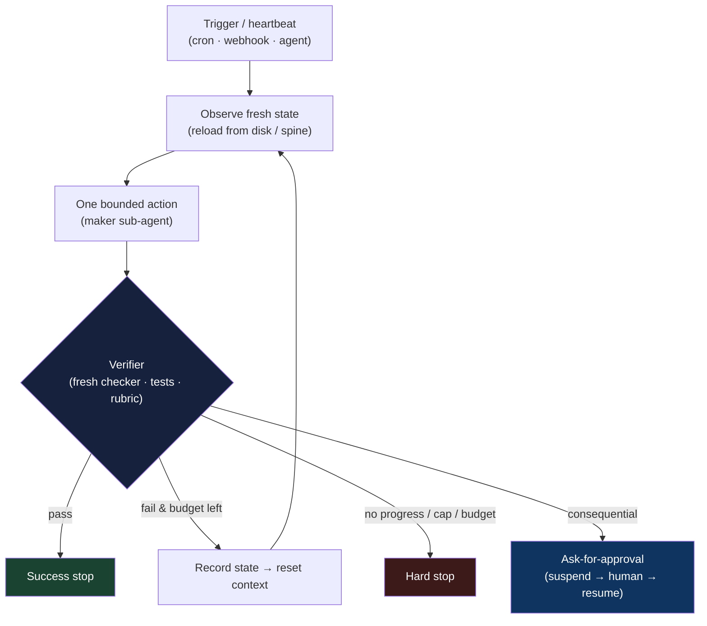

# Chapter 8: Loop Engineering

*Agent = Model + Harness.* Chapter 1 introduced the agent loop as the cycle at the centre of every agent: assemble context, let the model emit a tool call, execute it through the harness, append the observation, and repeat. The previous chapters focused on the components *inside* that loop—what the model sees, which tools it can use, where it runs, and how it recovers across sessions. This chapter treats the loop *itself* as the primary unit of engineering. The questions are what starts it, what happens on each pass, who checks the result, and when the work stops. In 2026, this practice acquired a name, *loop engineering*, and a slogan: stop prompting the agent and build the system that prompts it.

### 8.1 From Prompting to Looping

Section 1.6 traced a progression from prompt engineering to context engineering and, more broadly, to harness engineering. Loop engineering is the next step in that progression, and it made the shift concrete for practitioners. Addy Osmani named the pattern in his June 2026 essay "Loop Engineering," which described its canonical anatomy and introduced much of the vocabulary now in circulation ([Addy Osmani — Loop Engineering](https://addyosmani.com/blog/loop-engineering/)). That same week, Peter Steinberger compressed the idea into a line that reached millions within a day: you should no longer prompt coding agents; you should design the loops that prompt them ([O'Reilly Radar — Loop Engineering](https://www.oreilly.com/radar/loop-engineering/)). Boris Cherny, who built Claude Code, put the practitioner's version bluntly: he no longer prompts the model turn by turn—his job is to write the loops that drive it ([The New Stack — Loop Engineering](https://thenewstack.io/loop-engineering/)).

The change in framing sounds small, but its consequences are substantial. In prompt engineering, the human remains *inside* the loop: they advance each step and judge each result. Loop engineering removes the human from that inner position and asks a harder question: if no person is present to decide what happens next or whether the work is good enough, *what will make those decisions*? The rest of this chapter answers that question. The underlying mechanics are still the agent loop from Chapter 1; what changes is the focus. Instead of concentrating on the model's individual turn, loop engineering concentrates on the surrounding control structure that schedules, verifies, and bounds the agent over longer horizons. This is squarely harness territory. The two disciplines describe closely related work, but loop engineering is the operator's view of the *outer* loop.

### 8.2 A Loop Is a Task With a Check

The field guide offers a useful one-sentence definition: a loop is a task with a check, and a task without a check is just hope ([The Agentic Loop — A Practical Field Guide](https://dev.to/truongpx396/the-agentic-loop-a-practical-field-guide-mnc)). In fuller form, each pass through a well-formed loop follows four steps: observe the current state, take one bounded action, check the result against a fixed standard, and decide whether to continue or stop. This structure exposes four design levers. Much of loop engineering consists of specifying them clearly:

- **The trigger** — what starts a pass: a human goal, a schedule, a webhook, or another agent.
- **The topology** — how loops nest and hand off: one agent, a maker plus a checker, or an orchestrator over workers.
- **The verifier** — the fixed standard that decides "good enough," and who applies it.
- **The stop rules** — the explicit conditions under which the loop succeeds, gives up, or asks for help.

If any one of these remains implicit, the failure mode is predictable. Without a trigger, the loop is only a chat. Without a verifier, it can declare success on bad work. Without a stop rule, it can run forever—or until the budget is gone. The rest of this chapter examines these levers in turn.

### 8.3 The Trigger and the Nested Loops

A trigger turns an agent from something you invoke on demand into something that can run on its own. Osmani's anatomy calls this the *heartbeat*: a schedule or event that wakes the loop without a human prompt ([Addy Osmani — Loop Engineering](https://addyosmani.com/blog/loop-engineering/)). At this point, a coding agent becomes an operational system rather than merely an editor. A cron job might start it each night, a webhook might start it when a new issue arrives, or a supervising agent might launch it as a sub-task.

Andrew Ng provided a useful map of the topology by showing that these loops are nested. Each has a different owner and operates on a different time horizon ([Andrew Ng — The Batch, June 2026](https://www.deeplearning.ai/the-batch/)):

- The **agentic coding loop** runs in minutes: given a spec and evals, the agent writes code, tests it, and iterates until it meets the spec — no human between turns.
- The **developer feedback loop** runs in hours: a human inspects what was built and steers the agent toward what to do next.
- The **external feedback loop** runs over days: alpha testers, A/B tests, and production signals reveal how the product performs in practice.

Loop engineering automates the inner loop most aggressively. Human judgment remains essential in the outer loops because people hold a *context advantage* the agent lacks: they understand the intent behind the work and what the product is ultimately for. In Ng's example, a coding agent worked unattended for about an hour and checked its work in a browser several times before returning for direction. The design goal is to let each loop run productively for as long as it can, then hand control to the next loop when it needs broader context.

### 8.4 The Verifier Is the Bottleneck

Of the four levers, the verifier demands the most attention because it is what makes unattended operation safe. Chapter 7 approached the same issue from another direction: agents tend to judge their own work too positively, so separating the agent that produces the work from the agent that evaluates it is a powerful safeguard. Loop engineering elevates that observation into a design rule—the maker must not be the checker ([Loop Engineering Crash Course](https://agentfactory.panaversity.org/docs/loop-engineering-crash-course)). A separate reviewer agent, given the specification rather than the diff and instructed to be skeptical, can catch problems the generator might rationalize away. The generator–evaluator split from §7.4 and the evaluator-optimizer workflow from Chapter 6 therefore become more than useful techniques: they determine whether a loop can safely run on its own.

The community slogan captures this shift in leverage: writing the verifier is the new prompt engineering ([The Agentic Loop — A Practical Field Guide](https://dev.to/truongpx396/the-agentic-loop-a-practical-field-guide-mnc)). The difficult and valuable work is no longer simply phrasing the request. It is defining "done" precisely enough for a machine to recognize it. This leads to a useful distinction:

- A **closed loop** pins its acceptance criteria up front as hard, checkable passes — all tests green, the schema validates, the screenshot matches. It runs on a predictable budget and is safe to leave running.
- An **open loop** explores toward a less precise goal. It needs an even stronger verifier because, without one, it does not fail loudly. Instead, it can produce plausible but incorrect results with confidence, hundreds of times.

Verification should be as mechanical as the task allows. Prefer tests, type checks, schema validation, and browser assertions; use an LLM-as-judge only for properties that cannot be checked deterministically. This is the computational-before-inferential ordering from Chapter 5 and the grader taxonomy from Chapter 10. The strongest form uses a *fresh* model with no memory of how the work was produced, reducing the chance that it inherits the maker's blind spots.

### 8.5 Stop Rules and the Three Hard Stops

A loop that can start itself must also be able to stop itself—and not only when it succeeds. Every well-formed loop needs explicit outcomes for success, no-op (nothing left to do), ask-for-approval, and blocked-or-exhausted. It also needs three non-negotiable hard limits to contain a runaway process ([The Agentic Loop — A Practical Field Guide](https://dev.to/truongpx396/the-agentic-loop-a-practical-field-guide-mnc)):

1. **A maximum iteration count** — a hard cap like "all tests green, or six rounds, whichever comes first."
2. **No-progress detection** — if N passes produce no measurable change, halt rather than spin.
3. **A budget ceiling** — a token or dollar limit past which the loop stops and asks.

These limits are the per-task budget from Chapter 17 viewed from inside the loop. They matter here because no human is present to notice when the process starts spinning. The failure mode is concrete: a team at Uber capped agent spending at \$1,500 per month after an unattended setup consumed its annual AI budget in four months ([AI Builder Club — Loop Engineering Guide](https://www.aibuilderclub.com/blog/loop-engineering-guide-2026)). The ask-for-approval outcome provides the bridge to Chapter 15. When escalation is modeled as a tool call, the loop can suspend, hand a decision to a human, and resume from the event log after the human responds. It is the same durable-approval pattern, now used as the loop's designated exit for consequential decisions.

### 8.6 The Ralph Lineage

Loop engineering did not appear fully formed. It is the latest stage in a progression that the field has followed since 2022 ([The Agentic Loop — A Practical Field Guide](https://dev.to/truongpx396/the-agentic-loop-a-practical-field-guide-mnc)):

- **ReAct** (2022) established the basic reason–act–observe cycle that Chapter 1 calls the agent loop ([Yao et al. — ReAct](https://arxiv.org/abs/2210.03629)).
- **AutoGPT** (2023) made the loop goal-driven and autonomous—and exposed the failure this discipline now guards against: without a verifier or a stop rule, a loop can run forever or drift away from its goal.
- **The "Ralph Wiggum" loop** (2025) added the crucial fix described in §7.5: start each iteration with a clean context window, anchor state in files on disk instead of an ever-growing history, and reinject the goal so the agent continues to work against it.
- **Verifiable-completion commands** (2026), such as a `/goal` that gates exit on a separate validator model, made the stop rule a first-class, machine-checked step rather than the agent's own opinion.
- **Orchestration** (current) has loops supervising loops — scheduled, git-backed, and handing work up and down Ng's nested horizons.

Two ideas connect this lineage to the rest of the book. First, the Ralph reset explains why *memory lives on disk, not in context* (Chapters 2–3). A loop that resets on every pass must reload its state from files, exactly as the structured note-taking and recitation patterns in those chapters prescribe. Second, verifiable completion explains why *the event log matters* (Chapter 9). When loop state is stored in an append-only log, the loop can stop, resume, and be replayed—properties that make long-horizon autonomy debuggable.

### 8.7 What a Loop Is Made Of

Osmani's anatomy identifies the parts of a durable loop. Each one maps to a capability developed in an earlier chapter ([Addy Osmani — Loop Engineering](https://addyosmani.com/blog/loop-engineering/)):

- **Heartbeat** — the schedule or event that triggers a pass (§8.3).
- **Worktrees** — isolated working directories so parallel passes do not collide, drawing on the sandbox isolation of Chapter 5.
- **Skills** — reusable, file-backed project knowledge written once and loaded on demand, the `SKILL.md` pattern of Chapter 4.
- **Connectors** — MCP servers and plugins that reach the real tools the work depends on (Chapter 4).
- **Sub-agents** — the maker and the checker as separate roles (§8.4, Chapter 3).
- **The spine** — a persistent state file that survives between runs and carries the loop's memory across resets (Chapters 2–3, and the structured handoff of §7.6).

A loop is only as effective as the codebase it works in. Practitioners therefore describe three properties a repository needs before it is ready for loop-based work ([AI Builder Club — Loop Engineering Guide](https://www.aibuilderclub.com/blog/loop-engineering-guide-2026)). It must be **legible**: a compact `AGENTS.md` index and custom lints should show the agent how the codebase is organized and what it must not touch. It must be **executable**: the development server should start at near-zero token cost and support parallel worktrees. And it must be **verifiable**: end-to-end tests and browser-driven checks should cover the core flows, giving the verifier in §8.4 something mechanical to assert. These are the *ambient affordances* from Chapter 5, but for autonomous work they are prerequisites rather than conveniences.

### 8.8 The Maturity Ladder and Unattended Risk

Because a loop repeats and compounds its behaviour, adoption should proceed in stages. The community's maturity ladder advances one level at a time, and only after the current level reliably produces work you would otherwise have done by hand ([The Agentic Loop — A Practical Field Guide](https://dev.to/truongpx396/the-agentic-loop-a-practical-field-guide-mnc)):

0. **Manual** — you prompt every turn.
1. **Triage** — the loop reports findings to a markdown file, changing nothing.
2. **Draft** — it makes fixes on an isolated branch.
3. **Verified PR** — a separate verifier gates the change before a human reviews it.
4. **Auto-merge** — reserved for low-risk classes only.

Loop engineering does not eliminate the hard problem; it moves it. Speed compounds both successes and mistakes. An unattended loop also makes mistakes unattended, and it can ship code faster than a person can review it. The result is *comprehension debt*: a codebase that its owners no longer fully understand ([The New Stack — Loop Engineering](https://thenewstack.io/loop-engineering/)). Human responsibility therefore remains at two irreducible endpoints: defining the *intent* that determines what "good" means, and taking *ownership* of what ships ([Loop Engineering Crash Course](https://agentfactory.panaversity.org/docs/loop-engineering-crash-course)). This leads to a practical scoping rule: use a structured loop for work that is repeated, unattended, scheduled, and consequential. When you are already watching the agent interactively, your own judgment provides the check and a plain conversation is usually the better tool. Over-engineering a loop for a one-off task is another failure mode.

### 8.9 Beyond the Loop: Control and Evaluator Integrity

Loop engineering is the right unit of design for one autonomous task. A production system, however, eventually runs many loops under different identities, versions, budgets, and policies. At that scale, the next design object is the **control plane**: the system that registers agents, grants authority, schedules and revokes runs, records lineage, and governs the fleet. Chapter 18 develops that layer.

The verifier also needs governance. A separate checker may still be biased by its knowledge of downstream consequences, share the maker's blind spots, or be optimized against. Chapter 10 therefore treats **evaluator integrity**—blind judgment, deterministic evidence, calibration, abstention, and audit—as a separate concern from merely having a verifier. An engineered loop is truly closed only when its check is trustworthy.

---

## Diagram: The Engineered Loop

---

## Key Takeaways

- **Loop engineering is the outer-loop view of harness engineering**: instead of prompting the agent turn by turn, design the system that prompts it and decides when the work is good enough.
- **A loop is a task with a check**: observe → take one bounded action → verify against a fixed standard → continue or stop. A task without a check is just hope.
- **Four levers define a loop**: the trigger, topology, verifier, and stop rules. If any one remains implicit, the failure mode is predictable.
- **Loops are nested**: agentic coding operates in minutes, developer feedback in hours, and external feedback in days. Automate the inner loop while preserving human judgment in the outer ones.
- **The verifier is the bottleneck**: writing it is the new prompt engineering. The maker must not be the checker, and a weak check can silently accept confident but incorrect work.
- **Stop rules are mandatory**: use a maximum iteration count, no-progress detection, and a budget ceiling because no human is present to notice a runaway.
- **The Ralph lineage shows how the pattern evolved**: ReAct → AutoGPT → clean-context reset → verifiable completion → orchestration. Memory lives on disk, and state lives in an event log.
- **Climb the maturity ladder gradually**: move from triage to draft to auto-merge only for repeated, unattended, and consequential work. Unattended speed compounds mistakes and comprehension debt.
- **After one loop, the next unit is the fleet**: identity, lifecycle, policy, lineage, and revocation belong to a control plane, while verifier integrity belongs to the evaluation system.

## Further Reading

- Addy Osmani, *Loop Engineering*, addyosmani.com, Jun 2026. https://addyosmani.com/blog/loop-engineering/
- *Loop Engineering*, O'Reilly Radar, 2026. https://www.oreilly.com/radar/loop-engineering/
- Andrew Ng, *Three Loops for Building 0-to-1 AI Products*, The Batch, Jun 2026. https://www.deeplearning.ai/the-batch/
- *The Anthropic leader who built Claude Code ditched prompting — now he writes loops*, The New Stack, 2026. https://thenewstack.io/loop-engineering/
- *The Agentic Loop: A Practical Field Guide*, DEV Community, 2026. https://dev.to/truongpx396/the-agentic-loop-a-practical-field-guide-mnc
- *Loop Engineering Guide (2026)*, AI Builder Club. https://www.aibuilderclub.com/blog/loop-engineering-guide-2026
- Shunyu Yao et al., *ReAct: Synergizing Reasoning and Acting in Language Models*, arXiv, Oct 2022. https://arxiv.org/abs/2210.03629
