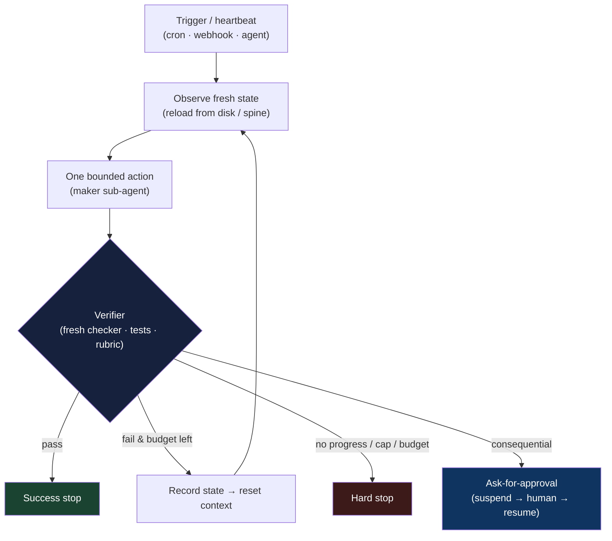

# Chapter 8: Loop Engineering

*Agent = Model + Harness.* Chapter 1 introduced the agent loop as the cycle at the centre of every agent — assemble context, the model emits a tool call, the harness executes it, the observation is appended, repeat. The previous chapters engineered the *inside* of that loop: what the model sees, what tools it has, where it runs, how it recovers across sessions. This chapter is about engineering the loop *itself* as the primary unit of work — deciding what starts it, what it does each pass, who checks the result, and when it stops. In 2026 this practice acquired a name, *loop engineering*, and a slogan: stop prompting the agent, and build the system that prompts it.

### 8.1 From Prompting to Looping

Section 1.6 traced an arc — prompt engineering gave way to context engineering, which sits under harness engineering. Loop engineering is the next stop on the same road, and the one that made the shift concrete for practitioners. Addy Osmani named the pattern in a June 2026 essay, "Loop Engineering," which supplied the canonical anatomy and the vocabulary that now circulates ([Addy Osmani — Loop Engineering](https://addyosmani.com/blog/loop-engineering/)). The same week, Peter Steinberger compressed it into a line that reached millions within a day: you should not be prompting coding agents anymore; you should be designing the loops that prompt them ([O'Reilly Radar — Loop Engineering](https://www.oreilly.com/radar/loop-engineering/)). Boris Cherny, who built Claude Code, put the practitioner's version bluntly: he no longer prompts the model turn by turn — his job is to write the loops that drive it ([The New Stack — Loop Engineering](https://thenewstack.io/loop-engineering/)).

The reframe is small but load-bearing. In prompt engineering the human is *in* the loop, pressing enter between every step and judging each result. Loop engineering removes the human from that inner position and asks a harder question: if you are not there to decide when the work is good enough and what to do next, *what is*? Everything in this chapter is an answer to that question. Nothing here is new relative to the mechanics of Chapter 1 — it is the same agent loop — but the emphasis moves from the model's turn to the surrounding control structure, which is squarely harness territory. Loop engineering and harness engineering are two names for closely related work; loop engineering is the operator's framing, focused on the *outer* loop that schedules, verifies, and bounds the agent over long horizons.

### 8.2 A Loop Is a Task With a Check

The field guide's one-sentence definition is the right anchor: a loop is a task with a check, and a task without a check is just hope ([The Agentic Loop — A Practical Field Guide](https://dev.to/truongpx396/the-agentic-loop-a-practical-field-guide-mnc)). Expanded, one pass of a well-formed loop is: observe the current state, take one bounded action, check the result against a fixed standard, and decide whether to continue or stop. That structure exposes four design levers, and loop engineering is largely the work of specifying them well:

- **The trigger** — what starts a pass: a human goal, a schedule, a webhook, or another agent.
- **The topology** — how loops nest and hand off: one agent, a maker plus a checker, or an orchestrator over workers.
- **The verifier** — the fixed standard that decides "good enough," and who applies it.
- **The stop rules** — the explicit conditions under which the loop succeeds, gives up, or asks for help.

Leave any one implicit and the failure is predictable. No trigger and the loop is just a chat. No verifier and it declares victory on garbage. No stop rule and it runs forever, or until the bill arrives. The rest of this chapter takes the four levers in turn.

### 8.3 The Trigger and the Nested Loops

A trigger is what promotes an agent from something you invoke to something that runs on its own. Osmani's anatomy calls it the *heartbeat* — a schedule or event that wakes the loop without a human prompt ([Addy Osmani — Loop Engineering](https://addyosmani.com/blog/loop-engineering/)). This is where a coding agent becomes an operations concern rather than an editor: cron fires it nightly, a webhook fires it on a new issue, or a supervising agent fires it as a sub-task.

Andrew Ng gave the topology its clearest map by observing that these loops nest, each with a different owner and time horizon ([Andrew Ng — The Batch, June 2026](https://www.deeplearning.ai/the-batch/)):

- The **agentic coding loop** runs in minutes: given a spec and evals, the agent writes code, tests it, and iterates until it meets the spec — no human between turns.
- The **developer feedback loop** runs in hours: a human inspects what was built and steers the agent toward what to do next.
- The **external feedback loop** runs in days: alpha testers, A/B tests, production signal.

The inner loop is the one loop engineering automates most aggressively; the outer loops are where human judgment stays irreplaceable, because the human holds a *context advantage* the agent lacks — knowledge of intent and of what the product is really for. Ng's own example: a coding agent worked unattended for about an hour, checking its work in a browser several times, before coming back for direction. The design goal is to let each loop run as long as it productively can before it must hand up to the next.

### 8.4 The Verifier Is the Bottleneck

Of the four levers, the verifier is where loop engineering concentrates its effort, because it is what makes unattended operation safe. Chapter 7 established the headline result from the other direction: agents skew positive about their own work, so separating the agent that does the work from the agent that judges it is a strong lever. Loop engineering elevates that observation to a design law — the maker must not be the checker ([Loop Engineering Crash Course](https://agentfactory.panaversity.org/docs/loop-engineering-crash-course)). A separate reviewer agent, given the spec rather than the diff and prompted to be skeptical, catches what the generator rationalizes past. This is the generator–evaluator split of §7.4 and the evaluator-optimizer workflow of Chapter 6, promoted from a technique to the thing that determines whether the loop can be left alone.

The community slogan captures the leverage shift: writing the verifier is the new prompt engineering ([The Agentic Loop — A Practical Field Guide](https://dev.to/truongpx396/the-agentic-loop-a-practical-field-guide-mnc)). The scarce, valuable act is no longer phrasing the request; it is defining "done" precisely enough that a machine can check it. A useful distinction follows:

- A **closed loop** pins its acceptance criteria up front as hard, checkable passes — all tests green, the schema validates, the screenshot matches. It runs on a predictable budget and is safe to leave running.
- An **open loop** explores loosely toward a fuzzy goal. It needs an even stronger verifier, because without one it does not fail loudly — it succeeds at producing plausible garbage, confidently, hundreds of times.

The verifier should be as mechanical as the task allows: a test, a type check, a schema validation, a browser assertion, and only then an LLM-as-judge for what cannot be checked deterministically — the computational-before-inferential ordering of Chapter 5, and the grader taxonomy of Chapter 10. The strongest form uses a *fresh* model with no memory of how the work was produced, so it cannot inherit the maker's blind spots.

### 8.5 Stop Rules and the Three Hard Stops

A loop that can start itself must also be able to stop itself, and for reasons other than success. Every well-formed loop needs explicit stop conditions — success, no-op (nothing left to do), ask-for-approval, and blocked-or-exhausted — and three of these are non-negotiable hard stops that exist to bound a runaway ([The Agentic Loop — A Practical Field Guide](https://dev.to/truongpx396/the-agentic-loop-a-practical-field-guide-mnc)):

1. **A maximum iteration count** — a hard cap like "all tests green, or six rounds, whichever comes first."
2. **No-progress detection** — if N passes produce no measurable change, halt rather than spin.
3. **A budget ceiling** — a token or dollar limit past which the loop stops and asks.

This is the per-task budget of Chapter 17 seen from the loop's inside, and the reason it is load-bearing here is that the human is no longer present to notice the spin. The failure mode is concrete: a team at Uber capped agent spending at \$1,500/month after an unattended setup burned its annual AI budget in four months ([AI Builder Club — Loop Engineering Guide](https://www.aibuilderclub.com/blog/loop-engineering-guide-2026)). The ask-for-approval stop is the bridge to Chapter 15: modeling escalation as a tool call lets the loop suspend, hand a decision to a human, and resume from the event log when they respond — the same durable-approval pattern, now the loop's designated exit for anything consequential.

### 8.6 The Ralph Lineage

Loop engineering did not appear from nowhere; it is the current rung of a ladder the field has been climbing since 2022 ([The Agentic Loop — A Practical Field Guide](https://dev.to/truongpx396/the-agentic-loop-a-practical-field-guide-mnc)):

- **ReAct** (2022) established the basic reason–act–observe cycle that Chapter 1 calls the agent loop ([Yao et al. — ReAct](https://arxiv.org/abs/2210.03629)).
- **AutoGPT** (2023) made it goal-driven and autonomous — and exposed the failure the discipline now guards against: a loop with no verifier and no stop rule runs forever or wanders off.
- **The "Ralph Wiggum" loop** (2025) added the crucial fix seen in §7.5: reset to a clean context window each iteration, anchoring state to files on disk rather than to a swelling history, and reinject the goal so the agent keeps working against it.
- **Verifiable-completion commands** (2026), such as a `/goal` that gates exit on a separate validator model, made the stop rule a first-class, machine-checked step rather than the agent's own opinion.
- **Orchestration** (current) has loops supervising loops — scheduled, git-backed, and handing work up and down Ng's nested horizons.

Two through-lines connect the lineage to the rest of the book. The Ralph reset is why *memory lives on disk, not in context* (Chapters 2–3): a loop that resets each pass must reload its state from files, which is exactly the structured note-taking and recitation those chapters prescribe. And verifiable completion is why *the event log matters* (Chapter 9): a loop whose state is an append-only log can stop, resume, and be replayed, which is what makes long-horizon autonomy debuggable at all.

### 8.7 What a Loop Is Made Of

Osmani's anatomy lists the parts a durable loop assembles, and each maps onto a capability the earlier chapters already built ([Addy Osmani — Loop Engineering](https://addyosmani.com/blog/loop-engineering/)):

- **Heartbeat** — the schedule or event that triggers a pass (§8.3).
- **Worktrees** — isolated working directories so parallel passes do not collide, drawing on the sandbox isolation of Chapter 5.
- **Skills** — reusable, file-backed project knowledge written once and loaded on demand, the `SKILL.md` pattern of Chapter 4.
- **Connectors** — MCP servers and plugins that reach the real tools the work depends on (Chapter 4).
- **Sub-agents** — the maker and the checker as separate roles (§8.4, Chapter 3).
- **The spine** — a persistent state file that survives between runs and carries the loop's memory across resets (Chapters 2–3, and the structured handoff of §7.6).

The loop is only as good as the codebase it runs against, which is why practitioners describe three properties a repository needs to be loop-ready ([AI Builder Club — Loop Engineering Guide](https://www.aibuilderclub.com/blog/loop-engineering-guide-2026)). It must be **legible** — a compact `AGENTS.md` index and custom lints so the agent knows the shape of the code and what not to touch. It must be **executable** — a dev server that comes up at near-zero token cost and tolerates parallel worktrees. And it must be **verifiable** — end-to-end tests and browser-driven checks on the core flows, so the verifier of §8.4 has something mechanical to assert against. These are the *ambient affordances* of Chapter 5, now prerequisites for autonomy rather than niceties.

### 8.8 The Maturity Ladder and Unattended Risk

Because a loop compounds whatever it does, adoption should be staged. The community's maturity ladder climbs one rung at a time, and only when the current rung already produces work you would have done by hand ([The Agentic Loop — A Practical Field Guide](https://dev.to/truongpx396/the-agentic-loop-a-practical-field-guide-mnc)):

0. **Manual** — you prompt every turn.
1. **Triage** — the loop reports findings to a markdown file, changing nothing.
2. **Draft** — it makes fixes on an isolated branch.
3. **Verified PR** — a separate verifier gates the change before a human reviews it.
4. **Auto-merge** — reserved for low-risk classes only.

The discipline exists because loop engineering does not remove the hard problem; it relocates it. Speed compounds both wins and mistakes: a loop running unattended is also a loop making mistakes unattended, and it can ship code faster than a human reads it, accumulating *comprehension debt* — a codebase whose owners no longer fully understand it ([The New Stack — Loop Engineering](https://thenewstack.io/loop-engineering/)). Verification and accountability remain human, at two irreducible endpoints: the *intent* that specifies what "good" means, and the *ownership* of what ships ([Loop Engineering Crash Course](https://agentfactory.panaversity.org/docs/loop-engineering-crash-course)). The corollary is a scoping rule: reach for a structured loop only for work that is repeated, unattended, scheduled, and consequential. For anything you are watching interactively, the check is your own eyes, and a plain conversation is the better tool — over-engineering a loop for a one-off is its own failure mode.

### 8.9 Beyond the Loop: Control and Evaluator Integrity

Loop engineering remains the right unit for one autonomous task, but a production system eventually runs many loops under many identities, versions, budgets, and policies. At that point the next design object is the **control plane**: the system that registers agents, grants authority, schedules and revokes runs, records lineage, and governs a fleet. Chapter 18 develops that layer.

The verifier also needs governance of its own. A separate checker can still be biased by knowledge of downstream consequences, share the maker's blind spots, or be optimized against. Chapter 10 therefore treats **evaluator integrity**—blind judgment, deterministic evidence, calibration, abstention, and audit—as distinct from merely having a verifier. An engineered loop is only closed when the check itself is trustworthy.

---

## Diagram: The Engineered Loop

---

## Key Takeaways

- **Loop engineering is the outer-loop framing of harness engineering**: stop prompting the agent turn by turn; design the system that prompts it, and specify what decides when the work is good enough.
- **A loop is a task with a check**: observe → one bounded action → verify against a fixed standard → decide continue or stop. A task without a check is just hope.
- **Four levers define a loop**: the trigger, the topology, the verifier, and the stop rules. Leave any implicit and the failure is predictable.
- **Loops nest**: agentic coding in minutes, developer feedback in hours, external feedback in days — automate the inner loop, keep human judgment on the outer ones.
- **The verifier is the bottleneck**: writing it is the new prompt engineering, the maker must not be the checker, and a weak check fails silently by shipping confident garbage.
- **Stop rules are mandatory**: a max iteration count, no-progress detection, and a budget ceiling — because no human is present to notice a runaway.
- **The Ralph lineage is the ancestry**: ReAct → AutoGPT → clean-context reset → verifiable completion → orchestration; memory lives on disk and state lives in an event log.
- **Climb the maturity ladder slowly**: triage before draft before auto-merge, and only for work that is repeated, unattended, and consequential — unattended speed compounds mistakes and comprehension debt.
- **The next unit after one loop is the fleet**: identity, lifecycle, policy, lineage, and revocation belong to a control plane, while verifier integrity belongs to the evaluation system.

## Further Reading

- Addy Osmani, *Loop Engineering*, addyosmani.com, Jun 2026. https://addyosmani.com/blog/loop-engineering/
- *Loop Engineering*, O'Reilly Radar, 2026. https://www.oreilly.com/radar/loop-engineering/
- Andrew Ng, *Three Loops for Building 0-to-1 AI Products*, The Batch, Jun 2026. https://www.deeplearning.ai/the-batch/
- *The Anthropic leader who built Claude Code ditched prompting — now he writes loops*, The New Stack, 2026. https://thenewstack.io/loop-engineering/
- *The Agentic Loop: A Practical Field Guide*, DEV Community, 2026. https://dev.to/truongpx396/the-agentic-loop-a-practical-field-guide-mnc
- *Loop Engineering Guide (2026)*, AI Builder Club. https://www.aibuilderclub.com/blog/loop-engineering-guide-2026
- Shunyu Yao et al., *ReAct: Synergizing Reasoning and Acting in Language Models*, arXiv, Oct 2022. https://arxiv.org/abs/2210.03629
