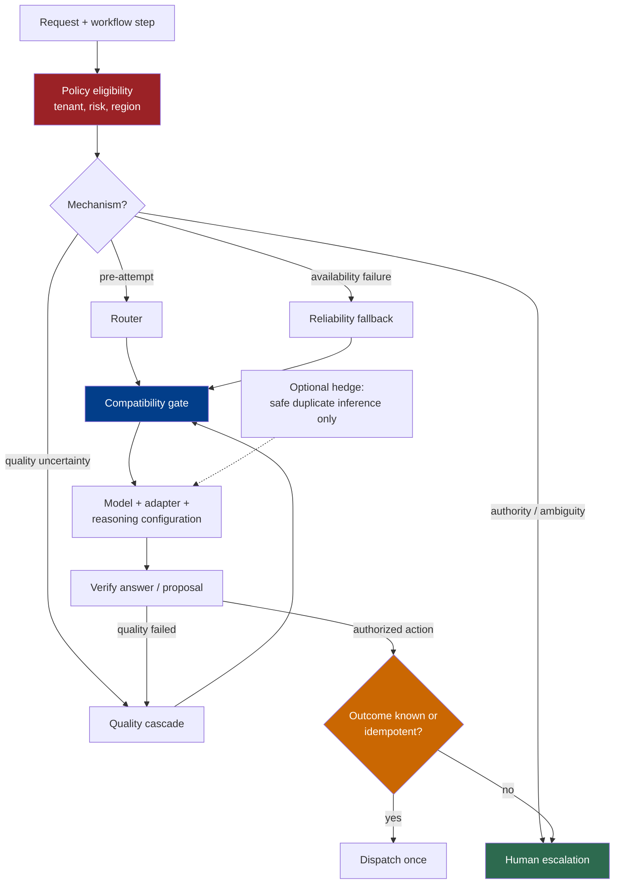

# Chapter 8: Model Selection, Routing, and Reasoning Budgets

*Agent = Model + Harness.* Model choice is part of the harness configuration, but “send it to another model” is not one operation. A router, a quality cascade, a reliability fallback, a hedged request, and a human escalation solve different problems and have different correctness conditions.

This chapter treats a route as safe only when the target configuration can honor the call's input, output, tool, state, policy, and data-handling contracts. The companion *LLM Foundations* volume explains model behavior; this chapter owns operational selection and switching.

### 8.1 Select a Model-Plus-Harness Configuration

The unit of selection is normally a model call or workflow step, not an entire application. A loop can use a capable model for planning and a smaller model for bounded classification or extraction, provided evaluation shows that the smaller configuration preserves the required outcome. Anthropic likewise recommends using the simplest workflow that succeeds and adding model-driven complexity only when it produces measurable value ([Anthropic — Building Effective Agents](https://www.anthropic.com/engineering/building-effective-agents)).

The selected object is more than a model ID:

```text
RouteTarget {
  provider, model_snapshot, endpoint,
  modalities, context_and_output_limits,
  tool_protocol, tool_schemas,
  structured_output_contract,
  reasoning_configuration,
  policy_profile, data_region,
  timeout, price_schedule
}
```

OpenAI's model catalog, for example, publishes capabilities such as context window, maximum output, modalities, tools, function calling, and structured-output support per model rather than as properties of a universal API model ([OpenAI — Models](https://developers.openai.com/api/docs/models)). A deployment must snapshot the capabilities it actually validated; a mutable provider alias can change without the application changing its own code.

Per-call selection has one important exception: a stateful assistant turn or tool-use continuation may bind several API calls to one provider-specific protocol. Switching midway is unsafe unless the harness has an explicit translation or restart strategy. Section 8.5 returns to this reasoning-state boundary.

### 8.2 Five Different Routing Mechanisms

Do not use *routing* as a catch-all for every model switch.

| Mechanism | Decision point | Purpose | Required signal |
|---|---|---|---|
| **Router** | Before an attempt | Match a request or step to a suitable target | Features available before execution and an evaluated routing policy |
| **Quality cascade** | After a cheaper attempt | Escalate when the first result does not meet a quality bar | A verifier that can accept or reject that result |
| **Reliability fallback** | After an infrastructure or availability failure | Continue service on a compatible target | Failure classification plus a prevalidated fallback target |
| **Hedging** | Concurrently or after a short delay | Reduce tail latency by racing equivalent attempts | An operation safe to duplicate, a winner rule, and loser cancellation |
| **Human escalation** | Before or after an automated attempt | Transfer ambiguity, authority, or high-impact judgment to a person | A stop condition, review package, and durable wait/resume path |

RouteLLM is a research example of a learned pre-execution router: it was trained from preference data to choose between stronger and weaker models and evaluated the resulting cost-quality tradeoff on its benchmark suite ([Ong et al. — RouteLLM](https://arxiv.org/abs/2406.18665)). Its measured savings are properties of that router, model pair, prices, and evaluation set—not a guarantee that difficulty routing will pay off for another workload.

FrugalGPT is a research example of quality cascades: it evaluates an answer from one service and conditionally escalates to another, optimizing under a budget on the studied datasets ([Chen et al. — FrugalGPT](https://arxiv.org/abs/2305.05176)). A cascade without a trustworthy acceptance signal is merely a slower route; schema validity alone proves neither semantic correctness nor task success.

Hedging is not fallback. The *Tail at Scale* describes issuing redundant requests to reduce tail latency in large online services, accepting extra work as the tradeoff ([Dean and Barroso — The Tail at Scale](https://research.google/pubs/the-tail-at-scale/)). In an agent system, hedge model generation only when duplicate attempts are policy-compatible and cannot independently cause external side effects. The harness chooses one result and prevents losing proposals from reaching tool dispatch.

Human escalation is not a “stronger model tier.” Use it when the missing ingredient is authorization, responsibility, domain judgment, or clarification rather than more inference compute. The workflow must preserve state while it waits and show the reviewer the relevant evidence, proposed action, uncertainty, and alternatives.

### 8.3 Require Compatibility Before Fallback

A fallback target is eligible only if it passes a compatibility gate for the current call. Test the exact model snapshot, endpoint, and harness adapter; provider families and “OpenAI-compatible” transports do not establish semantic equivalence.

| Dimension | Compatibility question | Failure if ignored |
|---|---|---|
| **Modalities** | Can the target accept every input type and produce the required output type at the required fidelity? | Images, audio, files, or tool results are dropped or transformed incorrectly. |
| **Context and output limits** | Do serialized input, reserved reasoning/output budget, tool schemas, and expected result fit? | Truncation, rejected requests, or missing final output. |
| **Tool protocol and schema** | Does the target support the same call/result protocol, parallelism, tool-choice modes, schema subset, and call-ID continuation? | Invalid calls, lost correlations, or different dispatch behavior. |
| **Structured output** | Does the target enforce the required schema and refusal/error representation? | Downstream code accepts prose or a different failure shape. |
| **Reasoning and continuation state** | Can provider-specific reasoning items, signatures, response IDs, and unfinished tool turns be continued or intentionally restarted? | Rejected requests or a continuation that silently loses prior work. |
| **Safety and policy** | Is the target approved for this tenant, risk class, content, tool set, and action scope, and does the harness normalize refusal handling? | A fallback bypasses a model allowlist or changes policy behavior. |
| **Data region and retention** | Are endpoint, model, tools, storage, processing region, retention mode, and subprocessors permitted? | The route violates residency or data-handling requirements. |

Capability differences are concrete API facts, not theoretical edge cases: model catalogs expose different modality, tool, structured-output, and context support ([OpenAI — Models](https://developers.openai.com/api/docs/models)). Data-region support can also vary by endpoint, model, tool, storage, and processing mode; OpenAI's data-control documentation, for example, distinguishes regional storage from regional processing and lists service-level eligibility ([OpenAI — Data Controls](https://developers.openai.com/api/docs/guides/your-data#data-residency-controls)). Treat current provider documentation as an input to the compatibility registry, not as a substitute for local contract tests.

Latency, price, capacity, and rate limits are selection constraints rather than semantic compatibility. A target may be compatible but too slow or expensive for the request's service tier. Conversely, a fast target is not eligible if it cannot honor the output or policy contract.

Precompute the compatibility graph for known targets, then re-check request-specific values at dispatch: actual token count, attached modalities, selected tools, tenant policy, data region, and current provider status. Fail closed to another eligible route or human escalation; do not silently strip an unsupported input to make a target fit.

### 8.4 Fallback and Retry Must Respect Side Effects

A model call proposes output; Chapter 6's dispatcher decides whether an external action executes. This boundary determines whether retry is cheap or dangerous.

Classify an attempt before retrying:

1. **No action proposed:** retry or fallback may repeat inference cost, but not an external effect.
2. **Action proposed but not dispatched:** discard the old proposal, route again, and authorize the new proposal normally.
3. **Dispatch outcome known:** record the outcome; retry only under the tool's documented semantics.
4. **Dispatch outcome unknown:** query the target system by action or idempotency key before deciding whether to repeat, compensate, or escalate.

HTTP Semantics states that a client should not automatically retry a non-idempotent request unless it knows the request semantics are idempotent or can determine that the original request was not applied ([RFC 9110 §9.2.2](https://www.rfc-editor.org/rfc/rfc9110.html#section-9.2.2)). Agent retries need the same discipline even when the tool transport is not HTTP.

For a side-effecting action, use a stable action ID or idempotency key that survives model fallback, gateway retry, worker restart, and timeout. Persist the proposed operation before dispatch and store the external resource ID or outcome beside it. If the target system offers no idempotency or status lookup, an ambiguous timeout is a human-review or compensation case—not permission to call the action again.

Retries never inherit authorization merely because the first attempt was allowed. Re-evaluate policy when identity, resource state, action arguments, policy version, route target, or approval validity changes. A fallback also must not reinterpret a refusal, deny, or mandatory approval as an infrastructure error.

### 8.5 Reasoning Budgets Are Provider-Specific Controls

Reasoning effort is a useful routing axis, but there is no portable cross-provider unit called “one reasoning token” or “high effort.” Each provider defines its own parameters, token accounting, supported models, continuation objects, and interactions with tools and caching.

OpenAI currently documents model-specific `reasoning.effort` levels and provider-managed persisted reasoning through `reasoning.context` and response continuation; its guidance says to compare settings on representative workloads rather than assume the maximum level is best ([OpenAI — Model Guidance](https://developers.openai.com/api/docs/guides/latest-model)). Anthropic documents manual and adaptive thinking modes, `budget_tokens` or effort controls depending on model, and rules for preserving thinking blocks during tool-use continuations ([Anthropic — Extended Thinking](https://platform.claude.com/docs/en/build-with-claude/extended-thinking)). These are different API contracts, not two spellings of one universal control.

The harness should expose a provider-neutral objective such as:

```text
ReasoningPolicy {
  quality_tier,
  max_end_to_end_latency,
  max_call_cost,
  allow_persisted_reasoning,
  data_handling_profile
}
```

The provider adapter maps that objective to supported parameters and records the resolved settings and usage. Do not translate `high` to `high` by name alone. Calibrate each provider/model configuration on the same task slice.

Reasoning state is also part of compatibility. Anthropic requires complete, unmodified thinking blocks in certain tool-use continuations, while OpenAI documents continuation through provider-specific response items and IDs ([Anthropic — Extended Thinking](https://platform.claude.com/docs/en/build-with-claude/extended-thinking); [OpenAI — Model Guidance](https://developers.openai.com/api/docs/guides/latest-model)). A harness cannot serialize one provider's opaque state into another provider's protocol and call that a continuation. It must either stay on the original target, restart from an explicit context summary and durable tool outcomes, or use a translation that has its own evals.

Visible or summarized reasoning is not a verifier. Providers may omit or summarize internal reasoning, and the returned representation belongs to their API contract ([Anthropic — Extended Thinking](https://platform.claude.com/docs/en/build-with-claude/extended-thinking)). Judge the answer, evidence, tool outcomes, and environment state instead.

### 8.6 Apply Policy Before Cost Optimization

Routing is a constrained optimization problem. First determine the eligible set; only then optimize among it.

Eligibility can depend on:

- tenant and user entitlements;
- approved provider, model snapshot, and endpoint;
- data classification, storage and processing region, and retention mode;
- required safety or domain policy profile;
- allowed modalities, hosted tools, and third-party subprocessors;
- action risk, approval status, and current incident controls.

A cheap route outside the eligible set is not a saving. Provider data-residency documentation demonstrates why eligibility must include the complete request path: regional storage does not necessarily imply regional processing, and third-party tools can have separate policies ([OpenAI — Data Controls](https://developers.openai.com/api/docs/guides/your-data#data-residency-controls)).

Record the policy version and eligibility result with every routing decision. If a provider error leaves no eligible automated target, use an explicit fail-closed result or human escalation rather than falling through to an unapproved default.

### 8.7 Evaluate the Routing System, Not Just Each Model

A routing policy can make every candidate look good in isolation and still fail by choosing the wrong candidate. Evaluate the complete model-plus-harness configurations, router decisions, escalation signals, and failure handling. Anthropic's evaluation guidance separates tasks, trials, graders, transcripts, outcomes, the agent harness, and the evaluation harness; that separation is useful for attributing routing failures to the decision rather than only to the selected model ([Anthropic — Demystifying Evals for AI Agents](https://www.anthropic.com/engineering/demystifying-evals-for-ai-agents)).

Use representative slices, not one blended average:

| Slice | What to measure |
|---|---|
| **Quality** | Task success, required evidence, verifier false accept/reject, easy/hard and domain cohorts |
| **Cost** | Input, output, reasoning, cache, tool, hedge, and escalation cost per successful outcome |
| **Latency** | Queue, router, provider, tool, verifier, and end-to-end p50/p95/p99; timeouts by stage |
| **Failure class** | Rate limit, timeout, transport error, context overflow, schema failure, refusal, tool mismatch, ambiguous side effect |
| **Policy** | Ineligible-route rate, region/retention/model-allowlist violations, approval and tenant-isolation tests |
| **Routing behavior** | Route distribution, misroutes, cascade escalation rate, fallback success, hedge win/cancel rate, human escalation rate |

For router evals, label both costly false escalation and more serious false economy: cases sent to a cheaper target that fail the task or policy. For cascades, grade the first answer independently so a weak verifier cannot make the cascade appear efficient. For fallback tests, inject each failure class and assert which transitions are allowed. For hedging, count duplicate tokens and verify that losing outputs cannot dispatch actions.

Pin model snapshots, adapters, prompts, tools, policy versions, prices, and regional endpoints in the trial manifest. Report current price as dated configuration data, not as a timeless property of a model family. A route is ready only when quality, cost, latency, failure, and policy slices all meet their gates.

### 8.8 An AI Gateway Is a Placement Option, Not an Architectural Role

An AI gateway can centralize provider adapters, credentials, quotas, routing, retries, telemetry, and sometimes policy checks. It can be a useful implementation location, but the product label does not make it a control plane or a policy enforcement point.

Kubernetes uses *control plane* for components that manage the overall state of a cluster, distinct from node components that run workloads ([Kubernetes — Components](https://kubernetes.io/docs/concepts/overview/components/)). In this book, a fleet control plane similarly manages desired configuration, identity, policy administration and decisions, versions, and lifecycle across many agents. A gateway on the synchronous model-call path is ordinarily a data-path component even if a separate control service configures it.

NIST defines a policy enforcement point (PEP) by function: it enforces access-policy decisions when a subject requests a protected resource ([NIST — Zero Trust Glossary](https://pages.nist.gov/zero-trust-architecture/glossary.html)). A gateway is a PEP only for the decisions it enforces on an unavoidable path. Logging a policy result, adding a guardrail callback, or hosting routing logic does not by itself make the gateway the PEP for tool execution, file access, or downstream side effects.

Centralization also creates correlated risk. Put explicit timeouts and circuit breakers around the gateway, preserve end-to-end call and action IDs, and ensure gateway retries use the same idempotency and outcome rules as application retries. Keep route policy in versioned configuration and test it independently of the gateway product.

### 8.9 Treat Every Route Change as a Release

A model upgrade, provider swap, reasoning-setting change, new cascade verifier, region change, or gateway policy edit changes the model-plus-harness configuration. Release it through the same eval and rollback discipline as code.

Use shadow traffic only when data policy permits it and its duplicate request cannot cause actions. Canary an eligible configuration on bounded traffic, compare the slices in Section 8.7, and retain the route target and decision reason in the trace. Aliases are convenient for provider updates, but production reproducibility requires recording the resolved model snapshot when the provider exposes one.

Rollback is also subject to the compatibility gate. An older target may no longer support a new tool schema, output contract, or policy requirement. “Last known good” means last known good for the current harness contract, not merely a previously deployed model ID.

---

## Diagram: A Policy- and Compatibility-Gated Route



---

## Key Takeaways

- **Select a configuration, not a model name:** endpoint, modalities, limits, tools, output contract, reasoning state, policy, and region travel together.
- **Name the mechanism:** router, quality cascade, reliability fallback, hedging, and human escalation have different triggers and proofs.
- **Compatibility precedes fallback:** never strip inputs, tools, state, or policy requirements merely to make a backup target accept the call.
- **Retry does not mean repeat the side effect:** use stable action IDs, idempotency, and outcome verification before another dispatch.
- **Reasoning controls are provider-specific:** map a neutral quality/latency/cost objective through a tested adapter; opaque continuation state is not generally portable.
- **Policy defines the eligible set:** optimize cost and latency only among targets permitted for the tenant, risk, data path, and action.
- **Evaluate routing as a system:** slice quality, cost, latency, failure class, policy, and routing behavior.
- **A gateway is not automatically a control plane or PEP:** classify it by the management and enforcement functions it actually performs.

## Further Reading

- Erik Schluntz and Barry Zhang, *Building Effective Agents*, Anthropic, Dec 2024. https://www.anthropic.com/engineering/building-effective-agents
- Isaac Ong et al., *RouteLLM: Learning to Route LLMs with Preference Data*, 2024. https://arxiv.org/abs/2406.18665
- Lingjiao Chen, Matei Zaharia, and James Zou, *FrugalGPT: How to Use Large Language Models While Reducing Cost and Improving Performance*, 2023. https://arxiv.org/abs/2305.05176
- Jeffrey Dean and Luiz André Barroso, *The Tail at Scale*, 2013. https://research.google/pubs/the-tail-at-scale/
- OpenAI, *Models*. https://developers.openai.com/api/docs/models
- OpenAI, *Model Guidance*. https://developers.openai.com/api/docs/guides/latest-model
- Anthropic, *Extended Thinking*. https://platform.claude.com/docs/en/build-with-claude/extended-thinking
- IETF, *RFC 9110: HTTP Semantics*, §9.2.2. https://www.rfc-editor.org/rfc/rfc9110.html#section-9.2.2
- OpenAI, *Data Controls in the OpenAI Platform*. https://developers.openai.com/api/docs/guides/your-data#data-residency-controls
- Anthropic, *Demystifying Evals for AI Agents*. https://www.anthropic.com/engineering/demystifying-evals-for-ai-agents
- Kubernetes, *Kubernetes Components*. https://kubernetes.io/docs/concepts/overview/components/
- NIST, *Zero Trust Glossary*. https://pages.nist.gov/zero-trust-architecture/glossary.html
