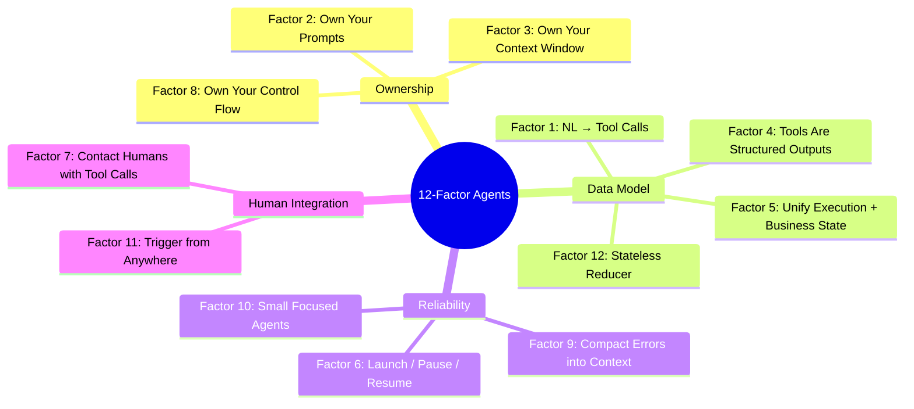

# Chapter 8: Twelve Factors for Production Agents

The previous chapters described individual harness techniques: context management, tools, sandboxing, workflows, and long-running handoffs. This chapter steps back: HumanLayer's "12 Factor Agents" is best read as a production checklist that ties those techniques back to ordinary software architecture. It borrows the naming style of the classic Twelve-Factor App, but the factors are specific to LLM agents — and it is a manifesto, not a complete reference architecture.

Two software concepts do a lot of work in this chapter. *State* is the information needed to continue execution: the current step, retry counts, approvals, user messages, tool results, and business objects touched so far. An *event log* is the append-only record from which that state can be reconstructed. When an agent is modeled as a reducer over events, pause/resume, replay, debugging, and testing become ordinary software problems rather than hidden conversation state.

The twelve principles, drawn from many production deployments ([HumanLayer — 12-Factor Agents](https://www.humanlayer.dev/blog/12-factor-agents)):

1. **Natural Language to Tool Calls**: the atomic pattern is converting user phrasing into a structured JSON call that deterministic code executes.
2. **Own Your Prompts**: do not outsource prompt engineering to a framework's black box. Write prompts as first-class code so they can be tested, evaluated, and tuned.
3. **Own Your Context Window**: standard message-format is one option; custom XML-tagged event logs that pack history into a single user message are another. The aim is maximum information density with minimum tokens.
4. **Tools Are Just Structured Outputs**: a tool call is a model emitting JSON that names an intent and parameters. Deterministic code decides what to do with it.
5. **Unify Execution State and Business State**: don't separate "current step / next step / retry count" from "what happened in the conversation." Infer execution state from a single event log.
6. **Launch / Pause / Resume with Simple APIs**: agents are programs; they should support standard lifecycle operations, including pause-between-tool-selection-and-execution.
7. **Contact Humans with Tool Calls**: rather than relying on the model's choice of plain-text vs. structured output, give it explicit `request_human_input` tools with structured options (urgency, format, choices).
8. **Own Your Control Flow**: hijack the loop to break for approval, summarize tool results, run LLM-as-judge over outputs, manage memory, log and trace, rate-limit, or sleep durably.
9. **Compact Errors into Context Window**: leaving errors visible enables self-healing; with a counter on consecutive errors, escalate to a human after a threshold.
10. **Small, Focused Agents**: keep individual agent scope to 3–10, maybe 20 steps. Larger context = worse performance.
11. **Trigger from Anywhere**: enable launches from Slack, email, SMS, webhooks, crons. Combined with factor 7, this enables the *outer loop* — agents kicked off by events that contact humans for help when they reach critical points.
12. **Make Your Agent a Stateless Reducer**: a fold over events. Pure, serializable, replay-able.

The deeper claim binding these together is that "agents, at least the good ones, don't follow the 'here's your prompt, here's a bag of tools, loop until you hit the goal' pattern. Rather, they are comprised of mostly just software" ([HumanLayer — 12-Factor Agents](https://www.humanlayer.dev/blog/12-factor-agents)). The factors are mostly software-engineering hygiene applied to a stateful, non-deterministic component. They should not be treated as universal laws: a research prototype, a local coding assistant, and a regulated customer-support agent will need different trade-offs. The useful lesson is the direction of travel — make state explicit, make control flow inspectable, and put human interaction behind structured interfaces.

---

## Diagram: The 12 Factors Grouped by Theme

---

## Key Takeaways

- **"Mostly just software"**: good agents are deterministic programs with a non-deterministic LLM component — not bags of tools looping until done.
- **Own your prompts**: frameworks hide prompts; prompts should be first-class code under version control.
- **Stateless reducer pattern**: treating the agent as a fold over an event log makes it serializable, replay-able, and testable.
- **Small, focused agents**: 3–20 steps per agent; performance degrades with context length.
- **Contact humans with tool calls**: structured `request_human_input` tools beat relying on the model's unstructured text choices.
- **Compact errors, don't hide them**: visible error traces enable self-healing; a consecutive-error counter provides a safety escalation path.

## Further Reading

- Dex Horthy, *12-Factor Agents*, HumanLayer, Apr 2025. https://www.humanlayer.dev/blog/12-factor-agents
- Kyle Brunet, *Skill Issue: Harness Engineering for Coding Agents*, HumanLayer, Mar 2026. https://www.humanlayer.dev/blog/skill-issue-harness-engineering-for-coding-agents
- Erik Schluntz and Barry Zhang, *Building Effective Agents*, Anthropic, Dec 2024. https://www.anthropic.com/engineering/building-effective-agents
