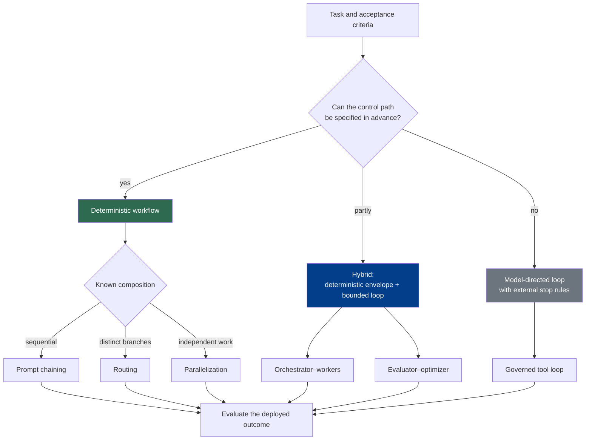

# Chapter 9: Agentic Workflow Patterns

Workflow patterns describe how a system arranges model calls, tools, checks, and state transitions. They do not change the responsibility boundary established in Chapter 6: a model can propose content, a route, a decomposition, or a next action, while the harness or runtime validates that proposal, executes authorized effects, records state, and returns observations. For client-executed tools, Anthropic's API contract likewise has the model emit a tool-use request and application code execute it ([Anthropic — How Tool Use Works](https://platform.claude.com/docs/en/agents-and-tools/tool-use/how-tool-use-works)).

This chapter compares control-flow shapes. Chapter 10 owns durable execution state and event histories, Chapter 11 owns system evaluation, and Chapter 13 develops verifier hierarchies. A workflow diagram alone supplies none of those capabilities.

### 9.1 Three Control Regimes

Anthropic distinguishes **workflows**, whose model and tool calls follow predefined code paths, from **agents**, in which the model dynamically directs process and tool use; it recommends starting with the simplest architecture that meets the need ([Anthropic — Building Effective Agents](https://www.anthropic.com/engineering/building-effective-agents)). For implementation, a three-way distinction is more precise:

| Regime | Who selects the next step? | Who executes and owns state? | Best fit |
|---|---|---|---|
| **Deterministic workflow** | Code selects a predefined transition; a model may fill in one node's output | The workflow controller/runtime | Stable processes whose branches and checks are known in advance |
| **Model-directed loop** | The model proposes the next action from the current observation | The harness validates and dispatches; the runtime owns budgets, status, and stop rules | Open-ended tasks whose next useful step cannot be enumerated reliably beforehand |
| **Hybrid workflow** | Code fixes the outer graph while a model chooses inside bounded nodes or loops | The outer controller remains authoritative; bounded inner loops have explicit budgets and handoff contracts | Production tasks that need both predictable boundaries and local flexibility |

An *augmented LLM*—Anthropic's term for a model connected to retrieval, tools, and memory—can appear in any of these regimes ([Anthropic — Building Effective Agents](https://www.anthropic.com/engineering/building-effective-agents)). Adding a model to one node does not turn a deterministic workflow into an autonomous agent. Conversely, letting a model select an action does not grant it credentials or make its transcript the source of execution state.

The word **routing** also appears at two levels. Workflow routing chooses a processing branch; model routing chooses which model or reasoning budget should handle a call. Chapter 8 covers the second decision. A workflow may use both, but the decisions should have separate records and evaluations.

### 9.2 Every Pattern Needs an Operational Contract

A box-and-arrow diagram is incomplete until each pattern specifies six fields:

1. **Applicability:** what task structure makes the pattern worth its added calls and coordination?
2. **State owner:** which external component records the current node, attempts, artifacts, budgets, and pending work?
3. **Stop condition:** which success, failure, abstention, escalation, cancellation, or exhaustion event ends it?
4. **Failure propagation:** how are invalid outputs, tool failures, timeouts, partial effects, and downstream contamination represented?
5. **Evaluation unit:** is quality scored at a call, route, branch, iteration, full run, final artifact, or external outcome?
6. **Effect boundary:** where are model proposals validated, authorized, executed, and confirmed?

Anthropic's evaluation terminology separates a task from repeated trials, the transcript from the final outcome, and the agent harness from the evaluation harness ([Anthropic — Demystifying Evals for AI Agents](https://www.anthropic.com/engineering/demystifying-evals-for-ai-agents)). That distinction matters here: a pattern can produce an attractive transcript while routing to the wrong branch, duplicating a side effect, omitting a subtask, or accepting a bad final artifact. Pattern evaluations must inspect the relevant external state and outcome, not only model text.

The effect boundary is constant across all patterns. Chapter 6 defines the full proposal-to-outcome lifecycle. The descriptions below focus on the other five fields and assume that every consequential tool call still passes through that lifecycle.

### 9.3 Compositional Workflow Patterns

Anthropic presents prompt chaining, routing, parallelization, orchestrator–workers, and evaluator–optimizer as common compositional patterns, with different tradeoffs in latency, cost, and predictability ([Anthropic — Building Effective Agents](https://www.anthropic.com/engineering/building-effective-agents)). They can be deterministic, model-directed, or hybrid depending on where selection occurs.

#### 9.3.1 Prompt Chaining

Prompt chaining feeds one stage's validated output into a later stage. The chain is usually deterministic even when every stage contains a model call: code, not the model, chooses the next node.

- **Use when:** the task decomposes into a stable sequence and intermediate interfaces can be stated clearly.
- **State owner:** the workflow controller records the current stage, validated intermediate values, artifacts, and attempts.
- **Stop when:** the last stage passes its acceptance gate, or a stage reaches a terminal failure or escalation path.
- **Typical failure:** an early omission or malformed intermediate value contaminates later stages; latency also accumulates serially.
- **Eval unit:** grade each stage contract and the end-to-end outcome. A high final score should not hide a stage that leaks data or creates an incorrect effect.

Do not pass arbitrary prose between stages when a typed intermediate representation is possible. A gate can reject or repair an invalid proposal before it becomes the next stage's assumed fact.

#### 9.3.2 Routing

Routing assigns an input to a specialized branch. A deterministic rule, a conventional classifier, or a model can propose the route; the harness applies the routing policy and performs the dispatch.

- **Use when:** inputs form operationally meaningful categories with distinct handlers, and the boundary can be evaluated.
- **State owner:** the router/controller records the candidate label, confidence or abstention signal, policy version, selected branch, and any fallback.
- **Stop when:** one permitted branch accepts the item, or the router abstains, escalates, or rejects it under an explicit rule.
- **Typical failure:** an ambiguous input is confidently misrouted and fails silently inside a plausible but wrong branch.
- **Eval unit:** evaluate the routing decision on labeled slices and the downstream task outcome conditional on that route. Include abstentions and fallback cost.

Keep workflow routing separate from Chapter 8's model routing. “Send to billing” and “use model B” are different decisions even if one component computes both.

#### 9.3.3 Parallelization

Parallelization launches multiple branches before aggregation. **Sectioning** assigns independent subtasks; **voting** asks multiple workers to address the same decision ([Anthropic — Building Effective Agents](https://www.anthropic.com/engineering/building-effective-agents)). A model may propose the split or votes, but an external coordinator creates branch records, enforces limits, and aggregates completed results.

- **Use when:** branches are genuinely independent enough to run concurrently, or multiple samples have measured value for a decision.
- **State owner:** the coordinator owns the branch set, call IDs, deadlines, partial results, cancellation status, and aggregation rule.
- **Stop when:** all required branches finish, a specified quorum is reached, or a deadline/failure policy selects a partial-result or escalation path.
- **Typical failure:** partial completion is mistaken for total success; workers duplicate work or share the same mistaken premise; aggregation drops minority evidence.
- **Eval unit:** score branches and the aggregate outcome, including coverage, agreement calibration, wall-clock latency, and total resource use.

Agreement is not proof. Voting needs diversity and calibration measurements; sectioning needs an explicit coverage check so that the split does not omit necessary work.

#### 9.3.4 Orchestrator–Workers

In orchestrator–workers, a model dynamically proposes a decomposition, workers perform bounded subtasks, and a synthesis step combines their results. Anthropic uses this pattern in its research system, where a lead agent delegates searches to parallel subagents and then synthesizes their findings ([Anthropic — How We Built Our Multi-Agent Research System](https://www.anthropic.com/engineering/multi-agent-research-system)). That is a documented system and workload, not evidence that the pattern improves every task.

- **Use when:** the necessary subtask shape depends on the input, the subtasks have clear ownership, and their results can be merged through explicit artifacts or evidence.
- **State owner:** the coordinator/runtime owns the task graph, worker identities and scopes, budgets, artifacts, completion status, and synthesis attempt.
- **Stop when:** required subtasks are accounted for and the synthesized outcome passes its task-level gate, or fan-out, time, cost, or no-progress limits are reached.
- **Typical failure:** uncontrolled fan-out, duplicate or missing coverage, conflicting writes, lost provenance, or a synthesis that overstates worker findings.
- **Eval unit:** grade the full task outcome plus decomposition coverage, worker handoff quality, synthesis faithfulness, latency, and cost.

Chapter 5's handoff contract applies: a worker result needs evidence, artifact pointers, identity and authority scope, uncertainty, and verification status. A higher-privilege orchestrator must not turn an unverified worker summary into a privileged effect.

#### 9.3.5 Evaluator–Optimizer

Evaluator–optimizer alternates candidate generation with feedback and revision. Anthropic recommends it when evaluation criteria are clear and iterative refinement has demonstrable value ([Anthropic — Building Effective Agents](https://www.anthropic.com/engineering/building-effective-agents)). A model-generated critique is an observation for the controller; it does not itself execute the next iteration or declare the external task complete.

- **Use when:** a candidate can be improved iteratively, the acceptance criteria are repeatable, and the improvement justifies extra calls.
- **State owner:** the loop controller owns candidate versions, feedback, scores, iteration count, budget, and accepted artifact.
- **Stop when:** the acceptance rule passes, progress stalls, the iteration/budget cap is reached, or the evaluator abstains and escalates.
- **Typical failure:** evaluator and generator share the same blind spot; scores oscillate; the candidate optimizes the rubric without improving the real outcome; the loop never converges.
- **Eval unit:** inspect each iteration and the final accepted outcome; measure improvement over the initial candidate, false accepts/rejects, resource use, and regressions outside the optimized criterion.

This pattern only establishes where an evaluation checkpoint sits. Chapter 11 explains tasks, trials, graders, and outcome measurement; Chapter 13 explains when deterministic checks, self-checks, or independent evaluators provide the right level of assurance. This chapter does not impose a universal “maker must never be checker” rule.

### 9.4 Model-Directed Loops and Bounded Hybrid Agents

A ReAct-style loop interleaves model reasoning, an action proposal, an externally produced observation, and another model decision ([Yao et al. — ReAct](https://arxiv.org/abs/2210.03629)). In production, the harness must make that abstract loop operational:

- **Use when:** the next useful action depends materially on observations that cannot be predicted in a fixed graph.
- **State owner:** the runtime owns run/step/action identities, context references, budgets, approvals, tool outcomes, and current status. The transcript is a model-facing view, not the authoritative state.
- **Stop when:** an externally checked success condition holds, no work remains, the task is blocked, approval or human input is required, or an iteration/time/cost/no-progress/cancellation limit fires.
- **Typical failure:** drift, repeated ineffective actions, retries after unknown outcomes, premature self-declared completion, or context growth that erases earlier constraints.
- **Eval unit:** score the complete run and external outcome, then diagnose at action and step level. Include side effects, recovery behavior, latency, and resource use.

A **hybrid** puts this loop inside a deterministic envelope. Code may fix ingest → analyze → review → publish, while a bounded agent chooses search and analysis actions inside the analyze node. The outer workflow owns entry conditions, allowed capabilities, budgets, handoff artifacts, and exit gates. This structure localizes model uncertainty without pretending that a static DAG can enumerate every useful inner step.

HumanLayer's 12-Factor Agents and LangChain's deploybot description both advocate focused agentic components inside more deterministic control structures ([HumanLayer — 12-Factor Agents](https://www.humanlayer.dev/blog/12-factor-agents); [LangChain — The Anatomy of an Agent Harness](https://blog.langchain.com/the-anatomy-of-an-agent-harness/)). Treat their suggested shapes as practitioner case studies, not universal turn-count limits. Choose the loop boundary with workload-specific evaluations.

For a hybrid pattern:

- **State owner:** the outer workflow remains authoritative; the inner loop receives a scoped task state and returns a typed handoff.
- **Stop condition:** both the inner loop's budget/exit contract and the outer node's acceptance gate must be satisfied.
- **Failure propagation:** inner failure becomes an explicit node result—retryable, terminal, partial, unknown, or escalated—rather than an invented success.
- **Eval unit:** test inner-loop capability on its bounded task and the full workflow outcome, including handoff correctness.

### 9.5 Research Patterns Are Design Lineage, Not Production Guarantees

Several influential papers explore search, reflection, and planning structures. They are useful design vocabulary, but results from a paper's tasks, models, tools, and budgets do not establish equal production maturity or a universal improvement. If implemented, their search frontier, reflections, candidate set, tool results, and termination status still belong to the external harness or runtime.

| Pattern | Mechanism studied | Production interpretation |
|---|---|---|
| **Reflexion** | Stores natural-language reflection after feedback and reuses it on later attempts ([Shinn et al. — Reflexion](https://arxiv.org/abs/2303.11366)) | Treat reflection as fallible memory with provenance and expiry, not as verified diagnosis |
| **Self-Refine** | Uses model-generated feedback to revise the model's earlier output iteratively ([Madaan et al. — Self-Refine](https://arxiv.org/abs/2303.17651)) | The controller still needs an external cap and acceptance rule; self-satisfaction is not outcome confirmation |
| **CRITIC** | Uses external tools during critique and correction ([Gou et al. — CRITIC](https://arxiv.org/abs/2305.11738)) | Tool evidence can strengthen a check, but every call still needs Chapter 6's validation and authorization lifecycle |
| **Tree of Thoughts (ToT)** | Searches over candidate “thought” branches with lookahead and backtracking ([Yao et al. — Tree of Thoughts](https://arxiv.org/abs/2305.10601)) | The harness owns the frontier, branching budget, value records, and termination; text branches are not durable execution state |
| **Language Agent Tree Search (LATS)** | Applies Monte Carlo tree search to language-agent trajectories using value estimates and reflection ([Zhou et al. — LATS](https://arxiv.org/abs/2310.04406)) | Tree growth, environment effects, and rollout budgets need explicit isolation and accounting |
| **ReWOO** | Separates an upfront Planner, tool-executing Workers, and a Solver that combines observations ([Xu et al. — ReWOO](https://arxiv.org/abs/2305.18323)) | A prewritten plan can reduce repeated planning in the studied setup, but workers must surface plan-invalidating observations rather than execute stale steps blindly |

These mechanisms can be nested inside the compositional patterns above. For example, ToT can search inside one deterministic node, Reflexion can update scoped memory after a failed trial, and ReWOO can define a hybrid plan–execute–synthesize workflow. Evaluate the composition actually deployed rather than attributing quality to the pattern name.

### 9.6 Selecting and Composing Patterns

Patterns compose along separate axes. A router can select a chain; a chain can contain a parallel stage; an orchestrator can route workers to different models using Chapter 8's policy; an evaluator–optimizer can operate inside one bounded node. At every boundary, preserve a stable task identity, typed state transition, explicit budget, failure status, and outcome evidence.

Prefer the least dynamic regime that satisfies the task. More model-directed control can be useful when observations change the path, but it also increases the state space that stop rules, recovery, and evaluation must cover. Frameworks may package these patterns; they do not remove the need to inspect the actual prompts, calls, state transitions, and effects. Anthropic similarly cautions that framework abstractions can obscure underlying prompts and responses during early development ([Anthropic — Building Effective Agents](https://www.anthropic.com/engineering/building-effective-agents)).

---

## Key Takeaways

- **Models propose; external systems execute and remember:** workflow patterns never transfer authority or state ownership into the model.
- **Distinguish deterministic, model-directed, and hybrid control:** a workflow containing an LLM is not automatically an autonomous agent.
- **Give every pattern an operational contract:** applicability, state owner, stop condition, failure propagation, eval unit, and effect boundary must be explicit.
- **Evaluate the right unit:** calls, routes, branches, iterations, runs, artifacts, and external outcomes answer different questions.
- **Use workflow routing and model routing as separate decisions:** Chapter 8 owns model and reasoning-budget selection.
- **Parallelism and delegation need coverage accounting:** agreement is not proof, and a worker summary is not authorization.
- **Evaluator–optimizer does not define verifier strength:** grader design belongs to Chapter 11 and verifier independence to Chapter 13.
- **Research pattern names are not maturity claims:** Reflexion, Self-Refine, CRITIC, ToT, LATS, and ReWOO must be evaluated in the exact deployed configuration.
- **Hybrid patterns are often the practical middle:** deterministic outer boundaries can contain locally flexible model-directed work.

## Further Reading

- Erik Schluntz and Barry Zhang, *Building Effective Agents*, Anthropic, Dec 2024. https://www.anthropic.com/engineering/building-effective-agents
- Anthropic, *How Tool Use Works*. https://platform.claude.com/docs/en/agents-and-tools/tool-use/how-tool-use-works
- Anthropic, *Demystifying Evals for AI Agents*, Jan 2026. https://www.anthropic.com/engineering/demystifying-evals-for-ai-agents
- Jeremy Hadfield et al., *How We Built Our Multi-Agent Research System*, Anthropic, Jun 2025. https://www.anthropic.com/engineering/multi-agent-research-system
- Dex Horthy, *12-Factor Agents*, HumanLayer, Apr 2025. https://www.humanlayer.dev/blog/12-factor-agents
- Vivek Trivedy, *The Anatomy of an Agent Harness*, LangChain, Mar 2026. https://blog.langchain.com/the-anatomy-of-an-agent-harness/
- Shunyu Yao et al., *ReAct: Synergizing Reasoning and Acting in Language Models*, ICLR 2023. https://arxiv.org/abs/2210.03629
- Noah Shinn et al., *Reflexion: Language Agents with Verbal Reinforcement Learning*, NeurIPS 2023. https://arxiv.org/abs/2303.11366
- Aman Madaan et al., *Self-Refine: Iterative Refinement with Self-Feedback*, NeurIPS 2023. https://arxiv.org/abs/2303.17651
- Zhibin Gou et al., *CRITIC: Large Language Models Can Self-Correct with Tool-Interactive Critiquing*, 2023. https://arxiv.org/abs/2305.11738
- Shunyu Yao et al., *Tree of Thoughts: Deliberate Problem Solving with Large Language Models*, NeurIPS 2023. https://arxiv.org/abs/2305.10601
- Andy Zhou et al., *Language Agent Tree Search Unifies Reasoning, Acting, and Planning in Language Models*, 2023. https://arxiv.org/abs/2310.04406
- Binfeng Xu et al., *ReWOO: Decoupling Reasoning from Observations for Efficient Augmented Language Models*, 2023. https://arxiv.org/abs/2305.18323
