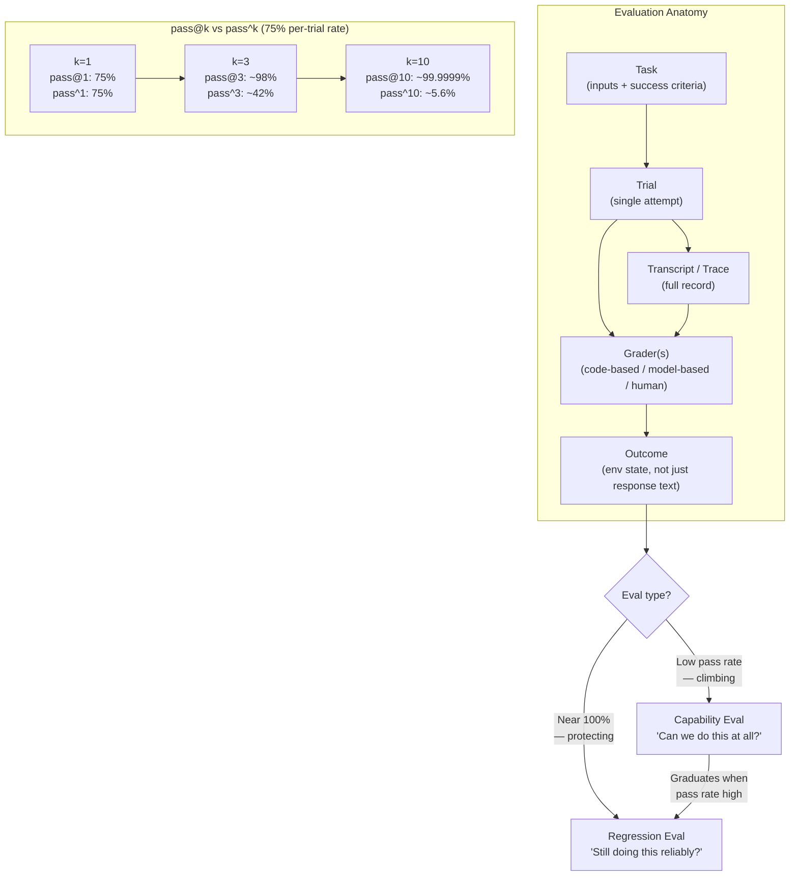

# Chapter 9: Evaluation

### 9.1 Why Evals

Without evals, debugging is reactive: wait for complaints, reproduce manually, fix, hope nothing else regressed ([Anthropic — Demystifying Evals for AI Agents](https://www.anthropic.com/engineering/demystifying-evals-for-ai-agents)). Teams cannot distinguish real regressions from noise, automate testing of changes against many scenarios, or measure improvements. They also adopt new models slowly — without evals, taking advantage of a new model means weeks of manual testing, while evaluated teams can verify strengths and tune prompts in days.

An eval is broader than a unit test. Unit tests usually check one deterministic function or module. Agent evals run the whole model-plus-harness system in an environment, then judge whether the final state satisfies the task. That matters because an agent can pass an intermediate test, produce a fluent answer, or take an unusual path while still failing the user's real goal.

Anthropic positions evals as compounding infrastructure: the costs are visible up front, the benefits accumulate over the agent's lifecycle. Their advice: start early, even with 20–50 simple tasks. Effect sizes in early agent development are large, so small samples suffice; mature agents need larger evals to detect smaller effects.

### 9.2 The Anatomy of an Evaluation

Anthropic's vocabulary ([Anthropic — Demystifying Evals for AI Agents](https://www.anthropic.com/engineering/demystifying-evals-for-ai-agents)):

- A **task** has defined inputs and success criteria.
- A **trial** is a single attempt at a task — multiple trials per task because outputs vary.
- A **grader** scores some aspect of performance; tasks can have multiple, each containing assertions.
- A **transcript** (trace, trajectory) is the full record of a trial.
- An **outcome** is the final environmental state at end of trial — distinct from the agent's text response. (A flight-booking agent's "your flight is booked" is the response; whether a row exists in the SQL database is the outcome.)
- An **evaluation harness** (distinct from the agent harness) is the infrastructure that runs the eval end-to-end.
- An **agent harness** (or scaffold) is the system being evaluated alongside the model. *"When we evaluate 'an agent,' we're evaluating the harness and the model working together."*

### 9.3 Three Types of Graders

- **Code-based**: string match, binary tests, static analysis, outcome verification, tool-call verification, transcript analysis. Fast, cheap, objective, reproducible — but brittle to valid variations.
- **Model-based**: rubric scoring, natural-language assertions, pairwise comparison, multi-judge consensus. Flexible, scalable, handles open-ended tasks — but non-deterministic, requires human calibration.
- **Human**: SME review, crowdsourced judgment, A/B testing. Best for calibration and subjective judgments — but expensive, slow, and still vulnerable to inconsistency if rubrics are weak.

Anthropic recommends deterministic graders where possible, model-based where necessary, human for periodic calibration. They also caution against grading the *path* the agent took rather than what it produced — agents regularly find valid approaches the eval designer did not anticipate, and grading paths makes the eval brittle.

### 9.4 Capability vs. Regression Evals

Two distinct purposes ([Anthropic — Demystifying Evals for AI Agents](https://www.anthropic.com/engineering/demystifying-evals-for-ai-agents)):

- **Capability evals** ask "what can this agent do well?" They start at low pass rates, targeting tasks the agent struggles with, giving teams a hill to climb.
- **Regression evals** ask "does the agent still handle what it used to?" They should run near 100%, protecting against backsliding.

After an agent matures, capability evals with high pass rates *graduate* into the regression suite. Tasks that once measured "can we do this at all?" then measure "can we still do this reliably?"

### 9.5 Pass@k vs. Pass^k

For agents whose behavior varies between runs, two metrics with opposite slopes ([Anthropic — Demystifying Evals for AI Agents](https://www.anthropic.com/engineering/demystifying-evals-for-ai-agents)):

- **pass@k**: probability of at least one correct solution in k attempts. Rises as k increases — more shots on goal means higher odds of success.
- **pass^k**: probability that *all* k trials succeed. Falls as k increases — demanding consistency across more trials raises the bar.

These metrics exist because agent runs are stochastic. The same prompt, model, and harness can produce different tool orders, search paths, or final answers across trials. A single run is therefore weak evidence; repeated trials tell you whether you have occasional success, consistent reliability, or a brittle lucky path.

A 75% per-trial success rate gives pass^3 of about 42% and pass^10 about 5.6%, while pass@10 is about 99.9999%. The right metric depends on the product: one success matters when the system can generate multiple candidates and select or show the best one; every success matters for a customer-facing agent that must behave reliably on repeated runs.

### 9.6 The Eight-Step Roadmap

Anthropic's distilled roadmap to going from no evals to evals you trust ([Anthropic — Demystifying Evals for AI Agents](https://www.anthropic.com/engineering/demystifying-evals-for-ai-agents)):

0. **Start early** — 20–50 tasks from real failures.
1. **Begin with what you already test manually** — pre-release checks and bug-tracker queue items.
2. **Write unambiguous tasks with reference solutions** — two domain experts should reach the same verdict; a 0% pass rate across many trials usually means a broken task, not an incapable agent.
3. **Build balanced problem sets** — both cases where a behavior should and should not occur. One-sided evals create one-sided optimization.
4. **Build a robust eval harness with a stable environment** — isolate trials, no shared state. Anthropic observed Claude gaining unfair advantage from inspecting git history left over from previous trials.
5. **Design graders thoughtfully** — deterministic where possible, partial credit for multi-component tasks, calibrated LLM-as-judge with structured rubrics, escape hatches for "Unknown" to avoid hallucination, anti-hacking design.
6. **Read transcripts** — failures should look fair; if scores stop climbing, the question is whether the agent regressed or the eval itself is now unfair.
7. **Monitor for capability eval saturation** — an eval at 100% provides no improvement signal. SWE-Bench Verified started at 30% and is now nearing 80%, with deceptive small score increases now hiding large capability gains.
8. **Maintain through open contribution** — domain experts and product teams should contribute eval tasks; product managers, customer success, salespeople can use Claude Code to file evals as PRs.

### 9.7 What Real Evals Look Like for Different Agent Types

- **Coding agents**: deterministic graders are natural — does the code run, do the tests pass? SWE-bench Verified runs the test suite from a fixed GitHub issue; Terminal-Bench tests end-to-end tasks like building a Linux kernel from source.
- **Conversational agents**: success is multidimensional — ticket resolved (state check), conversation under 10 turns (transcript constraint), tone appropriate (LLM rubric). Often require a second LLM to simulate the user (τ-Bench, τ²-Bench).
- **Research agents**: groundedness checks (claims supported by sources), coverage checks (key facts included), source-quality checks (authoritative sources, not first-retrieved). Require frequent calibration against expert humans.
- **Computer-use agents**: real or sandboxed environment, URL/page-state checks, backend state verification (was an order actually placed, or did just a confirmation page appear?). WebArena and OSWorld are the canonical examples.

### 9.8 Verification Feedback for Coding Agents

For coding agents, the most useful graders often double as repair signals. A failing check that says only "test failed" confirms that the outcome is bad but gives the agent little traction. A better failure message names the violated path, the expected state, the observed state, and the next place to inspect. OpenAI's Codex harness guidance emphasizes turning recurring review comments and architectural rules into repository-local checks so agents receive specific feedback while they are still able to fix the work ([OpenAI — Harness Engineering](https://openai.com/index/harness-engineering/)).

End-to-end verification should also be treated as a done gate, not a ceremonial final step. Anthropic's long-running application harness required the coding agent to start the app and verify the feature through a browser-driven path because agents were otherwise prone to declaring features complete after local tests or visual inspection while the actual user flow remained broken ([Anthropic — Effective Harnesses for Long-Running Agents](https://www.anthropic.com/engineering/effective-harnesses-for-long-running-agents)). The general rule from section 9.2 applies directly: grade the environment state, not the agent's confidence.

### 9.9 Reading Transcripts Is the Skill

A repeated theme: do not take eval scores at face value until someone reads the transcripts. Anthropic recounts a case where Opus 4.5 initially scored 42% on CORE-Bench, but investigation revealed rigid grading penalizing "96.12" when the expected answer was "96.124991…", ambiguous task specs, and stochastic tasks that were impossible to reproduce exactly. After fixing the grading bugs and running with a less constrained scaffold, the score jumped to 95% ([Anthropic — Demystifying Evals for AI Agents](https://www.anthropic.com/engineering/demystifying-evals-for-ai-agents)). Similarly, METR found tasks in their time-horizon benchmark that asked agents to optimize to a stated score threshold, but where the grading required exceeding the threshold — penalizing models that followed instructions and rewarding ones that ignored them.

The general rule: failures should seem fair. When scores plateau, the question to ask is whether the eval is measuring what it should.

### 9.10 Evals Are One Layer of Many

Automated evals are not a complete picture. Anthropic compares the situation to the Swiss-cheese model from safety engineering: no single layer catches every issue ([Anthropic — Demystifying Evals for AI Agents](https://www.anthropic.com/engineering/demystifying-evals-for-ai-agents)). The complete stack:

- **Automated evals** for fast iteration, regression detection, model upgrades.
- **Production monitoring** for ground truth and unanticipated real-world failures.
- **A/B testing** for validating significant changes once traffic is sufficient.
- **User feedback** for surfacing problems no one anticipated.
- **Manual transcript review** for building intuition about failure modes.
- **Systematic human studies** for calibrating LLM graders or grading subjective output.

---

## Diagram: Eval Anatomy and pass@k vs pass^k

---

## Key Takeaways

- **Evals are compounding infrastructure**: start with 20–50 tasks from real failures, even before the agent is mature.
- **Eval is broader than unit testing**: it checks the model-plus-harness system against task outcomes in an environment.
- **Outcome ≠ response**: measure the environmental state (database row, URL, file) not just what the agent said.
- **Repair-oriented feedback improves self-correction**: checks should tell the agent what failed, where, and what evidence would count as fixed.
- **Three grader types form a pyramid**: code-based for speed, model-based for nuance, human for calibration.
- **pass@k and pass^k serve different products**: multi-attempt generation can use pass@k; repeated customer-facing execution needs pass^k-style reliability.
- **Reading transcripts is the skill**: scores plateau for two reasons — agent regression or eval unfairness — only transcripts distinguish them.
- **Evals are one layer of many**: automated evals + production monitoring + A/B testing + user feedback + human review.

## Further Reading

- Mikaela Grace et al., *Demystifying Evals for AI Agents*, Anthropic, Jan 2026. https://www.anthropic.com/engineering/demystifying-evals-for-ai-agents
- Gian Segato, *Quantifying Infrastructure Noise in Agentic Coding Evals*, Anthropic, Feb 2026. https://www.anthropic.com/engineering/infrastructure-noise
- Vivek Trivedy, *Improving Deep Agents with Harness Engineering*, LangChain, Feb 2026. https://blog.langchain.com/improving-deep-agents-with-harness-engineering/
- Ken Aizawa, *Writing Effective Tools for Agents — with Agents*, Anthropic, Sep 2025. https://www.anthropic.com/engineering/writing-tools-for-agents
- OpenAI, *Harness Engineering: Leveraging Codex in an Agent-First World*, Feb 2026. https://openai.com/index/harness-engineering/
- Justin Young et al., *Effective Harnesses for Long-Running Agents*, Anthropic, Nov 2025. https://www.anthropic.com/engineering/effective-harnesses-for-long-running-agents
