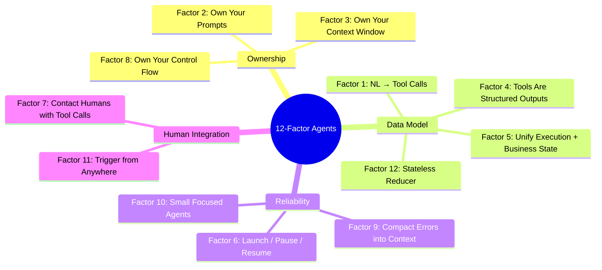

# Chapter 9: Twelve Factors for Production Agents

The previous chapters examined individual harness techniques: context management, tools, sandboxing, workflows, and handoffs for long-running work. This chapter steps back to consider how those techniques fit into ordinary software architecture. HumanLayer's "12 Factor Agents" is best understood as a production checklist. It borrows its name from the classic Twelve-Factor App, but its factors apply specifically to LLM agents. It is a manifesto, not a complete reference architecture.

Two software concepts underpin this chapter. *State* is all the information required to continue execution: the current step, retry counts, approvals, user messages, tool results, and the business objects affected so far. An *event log* is an append-only record from which that state can be reconstructed. Model the agent as a reducer over those events, and pause/resume, replay, debugging, and testing become ordinary software problems instead of operations on hidden conversation state.

### 9.1 The Twelve Factors as Software Architecture

The twelve principles, drawn from many production deployments ([HumanLayer — 12-Factor Agents](https://www.humanlayer.dev/blog/12-factor-agents)):

1. **Natural Language to Tool Calls**: the fundamental pattern is to convert the user's request into a structured JSON call, then let deterministic code execute it.
2. **Own Your Prompts**: do not outsource prompt engineering to a framework's black box. Treat prompts as first-class code so you can test, evaluate, and tune them.
3. **Own Your Context Window**: a standard message format is one option; another is a custom, XML-tagged event log that packs history into a single user message. In either case, the goal is to maximize useful information while minimizing token use.
4. **Tools Are Just Structured Outputs**: a tool call is structured JSON from the model that specifies an intent and its parameters. Deterministic code then decides how to act on it.
5. **Unify Execution State and Business State**: do not maintain "current step / next step / retry count" separately from "what happened in the conversation." Instead, derive execution state from a single event log.
6. **Launch / Pause / Resume with Simple APIs**: agents are programs, so they should support standard lifecycle operations. This includes pausing after tool selection but before tool execution.
7. **Contact Humans with Tool Calls**: do not depend on the model to choose correctly between plain text and structured output. Give it an explicit `request_human_input` tool with structured fields such as urgency, format, and choices.
8. **Own Your Control Flow**: take control of the loop so you can pause for approval, summarize tool results, apply an LLM-as-judge to outputs, manage memory, log and trace activity, enforce rate limits, or sleep durably.
9. **Compact Errors into Context Window**: keep errors visible so the agent can recover from them, and use a consecutive-error counter to escalate to a human after a threshold. The key word is *compact*: raw stack traces consume the token budget and contribute to context rot (see Foundations ch 9). Keep the latest error or a useful summary in context, and fold or remove older repeated traces so they do not crowd out the information needed to continue.
10. **Small, Focused Agents**: keep each agent's scope to roughly 3–10 steps, or perhaps 20. Larger contexts tend to reduce performance.
11. **Trigger from Anywhere**: allow launches from Slack, email, SMS, webhooks, and cron jobs. Together with factor 7, this creates the *outer loop*: events start agents, and agents contact people when they reach critical decision points.
12. **Make Your Agent a Stateless Reducer**: model the agent as a pure, serializable, replayable fold over events. Replay is deterministic only when every LLM response and tool result is captured as an event. On resume, fold over the recorded results rather than invoking the model again or rerunning tools with side effects.

The deeper claim connecting these factors is that "agents, at least the good ones, don't follow the 'here's your prompt, here's a bag of tools, loop until you hit the goal' pattern. Rather, they are comprised of mostly just software" ([HumanLayer — 12-Factor Agents](https://www.humanlayer.dev/blog/12-factor-agents)). In other words, the factors apply familiar software-engineering discipline to a stateful, non-deterministic component. They are not universal laws. A research prototype, a local coding assistant, and a regulated customer-support agent each require different trade-offs. The practical direction is what matters: make state explicit, make control flow inspectable, and place human interaction behind structured interfaces.

### 9.2 From Agent Programs to Agent Platforms

The OpenReview survey describes an ecosystem moving from agent frameworks toward agent platforms ([OpenReview — Agent Harness Engineering: A Survey](https://openreview.net/pdf?id=3hXEPbG0dh)). A framework packages local abstractions such as agents, tools, memory stores, and loops. A platform adds shared infrastructure: durable workspaces, managed sandboxes, identity, billing, observability, evaluation, governance, and human handoff across many runs and users.

This shift does not replace the twelve factors; it expands their scope. "Launch / pause / resume" becomes a platform API. "Unify execution state and business state" becomes event-log storage with tenancy and migration semantics. "Contact humans with tool calls" becomes a handoff interface that tracks permissions and audit history. "Own your control flow" requires explicit decisions about which checks run synchronously, which run offline, and which failures justify an expensive recovery process.

The platform boundary also changes who is responsible for what. A local agent may get by with ad hoc state files; a shared platform needs clear state ownership, retention policies, billing attribution, scoped credentials, and replayable audit trails. At this scale, the harness is no longer just the layer around one model call. It becomes the control system for many agents, environments, and human stakeholders.

That control system is not simply another agent framework. It is the **agent control plane** developed in Chapter 18: a registry of available agents and capabilities; an identity layer that records who is acting on whose behalf; policy enforcement that determines what each run may do; and lifecycle, lineage, and audit services that operate across sessions. The twelve factors remain the design discipline inside each agent program. The control plane makes a fleet of those programs governable.

---

## Diagram: The 12 Factors Grouped by Theme

---

## Key Takeaways

- **"Mostly just software"**: a good agent is mostly deterministic software wrapped around a non-deterministic LLM component—not a bag of tools that loops until it is done.
- **Own your prompts**: do not let frameworks hide them. Treat prompts as first-class code under version control.
- **Use the stateless reducer pattern**: folding an event log into current state makes the agent serializable, replayable, and testable.
- **Platform scope changes the factors**: lifecycle, state, identity, billing, observability, and human handoff become shared infrastructure concerns.
- **A fleet needs a control plane**: the twelve factors shape each agent program; registry, identity, policy, lifecycle, and audit govern the collection.
- **Keep agents small and focused**: limit each agent to 3–20 steps because performance tends to degrade as context grows.
- **Contact humans through tool calls**: a structured `request_human_input` tool is more reliable than depending on the model's choice of unstructured text.
- **Compact errors rather than hiding them**: visible error information supports self-recovery, while a consecutive-error counter provides a safe path for escalation.

## Further Reading

- Dex Horthy, *12-Factor Agents*, HumanLayer, Apr 2025. https://www.humanlayer.dev/blog/12-factor-agents
- Kyle Brunet, *Skill Issue: Harness Engineering for Coding Agents*, HumanLayer, Mar 2026. https://www.humanlayer.dev/blog/skill-issue-harness-engineering-for-coding-agents
- Erik Schluntz and Barry Zhang, *Building Effective Agents*, Anthropic, Dec 2024. https://www.anthropic.com/engineering/building-effective-agents
- *Agent Harness Engineering: A Survey*, OpenReview / TMLR submission, 2026. https://openreview.net/pdf?id=3hXEPbG0dh
