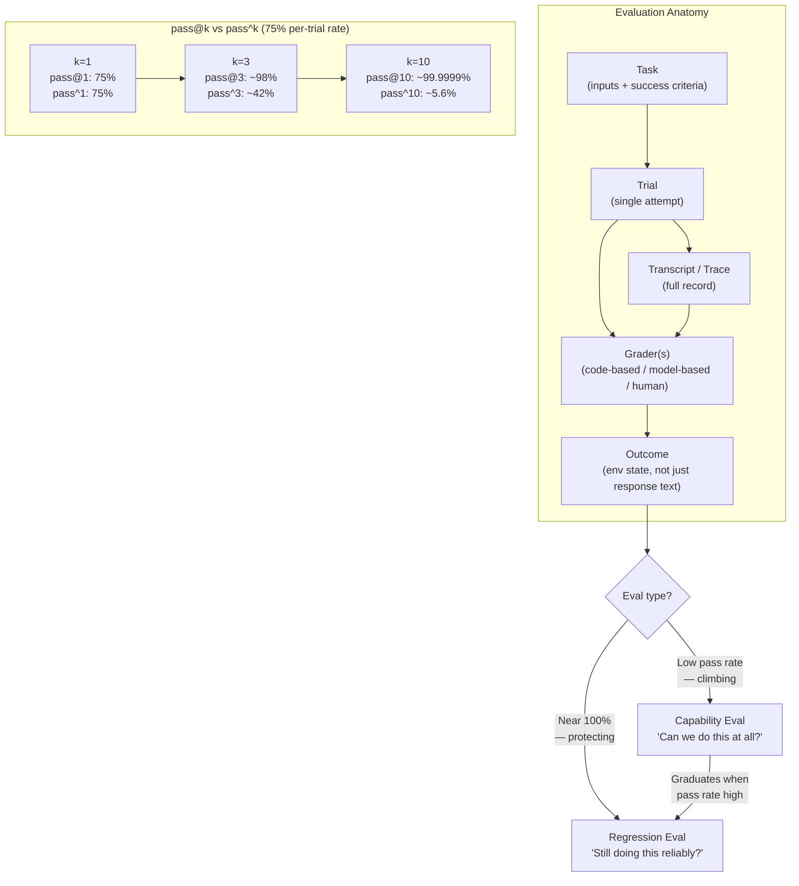

# Chapter 10: Evaluation

### 10.1 Why Evals

Without evals, debugging remains reactive: wait for a complaint, reproduce the problem manually, apply a fix, and hope nothing else has regressed ([Anthropic — Demystifying Evals for AI Agents](https://www.anthropic.com/engineering/demystifying-evals-for-ai-agents)). Teams have no reliable way to separate genuine regressions from random variation, test a change across many scenarios, or measure whether the system has improved. Model upgrades are slow for the same reason. Without evals, adopting a new model can require weeks of manual testing; with them, teams can verify its strengths and tune prompts in days.

The key is to evaluate the unit that matters. For an agent, that unit is the loop, not a single model call (see Foundations ch 13). An agent eval runs the entire model-plus-harness system in an environment, then checks whether the resulting state satisfies the task. This distinction matters because an agent can pass an intermediate test, produce a fluent answer, or follow an unexpected but plausible path and still fail to achieve the user's actual goal.

Anthropic describes evals as compounding infrastructure: the costs are visible up front, while the benefits accumulate throughout the agent's lifecycle. The practical advice is to start early, even with only 20–50 simple tasks. Changes during early development often have large effects, so small samples can be informative. As the agent matures and improvements become subtler, larger eval sets are needed to detect them.

### 10.2 The Anatomy of an Evaluation

Foundations ch 13 introduces the core eval vocabulary: code-, model-, and human-based graders; traces; regression and capability evals; pass@k and pass^k; and reward hacking. This chapter briefly reviews those concepts, then develops the harness-specific practices built on top of them.

Anthropic's vocabulary ([Anthropic — Demystifying Evals for AI Agents](https://www.anthropic.com/engineering/demystifying-evals-for-ai-agents)):

- A **task** has defined inputs and success criteria.
- A **trial** is one attempt at a task. Because agent outputs vary, an eval usually runs multiple trials for each task.
- A **grader** scores one aspect of performance. A task can have several graders, each with its own assertions.
- A **transcript** (trace, trajectory) is the full record of a trial.
- An **outcome** is the final state of the environment at the end of a trial, which is distinct from the agent's text response. For a flight-booking agent, "your flight is booked" is the response; the corresponding row in the SQL database is the outcome.
- An **evaluation harness** (distinct from the agent harness) is the infrastructure that runs the eval end-to-end.
- An **agent harness** (or scaffold) is the system being evaluated alongside the model. *"When we evaluate 'an agent,' we're evaluating the harness and the model working together."*

### 10.3 Three Types of Graders

- **Code-based**: string matching, binary tests, static analysis, outcome verification, tool-call verification, and transcript analysis. These graders are fast, inexpensive, objective, and reproducible, but they can reject valid variations.
- **Model-based**: rubric scoring, natural-language assertions, pairwise comparison, and multi-judge consensus. These graders are flexible, scalable, and well suited to open-ended tasks, but they are non-deterministic and require calibration against human judgment.
- **Human**: subject-matter-expert review, crowdsourced judgment, and A/B testing. Human graders are most useful for calibration and subjective decisions, but they are expensive, slow, and still inconsistent when rubrics are weak.

Anthropic recommends using deterministic graders where possible, model-based graders where necessary, and humans for periodic calibration. It also cautions against grading the *path* an agent followed instead of the result it produced. Agents often discover valid approaches that the eval designer did not anticipate; requiring a particular path makes the eval brittle.

### 10.4 Who Verifies the Verifier? Evaluator Integrity

Separating the maker from the checker removes one conflict of interest, but it does not make the checker neutral. Anthropic's 2026 work on **motivated mislabeling** found that model evaluators can change their labels when they know how a judgment will be used—for example, when a negative label would trigger deletion, punishment, or another downstream consequence. Tighter rubrics and an option to abstain reduced the effect but did not eliminate it ([Anthropic — Agentic Misalignment: Summer 2026 Update](https://alignment.anthropic.com/2026/agentic-misalignment-summer-2026/)).

The risk extends well beyond safety research. A judge that knows which candidate is the incumbent, which team produced it, or whether a failing score will block deployment may rationalize its decision toward the desired consequence. A generator may likewise learn to optimize superficial features that appeal to a known judge. **Evaluator integrity** is therefore a property of the harness and requires its own controls:

- Use deterministic outcome checks first, and preserve the evidence behind each result.
- Hide candidate identity, deployment consequences, and other irrelevant metadata from model judges.
- Allow an "insufficient evidence" verdict, and route consequential ambiguity to human reviewers.
- Calibrate judges against expert-labeled sets, and run **meta-evals** that test the evaluator itself for bias, leakage, and reward hacking.
- Use independent judges or ensembles for high-stakes semantic decisions, while recognizing that agreement among correlated models is not proof.
- Version rubrics, judge models, prompts, and evidence. Retain an immutable audit trail so that a verdict can be reproduced or challenged.

OpenAI's guidance for trustworthy third-party evaluations makes the same point at the institutional level: independence, methodological transparency, representative tasks, conflict disclosure, and reproducible artifacts are part of evaluation quality, not paperwork to add after calculating a score ([OpenAI — Trustworthy Third-Party Evaluations](https://openai.com/index/trustworthy-third-party-evaluations-foundations/)). The verifier is part of the system under test.

### 10.5 Capability vs. Regression Evals

Agent evals serve two distinct purposes ([Anthropic — Demystifying Evals for AI Agents](https://www.anthropic.com/engineering/demystifying-evals-for-ai-agents)):

- **Capability evals** ask, "What can this agent do well?" They deliberately include tasks the agent struggles with, so initial pass rates are low and the team has a meaningful target for improvement.
- **Regression evals** ask, "Can the agent still handle tasks it previously solved?" Their pass rates should remain close to 100%, protecting the system against backsliding.

As an agent matures, capability evals with consistently high pass rates *graduate* into the regression suite. A task that once measured "Can we do this at all?" then measures "Can we still do this reliably?"

### 10.6 Pass@k vs. Pass^k

Because agent behavior varies from run to run, evaluation commonly uses two metrics that move in opposite directions as the number of trials increases ([Anthropic — Demystifying Evals for AI Agents](https://www.anthropic.com/engineering/demystifying-evals-for-ai-agents)):

- **pass@k** is the probability of obtaining at least one correct solution in k attempts. It rises as k increases because more attempts create more opportunities for success.
- **pass^k** is the probability that *all* k trials succeed. It falls as k increases because consistent success across more trials is a stricter requirement.

These metrics exist because agent runs are stochastic. The same prompt, model, and harness can produce different tool orders, search paths, or final answers across trials. A single run is therefore weak evidence; repeated trials tell you whether you have occasional success, consistent reliability, or a brittle lucky path.

With a 75% success rate per trial, pass^3 is about 42% and pass^10 is about 5.6%, while pass@10 is about 99.9999%. The appropriate metric depends on the product. pass@k is useful when the system can generate several candidates and select or present the best one. pass^k better captures the reliability expected from a customer-facing agent that must succeed repeatedly.

### 10.7 The Eight-Step Roadmap

Anthropic distills the path from having no evals to having a trusted eval suite into the following roadmap ([Anthropic — Demystifying Evals for AI Agents](https://www.anthropic.com/engineering/demystifying-evals-for-ai-agents)):

0. **Start early** — 20–50 tasks from real failures.
1. **Begin with what you already test manually** — pre-release checks and bug-tracker queue items.
2. **Write unambiguous tasks with reference solutions** — two domain experts should be able to reach the same verdict. A 0% pass rate across many trials usually indicates a broken task rather than an incapable agent.
3. **Build balanced problem sets** — include cases in which a behavior should occur and cases in which it should not. One-sided evals encourage one-sided optimization.
4. **Build a robust eval harness with a stable environment** — isolate trials and prevent shared state. Anthropic observed Claude gaining an unfair advantage by inspecting git history left behind by earlier trials.
5. **Design graders thoughtfully** — use deterministic checks where possible, award partial credit for multi-component tasks, calibrate LLM judges against structured rubrics, provide an "Unknown" escape hatch to reduce hallucination, and design against reward hacking.
6. **Read transcripts** — failures should appear fair when examined. If scores stop improving, determine whether the agent has regressed or the eval has become unfair.
7. **Monitor for capability eval saturation** — an eval at 100% no longer provides a useful improvement signal. SWE-bench Verified began at 30% and is now nearing 80%, where apparently small score increases can conceal substantial capability gains.
8. **Maintain the suite through open contribution** — domain experts and product teams should contribute eval tasks. Product managers, customer-success teams, and salespeople can use Claude Code to submit evals as pull requests.

### 10.8 What Real Evals Look Like for Different Agent Types

The appropriate eval design depends on the type of agent. The following representative examples come from Anthropic's survey ([Anthropic — Demystifying Evals for AI Agents](https://www.anthropic.com/engineering/demystifying-evals-for-ai-agents)):

- **Coding agents** are a natural fit for deterministic graders: Does the code run? Do the tests pass? SWE-bench Verified runs a test suite associated with a fixed GitHub issue, while Terminal-Bench evaluates end-to-end tasks such as building a Linux kernel from source.
- **Conversational agents** require multidimensional measures of success: Was the ticket resolved (state check)? Did the conversation stay under 10 turns (transcript constraint)? Was the tone appropriate (LLM rubric)? These evals often use a second LLM to simulate the user, as in τ-Bench and τ²-Bench.
- **Research agents** need groundedness checks (are claims supported by sources?), coverage checks (are the key facts included?), and source-quality checks (are sources authoritative rather than merely the first retrieved?). Their graders require frequent calibration against expert humans.
- **Computer-use agents** need a real or sandboxed environment, URL or page-state checks, and backend state verification. For example, was an order actually placed, or did the agent only reach a confirmation page? WebArena and OSWorld are canonical examples.

### 10.9 Verification Feedback for Coding Agents

For coding agents, the most useful graders also serve as repair signals. A check that reports only "test failed" confirms a bad outcome but gives the agent little help in correcting it. A useful failure message identifies the affected path, the expected and observed states, and the next place to inspect. OpenAI's Codex harness guidance recommends converting recurring review comments and architectural rules into repository-local checks. This gives agents specific feedback while they still have an opportunity to fix the work ([OpenAI — Harness Engineering](https://openai.com/index/harness-engineering/)).

End-to-end verification should be a completion gate, not a ceremonial final step. In Anthropic's long-running application harness, the coding agent had to start the app and verify the feature through a browser-driven workflow. Without that requirement, agents tended to declare a feature complete after local tests or visual inspection even when the actual user flow was still broken ([Anthropic — Effective Harnesses for Long-Running Agents](https://www.anthropic.com/engineering/effective-harnesses-for-long-running-agents)). The general rule from §10.2 applies directly: grade the state of the environment, not the agent's confidence.

### 10.10 Reading Transcripts Is the Skill

One lesson recurs throughout eval work: do not accept scores at face value until someone has read the transcripts. Anthropic describes a case in which Opus 4.5 initially scored 42% on CORE-Bench. Investigation found rigid grading that rejected "96.12" when the expected answer was "96.124991…", ambiguous task specifications, and stochastic tasks that could not be reproduced exactly. After the grading bugs were fixed and the model was run with a less constrained scaffold, the score rose to 95% ([Anthropic — Demystifying Evals for AI Agents](https://www.anthropic.com/engineering/demystifying-evals-for-ai-agents)). METR found a related problem in its time-horizon benchmark: some tasks instructed agents to optimize to a stated score threshold, but the grader required them to exceed it. The eval therefore penalized models that followed the instructions and rewarded those that ignored them ([Anthropic — Demystifying Evals for AI Agents](https://www.anthropic.com/engineering/demystifying-evals-for-ai-agents)).

The general rule is that failures should look fair when inspected. When scores plateau, ask whether the agent has stopped improving or the eval has stopped measuring the intended capability.

### 10.11 Evals Are One Layer of Many

Automated evals provide only part of the picture. Anthropic compares evaluation to the Swiss-cheese model from safety engineering: every layer has gaps, so no single layer catches every problem ([Anthropic — Demystifying Evals for AI Agents](https://www.anthropic.com/engineering/demystifying-evals-for-ai-agents)). A complete evaluation stack includes:

- **Automated evals** for fast iteration, regression detection, model upgrades.
- **Production monitoring** for ground truth and unanticipated real-world failures.
- **A/B testing** for validating significant changes once traffic is sufficient.
- **User feedback** for surfacing problems no one anticipated.
- **Manual transcript review** for building intuition about failure modes.
- **Systematic human studies** for calibrating LLM graders and assessing subjective outputs.

### 10.12 Readiness Validation and Failure Attribution

The OpenReview survey separates the **Verification** layer from evaluation in general because a harness needs more than scorekeeping. Verification asks whether a specific agent-harness combination is ready for deployment on a defined task distribution, within a defined environment, budget, and governance regime ([OpenReview — Agent Harness Engineering: A Survey](https://openreview.net/pdf?id=3hXEPbG0dh)).

That framing adds two practical requirements to ordinary eval suites:

- **Readiness validation**: a release gate should bind together the tasks, environment-reset rules, available tools, context policy, budget limits, and governance checks. A score measured on a different execution substrate or with a different tool menu does not automatically carry over.
- **Failure attribution**: each failure should be assigned to its likely layer—execution, tool interface, context, lifecycle, observability, verification, or governance. Without this attribution, teams may keep tuning prompts when the actual defect is an unstable sandbox, an oversized tool surface, a missing checkpoint, or a weak policy hook.

This dependence on configuration also explains why benchmark numbers are fragile. Infrastructure changes, cost optimizations, and different tool boundaries can change the measured capability of the same model. A useful eval report should therefore record the harness configuration alongside the model name, including the environment image, resource limits, tool catalog, context-assembly policy, retry rules, graders, and human-approval requirements.

---

## Diagram: Eval Anatomy and pass@k vs pass^k

---

## Key Takeaways

- **Evals are compounding infrastructure**: start with 20–50 tasks drawn from real failures, even before the agent is mature.
- **Evaluation is broader than unit testing**: it tests the model-plus-harness system against task outcomes in an environment.
- **Outcome ≠ response**: measure the state of the environment—a database row, URL, or file—not only what the agent said.
- **Repair-oriented feedback improves self-correction**: checks should tell the agent what failed, where it failed, and what evidence would demonstrate a fix.
- **Three grader types form a pyramid**: use code-based graders for speed, model-based graders for nuance, and humans for calibration.
- **The verifier is part of the system under test**: blind judges to irrelevant consequences, preserve evidence, calibrate with meta-evals, allow abstention, and retain reproducible audit artifacts.
- **pass@k and pass^k serve different products**: multi-attempt generation can use pass@k; repeated customer-facing execution needs pass^k-style reliability.
- **Reading transcripts is the essential skill**: scores can plateau because the agent has regressed or because the eval is unfair; only the transcripts reveal which.
- **Readiness is configuration-specific**: eval results should travel with the harness configuration that produced them.
- **Evals are one layer of many**: automated evals + production monitoring + A/B testing + user feedback + human review.

## Further Reading

- Mikaela Grace et al., *Demystifying Evals for AI Agents*, Anthropic, Jan 2026. https://www.anthropic.com/engineering/demystifying-evals-for-ai-agents
- Gian Segato, *Quantifying Infrastructure Noise in Agentic Coding Evals*, Anthropic, Feb 2026. https://www.anthropic.com/engineering/infrastructure-noise
- Vivek Trivedy, *Improving Deep Agents with Harness Engineering*, LangChain, Feb 2026. https://blog.langchain.com/improving-deep-agents-with-harness-engineering/
- Ken Aizawa, *Writing Effective Tools for Agents — with Agents*, Anthropic, Sep 2025. https://www.anthropic.com/engineering/writing-tools-for-agents
- OpenAI, *Harness Engineering: Leveraging Codex in an Agent-First World*, Feb 2026. https://openai.com/index/harness-engineering/
- Justin Young et al., *Effective Harnesses for Long-Running Agents*, Anthropic, Nov 2025. https://www.anthropic.com/engineering/effective-harnesses-for-long-running-agents
- *Agent Harness Engineering: A Survey*, OpenReview / TMLR submission, 2026. https://openreview.net/pdf?id=3hXEPbG0dh
- Anthropic Safeguards Research Team, *Agentic Misalignment: Summer 2026 Update*, 2026. https://alignment.anthropic.com/2026/agentic-misalignment-summer-2026/
- OpenAI, *Trustworthy Third-Party Evaluations: Foundations*, 2026. https://openai.com/index/trustworthy-third-party-evaluations-foundations/
