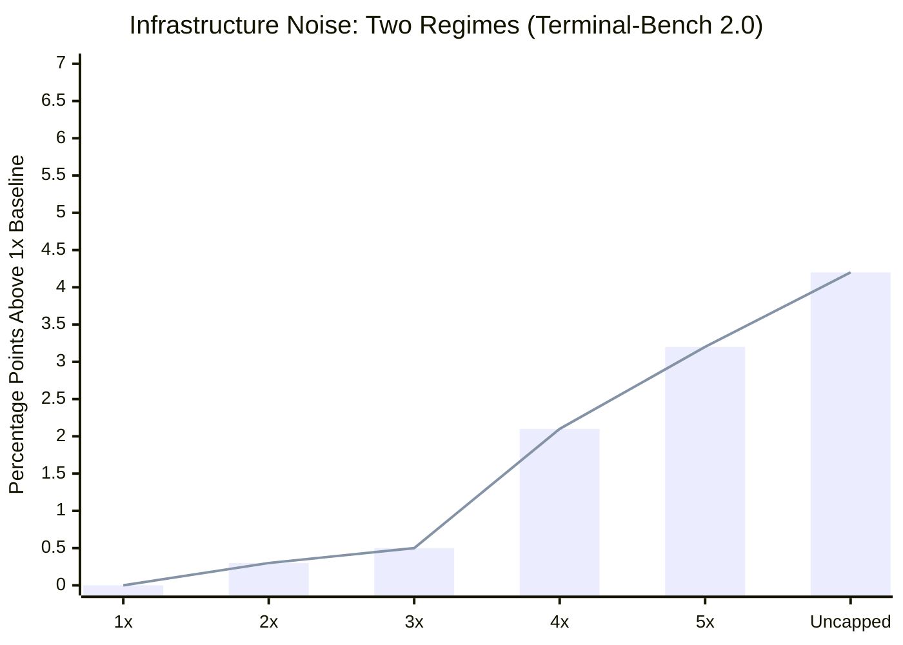

# Chapter 10: Infrastructure Noise

A practitioner reading benchmark leaderboards needs to know that small score differences carry more uncertainty than the precision of the reported numbers suggests. Anthropic's "Quantifying Infrastructure Noise" documents the size of this effect ([Anthropic — Quantifying Infrastructure Noise in Agentic Coding Evals](https://www.anthropic.com/engineering/infrastructure-noise)).

Static benchmarks score a model's output directly. Agentic coding evals are different: the model writes programs, runs tests, installs dependencies, iterates over many turns. The runtime is not a passive container but an integral component of the problem-solving process. Two agents with different resource budgets are not taking the same test.

### 10.1 The Headline Result

Running Terminal-Bench 2.0 across six resource configurations on a Google Kubernetes Engine cluster — same Claude model, same harness, same task set, varying only the resource floor and ceiling — the gap between the most- and least-resourced setups was 6 percentage points (p < 0.01) ([Anthropic — Quantifying Infrastructure Noise](https://www.anthropic.com/engineering/infrastructure-noise)).

This is more than the typical leaderboard gap between top models. The implication is direct: a 2-point lead on a leaderboard might reflect a real capability gap, or it might reflect that one eval ran on beefier hardware.

### 10.2 The Two Regimes

The data reveals two regimes:

- **From 1× to 3× the per-task resource specs**, scores fluctuated within noise (p = 0.40), but infrastructure error rates dropped monotonically — from 5.8% at strict enforcement to 2.1% at 3× headroom, p < 0.001. Tasks that crashed at 1× would have failed regardless. The extra resources fixed transient memory spikes that were OOM-killing containers, without making the eval itself easier.
- **Above 3×**, scores climbed faster than infrastructure errors declined. From 3× to uncapped, infra errors dropped 1.6 percentage points but success jumped almost 4 points. Extra resources let the agent try approaches that only work with generous allocations: pulling in large dependencies, running memory-intensive test suites, brute-forcing solutions with heavyweight tools.

### 10.3 What This Means for Measurement

Tight resource limits inadvertently reward efficient strategies; generous limits reward agents that exploit available resources. Both are legitimate things to test, but collapsing them into a single score without specifying configuration makes interpretation difficult.

Anthropic's `bn-fit-modify` example illustrates: under generous limits, some models default to installing the entire Python data-science stack (pandas, networkx, scikit-learn) before writing any solution code. Under tight limits, the pod runs out of memory during installation. A leaner strategy exists — implementing the math from scratch using only the standard library — and some models default to it. The resource configuration determines which default succeeds.

The same effect holds outside Terminal-Bench, though with smaller magnitude. Anthropic's SWE-bench experiment with 5× RAM showed scores 1.54 percentage points higher at 5× than 1× across 227 problems — smaller than Terminal-Bench because SWE-bench tasks are less resource-intensive, but non-neutral.

### 10.4 The Recommendation

Evals should specify both a guaranteed allocation (the floor) and a hard ceiling separately, not a single pinned value. A 3× ceiling over per-task specs is a reasonable default for Terminal-Bench: it cut infra errors by two-thirds while keeping the score lift well within noise ([Anthropic — Quantifying Infrastructure Noise](https://www.anthropic.com/engineering/infrastructure-noise)). The exact multiplier depends on benchmark and task distribution and should be reported.

For consumers of benchmark results, the operational rule: leaderboard differences below 3 percentage points deserve skepticism until configuration is documented and matched. A few-point lead might signal a real capability gap, or it might just be a bigger VM.

---

## Diagram: Resource Configuration vs. Score (Terminal-Bench 2.0 Summary)

The following table summarizes the two regimes observed across six resource configurations (same model, same harness, same tasks):

| Resource Level | Infra Error Rate | Score Change | Interpretation |
|---|---|---|---|
| 1× (strict) | 5.8% | baseline | OOM kills mask real failures |
| 2× | ~4.2% | +noise | Fewer crashes, same effective difficulty |
| 3× | 2.1% | +noise | Sweet spot: infra errors cut 2/3 |
| 4× | ~1.5% | +2 pts | Agents start exploiting extra RAM |
| 5× | ~1.2% | +3 pts | Heavyweight strategies now viable |
| Uncapped | ~0.5% | +4 pts | Resource-intensive defaults succeed |

*Above 3×, score gains outpace the decline in infrastructure errors — extra resources enable strategies, not just stability.*

---

## Key Takeaways

- **6-point gap from hardware alone**: the most- vs. least-resourced configuration on Terminal-Bench 2.0 produces a difference larger than typical top-model gaps on leaderboards.
- **Two regimes**: 1×–3× fixes infrastructure instability; above 3× enables resource-intensive strategies.
- **3× ceiling is the practical default**: cuts infrastructure errors by two-thirds while keeping score lift within noise.
- **Leaderboard skepticism threshold**: differences below 3 percentage points are suspect until resource configurations are documented and matched.
- **Resource limits shape strategy**: tight limits reward efficiency; generous limits reward exploitation — both are valid but should be distinguished.

## Further Reading

- Gian Segato, *Quantifying Infrastructure Noise in Agentic Coding Evals*, Anthropic, Feb 2026. https://www.anthropic.com/engineering/infrastructure-noise
- Mikaela Grace et al., *Demystifying Evals for AI Agents*, Anthropic, Jan 2026. https://www.anthropic.com/engineering/demystifying-evals-for-ai-agents
- Vivek Trivedy, *Improving Deep Agents with Harness Engineering*, LangChain, Feb 2026. https://blog.langchain.com/improving-deep-agents-with-harness-engineering/
