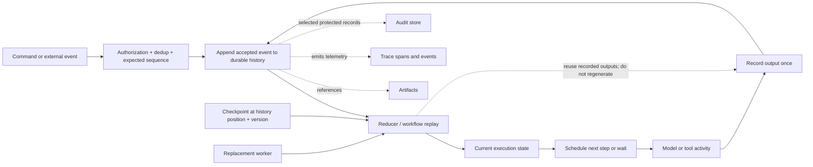

# Chapter 10: State, Event Histories, and Production Factors

An agent cannot recover from a crash, wait safely for approval, or explain a duplicate side effect if its only state is the next prompt. This chapter defines the durable data model beneath later discussions of evaluation, long-running tasks, tracing, AgentOps, and fleets. HumanLayer's “12 Factor Agents” remains useful as a named practitioner manifesto, but it is not a formal standard or a complete architecture ([HumanLayer — 12-Factor Agents](https://www.humanlayer.dev/blog/12-factor-agents)).

### 10.1 Six Objects That Must Not Collapse Into One

The word *history* is often used for several different products. This book uses the following definitions:

| Object | Canonical meaning | Primary use | What it is not |
|---|---|---|---|
| **Execution state** | Structured current workflow state: status, current step, pending action, budgets, retry count, approval state, and relevant business references | Decide what may happen next | The model's context or an unstructured transcript |
| **Event history** | An ordered, durable record of accepted workflow events sufficient for recovery under a stated replay contract | Reconstruct state and resume | Automatically a compliance audit log |
| **Checkpoint** | A recoverable state snapshot plus the history position and references required to continue | Bound recovery time and create a resume point | The complete causal history |
| **Artifact** | An addressable work product such as a file, diff, report, dataset, build, or large raw result | Preserve outputs and evidence outside live context | Execution state merely because the model can read it |
| **Trace** | Observability data that represents an execution path with spans, timestamps, attributes, events, links, and status | Debug latency, causality, and failures | A durable recovery source or audit record by definition |
| **Audit record** | A protected record retained for accountability under defined requirements for content, identity, timestamps, integrity, access, and retention | Investigation, governance, and compliance | Every log line or sampled trace |

Temporal defines Event History as an append-only log used to recover a workflow after crashes or failures ([Temporal — Events and Event History](https://docs.temporal.io/workflow-execution/event)). OpenTelemetry defines traces in terms of spans and permits sampling, so traces may intentionally omit executions or details ([OpenTelemetry — Tracing API](https://opentelemetry.io/docs/specs/otel/trace/api/); [OpenTelemetry — Tracing SDK](https://opentelemetry.io/docs/specs/otel/trace/sdk/)). NIST SP 800-53's AU control family separately addresses audit-record content, generation, protection, review, and retention ([NIST SP 800-53 Rev. 5](https://csrc.nist.gov/pubs/sp/800/53/r5/upd1/final)). These sources establish why one product can feed another without becoming its synonym.

A production trace may link to an event ID, an event may reference an artifact, and selected events may be copied into a protected audit store. That lineage is useful. It still does not justify the equation `trace = history = audit`. Context and memory are different again: context is the representation visible to one model call, while memory is information selected for possible use in future calls. Neither should be the authoritative execution state.

### 10.2 Identity Hierarchy: Session, Run, Step, Action, Attempt, and Call

Durability requires identifiers that survive process and model-context boundaries. This book uses a local hierarchy rather than assuming one vendor's naming scheme:

| Identifier | Identifies | Lifetime and relation |
|---|---|---|
| `session_id` | A durable user or work stream, including its conversations and artifacts | May contain several runs, resumptions, or branches |
| `run_id` | One logical workflow execution under a pinned objective and configuration lineage | Belongs to one session and survives worker replacement |
| `step_id` | One logical state transition or orchestration position | Belongs to one run; may be revisited only under explicit loop semantics |
| `action_id` | One intended external effect | Belongs to one step and remains stable across delivery retries |
| `attempt_id` | One execution or delivery try for a step or action | A retry dimension beneath the same logical step/action |
| `call_id` | One model-call or tool-call protocol exchange and its correlated output | Belongs to a step or attempt; never substitutes for an action's idempotency identity |

The containment path is usually `session → run → step → action → attempt`; model and tool `call_id`s attach at the step or attempt that issued them. Branches receive new run or branch identities and record their parent history position. A worker ID, sandbox ID, model context ID, and trace ID are associations, not replacements for these durable IDs.

Some dispatchers use `invocation_id` for their internal tool-dispatch record. Publish its mapping instead of adding another ambiguous synonym: it may alias `action_id` when one invocation represents exactly one intended effect, while a composite invocation can contain several actions and attempts.

This separation answers practical questions. A crashed worker can be replaced without changing `run_id`. A timed-out payment retry gets a new `attempt_id` but retains its `action_id` and idempotency key. A model retry gets a new `call_id`; it must not silently redefine an already-approved action. Temporal itself distinguishes a durable Workflow ID from individual Run IDs in a workflow-execution chain, illustrating why logical work and one execution instance need separate identities ([Temporal — Workflow Execution](https://docs.temporal.io/workflow-execution)).

### 10.3 Reducers, Event Sourcing, Checkpoints, and Workflow Engines

Four related techniques solve different problems:

1. **Reducer.** A deterministic function such as `state_next = reduce(state_previous, event)` computes a projection. It can run over a full history, a suffix after a checkpoint, or events copied from another store. A reducer is code, not persistence.
2. **Event sourcing.** Accepted domain changes are stored as an append-only event stream that is authoritative for the sourced state. Microsoft describes the pattern as persisting a series of actions and rebuilding current state by replaying them; it also warns that the pattern adds complexity and should be adopted selectively rather than for every CRUD subsystem ([Azure Architecture Center — Event Sourcing](https://learn.microsoft.com/en-us/azure/architecture/patterns/event-sourcing)).
3. **Snapshot or checkpoint.** A materialized state image at a known history position reduces rehydration cost. Azure's event-sourcing guidance treats snapshots as an optimization that avoids replaying the entire stream ([Azure Architecture Center — Event Sourcing](https://learn.microsoft.com/en-us/azure/architecture/patterns/event-sourcing)). In this book, a *checkpoint* additionally includes the references and resume contract needed to continue execution.
4. **Workflow engine.** Runtime infrastructure schedules work, persists timers and waits, dispatches tasks, manages retry policy and ownership, and resumes progress after failure. Temporal, for example, records commands and events so a Workflow Execution can recover from its latest durable state ([Temporal — Workflow Execution](https://docs.temporal.io/workflow-execution); [Temporal — History Service Architecture](https://github.com/temporalio/temporal/blob/main/docs/architecture/history-service.md)).

These choices are composable, not mandatory as a bundle. A system can use a reducer over an ordinary append-only workflow log without event-sourcing its customer database. It can take checkpoints without discarding the prior event history. A workflow engine can orchestrate activities whose domain data remains in conventional transactional stores. Conversely, an event-sourced business aggregate does not by itself provide timers, worker leases, approval waits, or activity retries.

Keep an explicit source-of-truth map. For example, the event history can own workflow position and approval transitions; a payment system can own transaction outcome; an artifact store can own generated files; a current-state projection can serve queries. “Unify state” should mean shared identity and deliberate derivation, not forcing every byte into one prompt, table, or event stream.

### 10.4 Durable Execution and Honest Replay

*Durable execution* means that progress survives process, worker, network, or infrastructure failure and can resume from recorded state. Temporal's documented replay mechanism runs workflow code against an existing Event History, checks newly generated commands against that history, and resumes after the last recorded event ([Temporal — Workflow Execution](https://docs.temporal.io/workflow-execution)). That is a concrete implementation, not the only possible engine.

Agent workflows add a critical boundary: model calls and external tool calls are non-deterministic activities. Temporal records completed Activity results in Event History, and its Side Effect primitive returns a recorded result instead of re-executing the function during replay ([Temporal — Activities](https://docs.temporal.io/activities); [Temporal — Events and Event History](https://docs.temporal.io/workflow-execution/event)). Apply the same rule to an agent:

- record the complete model response or structured proposal under its `call_id`;
- record each tool result, error, external operation ID, and outcome status;
- on replay, return those recorded outputs to the reducer or workflow code;
- do **not** call the model again or rerun a side-effecting tool and label the new trajectory a replay;
- if a new answer is desired, create an explicit retry, fork, or new run with new identities and lineage.

Replaying an event history reconstructs an earlier execution. Re-running from the same user input samples a new execution. The second operation is valuable for evals and recovery experiments, but it is not deterministic replay.

Workflow-code changes also need version discipline. A reducer or workflow version that emits a different command sequence for the same old history can make replay incompatible. Store code, model, prompt, tool-schema, policy, and reducer versions with the run; use migration, version gates, or a new run rather than silently reinterpret old events. Checkpoints must state the history position and reducer/schema version that produced them.

### 10.5 Events Need a Contract

An event should describe an accepted fact, not an uncommitted intention disguised in past tense. A practical envelope includes:

```text
event_id, event_type, schema_version, occurred_at, recorded_at
session_id, run_id, step_id, action_id, attempt_id, call_id
actor, tenant, source, causation_id, correlation_id
payload_or_artifact_ref, policy_version, previous_sequence
```

Not every event has every ID. `approval_received` needs the approver and action; `worker_replaced` needs the run and worker identities; `model_call_completed` needs the call and step. The envelope should make omitted fields intentional rather than ambiguous.

Append with an expected sequence or version so two workers cannot both commit incompatible next events. Give inbound commands and externally delivered events stable deduplication identities. Microsoft notes that ordering and per-entity event identifiers are central event-sourcing concerns, and that event stores are not interchangeable with message brokers ([Azure Architecture Center — Event Sourcing](https://learn.microsoft.com/en-us/azure/architecture/patterns/event-sourcing)). A queue can deliver work; the accepted workflow history decides what became part of the run.

Large payloads should normally be stored as immutable or versioned artifacts and referenced by content hash or durable URI. Keep enough metadata to authorize access and verify the referenced version. Redaction must preserve the fact that an event occurred and the applicable lineage; deleting bytes from a model-facing context is not the same operation as applying retention or erasure policy to durable stores.

### 10.6 Recovery Is a State Machine, Not “Retry Everything”

The runtime should define a recovery transition for each interruption:

| Interruption | Durable record before recovery | Safe next transition |
|---|---|---|
| **Process or machine crash** | Last committed event, current checkpoint, ownership lease | Rehydrate with the recorded history; issue only work not already accepted |
| **Worker replacement or deploy** | Run ID, worker/config versions, in-flight step and lease | Acquire ownership, replay recorded outputs, continue under an explicit compatible version |
| **Tool timeout or lost response** | Action ID, attempt ID, idempotency key, external operation reference, status `unknown` | Reconcile external state before retrying a consequential action |
| **Duplicate delivery** | Command/event dedup key and accepted sequence | Return the recorded disposition; do not append or execute twice |
| **Approval wait** | Exact pending action, policy decision, required approver scope, expiry | Release compute; resume only from an authenticated approval/deny event |
| **Cancellation request** | Requester, scope, reason, time, current action state | Stop scheduling new work, propagate cancellation, then record actual terminal or partial outcome |

Temporal's workflow status model distinguishes a cancellation request from a successfully handled `Cancelled` terminal state, and its Activity history separately records requested and accepted cancellation ([Temporal — Workflow Execution](https://docs.temporal.io/workflow-execution); [Temporal — Events and Event History](https://docs.temporal.io/workflow-execution/event)). Preserve that distinction. Cancellation is not rollback, and a timeout is not evidence that no side effect occurred.

Approval waits should be durable events, not a sleeping web process. HumanLayer's manifesto correctly emphasizes launch/pause/resume APIs and structured human-input events ([HumanLayer — 12-Factor Agents](https://www.humanlayer.dev/blog/12-factor-agents)). For high-risk actions, however, [Chapter 7](./07-sandboxing-runtime-enforcement.md)'s non-bypassable policy gate and [Chapter 14](./14-human-agent-interaction.md)'s approval semantics apply: the model may request consultation, but the runtime decides whether approval is mandatory and verifies the approver.

Every recovery path needs a budget and a terminal state. Repeated transient failures can become `failed` or `needs_human`; incompatible workflow code can become `migration_required`; an unresolved external effect can remain `unknown` rather than being falsely labeled failed. The event history should preserve how that decision was reached.

### 10.7 The Twelve Factors: Principle or Implementation Choice?

HumanLayer presents the following twelve factors as guidance for production LLM software ([HumanLayer — 12-Factor Agents](https://www.humanlayer.dev/blog/12-factor-agents)). Read them as a manifesto to evaluate, not as a standards checklist:

| HumanLayer factor | Durable principle worth keeping | Context-dependent implementation choice |
|---|---|---|
| 1. Natural Language to Tool Calls | Separate model proposals from deterministic execution | Not every task needs a tool; wire format need not be JSON |
| 2. Own Your Prompts | Version and evaluate model-visible configuration | Teams may use provider/framework templates if versions and rendered inputs remain inspectable |
| 3. Own Your Context Window | Make context assembly explicit | XML and a single-message event rendering are formatting choices |
| 4. Tools Are Just Structured Outputs | A tool call is output, not an effect | Provider-native, MCP, or custom serialization can represent it |
| 5. Unify Execution and Business State | Use shared IDs and defined sources of truth | Deriving all execution state from one event stream is optional; external systems may own business facts |
| 6. Launch/Pause/Resume With Simple APIs | Long-running work needs explicit lifecycle operations | Endpoint shape and workflow engine are implementation choices |
| 7. Contact Humans With Tool Calls | Human requests and responses should be structured, durable events | Model-requested consultation cannot replace a mandatory runtime approval gate |
| 8. Own Your Control Flow | The harness must own stopping, waiting, retry, and dispatch | A custom loop, graph runtime, and managed workflow engine are alternatives |
| 9. Compact Errors Into Context | Preserve actionable error information for the next decision | Full diagnostics belong in history/artifacts; exact compaction and escalation thresholds require evals |
| 10. Small, Focused Agents | Bound scope and evaluate reliability near the model's capability frontier | “3–10, maybe 20 steps” is the manifesto's heuristic, not a universal limit |
| 11. Trigger From Anywhere | Normalize external triggers into authenticated, idempotent events | Slack, email, SMS, webhook, and cron support are product choices |
| 12. Make the Agent a Stateless Reducer | Reconstruct current execution state from durable inputs where practical | A pure reducer does not require event-sourcing every domain system |

This reading preserves the manifesto's strongest insight—agent systems are mostly software around probabilistic calls—without turning its examples into universal facts. In particular, “stateless reducer” describes worker behavior: a replaceable worker can compute from durable inputs. The system as a whole is intentionally stateful.

### 10.8 From One Program to AgentOps and Fleets

A local prototype may keep execution state and artifacts in a repository. A shared service additionally needs tenant boundaries, schema migration, retention, quotas, worker ownership, configuration rollout, and reconciliation across many active runs. That is a shift in operational scope, not evidence that one event log should become a universal control plane.

[Chapter 17](./17-trace-driven-iteration.md) treats traces as observability inputs for iteration. [Chapter 18](./18-agentops.md) applies this chapter's identities and data boundaries to cost attribution, privacy, retention, deployment, and incident response. [Chapter 19](./19-agent-fleets-control-plane.md) adds fleet identity, policy administration, distributed policy enforcement, lineage, and protected audit records. The handoff is deliberate:

- this chapter owns execution state, recovery history, checkpoints, and replay semantics;
- AgentOps owns operating and changing those systems safely at scale;
- the fleet/control-plane chapter owns cross-run identity, governance, and enforcement topology.

The boundary also prevents a common shortcut: an event history can supply selected evidence to AgentOps or an audit pipeline, but it is not automatically complete, access-controlled, immutable enough, or retained long enough for every audit requirement. Those properties must be designed and verified explicitly.

---

## Diagram: Durable State, Replay, and Evidence Products



---

## Key Takeaways

- **Execution state, event history, checkpoint, artifact, trace, and audit record are different products:** link them with lineage instead of collapsing their guarantees.
- **Use durable identities:** session, run, step, action, attempt, and call IDs answer different recovery and deduplication questions.
- **Reducer, event sourcing, checkpoint, and workflow engine are not synonyms:** each is independently adoptable.
- **Replay must reuse recorded model and tool outputs:** calling them again creates a new attempt or branch, not a replay of the old execution.
- **Recovery is explicit state transition:** crash, worker replacement, timeout, duplicate delivery, approval wait, and cancellation require different evidence and next actions.
- **A timeout or cancellation request is not a confirmed external outcome:** reconcile consequential effects.
- **HumanLayer's twelve factors are a named manifesto:** preserve general ownership and lifecycle principles while labeling XML formats, step counts, channels, and full event sourcing as choices.
- **A stateless worker runs over a stateful system:** durable state lives outside replaceable compute.
- **This chapter feeds AgentOps and fleet governance:** it does not redefine traces as histories or histories as audit records.

## Further Reading

- Temporal, *Workflow Execution*. https://docs.temporal.io/workflow-execution
- Temporal, *Events and Event History*. https://docs.temporal.io/workflow-execution/event
- Temporal, *Activities*. https://docs.temporal.io/activities
- Temporal, *History Service Architecture*. https://github.com/temporalio/temporal/blob/main/docs/architecture/history-service.md
- Microsoft Azure Architecture Center, *Event Sourcing Pattern*. https://learn.microsoft.com/en-us/azure/architecture/patterns/event-sourcing
- OpenTelemetry, *Tracing API*. https://opentelemetry.io/docs/specs/otel/trace/api/
- NIST, *SP 800-53 Rev. 5: Security and Privacy Controls*. https://csrc.nist.gov/pubs/sp/800/53/r5/upd1/final
- Dex Horthy, *12-Factor Agents*, HumanLayer, Apr 2025. https://www.humanlayer.dev/blog/12-factor-agents
