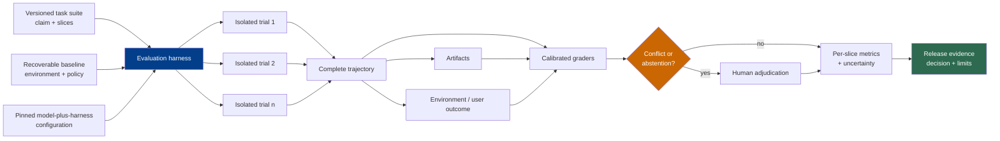

# Chapter 11: Evaluation

Foundations Chapter 13 establishes the model-behavior layer: representative tasks, repeated trials, grader types, pass@k, pass^k, and the limits of metrics as proxies. It explicitly hands tool execution, permissions, side effects, agent trajectories, environment-state grading, operational reliability, and release gates to this volume ([LLM Foundations — Chapter 13](../llm-foundations/13-evaluation-for-llm-behavior.md)).

This chapter evaluates the system that users actually encounter: a model plus an agent harness, runtime, tools, policies, and environment. Its output is not just a score. It is evidence for a bounded claim such as “configuration C is ready for task distribution D under budget B and policy P.”

### 11.1 The Evaluation Contract

An evaluation begins by stating the claim before choosing tasks or metrics. OpenAI's guidance for trustworthy evaluations distinguishes capability elicitation, controlled comparison, and safeguard-performance claims because each requires a different harness and different supporting evidence ([OpenAI — Trustworthy Third-Party Evaluations](https://openai.com/index/trustworthy-third-party-evaluations-foundations/)).

A release-oriented contract should name:

- the task distribution and excluded cases;
- the model-plus-harness configuration under test;
- the environment, tools, permissions, and data available;
- token, time, attempt, cost, and side-effect budgets;
- success, failure, abstention, and policy-violation criteria;
- the graders and human adjudication policy;
- the uncertainty and per-slice reporting required for a decision.

A headline score without this contract is easy to overgeneralize. It describes observed behavior under one setup, not an intrinsic property of a model or agent.

### 11.2 Canonical Agent-Eval Vocabulary

Anthropic defines the main components of an agent evaluation and explicitly separates the evaluation harness from the agent harness ([Anthropic — Demystifying Evals for AI Agents](https://www.anthropic.com/engineering/demystifying-evals-for-ai-agents)). This book uses the following normalized vocabulary:

| Term | Definition in this book |
|---|---|
| **Task** | One test case with declared inputs, initial environment, available capabilities, budgets, and success criteria. |
| **Trial** | One attempt by one tested configuration at one task from a restored baseline. |
| **Grader** | Versioned logic that judges one stated property from declared evidence and returns a verdict or score. |
| **Eval transcript / trajectory** | The complete model-, tool-, and observation-level record retained for grading one trial. |
| **Outcome** | The final relevant state produced by the trial, including environment and external-effect state rather than only response text. |
| **Evaluation harness** | Test infrastructure that provisions baselines, invokes the agent harness, records evidence, runs graders, aggregates trials, and produces reports. |
| **Agent harness** | The model-facing system under test that assembles context, drives the loop, validates proposals, and coordinates tools and runtime. |
| **Evaluation suite** | A versioned collection of tasks intended to support a stated capability, regression, reliability, or policy claim. |

Anthropic sometimes uses *transcript*, *trace*, and *trajectory* as synonyms for a complete eval run. This book reserves **trace** for observability data made of spans, attributes, events, links, timestamps, and status; OpenTelemetry also permits sampling at the tracing layer ([OpenTelemetry — Trace API](https://opentelemetry.io/docs/specs/otel/trace/api/)). An eval trajectory may be derived from trace instrumentation only if the evaluation harness guarantees that every grader-required event and artifact is complete. A sampled production trace is not automatically an eval transcript.

### 11.3 Grade Four Evidence Layers Separately

Agent success is multi-layered. Do not collapse every grader into one notion of “correct.”

| Evidence layer | What it can establish | Typical graders | What it cannot establish alone |
|---|---|---|---|
| **Process / trajectory** | Required or forbidden actions, approval use, tool arguments, turn count, budget, recovery behavior | Event assertions, policy checks, trajectory rubric | That the final artifact or environment is correct |
| **Artifact** | Properties of a produced file, diff, report, dataset, build, or citation set | Unit tests, static analysis, schema/content checks, expert rubric | That it was deployed or caused the intended external effect |
| **Environment state** | Database rows, filesystem state, UI/backend state, messages sent, permissions changed, cleanup completed | State queries, integration tests, independent API checks | That the user experienced or valued the result |
| **User / business outcome** | Resolution, acceptance, satisfaction, conversion, loss avoided, or another product-level effect | User confirmation, business event, controlled study, delayed outcome join | Fine-grained cause without additional evidence |

Anthropic's flight-booking example makes the environment distinction concrete: an agent saying a flight was booked is transcript content; a reservation row in the environment is the outcome ([Anthropic — Demystifying Evals for AI Agents](https://www.anthropic.com/engineering/demystifying-evals-for-ai-agents)). The same rule applies to code: a plausible final message is not a passing build, and a passing unit test is not necessarily a working end-to-end user flow.

Process grading is appropriate when the path itself is part of the contract—for example, mandatory approval, prohibited data access, or a cost ceiling. Do not require one exact tool sequence merely because the author expected it; Anthropic reports that rigid path grading can reject valid solutions that reach the intended outcome by another route ([Anthropic — Demystifying Evals for AI Agents](https://www.anthropic.com/engineering/demystifying-evals-for-ai-agents)).

Preserve links across all four layers: `task_id → trial_id → trajectory events → artifact versions → environment snapshot → user/business event`. That lineage lets a reviewer distinguish a process violation from an artifact defect, an environment failure, or an outcome that changed after the trial.

### 11.4 Run Multiple Trials from Isolated, Recoverable Baselines

One successful trial demonstrates possibility, not reliability. Agent outputs and tool paths can vary, so the evaluation harness should run multiple trials per task when the product claim depends on repeatability ([Anthropic — Demystifying Evals for AI Agents](https://www.anthropic.com/engineering/demystifying-evals-for-ai-agents)).

Every trial starts from a declared baseline:

- immutable environment image or reproducible fixture version;
- clean filesystem, database, queues, caches, browser profile, and external-resource namespace;
- task-specific credentials and tenant identity;
- controlled clock, network stubs, or recorded external responses where required;
- known resource quotas and no artifacts from earlier trials;
- teardown verification and a recovery path when setup or cleanup fails.

Anthropic documents both failure correlation and artificial score inflation from shared state, including an internal example where an agent inspected git history left by earlier trials ([Anthropic — Demystifying Evals for AI Agents](https://www.anthropic.com/engineering/demystifying-evals-for-ai-agents)). Isolation therefore protects measurement validity, not merely test hygiene.

Distinguish three results:

1. **Task verdict:** the tested system passed, failed, or received partial credit.
2. **Infrastructure-invalid trial:** setup, dependency, grader, or cleanup failed, so the attempt does not measure the agent claim.
3. **System reliability failure:** an in-scope timeout, tool error, recovery failure, or resource exhaustion occurred under the declared production-like contract.

Do not discard category 3 as “eval noise.” Do not count category 2 as an agent failure without reporting it separately. Retry an invalid trial only under a recorded policy; otherwise repeated retries can hide an unstable evaluation harness.

### 11.5 Freeze the Tested Configuration and Report Slices

An eval result belongs to the complete tested configuration. Pin or record:

```text
EvalConfiguration {
  model_snapshot, provider_endpoint, reasoning_settings,
  agent_harness_version, prompt_and_context_policy,
  tool_catalog_and_schemas, runtime_and_environment_image,
  retrieval_and_index_versions, policy_and_approval_rules,
  retry_timeout_and_budget_rules,
  task_suite, graders, adjudication_policy
}
```

OpenAI's evaluation playbook likewise asks reports to disclose the system, harness, tool access, elicitation method, budgets, safeguards, and validity checks because these choices can materially change the claim a score supports ([OpenAI — Trustworthy Third-Party Evaluations](https://openai.com/index/trustworthy-third-party-evaluations-foundations/)).

Report per-slice results before a blended aggregate. At minimum include:

- **task and quality:** domain, difficulty, language, input shape, ordinary vs edge vs historical failure;
- **routing:** route target, reasoning tier, cascade/fallback/hedge/human escalation, as defined in Chapter 8;
- **cost:** input, output, reasoning, cache, retrieval, tool, grader, and human-review cost;
- **latency:** router, model, tool, grader, end-to-end p50/p95/p99, timeout and queue time;
- **failure class:** model, transport, schema, tool, environment, recovery, grader, policy, ambiguous side effect;
- **policy:** tenant, identity, data region, model allowlist, approval, restricted-content and cross-tenant tests.

An aggregate can improve while a high-risk slice regresses. Release gates should therefore operate on critical slices and hard policy checks, not only on a weighted average.

### 11.6 Use pass@k, pass^k, and Uncertainty Correctly

Let $p$ be a per-trial success probability. If $k$ trials are independent and identically distributed, then:

- **pass@k** is the probability of at least one success: $1-(1-p)^k$;
- **pass^k** is the probability that all attempts succeed: $p^k$.

pass@k fits a product that genuinely generates several candidates and can identify a successful one. pass^k expresses repeated consistency. Anthropic emphasizes that the product contract determines which metric is appropriate ([Anthropic — Demystifying Evals for AI Agents](https://www.anthropic.com/engineering/demystifying-evals-for-ai-agents)). Do not report pass@k for a one-attempt user experience merely because it produces a larger number.

When $n$ sampled candidates contain $c$ correct candidates, the HumanEval/Codex paper uses the estimator $1-\binom{n-c}{k}/\binom{n}{k}$ for pass@k when $n \ge k$ ([Chen et al. — Evaluating Large Language Models Trained on Code](https://arxiv.org/abs/2107.03374)). That estimator answers a sampling question; it does not make correlated trials independent or prove that a selector can find the passing candidate.

Always report counts and uncertainty with the summary: number of tasks, trials per task, successes, invalid trials, and the interval method. NIST describes Wilson and related confidence intervals for a binomial proportion, which are preferable to presenting the observed fraction as exact truth ([NIST/SEMATECH — Confidence Intervals for a Proportion](https://itl.nist.gov/div898/handbook/prc/section2/prc241.htm)). A binomial interval assumes the observations used in it behave like the stated binomial sampling model.

Agent trials are often clustered by task or environment. When attempts share a task, outage, cache, account, or fixture defect, treating every attempt as independent overstates precision. Use task-level paired comparisons, task-level bootstrap or a hierarchical model when appropriate, and disclose the sampling unit. Chapter 16 examines a measured case in which infrastructure configuration materially shifted agentic coding results ([Anthropic — Infrastructure Noise](https://www.anthropic.com/engineering/infrastructure-noise)).

Uncertainty is not only a confidence interval. Also report sensitivity to task-set version, grader version, invalid-trial policy, and infrastructure configuration. A statistically narrow estimate of a misconfigured eval is still invalid evidence.

### 11.7 Calibrate Graders as Measurement Instruments

Use deterministic graders for properties they can establish, model graders for rubric-based semantic judgment, and humans for expert or consequential ambiguity. Anthropic documents these three grader families and recommends calibrating model-based graders against human judgment ([Anthropic — Demystifying Evals for AI Agents](https://www.anthropic.com/engineering/demystifying-evals-for-ai-agents)).

Every grader has a contract:

```text
GraderResult {
  grader_version, evidence_ids,
  verdict: pass | fail | partial | abstain,
  score, reason_code, explanation,
  confidence_or_supporting_checks
}
```

Build an adjudicated calibration set containing clear positives, clear negatives, boundary cases, valid alternative solutions, insufficient-evidence cases, and adversarial attempts to exploit the grader. For each grader and critical slice, measure:

- **false positive:** grader passes an adjudicated failure;
- **false negative:** grader fails an adjudicated success;
- **abstention rate:** grader correctly or excessively declines to decide;
- **coverage:** fraction of intended cases for which the grader can render a supported verdict;
- **agreement by slice:** where model and human judgments diverge, not only aggregate agreement;
- **cost and latency:** whether the grader is usable in a live loop, CI gate, or offline audit.

Here, *positive* means the grader's `pass` label. If a safety classifier instead defines “violation” as positive, the names reverse; publish the labeled confusion matrix rather than relying on the words alone.

The cost of errors is asymmetric. A false positive in a destructive-action safety check may matter more than many false negatives; a false negative in a creative-writing rubric may mostly waste review time. Set thresholds and escalation rules from consequence, not from one universal target accuracy.

Give semantic graders an explicit **abstain** or **insufficient evidence** option. Anthropic reports that model graders require careful calibration and recommends an “Unknown” path when evidence is insufficient ([Anthropic — Demystifying Evals for AI Agents](https://www.anthropic.com/engineering/demystifying-evals-for-ai-agents)). Its motivated-mislabeling research also found that consequences disclosed to a model evaluator can alter labels and that abstention and tighter rubrics reduced, but did not eliminate, the observed effect ([Anthropic — Agentic Misalignment in Summer 2026](https://alignment.anthropic.com/2026/agentic-misalignment-summer-2026/)). Blind judges to candidate identity and deployment consequence when those facts are irrelevant to the rubric.

Define conflict resolution before running the release eval:

1. deterministic evidence wins only for the narrow property that check establishes;
2. a mandatory policy failure cannot be averaged away by quality graders;
3. grader disagreement or abstention enters a review queue with all evidence;
4. a human adjudicator applies a versioned rubric and records a reason code;
5. adjudicated cases feed the calibration set, but changing the rubric creates a new grader version.

Human judgment is not automatically consistent ground truth. Use multiple reviewers or an escalation reviewer for high-impact disputes, measure disagreement, and improve the rubric when experts interpret it differently.

### 11.8 Measure the Verifiers Used in Agent Loops

Chapter 13 will choose among schema checks, deterministic tests, environment checks, same-agent critique, independent model graders, and human review. This chapter supplies the evidence for that choice.

For every proposed verifier, measure:

- which failure classes it detects and misses;
- false-positive, false-negative, abstention, and disagreement rates;
- latency and cost at the point where it would run;
- whether its failures correlate with the generator's failures;
- susceptibility to leaked answers, reward hacking, or path overfitting;
- the consequence of accepting a bad result or rejecting a good one.

A verifier used inside the live loop and a grader used in the evaluation harness may share code, but they have different roles. The live verifier affects the trajectory and can give the agent repair information; the holdout grader measures the resulting system. If the agent can inspect the hidden tests, reference answer, or release grader, the evaluation may measure grader exploitation rather than task success.

Do not select an independent model judge merely because “the maker must not be the checker.” Independence can reduce one correlated failure, but the measured error profile, consequence, latency, and cost determine whether it is useful. Chapter 13 consumes this evidence to build a verifier hierarchy rather than a universal checker rule.

### 11.9 Turn Eval Results into Release Evidence

A release packet should be reconstructible from immutable artifacts:

- claim and decision owner;
- tested configuration and comparison baseline;
- task-suite manifest and slice coverage;
- environment baseline, isolation and reset evidence;
- trial counts, invalid-trial accounting, pass/fail/partial results;
- pass@k or pass^k where product semantics justify them, with uncertainty;
- grader calibration results, conflicts, abstentions, and human adjudications;
- policy and safety gate results;
- cost, latency, reliability, and routing slices;
- representative trajectories, artifacts, environment diffs, and known limitations;
- release decision, exception owner, expiry, rollback trigger, and post-release monitors.

OpenAI recommends that evaluation reports state the claim, tested system, harness and tools, budgets, elicitation choices, and checks for hazards such as broken tasks, reward hacking, contamination, refusals, and sandbagging ([OpenAI — Trustworthy Third-Party Evaluations](https://openai.com/index/trustworthy-third-party-evaluations-foundations/)). The same discipline makes an internal release decision reviewable rather than turning a dashboard number into an unexplained approval.

Release gates should combine hard constraints and statistical evidence. A confirmed cross-tenant disclosure, unauthorized action, or broken mandatory approval is a gate failure even if aggregate task success improves. A small quality regression may require an uncertainty-aware decision rather than an automatic block. Record which rule produced the decision.

### 11.10 Maintain the Suite and Close the Production Loop

Read trajectories and grader disagreements on every important evaluation run. Anthropic reports that transcript review revealed ambiguous tasks, overly rigid graders, shared-state shortcuts, and other defects invisible in aggregate scores ([Anthropic — Demystifying Evals for AI Agents](https://www.anthropic.com/engineering/demystifying-evals-for-ai-agents)). Failures should look fair: the task was solvable, the environment worked, and the verdict follows from declared evidence.

Evaluation suites are versioned products. Add escaped production failures, retain important regressions, rotate held-out cases, retire unsound tasks, and preserve history rather than editing old scores in place. If a task or grader changes, do not compare the new score with the old one as though only the agent changed.

Offline eval does not replace production monitoring, user feedback, controlled experiments, or incident review. Production supplies new task distributions and delayed user/business outcomes; the evaluation harness turns suitable cases into isolated, repeatable tests. Chapter 17 uses traces to find failure patterns, but this chapter's release evidence remains based on complete trial trajectories, artifacts, outcomes, and declared graders.

---

## Diagram: From Isolated Trials to Release Evidence



---

## Key Takeaways

- **Foundations ends at model-behavior eval; Harness owns system evidence:** trajectories, tools, permissions, side effects, environment outcomes, reliability, and release gates live here.
- **Use precise eval objects:** task, trial, grader, eval trajectory, outcome, evaluation harness, and agent harness are distinct.
- **A trace is not automatically a trajectory:** observability data may be sampled; grader evidence must be complete.
- **Grade evidence layers separately:** process, artifact, environment state, and user/business outcome answer different questions.
- **Repeat isolated trials:** recoverable baselines and invalid-trial accounting are prerequisites for reliability claims.
- **Report the tested configuration and slices:** quality, routing, cost, latency, failure, and policy results must accompany aggregates.
- **Use pass@k and pass^k according to product semantics:** state independence assumptions, counts, intervals, and the sampling unit.
- **Calibrate graders:** measure false positives, false negatives, abstention, coverage, conflict, and human adjudication.
- **Measure verifiers before placing them in loops:** Chapter 13 uses these error, consequence, latency, and cost profiles.
- **Ship release evidence, not a naked score:** preserve claims, versions, artifacts, uncertainty, exceptions, rollback rules, and post-release monitors.

## Further Reading

- Mikaela Grace et al., *Demystifying Evals for AI Agents*, Anthropic, Jan 2026. https://www.anthropic.com/engineering/demystifying-evals-for-ai-agents
- OpenAI, *A Shared Playbook for Trustworthy Third-Party Evaluations*, May 2026. https://openai.com/index/trustworthy-third-party-evaluations-foundations/
- OpenTelemetry, *Tracing API*. https://opentelemetry.io/docs/specs/otel/trace/api/
- Mark Chen et al., *Evaluating Large Language Models Trained on Code*, 2021. https://arxiv.org/abs/2107.03374
- NIST/SEMATECH, *Confidence Intervals for a Proportion*. https://itl.nist.gov/div898/handbook/prc/section2/prc241.htm
- Gian Segato, *Quantifying Infrastructure Noise in Agentic Coding Evals*, Anthropic, Feb 2026. https://www.anthropic.com/engineering/infrastructure-noise
- Anthropic Safeguards Research Team, *Agentic Misalignment in Summer 2026*, 2026. https://alignment.anthropic.com/2026/agentic-misalignment-summer-2026/
